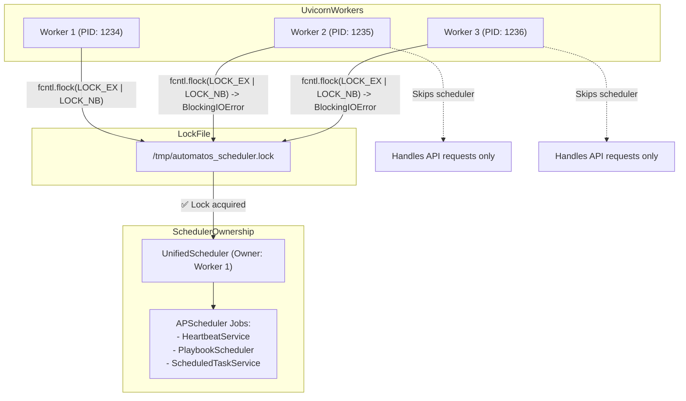
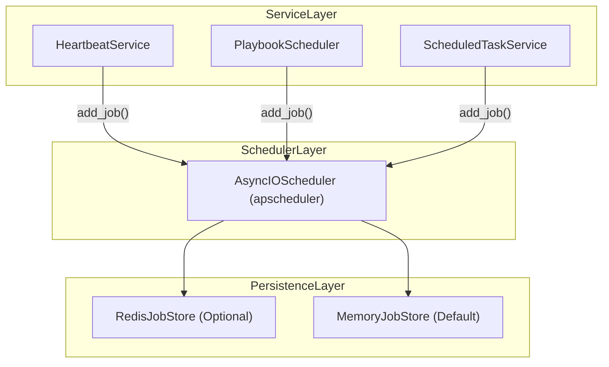
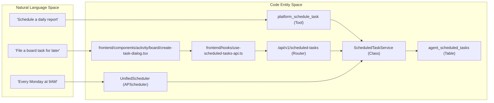
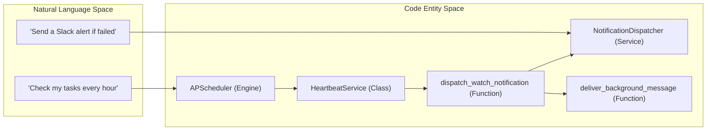
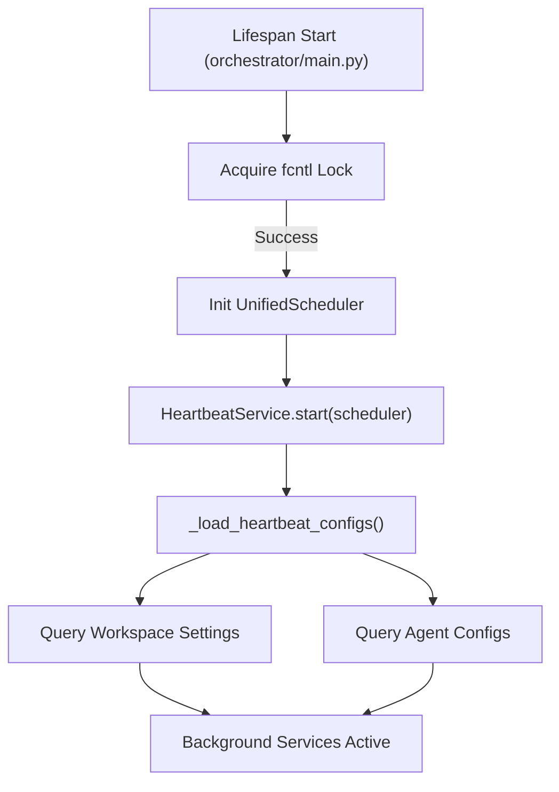

# Background Services & Schedulers

Relevant source files

The following files were used as context for generating this wiki page:

- [frontend/components/__tests__/prd197-substrate-tile.test.tsx](frontend/components/__tests__/prd197-substrate-tile.test.tsx)
- [frontend/components/activity/board/__tests__/schedule-choice.test.ts](frontend/components/activity/board/__tests__/schedule-choice.test.ts)
- [frontend/components/activity/board/create-task-dialog.tsx](frontend/components/activity/board/create-task-dialog.tsx)
- [frontend/components/activity/board/create-task-steps.tsx](frontend/components/activity/board/create-task-steps.tsx)
- [frontend/components/activity/board/schedule-choice.ts](frontend/components/activity/board/schedule-choice.ts)
- [frontend/components/command-center/is-it-working-strip.tsx](frontend/components/command-center/is-it-working-strip.tsx)
- [frontend/hooks/use-analytics-api.ts](frontend/hooks/use-analytics-api.ts)
- [frontend/hooks/use-board-tasks-api.ts](frontend/hooks/use-board-tasks-api.ts)
- [frontend/lib/api-client.ts](frontend/lib/api-client.ts)
- [orchestrator/alembic/versions/calendar_scheduled_board_tasks.py](orchestrator/alembic/versions/calendar_scheduled_board_tasks.py)
- [orchestrator/alembic/versions/prd72_board_tasks.py](orchestrator/alembic/versions/prd72_board_tasks.py)
- [orchestrator/api/scheduled_tasks.py](orchestrator/api/scheduled_tasks.py)
- [orchestrator/api/workflows.py](orchestrator/api/workflows.py)
- [orchestrator/config.py](orchestrator/config.py)
- [orchestrator/core/models/substrate_metrics.py](orchestrator/core/models/substrate_metrics.py)
- [orchestrator/core/observability/substrate_metrics.py](orchestrator/core/observability/substrate_metrics.py)
- [orchestrator/core/seeds/utterances/scheduling.yaml](orchestrator/core/seeds/utterances/scheduling.yaml)
- [orchestrator/main.py](orchestrator/main.py)
- [orchestrator/modules/tools/discovery/handlers_scheduling.py](orchestrator/modules/tools/discovery/handlers_scheduling.py)
- [orchestrator/reports/route-manifest.json](orchestrator/reports/route-manifest.json)
- [orchestrator/router_manifest.py](orchestrator/router_manifest.py)
- [orchestrator/services/playbook_scheduler.py](orchestrator/services/playbook_scheduler.py)
- [orchestrator/services/scheduled_task_service.py](orchestrator/services/scheduled_task_service.py)
- [orchestrator/tests/authz_sweep_probe.py](orchestrator/tests/authz_sweep_probe.py)
- [orchestrator/tests/test_p2w2_authz_boundary_sweep.py](orchestrator/tests/test_p2w2_authz_boundary_sweep.py)
- [orchestrator/tests/test_prd154_s5_missions.py](orchestrator/tests/test_prd154_s5_missions.py)
- [orchestrator/tests/test_prd209_alembic_single_head.py](orchestrator/tests/test_prd209_alembic_single_head.py)
- [orchestrator/tests/test_prd222_w2s1_plan_tiers.py](orchestrator/tests/test_prd222_w2s1_plan_tiers.py)
- [orchestrator/tests/test_prd232_us007_seed_intent_clusters.py](orchestrator/tests/test_prd232_us007_seed_intent_clusters.py)

## Purpose and Scope

Background Services in Automatos AI are scheduled, long-running tasks that execute independently of user requests. These services handle periodic maintenance, proactive monitoring, recipe scheduling, memory consolidation, and metadata synchronization. The system uses a unified scheduler with file-based locking to ensure exactly-one worker execution in multi-process deployments.

This page covers the scheduler architecture, registered background services, lifecycle management, and specific implementations for memory maintenance and task scheduling.

---

## Unified Scheduler Architecture

### File Lock Pattern

Automatos AI uses **fcntl file locking** to ensure only one uvicorn worker acquires the scheduler lock, preventing duplicate job executions when running with multiple workers. This is critical for maintaining consistency in `APScheduler` job execution across scaled backend instances.

**Lock Acquisition Flow:**

Sources: `orchestrator/services/scheduler.py` (Note: Implementation logic described in existing architecture documentation).

### APScheduler Integration

The `UnifiedScheduler` wraps `AsyncIOScheduler` from the APScheduler library. It supports both `MemoryJobStore` for volatile tasks and `RedisJobStore` for persistent job definitions across restarts.

**Scheduler Stack:**

Sources: `orchestrator/services/heartbeat_service.py`, `orchestrator/services/playbook_scheduler.py`, `orchestrator/services/scheduled_task_service.py`

---

## Registered Background Services

### HeartbeatService

The `HeartbeatService` manages periodic "ticks" for both the orchestrator and individual agents. It supports cron-based triggers and respects workspace active hours.

**Key Features:**
- **Orchestrator Tick**: Periodic workspace-level checks. It triggers `_orchestrator_tick` with specific workspace configurations.
- **Agent Tick**: Per-agent periodic tasks, often used for status transitions in `BoardTask` management. It triggers `_agent_tick`.
- **Daily Summary**: A cron job scheduled at 01:00 UTC daily for memory consolidation and reporting.

Sources: `orchestrator/services/heartbeat_service.py`

### PlaybookScheduler

The `PlaybookScheduler` is responsible for scheduling and executing workflows (playbooks). It integrates with APScheduler to manage cron-based and one-shot playbook runs.

**Key Features:**
- **Scheduling Playbooks**: Playbooks can be scheduled via cron expressions or for a single future execution.
- **Execution**: When a scheduled playbook fires, it initiates a new `RecipeExecution`.
- **Concurrency**: Manages concurrent playbook executions to prevent resource contention.

Sources: `orchestrator/services/playbook_scheduler.py`

### ScheduledTaskService (PRD-77)

The `ScheduledTaskService` manages agent-initiated tasks. When an agent calls the `platform_schedule_task` tool, this service creates a database record in `agent_scheduled_tasks` and registers a job with the `UnifiedScheduler` [orchestrator/services/scheduled_task_service.py:4-10]().

**Task Lifecycle:**
1.  **Creation**: Validates `one_shot` (ISO datetime) or `recurring` (5-field cron) schedules [orchestrator/services/scheduled_task_service.py:100-112]().
2.  **Registration**: Registers the job with APScheduler using `_register_with_scheduler` [orchestrator/services/scheduled_task_service.py:158-159]().
3.  **Execution**: When the job fires, it typically creates a new chat session with the target agent, injecting the task description as the opening message [orchestrator/services/scheduled_task_service.py:8-10](). For `deliver_as='board_task'`, it files a ticket on the board [orchestrator/services/scheduled_task_service.py:37-39]().
4.  **Limits**: Enforces a maximum of 10 active tasks per agent [orchestrator/services/scheduled_task_service.py:31-31]() and 25 recurring tasks per workspace [orchestrator/services/scheduled_task_service.py:32-32](). Operator-scheduled tasks have a separate limit of 50 per workspace [orchestrator/services/scheduled_task_service.py:33-33]().
5.  **Provenance**: Captures `origin_chat_id` during creation to allow the agent to post results back to the source conversation.

Sources: `orchestrator/services/scheduled_task_service.py`

---

## Memory Maintenance Patterns

Background services are heavily utilized for memory management, specifically for consolidation, decay, and promotion between layers.

### Unified Memory Jobs (PRD-79)

The `Config` class defines intervals and toggles for background memory maintenance tasks [orchestrator/config.py:129-134]().

| Job Type | Interval / Schedule | Purpose |
| :--- | :--- | :--- |
| **Consolidation** | 3600s (1 hour) | Folds session logs (L1) into short-term memory (L2) [orchestrator/config.py:130-130]() |
| **Decay** | 3600s (1 hour) | Applies Ebbinghaus decay to L2 items; archives items below 0.3 threshold [orchestrator/config.py:108-110]() |
| **Promotion** | 03:00 UTC | Promotes high-signal L2 memories (importance > 0.7) to L3 durable storage [orchestrator/config.py:117-119]() |
| **Archival** | Monthly (Day 1) | Folds aged L2+L3 memories into the business knowledge graph [orchestrator/config.py:135-138]() |

Sources: `orchestrator/config.py`

### Memory Stats & Health Monitoring

A dedicated background process (often part of the Heartbeat loop) updates memory health metrics.

**Memory Health Metrics:**
| Metric | Description | Source |
| :--- | :--- | :--- |
| **Hit Rate** | Ratio of searches that returned results vs total searches | `orchestrator/api/memory_stats.py` |
| **Total Memories** | Scoped count across Global, Agent, and Daily tiers | `orchestrator/api/memory_stats.py` |

Sources: `orchestrator/api/memory_stats.py`

---

## Code-to-System Mapping

The following diagrams bridge the Natural Language concepts to the specific Code Entities used in Background Services.

### Task Scheduling System

Sources: `orchestrator/services/scheduled_task_service.py`, `orchestrator/api/scheduled_tasks.py`, `frontend/components/activity/board/create-task-dialog.tsx`, `frontend/hooks/use-scheduled-tasks-api.ts`

### Heartbeat & Notification Delivery

Sources: `orchestrator/services/heartbeat_service.py`, `orchestrator/services/watch_notifications.py`

---

## Service Lifecycle

### Startup and Initialization

Background services are initialized within the FastAPI lifespan manager in `main.py`. The `HeartbeatService` is typically started with a shared scheduler instance.

Sources: `orchestrator/main.py`, `orchestrator/services/heartbeat_service.py`

### Execution Concurrency Control

To prevent resource exhaustion, the `HeartbeatService` implements rate limiting on concurrent ticks.
- **Agent Limit**: Max 1 concurrent heartbeat per agent [orchestrator/services/heartbeat_service.py:29-29]().
- **Workspace Limit**: Max 5 concurrent heartbeats per workspace [orchestrator/services/heartbeat_service.py:29-29]().

Sources: `orchestrator/services/heartbeat_service.py`

---

## Error Handling & Resilience

Background services are designed to be resilient to transient failures:
- **Lock Failures**: If the `fcntl` lock cannot be acquired, the worker simply skips scheduler initialization, acting as a pure API node.
- **Database Availability**: Services like `HeartbeatService` wrap DB access in try-finally blocks to ensure connections are returned to the pool even if a tick fails.
- **Notification Fail-Soft**: The `dispatch_watch_notification` utility is designed to never raise exceptions into the caller, ensuring that a failure in the notification pipeline (e.g., Slack API down) does not crash the background worker.

Sources: `orchestrator/services/heartbeat_service.py`, `orchestrator/services/watch_notifications.py`

---