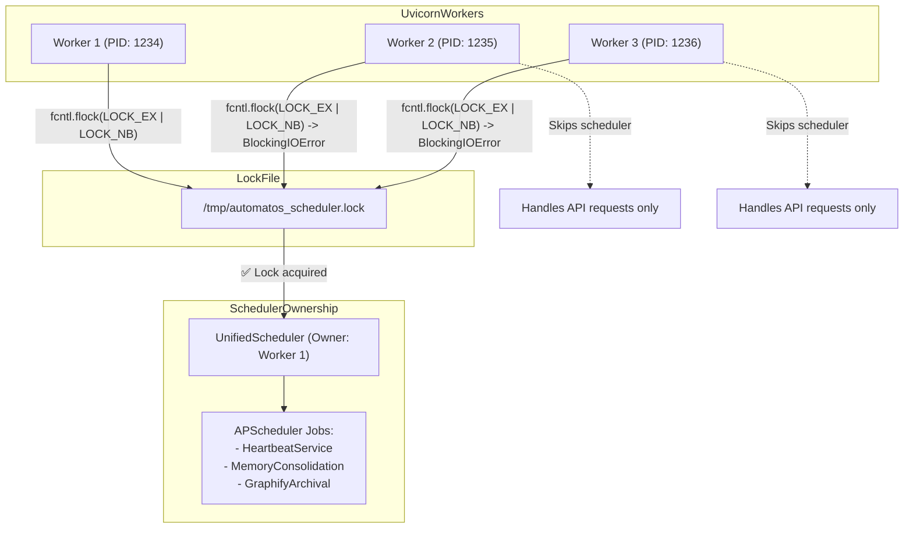
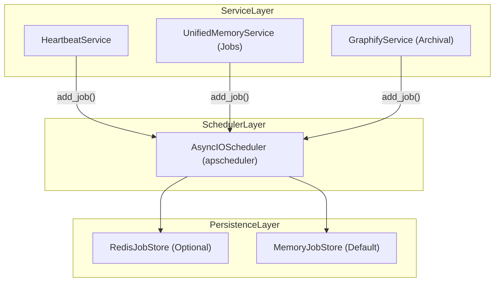
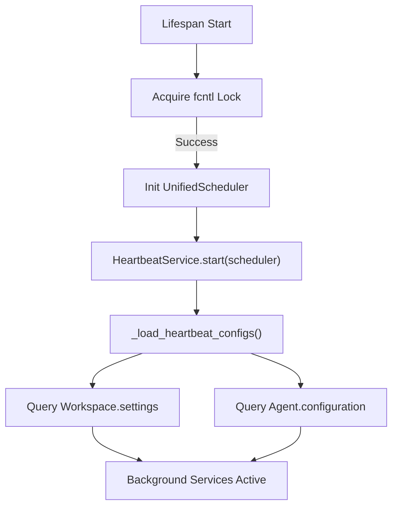

# Background Services

<details>
<summary>Relevant source files</summary>

The following files were used as context for generating this wiki page:

- [frontend/tsconfig.tsbuildinfo](frontend/tsconfig.tsbuildinfo)
- [orchestrator/alembic/versions/wave3_escalation_level.py](orchestrator/alembic/versions/wave3_escalation_level.py)
- [orchestrator/config.py](orchestrator/config.py)
- [orchestrator/core/services/escalation.py](orchestrator/core/services/escalation.py)
- [orchestrator/main.py](orchestrator/main.py)
- [orchestrator/modules/memory/context_router.py](orchestrator/modules/memory/context_router.py)
- [orchestrator/modules/memory/unified_memory_service.py](orchestrator/modules/memory/unified_memory_service.py)
- [orchestrator/modules/tools/discovery/actions_reports.py](orchestrator/modules/tools/discovery/actions_reports.py)
- [orchestrator/modules/tools/discovery/actions_workspace.py](orchestrator/modules/tools/discovery/actions_workspace.py)
- [orchestrator/modules/tools/discovery/handlers_reports.py](orchestrator/modules/tools/discovery/handlers_reports.py)
- [orchestrator/modules/tools/discovery/handlers_workspace.py](orchestrator/modules/tools/discovery/handlers_workspace.py)
- [orchestrator/services/heartbeat_service.py](orchestrator/services/heartbeat_service.py)
- [orchestrator/services/report_service.py](orchestrator/services/report_service.py)
- [orchestrator/tests/test_unified_memory.py](orchestrator/tests/test_unified_memory.py)
- [scripts/ralph/IMPLEMENTATION_PLAN.md](scripts/ralph/IMPLEMENTATION_PLAN.md)
- [scripts/ralph/prd.json](scripts/ralph/prd.json)
- [scripts/ralph/progress.txt](scripts/ralph/progress.txt)

</details>


## Purpose and Scope

Background Services in Automatos AI are scheduled, long-running tasks that execute independently of user requests. These services handle periodic maintenance, proactive monitoring, memory consolidation, and autonomous agent actions. The system uses a unified scheduler with file-based locking to ensure exactly-one worker execution in multi-process deployments, preventing race conditions and duplicate task execution.

This page covers the scheduler architecture, registered background services (Heartbeat, Memory, and Reports), and specific patterns for background data processing.

---

## Unified Scheduler Architecture

### File Lock Pattern

Automatos AI uses **fcntl file locking** to ensure only one uvicorn worker acquires the scheduler lock. This is critical for maintaining consistency in `APScheduler` job execution across scaled backend instances.

**Lock Acquisition Flow:**



Sources: `[orchestrator/main.py:1-22]()` (Lifespan management), `[orchestrator/services/heartbeat_service.py:33-52]()` (Scheduler ownership).

### APScheduler Integration

The background infrastructure utilizes `AsyncIOScheduler` from the APScheduler library. It supports `MemoryJobStore` for volatile tasks and `RedisJobStore` for persistent job definitions across restarts when `REDIS_URL` is configured in `config.py` `[orchestrator/config.py:69-79]()`.

**Scheduler Stack:**



Sources: `[orchestrator/services/heartbeat_service.py:17-20]()`, `[orchestrator/services/heartbeat_service.py:55-67]()`.

---

## Registered Background Services

### HeartbeatService

The `HeartbeatService` manages periodic "ticks" for both the orchestrator and individual agents. It converts user-defined intervals into cron-based triggers `[orchestrator/services/heartbeat_service.py:140-171]()`.

**Key Features:**
- **Orchestrator Tick**: Periodic workspace-level checks. It triggers `_orchestrator_tick` with specific workspace configurations `[orchestrator/services/heartbeat_service.py:173-195]()`.
- **Agent Tick**: Per-agent periodic tasks, often used for status transitions in `BoardTask` management. It triggers `_agent_tick` `[orchestrator/services/heartbeat_service.py:197-219]()`.
- **Daily Summary**: A cron job scheduled at 01:00 UTC daily for memory consolidation and reporting `[orchestrator/services/heartbeat_service.py:73-83]()`.

Sources: `[orchestrator/services/heartbeat_service.py:24-220]()`.

### Memory Maintenance Service

The `UnifiedMemoryService` and its associated background jobs handle the lifecycle of the 5-layer memory stack.

**Background Tasks:**
- **Consolidation**: Moving L1 (Redis) session data to L2 (Postgres) after a session ends `[orchestrator/config.py:111-111]()`.
- **Decay**: Applying Ebbinghaus decay to L2 memories based on `MEMORY_DECAY_RATE` `[orchestrator/config.py:98-112]()`.
- **Promotion**: Moving high-importance L2 memories to L3 (Mem0) `[orchestrator/config.py:104-113]()`.
- **Graphify Archival**: Monthly job that folds aged L2/L3 memories into the workspace knowledge graph `[orchestrator/config.py:116-123]()`.

Sources: `[orchestrator/modules/memory/unified_memory_service.py:154-188]()`, `[orchestrator/config.py:82-123]()`.

---

## Background Task Patterns

### Report Generation and Submission

Agents use background execution to produce deliverables. The `ReportService` handles the persistent storage of these artifacts.

**Report Lifecycle:**
1.  **Execution**: An agent performs work (e.g., via a heartbeat tick).
2.  **Submission**: The agent calls `platform_submit_report` `[orchestrator/modules/tools/discovery/actions_reports.py:9-110]()`.
3.  **Storage**: The `ReportService` writes a Markdown file to the workspace filesystem and inserts a metadata row into the `agent_reports` table `[orchestrator/services/report_service.py:156-210]()`.
4.  **Indexing**: Submission triggers an incremental update to the Knowledge Graph `[orchestrator/modules/tools/discovery/handlers_reports.py:83-91]()`.

Sources: `[orchestrator/services/report_service.py:149-211]()`, `[orchestrator/modules/tools/discovery/handlers_reports.py:14-92]()`.

---

## Code-to-System Mapping

### Heartbeat and Proactive Tick System

```mermaid
graph LR
    subgraph "Natural Language Space"
        Schedule["'Check my tasks every hour'"]
        Action["'Proactively notify me of errors'"]
    end

    subgraph "Code Entity Space"
        HS["HeartbeatService (Class)"]
        Tick["_orchestrator_tick (Method)"]
        Cron["_interval_to_cron_trigger (Helper)"]
        AgentConfig["agent.configuration.heartbeat (JSON)"]
        DB["Workspace (Model)"]
    end

    Schedule --> AgentConfig
    AgentConfig --> HS
    HS --> Cron
    Cron --> HS
    HS --> Tick
    Action --> Tick
    Tick --> DB
end
```
Sources: `[orchestrator/services/heartbeat_service.py:24-38]()`, `[orchestrator/services/heartbeat_service.py:140-151]()`.

### Memory Lifecycle System

```mermaid
graph LR
    subgraph "Natural Language Space"
        Store["'Remember this decision'"]
        Decay["'Forget unimportant notes'"]
    end

    subgraph "Code Entity Space"
        UMS["UnifiedMemoryService (Singleton)"]
        MN["MemoryNamespace (Dataclass)"]
        L1["Redis (Session Cache)"]
        L2["Postgres (Short-term)"]
        L3["Mem0Client (Long-term)"]
    end

    Store --> UMS
    UMS --> MN
    MN --> L1
    UMS --> L2
    Decay --> L2
    UMS --> L3
end
```
Sources: `[orchestrator/modules/memory/unified_memory_service.py:39-107]()`, `[orchestrator/modules/memory/unified_memory_service.py:154-188]()`.

---

## Service Lifecycle

### Startup and Initialization

Background services are initialized within the FastAPI lifespan manager. The `HeartbeatService` is typically started with a shared scheduler instance to maintain the lock `[orchestrator/services/heartbeat_service.py:43-52]()`.



Sources: `[orchestrator/services/heartbeat_service.py:43-71]()`, `[orchestrator/services/heartbeat_service.py:96-133]()`.

### Execution Concurrency Control

To prevent resource exhaustion, the `HeartbeatService` implements rate limiting on concurrent ticks:
- **Agent Limit**: Max 1 concurrent heartbeat per agent `[orchestrator/services/heartbeat_service.py:29-29]()`.
- **Workspace Limit**: Max 5 concurrent heartbeats per workspace `[orchestrator/services/heartbeat_service.py:29-29]()`.

Sources: `[orchestrator/services/heartbeat_service.py:24-38]()`.

---