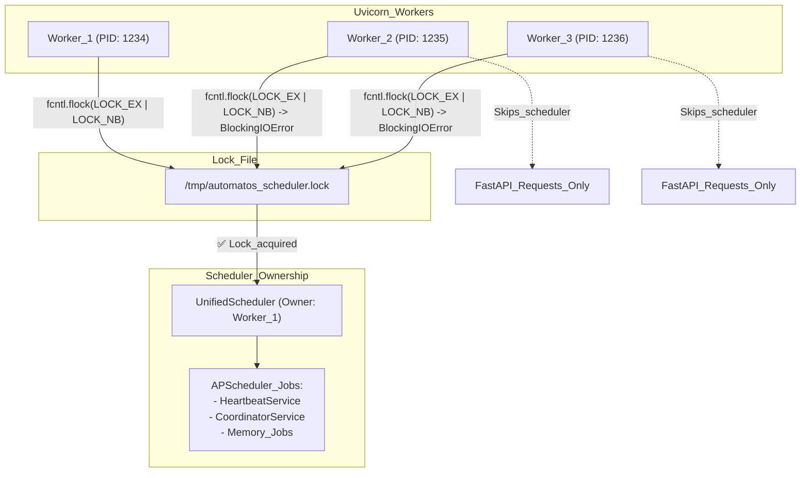
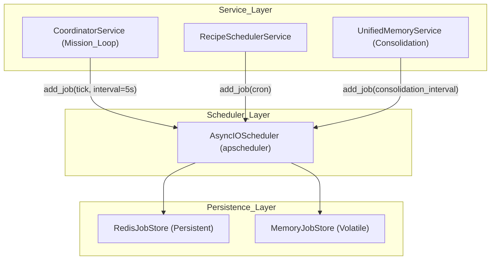
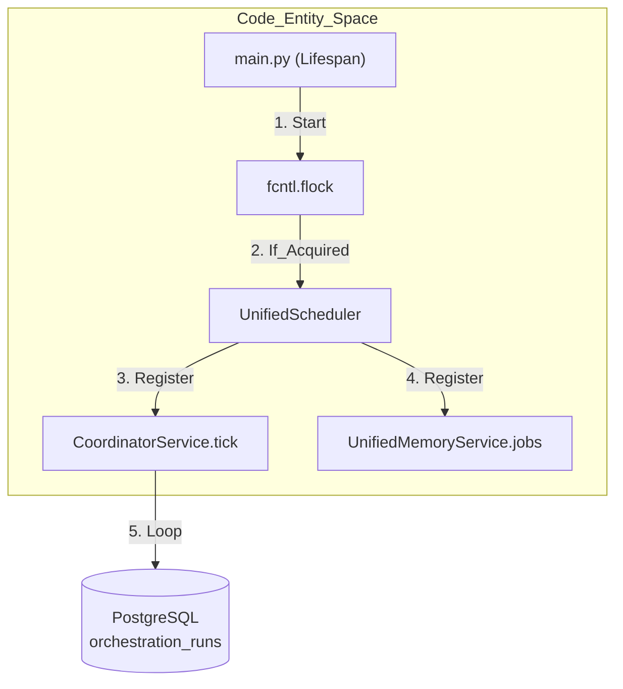

# Background Services

Relevant source files

The following files were used as context for generating this wiki page:

- [docs/PRDS/69-AGENT-INTELLIGENCE-LAYER.md](docs/PRDS/69-AGENT-INTELLIGENCE-LAYER.md)
- [docs/PRDS/70-SECURITY-HARDENING-PENTEST-REMEDIATION.md](docs/PRDS/70-SECURITY-HARDENING-PENTEST-REMEDIATION.md)
- [orchestrator/alembic/versions/prd123_checkpoint_count.py](orchestrator/alembic/versions/prd123_checkpoint_count.py)
- [orchestrator/api/missions.py](orchestrator/api/missions.py)
- [orchestrator/config.py](orchestrator/config.py)
- [orchestrator/core/context_guard.py](orchestrator/core/context_guard.py)
- [orchestrator/core/models/orchestration.py](orchestrator/core/models/orchestration.py)
- [orchestrator/core/models/orchestration_enums.py](orchestrator/core/models/orchestration_enums.py)
- [orchestrator/main.py](orchestrator/main.py)
- [orchestrator/modules/coordination/dispatcher.py](orchestrator/modules/coordination/dispatcher.py)
- [orchestrator/modules/coordination/planner.py](orchestrator/modules/coordination/planner.py)
- [orchestrator/modules/coordination/reconciler.py](orchestrator/modules/coordination/reconciler.py)
- [orchestrator/modules/memory/context_router.py](orchestrator/modules/memory/context_router.py)
- [orchestrator/modules/memory/unified_memory_service.py](orchestrator/modules/memory/unified_memory_service.py)
- [orchestrator/modules/tools/discovery/action_registry.py](orchestrator/modules/tools/discovery/action_registry.py)
- [orchestrator/modules/tools/execution/concurrency.py](orchestrator/modules/tools/execution/concurrency.py)
- [orchestrator/services/checkpoint_service.py](orchestrator/services/checkpoint_service.py)
- [orchestrator/services/coordinator_service.py](orchestrator/services/coordinator_service.py)
- [orchestrator/services/orchestration_state.py](orchestrator/services/orchestration_state.py)
- [orchestrator/services/scheduler.py](orchestrator/services/scheduler.py)
- [orchestrator/tests/test_budget_gate.py](orchestrator/tests/test_budget_gate.py)
- [orchestrator/tests/test_dispatcher_parallel.py](orchestrator/tests/test_dispatcher_parallel.py)
- [orchestrator/tests/test_recipe_scheduler.py](orchestrator/tests/test_recipe_scheduler.py)
- [orchestrator/tests/test_unified_memory.py](orchestrator/tests/test_unified_memory.py)
- [orchestrator/tests/test_unified_scheduler.py](orchestrator/tests/test_unified_scheduler.py)
- [scripts/ralph/IMPLEMENTATION_PLAN.md](scripts/ralph/IMPLEMENTATION_PLAN.md)
- [scripts/ralph/progress.txt](scripts/ralph/progress.txt)

## Purpose and Scope

Background Services in Automatos AI are scheduled, long-running tasks that execute independently of user requests. These services handle periodic maintenance, proactive monitoring, recipe scheduling, memory consolidation, and multi-agent mission coordination. The system uses a unified scheduler with file-based locking to ensure exactly-one worker execution in multi-process deployments.

This page covers the scheduler architecture, the mission coordination loop, registered background services, and lifecycle management patterns.

---

## Unified Scheduler Architecture

### File Lock Pattern

Automatos AI uses **fcntl file locking** to ensure only one uvicorn worker acquires the scheduler lock, preventing duplicate job executions when running with multiple workers. This is critical for maintaining consistency in `APScheduler` job execution across scaled backend instances.

**Lock Acquisition Flow:**

Sources: [orchestrator/main.py:18-21](), [orchestrator/main.py:32-34]()

### APScheduler Integration

The `UnifiedScheduler` (referenced in `services/scheduler.py`) wraps `AsyncIOScheduler`. It supports both `MemoryJobStore` for volatile tasks and `RedisJobStore` for persistent job definitions across restarts.

**Scheduler Stack:**

Sources: [orchestrator/services/coordinator_service.py:88-91](), [orchestrator/tests/test_recipe_scheduler.py:33-39]()

---

## The Mission Coordination Loop

The `CoordinatorService` is the primary background engine for multi-agent orchestration. It runs a **5-second tick loop** to manage the lifecycle of sequential missions.

### Coordinator Tick Logic

The `tick()` function is DB-authoritative and stateless. Each execution acquires a new `SessionLocal` to process active missions.

1.  **Reconciliation**: The `MissionReconciler` checks for stalled tasks (tasks stuck in `running` state beyond timeouts). [orchestrator/services/coordinator_service.py:54-55]()
2.  **Dispatching**: The `MissionDispatcher` identifies `queued` tasks whose dependencies are met and assigns them to available agents. [orchestrator/modules/coordination/dispatcher.py:181-202]()
3.  **Parallelism**: It respects `max_concurrent` settings per mission to dispatch multiple tasks simultaneously using `asyncio.gather`. [orchestrator/modules/coordination/dispatcher.py:5-6]()
4.  **Optimistic Locking**: Uses a `version_id` column and raw SQL `UPDATE` to "claim" tasks, preventing race conditions between concurrent scheduler ticks. [orchestrator/modules/coordination/dispatcher.py:120-151]()

### Mission State Machine

The background loop transitions missions through various `RunState` and `TaskState` values.

| Entity | Initial State | Active States | Terminal States |
| :--- | :--- | :--- | :--- |
| **OrchestrationRun** | `PENDING`, `PLANNING` | `RUNNING`, `VERIFYING`, `AWAITING_HUMAN` | `COMPLETED`, `FAILED`, `CANCELLED` |
| **OrchestrationTask** | `PENDING`, `QUEUED` | `ASSIGNED`, `RUNNING`, `VERIFYING` | `VERIFIED`, `FAILED`, `SKIPPED` |

Sources: [orchestrator/core/models/orchestration_enums.py:29-60](), [orchestrator/core/models/orchestration.py:153-162]()

---

## Registered Background Services

### HeartbeatService

Manages periodic "ticks" for both the orchestrator and individual agents.
- **Orchestrator Tick**: Periodic workspace-level health and proactive checks.
- **Agent Tick**: Per-agent periodic tasks, often used for status transitions in `BoardTask` management.
- **Daily Summary**: A cron job scheduled at 01:00 UTC daily for memory consolidation.

Sources: [orchestrator/main.py:134-142]()

### UnifiedMemoryService (L2→L3 Promotion)

The `UnifiedMemoryService` manages the 5-layer memory stack via background jobs.
- **Consolidation**: Moves L1 (Redis session) data to L2 (Postgres) after a session ends. [orchestrator/config.py:112-114]()
- **Promotion**: A daily background job (default 03:00 UTC) promotes high-importance memories from L2 to L3 (Mem0). [orchestrator/config.py:115-115]()
- **Decay**: Periodically applies Ebbinghaus forgetting curves to L2 memories, archiving items below a specific importance threshold. [orchestrator/config.py:100-103]()

Sources: [orchestrator/modules/memory/unified_memory_service.py:8-13](), [orchestrator/config.py:82-118]()

### RecipeSchedulerService

Fires workflow recipes that have a `schedule_config` of type `cron`.
- **Job Identification**: Jobs are assigned unique IDs (e.g., `recipe_cron_{id}`) to prevent duplicates. [orchestrator/tests/test_recipe_scheduler.py:180-188]()
- **Execution**: Triggers `execute_recipe_direct` which manages workspace semaphores to limit concurrency. [orchestrator/api/workflow_recipes.py:66-79]()

Sources: [orchestrator/api/workflow_recipes.py:34-48](), [orchestrator/tests/test_recipe_scheduler.py:42-46]()

---

## Service Lifecycle and Patterns

### Startup Sequence

Background services are initialized within the FastAPI lifespan manager in `main.py`.

Sources: [orchestrator/main.py:9-14](), [orchestrator/services/coordinator_service.py:82-83]()

### Implementation Patterns

**1. Atomic Task Claiming**
To ensure that two scheduler ticks don't dispatch the same task, the system uses an atomic SQL update:
`UPDATE orchestration_tasks SET state = 'assigned' WHERE id = :id AND state = 'queued' AND version_id = :expected_version`
[orchestrator/modules/coordination/dispatcher.py:140-151]()

**2. Per-Workspace Semaphores**
To prevent a single workspace from exhausting system resources, background execution (like recipes) is gated by a semaphore:
`_workspace_semaphores: Dict[str, asyncio.Semaphore]`
[orchestrator/api/recipe_executor.py:41-47]()

**3. Budget Guardrails**
The `CoordinatorService` tracks `tokens_used` and `budget_spent` (JSONB) in the background. If a mission exceeds its `token_budget_estimate`, the loop transitions the mission to `FAILED` with a `BUDGET_EXHAUSTED` reason. [orchestrator/core/models/orchestration.py:114-116](), [orchestrator/core/models/orchestration_enums.py:177-179]()

Sources: [orchestrator/services/coordinator_service.py:12-13](), [orchestrator/modules/coordination/dispatcher.py:160-178]()

---