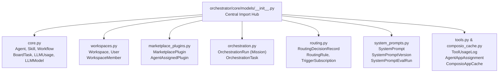
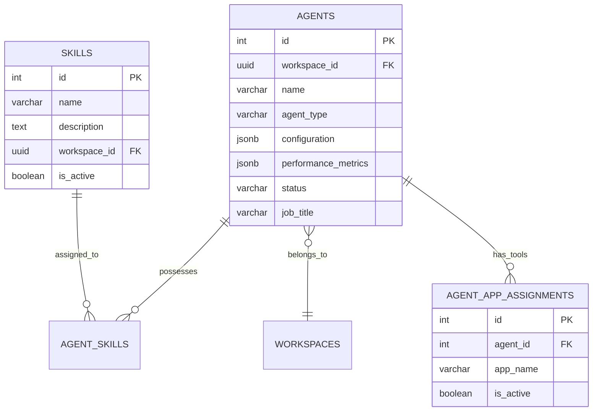
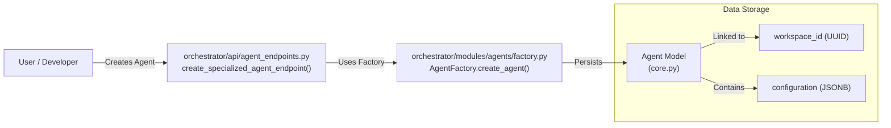

# Database Models & Migrations

<details>
<summary>Relevant source files</summary>

The following files were used as context for generating this wiki page:

- [.github/workflows/test.yml](.github/workflows/test.yml)
- [docker-compose.yml](docker-compose.yml)
- [frontend/.dockerignore](frontend/.dockerignore)
- [frontend/Dockerfile](frontend/Dockerfile)
- [frontend/components/agents/agent-configuration-modal.tsx](frontend/components/agents/agent-configuration-modal.tsx)
- [frontend/components/agents/agent-configuration.tsx](frontend/components/agents/agent-configuration.tsx)
- [frontend/components/agents/agent-details-modal.tsx](frontend/components/agents/agent-details-modal.tsx)
- [frontend/components/agents/agent-performance.tsx](frontend/components/agents/agent-performance.tsx)
- [frontend/components/agents/agent-roster.tsx](frontend/components/agents/agent-roster.tsx)
- [frontend/components/agents/agent-skills.tsx](frontend/components/agents/agent-skills.tsx)
- [frontend/components/agents/agent-status-control-modal.tsx](frontend/components/agents/agent-status-control-modal.tsx)
- [frontend/components/agents/create-agent-modal.tsx](frontend/components/agents/create-agent-modal.tsx)
- [frontend/components/agents/create-skill-modal.tsx](frontend/components/agents/create-skill-modal.tsx)
- [frontend/components/agents/model-selector.tsx](frontend/components/agents/model-selector.tsx)
- [frontend/components/agents/skill-configuration-modal.tsx](frontend/components/agents/skill-configuration-modal.tsx)
- [frontend/hooks/use-agent-api.ts](frontend/hooks/use-agent-api.ts)
- [frontend/hooks/use-model-api.ts](frontend/hooks/use-model-api.ts)
- [frontend/lib/agent-constants.ts](frontend/lib/agent-constants.ts)
- [infrastructure/.env.example](infrastructure/.env.example)
- [infrastructure/railway-manifest.json](infrastructure/railway-manifest.json)
- [orchestrator/Dockerfile](orchestrator/Dockerfile)
- [orchestrator/alembic/versions/add_job_title_to_agents.py](orchestrator/alembic/versions/add_job_title_to_agents.py)
- [orchestrator/api/admin_prompts.py](orchestrator/api/admin_prompts.py)
- [orchestrator/api/agent_endpoints.py](orchestrator/api/agent_endpoints.py)
- [orchestrator/api/agents.py](orchestrator/api/agents.py)
- [orchestrator/api/generated_images.py](orchestrator/api/generated_images.py)
- [orchestrator/api/system_settings.py](orchestrator/api/system_settings.py)
- [orchestrator/core/database/database.py](orchestrator/core/database/database.py)
- [orchestrator/core/models/__init__.py](orchestrator/core/models/__init__.py)
- [orchestrator/core/models/core.py](orchestrator/core/models/core.py)
- [orchestrator/core/models/system_prompts.py](orchestrator/core/models/system_prompts.py)
- [orchestrator/core/redis/client.py](orchestrator/core/redis/client.py)
- [orchestrator/core/seeds/seed_system_prompts.py](orchestrator/core/seeds/seed_system_prompts.py)
- [orchestrator/core/services/audit_service.py](orchestrator/core/services/audit_service.py)
- [orchestrator/core/services/prompt_registry.py](orchestrator/core/services/prompt_registry.py)
- [orchestrator/requirements.txt](orchestrator/requirements.txt)
- [orchestrator/tests/test_dockerfile_prod_parity.py](orchestrator/tests/test_dockerfile_prod_parity.py)
- [orchestrator/tests/test_w1s8_get_db_lifecycle.py](orchestrator/tests/test_w1s8_get_db_lifecycle.py)

</details>


This page documents the SQLAlchemy ORM models that define the database schema for Automatos AI, focusing on their structure, usage of `workspace_id` foreign keys, `JSONB` fields, and the Alembic migration strategy. These models establish the data layer for agents, workflows, marketplace entities, multi-tenancy, and orchestration missions.

## Model Organization

Database models are organized in the `orchestrator/core/models/` directory as a modular package. The `__init__.py` file serves as the central hub, importing and exposing models to allow unified imports like `from core.models import Agent, LLMUsage, OrchestrationRun` [orchestrator/core/models/__init__.py:1-54]().

### Module Structure

The following diagram illustrates the relationship between the model files and the entities they define.

**Core Models Module Layout**



Sources: [orchestrator/core/models/__init__.py:1-80](), [orchestrator/core/models/core.py:43-140](), [orchestrator/core/models/system_prompts.py:32-138]()

### Database Connection & Session Management

The system uses SQLAlchemy with a PostgreSQL backend, utilizing `JSONB` for flexible configuration and `UUID` for multi-tenant identifiers [orchestrator/core/models/core.py:9-19]().

**Session Lifecycle Pattern**
The application follows a dependency injection pattern for database sessions. The `get_db` utility in `orchestrator/core/database/database.py` provides a scoped session per request, ensuring transactions are handled at the API level [orchestrator/core/database/database.py:105-117](). It includes a `rollback()` in the `finally` block to prevent "idle in transaction" connections [orchestrator/core/database/database.py:115-116]().

---

## Core Entity Models

### LLM Registry & Usage Tracking

The system maintains a registry of available models and tracks their usage for analytics and cost management.

| Model | Table Name | Purpose |
|-------|------------|---------|
| `LLMModel` | `llm_models` | Registry of available models (GPT-4, Claude, etc.) with cost and capability metadata [orchestrator/core/models/core.py:47-98](). |
| `WorkspaceModel` | `workspace_models` | Tracks which marketplace models are installed in a specific workspace [orchestrator/core/models/core.py:107-133](). |
| `LLMUsage` | `llm_usage` | Granular tracking of token usage, latency, and costs per request [orchestrator/core/models/core.py:152-169](). |
| `UserApiKey` | `user_api_keys` | Encrypted BYOK storage for workspace-provided API keys [orchestrator/core/models/core.py:136-150](). |

Sources: [orchestrator/core/models/core.py:47-169]()

### Agent & Skill Models

Agents are the primary execution units. They are linked to skills and workflows via association tables `agent_skills` and `workflow_agents` [orchestrator/core/models/core.py:31-41]().



Sources: [orchestrator/core/models/core.py:29-41](), [orchestrator/core/models/composio_cache.py:13-25](), [orchestrator/api/agents.py:12-25](), [orchestrator/alembic/versions/add_job_title_to_agents.py]()

---

## System Prompt Management (PRD-58)

The system includes a versioned prompt management layer that allows admins to manage system-wide prompts with evaluation tracking [orchestrator/core/models/system_prompts.py:1-6]().

### Prompt Schema

| Class | Table | Role |
|-------|-------|------|
| `SystemPrompt` | `system_prompts` | The root prompt entity. Uses a `slug` as a stable identifier for code references [orchestrator/core/models/system_prompts.py:32-68](). |
| `SystemPromptVersion` | `system_prompt_versions` | Immutable snapshots of prompt content. Only one version per prompt is marked as `active` [orchestrator/core/models/system_prompts.py:71-105](). |
| `SystemPromptEvalRun` | `system_prompt_eval_runs` | Tracks FutureAGI evaluation, optimization, or safety check runs [orchestrator/core/models/system_prompts.py:108-138](). |

Sources: [orchestrator/core/models/system_prompts.py:32-138]()

---

## Mission & Orchestration Models

The Mission system (Sequential Mission Coordinator) uses a set of specialized models to manage complex, multi-step agent goals [orchestrator/core/models/__init__.py:30-52]().

### Orchestration Schema

| Class | Table | Role |
|-------|-------|------|
| `OrchestrationRun` | `orchestration_runs` | Represents a "Mission". Stores high-level goal, budget configuration, and overall state [orchestrator/core/models/__init__.py:32](). |
| `OrchestrationTask` | `orchestration_tasks` | A single step within a mission. Tracks assigned agent, input/output data, and execution state [orchestrator/core/models/__init__.py:33](). |
| `OrchestrationEvent` | `orchestration_events` | Audit log for mission transitions and system actions [orchestrator/core/models/__init__.py:35](). |

**Governance & Reliability**: 
Missions utilize a `RunState` and `TaskState` machine to track progress, with terminal states including `COMPLETED`, `FAILED`, and `CANCELLED` [orchestrator/core/models/__init__.py:39-52]().

Sources: [orchestrator/core/models/__init__.py:30-52]()

---

## Data Patterns

### Multi-Tenancy (Workspace ID)
Multi-tenancy is strictly enforced via `workspace_id` foreign keys on nearly all models.
- **Foreign Key**: Models like `LLMModel`, `WorkspaceModel`, `UserApiKey`, and `LLMUsage` include a `workspace_id` referencing the `workspaces` table [orchestrator/core/models/core.py:101](), [orchestrator/core/models/core.py:112](), [orchestrator/core/models/core.py:141](), [orchestrator/core/models/core.py:158]().
- **Filtering**: API endpoints like `get_agent_performance` filter by `workspace_id` from the request context to ensure data isolation [orchestrator/api/agent_endpoints.py:134]().

### JSONB Fields
The codebase extensively uses `JSONB` for flexibility:
- **Capabilities**: `LLMModel.capabilities` stores model-specific features [orchestrator/core/models/core.py:61]().
- **Configuration**: `Agent.configuration` stores LLM parameters and execution settings [orchestrator/core/models/core.py:79-93]().
- **Usage Stats**: `Agent.model_usage_stats` and `Agent.performance_metrics` store aggregated execution data [orchestrator/api/agent_endpoints.py:152-153]().

**Natural Language Space to Code Entity Mapping**



Sources: [orchestrator/api/agent_endpoints.py:42-89](), [orchestrator/core/models/core.py:43-140](), [orchestrator/core/database/database.py:105-117]()

## Database Migrations with Alembic

Alembic is used for database schema migrations, ensuring that the database schema evolves with the application code.

### Alembic Configuration and Usage

Alembic is configured in the `orchestrator/alembic.ini` file. Migration scripts are located in `orchestrator/alembic/versions/`.

- **`alembic upgrade heads`**: This command is used to apply all pending migrations. In the `Dockerfile`, this command is executed during the development and production stages to ensure the database schema is up-to-date before the application starts [orchestrator/Dockerfile:131](). The `heads` argument is used to apply all unmerged heads in the migration tree.
- **Single-Head Invariant**: While `alembic upgrade heads` is currently used due to multiple unmerged heads, the ideal state for Alembic is a single-head invariant. This means the migration history should be linear, simplifying schema management and preventing conflicts. Future work should aim to rebase and merge divergent branches into a single linear history.

### Schema Drift and From-Zero Checks

- **Schema Drift Prevention**: By running `alembic upgrade heads` at application startup, the system actively prevents schema drift. If the application code expects a different schema than what's in the database, the migration process will either update the schema or fail loudly, preventing runtime errors due to mismatched database structures.
- **From-Zero Initialization**: For fresh deployments, the `scripts/init_test_db.py` script is used to initialize the database schema from scratch. This script typically involves creating all tables defined by the SQLAlchemy models and applying any necessary seed data. This is particularly useful in CI environments where a clean database is needed for each test run [orchestrator/tests/test_dockerfile_prod_parity.py:102](), [orchestrator/tests/test_w1s8_get_db_lifecycle.py:106](), [orchestrator/.github/workflows/test.yml:110]().

**Migration Workflow**

```mermaid
graph TD
    A[Developer Modifies Models] --> B{Generate Migration Script};
    B -- "alembic revision --autogenerate" --> C[New Migration File<br/>(alembic/versions/...)];
    C --> D[Review & Edit Migration Script];
    D --> E[Commit Migration Script];
    E --> F[Deployment / CI Environment];
    F -- "docker-entrypoint.sh" --> G[Run alembic upgrade heads];
    G --> H[Database Schema Updated];
```

Sources: [orchestrator/Dockerfile:131](), [orchestrator/requirements.txt:14](), [orchestrator/.github/workflows/test.yml:110]()

---