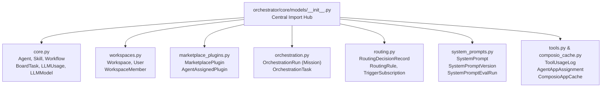
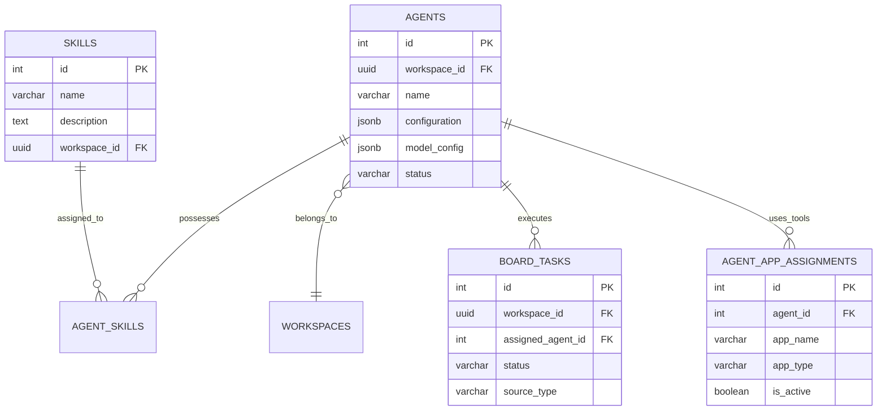
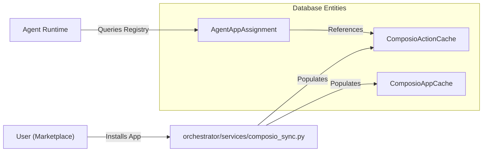

# Database Models

Relevant source files

The following files were used as context for generating this wiki page:

- [frontend/components/workflows/execution-theater/communication-log.tsx](frontend/components/workflows/execution-theater/communication-log.tsx)
- [orchestrator/alembic/versions/prd123_cost_tracking.py](orchestrator/alembic/versions/prd123_cost_tracking.py)
- [orchestrator/core/models/composio_cache.py](orchestrator/core/models/composio_cache.py)
- [orchestrator/scripts/prd_parity.py](orchestrator/scripts/prd_parity.py)
- [orchestrator/services/tool_manifest_service.py](orchestrator/services/tool_manifest_service.py)

This page documents the SQLAlchemy ORM models that define the database schema for Automatos AI. These models establish the data layer for agents, workflows, marketplace entities, multi-tenancy, and orchestration missions.

## Model Organization

Database models are organized in the `orchestrator/core/models/` directory as a modular package. The `__init__.py` file serves as the central hub, importing and exposing models to allow unified imports like `from core.models import Agent, LLMUsage, OrchestrationRun` [orchestrator/core/models/__init__.py:1-49]().

### Module Structure

The following diagram illustrates the relationship between the model files and the entities they define.

**Core Models Module Layout**

**Sources:** [orchestrator/core/models/__init__.py:1-49](), [orchestrator/core/models/core.py:43-140](), [orchestrator/core/models/composio_cache.py:39-132]()

### Database Connection & Session Management

The system uses SQLAlchemy with a PostgreSQL backend, utilizing `JSONB` for flexible configuration and `UUID` for multi-tenant identifiers [orchestrator/core/models/core.py:9-19]().

**Session Lifecycle Pattern**
The application follows a dependency injection pattern for database sessions. The `get_db` utility provides a scoped session per request, ensuring transactions are handled at the API level [orchestrator/api/missions.py:47]().

---

## Core Entity Models

### LLM Registry & Usage Tracking

The system maintains a registry of available models and tracks their usage for analytics and cost management.

| Model | Table Name | Purpose |
|-------|------------|---------|
| `LLMModel` | `llm_models` | Registry of available models (GPT-4, Claude, etc.) with cost and capability metadata [orchestrator/core/models/core.py:43-94](). |
| `WorkspaceModel` | `workspace_models` | Tracks which marketplace models are installed in a specific workspace [orchestrator/core/models/core.py:103-119](). |
| `LLMUsage` | `llm_usage` | Granular tracking of token usage, latency, and costs per request [orchestrator/core/models/core.py:138-169](). |
| `UserApiKey` | `user_api_keys` | Encrypted BYOK storage for workspace-specific provider keys [orchestrator/core/models/core.py:122-136](). |

**Sources:** [orchestrator/core/models/core.py:43-169]()

### Agent & Skill Models

Agents are the primary execution units, associated with skills and scoped to workspaces.

**Sources:** [orchestrator/core/models/core.py:29-37](), [orchestrator/core/models/core.py:97](), [orchestrator/core/models/composio_cache.py:165-188]()

---

## Mission & Orchestration Models

The Mission system (Sequential Mission Coordinator) uses a set of specialized models to manage complex, multi-step agent goals [orchestrator/core/models/orchestration.py:1-10]().

### Orchestration Schema

| Class | Table | Role |
|-------|-------|------|
| `OrchestrationRun` | `orchestration_runs` | Represents a "Mission". Stores high-level goal, `budget_config`, `budget_spent`, and overall state (INITIAL, ACTIVE, TERMINAL) [orchestrator/core/models/orchestration.py:39-136](). |
| `OrchestrationTask` | `orchestration_tasks` | A single step within a mission. Tracks assigned agent, input/output data, and execution state [orchestrator/core/models/orchestration.py:153-232](). |
| `OrchestrationEvent` | `orchestration_events` | Audit log for mission transitions and system actions [orchestrator/core/models/orchestration.py:284-315](). |
| `OrchestrationArchive` | `orchestration_archives` | Long-term storage for completed missions [orchestrator/core/models/orchestration.py:326-348](). |

**Governance & Reliability**: 
- **Optimistic Locking**: `OrchestrationRun` uses a `version_id` column for concurrency control [orchestrator/core/models/orchestration.py:134-136]().
- **Checkpoints**: Missions track `checkpoint_count` to facilitate recovery from S3-backed session snapshots [orchestrator/core/models/orchestration.py:112](), [orchestrator/services/checkpoint_service.py:40-79]().

**Sources:** [orchestrator/core/models/orchestration.py:39-348](), [orchestrator/services/checkpoint_service.py:40-79]()

---

## Tool & Integration Models

The system caches external tool metadata (primarily from Composio) to enable local discovery and routing [orchestrator/core/models/composio_cache.py:1-14]().

### Tool Cache Schema

- **ComposioAppCache**: Stores application-level metadata like `app_slug`, `logo_url`, and `auth_schemes` [orchestrator/core/models/composio_cache.py:39-60]().
- **ComposioActionCache**: Stores specific tool definitions, including `parameters` (JSON schema) and `response_schema` [orchestrator/core/models/composio_cache.py:86-110]().
- **AgentAppAssignment**: Links agents to specific tools with an `is_active` toggle and `priority` weight [orchestrator/core/models/composio_cache.py:165-188]().

**Natural Language to Code Entity Mapping**

**Sources:** [orchestrator/core/models/composio_cache.py:39-188]()

---

## Data Patterns

### Multi-Tenancy (Workspace ID)
Multi-tenancy is strictly enforced via `workspace_id` foreign keys on nearly all models.
- **Foreign Key**: `workspace_id = Column(UUID(as_uuid=True), ForeignKey('workspaces.id'))` [orchestrator/core/models/orchestration.py:59-64]().
- **Isolation**: All queries are scoped to the `workspace_id` extracted from the request context [orchestrator/api/missions.py:197]().

### JSONB Fields
The codebase extensively uses `JSONB` for flexible schemas and governance data:
- **Governance**: `budget_config` and `budget_spent` in `OrchestrationRun` [orchestrator/core/models/orchestration.py:115-116]().
- **Tool Schemas**: `parameters` and `response_schema` in `ComposioActionCache` [orchestrator/core/models/composio_cache.py:96-97]().
- **Metadata Aliasing**: To avoid clashes with SQLAlchemy's internal `metadata` attribute, several models map the physical `metadata` JSONB column to specialized names like `app_metadata`, `action_metadata`, or `job_metadata` [orchestrator/core/models/composio_cache.py:11-14](), [orchestrator/core/models/composio_cache.py:56](), [orchestrator/core/models/composio_cache.py:106](), [orchestrator/core/models/composio_cache.py:145]().

### State Machine Pattern
Missions and tasks follow a formal state machine defined in `orchestration_enums.py`. Transitions are managed by the `orchestration_state.py` service, which performs a **dual-write**: updating the entity row and appending an `OrchestrationEvent` in the same transaction [orchestrator/services/orchestration_state.py:84-185]().

### Cost and Execution Tracking
Recent schema updates (PRD-123) have introduced specific columns for tracking tool execution efficiency and costs within the `tool_execution_logs` table:
- `estimated_cost`: Tracks the LLM or API cost of a specific tool call [orchestrator/alembic/versions/prd123_cost_tracking.py:21]().
- `execution_ms`: Records the latency of the tool execution [orchestrator/alembic/versions/prd123_cost_tracking.py:29]().
- `rate_limit_remaining`: Provides visibility into provider limits [orchestrator/alembic/versions/prd123_cost_tracking.py:25]().

**Sources:** [orchestrator/core/models/orchestration.py:39-232](), [orchestrator/services/orchestration_state.py:84-185](), [orchestrator/core/models/composio_cache.py:86-110](), [orchestrator/alembic/versions/prd123_cost_tracking.py:18-31]()

---