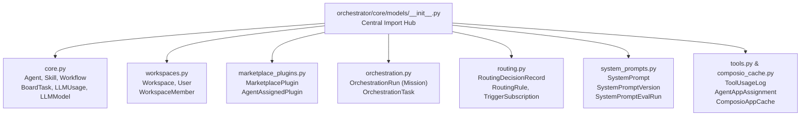
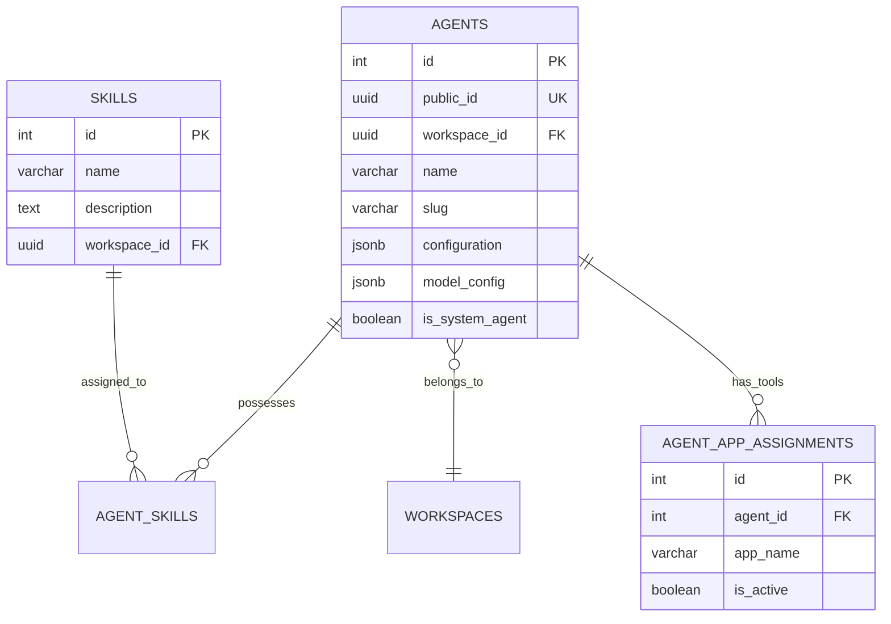
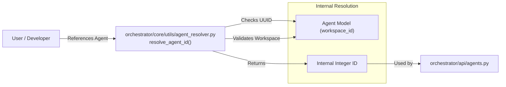

# Database Models

Relevant source files

The following files were used as context for generating this wiki page:

- [frontend/components/agents/agent-configuration-modal.tsx](frontend/components/agents/agent-configuration-modal.tsx)
- [frontend/components/agents/agent-configuration.tsx](frontend/components/agents/agent-configuration.tsx)
- [frontend/components/agents/agent-details-modal.tsx](frontend/components/agents/agent-details-modal.tsx)
- [frontend/components/agents/agent-roster.tsx](frontend/components/agents/agent-roster.tsx)
- [frontend/components/agents/create-agent-modal.tsx](frontend/components/agents/create-agent-modal.tsx)
- [frontend/components/documents/analytics-tab.tsx](frontend/components/documents/analytics-tab.tsx)
- [frontend/components/documents/processing-tab.tsx](frontend/components/documents/processing-tab.tsx)
- [frontend/lib/agent-constants.ts](frontend/lib/agent-constants.ts)
- [orchestrator/alembic/versions/add_job_title_to_agents.py](orchestrator/alembic/versions/add_job_title_to_agents.py)
- [orchestrator/alembic/versions/agent_public_id_and_slug_fix.py](orchestrator/alembic/versions/agent_public_id_and_slug_fix.py)
- [orchestrator/alembic/versions/seed_auto_agents_existing_workspaces.py](orchestrator/alembic/versions/seed_auto_agents_existing_workspaces.py)
- [orchestrator/alembic/versions/wave1a_agent_responsibilities.py](orchestrator/alembic/versions/wave1a_agent_responsibilities.py)
- [orchestrator/alembic/versions/wave1b_heartbeat_completion.py](orchestrator/alembic/versions/wave1b_heartbeat_completion.py)
- [orchestrator/alembic/versions/wave1c_report_signals.py](orchestrator/alembic/versions/wave1c_report_signals.py)
- [orchestrator/alembic/versions/wave1d_mission_lifecycle.py](orchestrator/alembic/versions/wave1d_mission_lifecycle.py)
- [orchestrator/api/agents.py](orchestrator/api/agents.py)
- [orchestrator/core/models/core.py](orchestrator/core/models/core.py)
- [orchestrator/core/models/orchestration.py](orchestrator/core/models/orchestration.py)
- [orchestrator/core/models/orchestration_enums.py](orchestrator/core/models/orchestration_enums.py)
- [orchestrator/core/utils/agent_resolver.py](orchestrator/core/utils/agent_resolver.py)

This page documents the SQLAlchemy ORM models that define the database schema for Automatos AI. These models establish the data layer for agents, workflows, marketplace entities, multi-tenancy, and orchestration missions.

## Model Organization

Database models are organized in the `orchestrator/core/models/` directory as a modular package. The `__init__.py` file serves as the central hub, importing and exposing models to allow unified imports like `from core.models import Agent, LLMUsage, OrchestrationRun` [orchestrator/core/models/__init__.py:1-51]().

### Module Structure

The following diagram illustrates the relationship between the model files and the entities they define.

**Core Models Module Layout**

**Sources:** [orchestrator/core/models/__init__.py:1-80](), [orchestrator/core/models/core.py:43-140](), [orchestrator/core/models/system_prompts.py:32-138]()

### Database Connection & Session Management

The system uses SQLAlchemy with a PostgreSQL backend, utilizing `JSONB` for flexible configuration and `UUID` for multi-tenant identifiers [orchestrator/core/models/core.py:9-19]().

**Session Lifecycle Pattern**
The application follows a dependency injection pattern for database sessions. The `get_db` utility provides a scoped session per request, ensuring transactions are handled at the API level [orchestrator/api/agents.py:9]().

---

## Core Entity Models

### LLM Registry & Usage Tracking

The system maintains a registry of available models and tracks their usage for analytics and cost management.

| Model | Table Name | Purpose |
|-------|------------|---------|
| `LLMModel` | `llm_models` | Registry of available models (GPT-4, Claude, etc.) with cost and capability metadata [orchestrator/core/models/core.py:43-94](). |
| `WorkspaceModel` | `workspace_models` | Tracks which marketplace models are installed in a specific workspace [orchestrator/core/models/core.py:103-119](). |
| `LLMUsage` | `llm_usage` | Granular tracking of token usage, latency, and costs per request [orchestrator/core/models/core.py:138-169](). |
| `UserApiKey` | `user_api_keys` | Encrypted BYOK storage for workspace-specific provider keys [orchestrator/core/models/core.py:122-136](). |

**Sources:** [orchestrator/core/models/core.py:43-169]()

### Agent & Skill Models

Agents are the primary execution units. Recent migrations have introduced `public_id` (UUID) for secure external identification and per-workspace `slug` uniqueness [orchestrator/alembic/versions/agent_public_id_and_slug_fix.py:1-13](). Every workspace is automatically provisioned with a system "Auto" agent for orchestration [orchestrator/alembic/versions/seed_auto_agents_existing_workspaces.py:1-10]().

**Sources:** [orchestrator/core/models/core.py:29-37](), [orchestrator/core/models/composio_cache.py:13](), [orchestrator/alembic/versions/agent_public_id_and_slug_fix.py:28-66](), [orchestrator/alembic/versions/seed_auto_agents_existing_workspaces.py:42-60]()

---

## System Prompt Management (PRD-58)

The system includes a versioned prompt management layer that allows admins to manage system-wide prompts (e.g., routing logic, personality templates) with evaluation tracking [orchestrator/core/models/system_prompts.py:1-6]().

### Prompt Schema

| Class | Table | Role |
|-------|-------|------|
| `SystemPrompt` | `system_prompts` | The root prompt entity. Uses a `slug` as a stable identifier for code references (e.g., `routing-classifier`) [orchestrator/core/models/system_prompts.py:32-68](). |
| `SystemPromptVersion` | `system_prompt_versions` | Immutable snapshots of prompt content. Only one version per prompt is marked as `active` [orchestrator/core/models/system_prompts.py:71-105](). |
| `SystemPromptEvalRun` | `system_prompt_eval_runs` | Tracks FutureAGI evaluation, optimization, or safety check runs against a specific prompt version [orchestrator/core/models/system_prompts.py:108-138](). |

**Sources:** [orchestrator/core/models/system_prompts.py:32-138]()

---

## Mission & Orchestration Models

The Mission system (Sequential Mission Coordinator) uses a set of specialized models to manage complex, multi-step agent goals [orchestrator/core/models/orchestration.py:1-10]().

### Orchestration Schema

| Class | Table | Role |
|-------|-------|------|
| `OrchestrationRun` | `orchestration_runs` | Represents a "Mission". Stores goal, plan, budget configuration, and state (PENDING, RUNNING, etc.) [orchestrator/core/models/orchestration.py:39-140](). |
| `OrchestrationTask` | `orchestration_tasks` | A single step within a mission. Tracks assigned agent, verification criteria, and execution state [orchestrator/core/models/orchestration.py:159-230](). |
| `OrchestrationEvent` | `orchestration_events` | Audit log for mission transitions and system actions [orchestrator/core/models/__init__.py:30](). |

**State Machine Logic**:
Missions utilize `RunState` and `TaskState` enums. Notably, in `OrchestrationTask`, the `completed` state is NOT terminal; only `verified`, `failed`, or `skipped` are considered terminal [orchestrator/core/models/orchestration.py:166-168]().

**Sources:** [orchestrator/core/models/orchestration.py:39-230](), [orchestrator/core/models/orchestration_enums.py:18-60]()

---

## Data Patterns

### Multi-Tenancy (Workspace ID)
Multi-tenancy is strictly enforced via `workspace_id` foreign keys on nearly all models.
- **Foreign Key**: Models like `LLMModel`, `LLMUsage`, and `UserApiKey` include a `workspace_id` referencing the `workspaces` table [orchestrator/core/models/core.py:97](), [orchestrator/core/models/core.py:127](), [orchestrator/core/models/core.py:143]().
- **Resolution**: The `resolve_agent_id` utility ensures that even when using `public_id` (UUID), the agent must belong to the caller's `workspace_id` [orchestrator/core/utils/agent_resolver.py:17-49]().

### JSONB Fields
The codebase extensively uses `JSONB` for flexibility:
- **Capabilities**: `LLMModel.capabilities` stores model-specific features [orchestrator/core/models/core.py:57]().
- **Configuration**: `Agent.model_config` and `Agent.configuration` store LLM parameters and proactive heartbeat settings [orchestrator/alembic/versions/seed_auto_agents_existing_workspaces.py:73-75]().
- **Budget Tracking**: `OrchestrationRun` uses JSONB for `budget_config` and `budget_spent` tracking [orchestrator/core/models/orchestration.py:115-116]().
- **Evaluation**: `SystemPromptVersion.eval_scores` and `SystemPromptEvalRun.scores` store complex metric objects [orchestrator/core/models/system_prompts.py:98](), [orchestrator/core/models/system_prompts.py:129]().

**Natural Language Space to Code Entity Mapping**

**Sources:** [orchestrator/core/utils/agent_resolver.py:17-69](), [orchestrator/core/models/core.py:43-140](), [orchestrator/api/agents.py:1-31]()

---