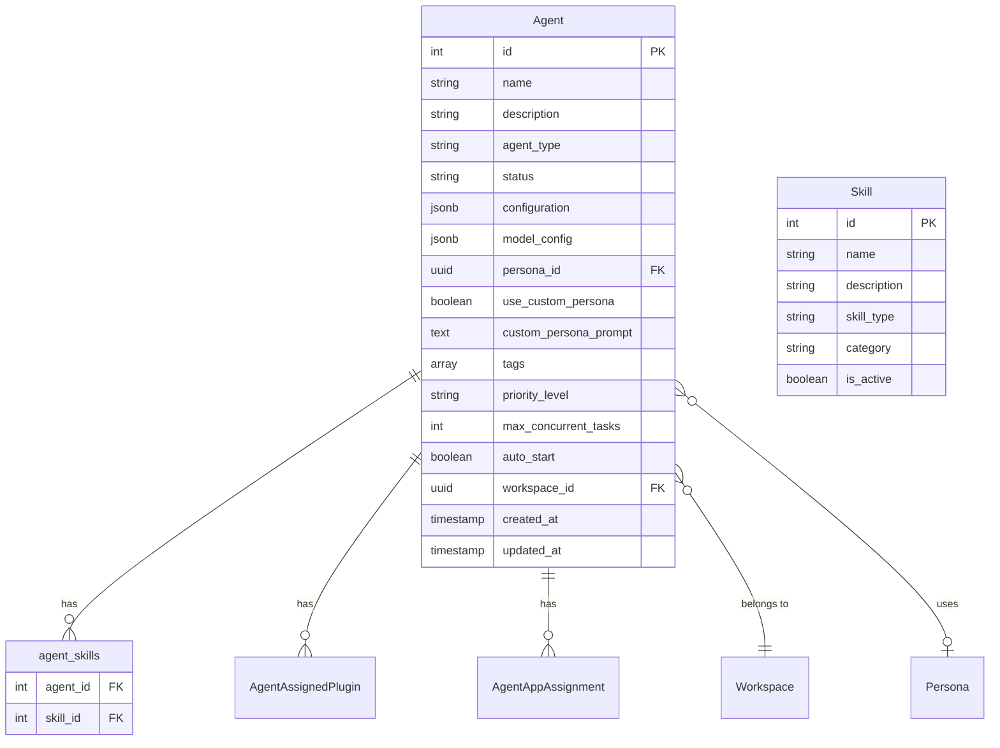
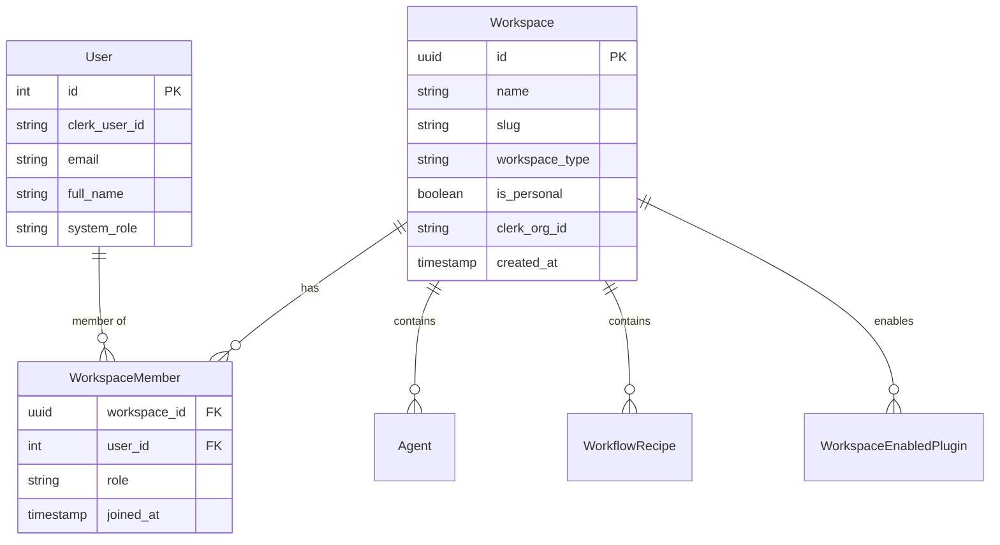
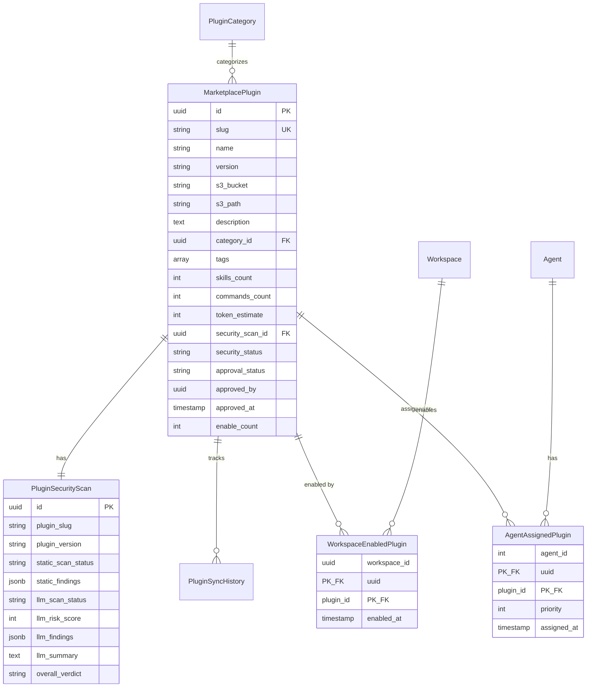
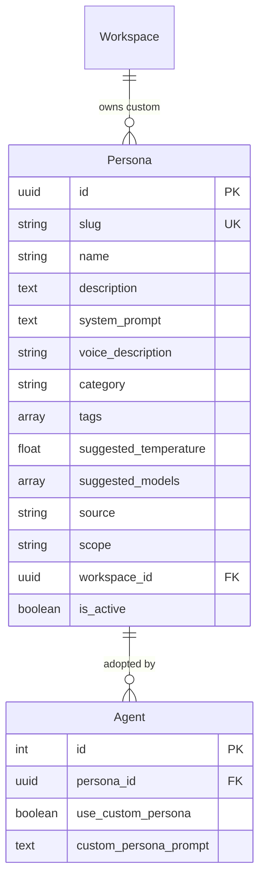
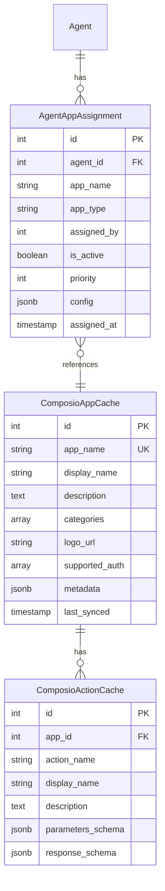
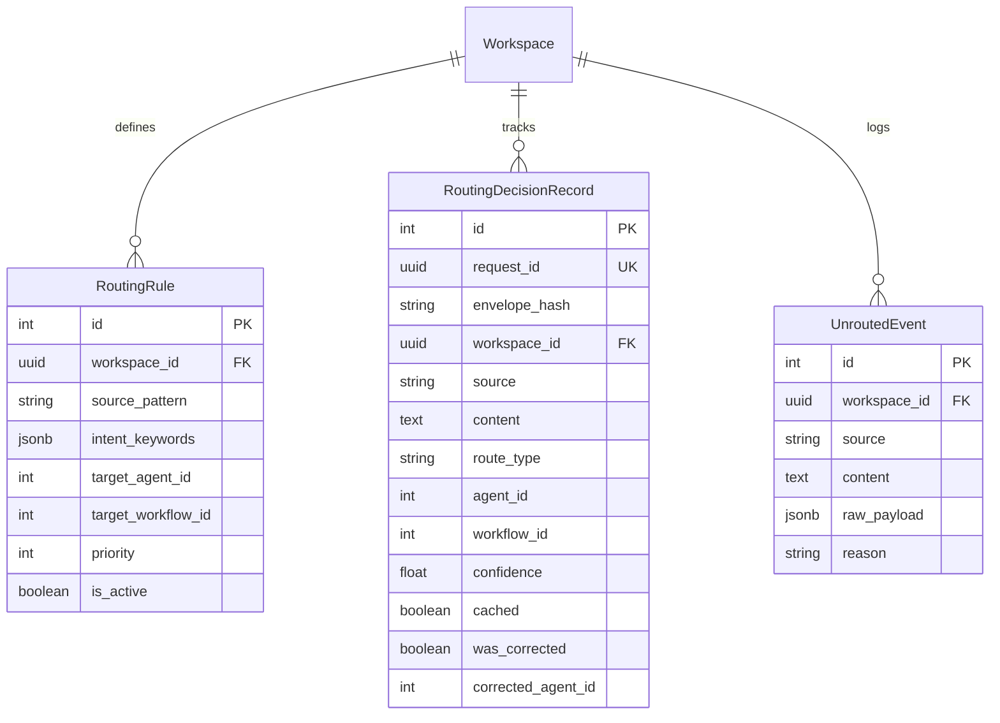

# Database Models

<details>
<summary>Relevant source files</summary>

The following files were used as context for generating this wiki page:

- [frontend/app/admin/plugins/page.tsx](frontend/app/admin/plugins/page.tsx)
- [frontend/lib/api-client.ts](frontend/lib/api-client.ts)
- [orchestrator/.env.example](orchestrator/.env.example)
- [orchestrator/api/agent_plugins.py](orchestrator/api/agent_plugins.py)
- [orchestrator/config.py](orchestrator/config.py)
- [orchestrator/core/database/load_seed_data.py](orchestrator/core/database/load_seed_data.py)
- [orchestrator/core/seeds/seed_personas.py](orchestrator/core/seeds/seed_personas.py)
- [orchestrator/core/seeds/seed_plugin_categories.py](orchestrator/core/seeds/seed_plugin_categories.py)
- [orchestrator/core/services/plugin_cache.py](orchestrator/core/services/plugin_cache.py)
- [orchestrator/main.py](orchestrator/main.py)
- [scripts/ralph/prd.json](scripts/ralph/prd.json)

</details>


This page documents the SQLAlchemy ORM models that define the database schema for Automatos AI. These models establish the data layer for agents, workflows, marketplace plugins, workspaces, and all other persistent entities in the system.

For API endpoint documentation that uses these models, see [API Router Organization](#10.2). For database initialization and migrations, see [Database Setup](#12.4).

---

## Model Organization

Database models are organized in the `orchestrator/core/models/` directory as a modular package. The `__init__.py` file imports and exposes all models, allowing imports like `from core.models import Agent, Skill, MarketplacePlugin`.

### Module Structure

```mermaid
graph TB
    Init["core/models/__init__.py<br/>Aggregates all models"]
    
    Core["core.py<br/>Agent, Skill, Pattern, Workflow"]
    Workspaces["workspaces.py<br/>Workspace, User, WorkspaceMember"]
    Plugins["marketplace_plugins.py<br/>MarketplacePlugin, AgentAssignedPlugin"]
    Personas["personas.py<br/>Persona"]
    Routing["routing.py<br/>RoutingDecisionRecord, RoutingRule"]
    Tools["tools.py<br/>ToolUsageLog"]
    ToolAssign["tool_assignments.py<br/>Tool catalog"]
    ComposioCache["composio_cache.py<br/>AgentAppAssignment, ComposioAppCache"]
    Credentials["credentials.py<br/>Credential, CredentialType"]
    SystemSettings["system_settings.py<br/>SystemSetting"]
    
    Init --> Core
    Init --> Workspaces
    Init --> Plugins
    Init --> Personas
    Init --> Routing
    Init --> Tools
    Init --> ToolAssign
    Init --> ComposioCache
    Init --> Credentials
    Init --> SystemSettings
    
    classDef primary fill:#1a1a2e,stroke:#16213e,stroke-width:2px
    classDef secondary fill:#0f3460,stroke:#16213e,stroke-width:1px
    
    class Init primary
    class Core,Workspaces,Plugins secondary
```



**Sources:** [orchestrator/core/models/__init__.py:1-39]()

### Import Pattern

Models are imported in a specific order to resolve foreign key dependencies. The `__init__.py` imports core models first, followed by workspace models (required for FK resolution), then specialized models:

| Import Order | Module | Reason |
|--------------|--------|--------|
| 1 | `core.py` | Base entities (Agent, Skill, Workflow) |
| 2 | `workspaces.py` | Required for workspace_id FKs |
| 3 | `credentials.py` | Credential management |
| 4 | `marketplace_plugins.py` | Plugin system |
| 5 | `personas.py` | Agent personalities |
| 6 | `composio_cache.py` | Tool metadata cache |
| 7 | `routing.py` | Universal router |

**Sources:** [orchestrator/core/models/__init__.py:1-39]()

---

## Core Entity Models

The `core.py` module defines the fundamental entities: agents, skills, patterns, and workflows. These models form the backbone of the orchestration system.

### Agent Model

The `Agent` model represents an AI agent instance with its configuration, status, and relationships.

**Schema Definition:**



**Key Fields:**

- **`agent_type`**: Enum defining agent specialization (e.g., `code_architect`, `security_expert`, `data_analyst`)
- **`status`**: Lifecycle state (`active`, `inactive`, `paused`, `archived`)
- **`model_config`**: JSON blob storing LLM configuration (provider, model, temperature, max_tokens)
- **`persona_id`**: FK to `personas` table for predefined personality
- **`use_custom_persona`**: Boolean flag to use `custom_persona_prompt` instead
- **`workspace_id`**: Multi-tenancy isolation key

**Sources:** [orchestrator/api/agents.py:138-237](), [orchestrator/api/agent_plugins.py:220-237]()

### Skill Model

The `Skill` model represents capabilities that can be assigned to agents. Skills are loaded from Git repositories or created manually.

**Key Fields:**

| Field | Type | Description |
|-------|------|-------------|
| `id` | `Integer` | Primary key |
| `name` | `String(200)` | Skill name |
| `description` | `Text` | Skill description |
| `skill_type` | `String(50)` | Type classification |
| `category` | `String(100)` | Category (development, security, etc.) |
| `skill_source` | `String(200)` | Source identifier (Git repo, manual) |
| `git_repo_url` | `String(500)` | Git repository URL if sourced from Git |
| `git_commit_sha` | `String(100)` | Commit hash for versioning |
| `filesystem_path` | `Text` | Local filesystem path |
| `tags` | `ARRAY(String)` | Tags for filtering |
| `is_active` | `Boolean` | Active status |

**Progressive Content Loading:**

Skills support three loading levels for token optimization (see [Skill Content Loading](#7.2)):
- **Level 1 (Metadata)**: Name, description, category
- **Level 2 (Core)**: Essential instructions and examples
- **Level 3 (Resource)**: Full reference documentation

**Sources:** [orchestrator/api/skills.py:85-104](), [orchestrator/api/skills.py:418-502]()

### Pattern Model

The `Pattern` model represents reusable agent coordination patterns (coordination, communication, decision-making).

**Sources:** [orchestrator/api/patterns.py:1-141]()

### Workflow Model

Workflows define multi-step execution plans. The schema includes:
- **`Workflow`**: Workflow definition
- **`WorkflowExecution`**: Execution instance with status tracking
- **`WorkflowRecipe`**: Templated workflows with parameter substitution

**Sources:** [orchestrator/api/statistics.py:16-18]()

---

## Workspace & Multi-Tenancy Models

Multi-tenancy is enforced through workspace-scoped queries. Every tenant-specific entity has a `workspace_id` foreign key.

### Workspace Model



**Workspace Types:**

- **Personal**: Single-user workspace (default for new users)
- **Organization**: Multi-user workspace (mapped to Clerk organizations)

**Data Isolation:**

All workspace-scoped queries filter by `workspace_id` through the `RequestContext` from hybrid authentication:

```python
# Example from agents.py
agents = db.query(Agent).filter(
    Agent.workspace_id == ctx.workspace_id
).all()
```

**Sources:** [orchestrator/api/agents.py:271-272](), [orchestrator/api/agents.py:451](), [orchestrator/core/models/__init__.py:6]()

---

## Plugin Marketplace Models

The plugin marketplace enables sharing and distributing agent capabilities through a secure approval pipeline.

### Marketplace Schema



**Sources:** [orchestrator/core/models/marketplace_plugins.py:1-235](), [orchestrator/api/agent_plugins.py:1-338]()

### Plugin Lifecycle States

| Status Field | Values | Description |
|--------------|--------|-------------|
| `approval_status` | `pending`, `approved`, `rejected` | Approval workflow state |
| `security_status` | `pending`, `safe`, `review_required`, `blocked` | Security scan verdict |
| `is_active` | `true`, `false` | Visibility in marketplace |

**Approval Flow:**

1. **Upload**: Plugin uploaded via `/api/admin/plugins/upload` (zip file)
2. **Static Scan**: Pattern matching for malicious code (blocked patterns, suspicious imports)
3. **LLM Scan**: GPT-4 reviews content and generates risk score (0-100)
4. **Overall Verdict**: `safe` (risk < 20), `review_required` (20-70), or `blocked` (> 70)
5. **Admin Approval**: Admin reviews scan results and approves/rejects
6. **Marketplace Visibility**: Approved plugins appear in marketplace

**Sources:** [frontend/app/admin/plugins/upload/page.tsx:76-111](), [frontend/app/admin/plugins/page.tsx:29-76]()

### Plugin Categories

The `PluginCategory` model organizes plugins into hierarchical categories (Development, DevOps, Marketing, Sales, Support, Data, Security).

**Predefined Categories (from seed data):**

- **Development**: Code Review, Testing, Documentation
- **DevOps**: Deployment, Monitoring, CI/CD
- **Marketing**: SEO, Content, Analytics
- **Sales**: Outreach, CRM, Prospecting
- **Support**: Ticketing, Knowledge Base
- **Data**: Analysis, Visualization, ETL
- **Security**: Scanning, Compliance, Audit

**Sources:** [orchestrator/core/seeds/seed_plugin_categories.py:19-167](), [orchestrator/core/database/load_seed_data.py:158-168]()

---

## Persona Models

The `Persona` model defines agent personality profiles that shape system prompts and behavior.

### Persona Schema



**Persona Scopes:**

| Scope | Description | Visibility |
|-------|-------------|------------|
| `global` | Predefined personas (seeded) | All workspaces |
| `workspace` | Custom personas created by workspace | Single workspace only |

**Predefined Personas (from seed data):**

- **Engineering**: Senior Engineer, Code Reviewer, DevOps/SRE Engineer
- **Sales**: Sales Development Representative, Account Executive, Customer Success Manager
- **Marketing**: Content Strategist, SEO Specialist, Social Media Manager
- **Support**: Support Engineer, Technical Writer, Community Manager

**Persona vs. Custom Prompt:**

Agents can use either:
- **`persona_id`**: Reference to a predefined/workspace persona
- **`custom_persona_prompt`**: Freeform custom prompt (when `use_custom_persona = true`)

The `/api/agents/{agent_id}/assembled-context` endpoint resolves the persona and builds the full system prompt by combining persona text with plugin skills.

**Sources:** [orchestrator/core/models/personas.py:1-48](), [orchestrator/core/seeds/seed_personas.py:19-214](), [orchestrator/api/agent_plugins.py:243-261]()

---

## Tool & Integration Models

Tool-related models support Composio app integration and tool assignment to agents.

### Tool Assignment Schema



**Design Note:**

The `AgentAppAssignment` model replaced the legacy `tools` JSON field in the Agent configuration. Instead of storing tool IDs in `configuration.tools`, the system now uses a dedicated junction table with priority and configuration per assignment.

**Tool Resolution:**

When building agent context, the system:
1. Queries `AgentAppAssignment` for `agent_id`
2. Joins with `ComposioAppCache` for app metadata
3. Loads action schemas from `ComposioActionCache`
4. Constructs tool definitions for LLM function calling

**Sources:** [orchestrator/api/agents.py:144-173](), [orchestrator/api/agent_plugins.py:293-315](), [orchestrator/api/agents.py:11-14]()

---

## Routing & Orchestration Models

The Universal Orchestrator Router (PRD-50) uses these models to persist routing decisions and rules.

### Routing Schema



**Routing Decision Types:**

- **`agent`**: Route to specific agent
- **`workflow`**: Route to workflow
- **`orchestrate`**: Multi-agent orchestration

**Caching & Corrections:**

The system caches routing decisions by `envelope_hash` (hash of source + content). If a user corrects a routing decision (via UI feedback), the system records `was_corrected = true` and stores the `corrected_agent_id` for learning.

**Sources:** [orchestrator/core/models/routing.py:1-124]()

---

## Supporting Models

### Credential Models

The `Credential` and `CredentialType` models support encrypted credential storage for external integrations.

**Key Features:**
- Encrypted credential values (AES-256)
- Typed credentials with JSON schema validation
- Test endpoints for credential verification
- Audit logging of credential usage

**Sources:** [orchestrator/core/database/load_seed_data.py:58-102]()

### System Settings Models

The `SystemSetting` model stores global configuration key-value pairs with typed values (string, number, boolean, JSON).

**Sources:** [orchestrator/core/database/load_seed_data.py:114-125]()

---

## Relationships & Schema Design

### Many-to-Many Relationships

The system uses junction tables for many-to-many relationships:

| Relationship | Junction Table | Description |
|--------------|----------------|-------------|
| Agent ↔ Skill | `agent_skills` | Skills assigned to agents |
| Agent ↔ Plugin | `AgentAssignedPlugin` | Plugins assigned to agents |
| Workspace ↔ Plugin | `WorkspaceEnabledPlugin` | Plugins enabled for workspaces |
| Workspace ↔ User | `WorkspaceMember` | Users in workspaces with roles |

**Sources:** [orchestrator/api/agents.py:11](), [orchestrator/core/models/marketplace_plugins.py:180-235]()

### Foreign Key Constraints

All foreign keys use `ondelete="CASCADE"` for junction tables to ensure referential integrity when parent entities are deleted.

**Example:**

```python
# From AgentAssignedPlugin model
agent_id = Column(
    Integer,
    ForeignKey("agents.id", ondelete="CASCADE"),
    primary_key=True,
)
```

**Sources:** [orchestrator/core/models/marketplace_plugins.py:220-224]()

### UUID vs. Integer Primary Keys

| Model Type | PK Type | Rationale |
|------------|---------|-----------|
| Core entities (Agent, Skill) | `Integer` | Legacy compatibility, simpler auto-increment |
| Marketplace entities | `UUID` | Global uniqueness, prevents enumeration attacks |
| Workspace entities | `UUID` | Matches Clerk organization IDs |

**Sources:** [orchestrator/core/models/marketplace_plugins.py:60](), [orchestrator/core/models/personas.py:31]()

---

## Database Initialization & Seeding

### Initialization Process

Database tables are created via SQLAlchemy's `Base.metadata.create_all()` during first install. Docker Compose runs `init_database.py` on container startup.

**Seed Data Loading:**

The `load_seed_data.py` script seeds reference data in this order:

1. **Credential Types**: 17 predefined credential types (API keys, OAuth, database connections)
2. **System Settings**: Default system configuration
3. **LLM Models**: Available model definitions
4. **Skills & Patterns**: Core skills and coordination patterns
5. **Personas**: 15 predefined personas across 4 categories
6. **Plugin Categories**: 18 marketplace categories

**Idempotent Seeding:**

All seed operations use `ON CONFLICT DO NOTHING` or slug-based upserts, allowing the script to run multiple times safely.

**Sources:** [orchestrator/core/database/load_seed_data.py:23-190]()

### Manual Seeding

```bash
# Load all seed data
python orchestrator/core/database/load_seed_data.py

# Load only credential types
python orchestrator/core/database/load_seed_data.py --credentials-only
```

**Sources:** [orchestrator/core/database/load_seed_data.py:181-190]()

---

## Model Access Patterns

### Eager Loading

APIs use SQLAlchemy's `joinedload()` and `subqueryload()` to avoid N+1 queries when loading relationships:

```python
# From agents.py list endpoint
agent = db.query(Agent).options(
    joinedload(Agent.skills),
    subqueryload(Agent.assigned_plugins)
).filter(Agent.id == agent_id).first()
```

**Sources:** [orchestrator/api/agents.py:451](), [orchestrator/api/agents.py:538-541]()

### Workspace Filtering

All tenant-scoped queries filter by `workspace_id` from `RequestContext`:

```python
# Pattern used throughout API endpoints
agents = db.query(Agent).filter(
    Agent.workspace_id == ctx.workspace_id
).all()
```

**Sources:** [orchestrator/api/agents.py:451](), [orchestrator/api/patterns.py:24]()

### Query Optimization

- **Pagination**: `offset()` and `limit()` for large result sets
- **Indexes**: Multi-column indexes on `(workspace_id, status)`, `(approval_status, is_active)`
- **Selective Loading**: Progressive content loading for skills (metadata → core → resources)

**Sources:** [orchestrator/api/agents.py:439-440](), [orchestrator/core/models/marketplace_plugins.py:54-58]()

---