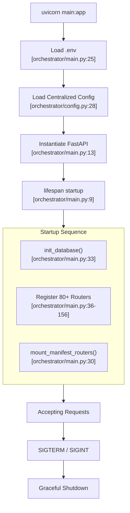
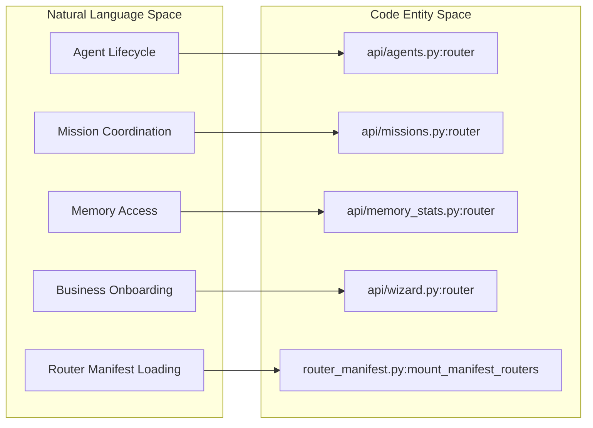
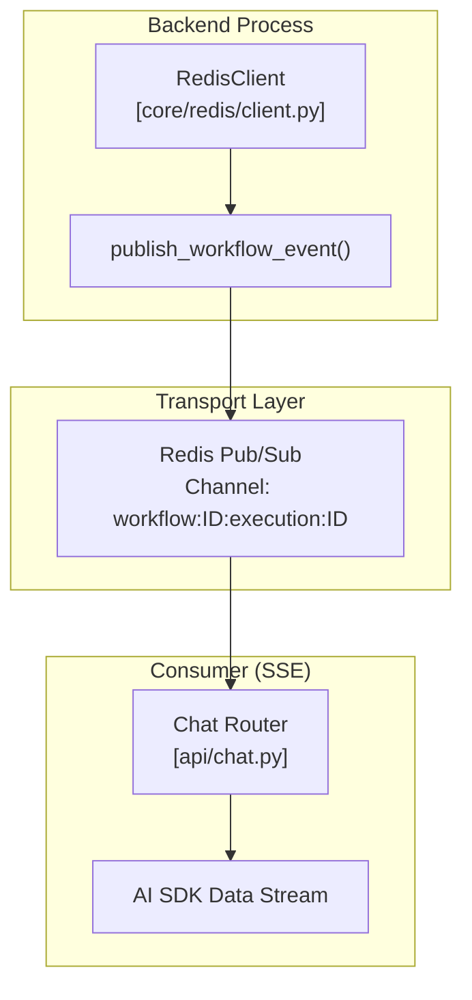

# FastAPI Application & Boot Sequence

Relevant source files

The following files were used as context for generating this wiki page:

- [frontend/components/__tests__/prd197-substrate-tile.test.tsx](frontend/components/__tests__/prd197-substrate-tile.test.tsx)
- [frontend/components/command-center/is-it-working-strip.tsx](frontend/components/command-center/is-it-working-strip.tsx)
- [frontend/hooks/use-analytics-api.ts](frontend/hooks/use-analytics-api.ts)
- [frontend/lib/api-client.ts](frontend/lib/api-client.ts)
- [orchestrator/api/workflows.py](orchestrator/api/workflows.py)
- [orchestrator/config.py](orchestrator/config.py)
- [orchestrator/core/models/substrate_metrics.py](orchestrator/core/models/substrate_metrics.py)
- [orchestrator/core/observability/substrate_metrics.py](orchestrator/core/observability/substrate_metrics.py)
- [orchestrator/main.py](orchestrator/main.py)
- [orchestrator/reports/route-manifest.json](orchestrator/reports/route-manifest.json)
- [orchestrator/router_manifest.py](orchestrator/router_manifest.py)
- [orchestrator/tests/authz_sweep_probe.py](orchestrator/tests/authz_sweep_probe.py)
- [orchestrator/tests/test_p2w2_authz_boundary_sweep.py](orchestrator/tests/test_p2w2_authz_boundary_sweep.py)
- [orchestrator/tests/test_prd154_s5_missions.py](orchestrator/tests/test_prd154_s5_missions.py)
- [orchestrator/tests/test_prd222_w2s1_plan_tiers.py](orchestrator/tests/test_prd222_w2s1_plan_tiers.py)

This document describes the core FastAPI application initialization, lifespan management, middleware pipeline, and router organization. It covers the `orchestrator` backend's main entry point and how requests flow through the system.

---

## Overview

The FastAPI application serves as the central engine for Automatos AI. It initializes backend services, registers over 80 API routers, configures security and monitoring middleware, and manages the application lifecycle. The application is designed to be a high-performance, asynchronous orchestrator for multi-agent workflows, real-time streaming chat, and complex mission coordination.

### Key Responsibilities
- **Application Initialization**: Loading environment variables via `load_dotenv` and centralized configuration from `config.py` [orchestrator/main.py:24-29]().
- **Lifespan Management**: Handling startup (database initialization) and graceful shutdown [orchestrator/main.py:9-18]().
- **Middleware Stack**: Executing CORS, request tracking, and authentication logic for every request [orchestrator/main.py:14-17]().
- **Router Organization**: Mounting specialized routers for agents, missions, tools, and memory [orchestrator/main.py:36-156]().

Sources: [orchestrator/main.py:9-29](), [orchestrator/main.py:36-156](), [orchestrator/main.py:14-17]()

---

## System Entry Point & Lifespan

The application uses an `asynccontextmanager` called `lifespan` to coordinate the lifecycle of global resources. This ensures that the database is ready and services are active before the server begins accepting traffic.

### Application Initialization Flow

Sources: [orchestrator/main.py:9-33](), [orchestrator/main.py:36-156](), [orchestrator/config.py:28-32]()

---

## Middleware & Request Pipeline

The application implements a standard middleware stack to handle cross-cutting concerns, including security headers and rate limiting.

### Middleware Stack

| Component | Purpose | Source |
|:---|:---|:---|
| `CORSMiddleware` | Configures allowed origins, methods, and headers for the Next.js frontend. | [orchestrator/main.py:14]() |
| `Authentication` | `get_request_context_hybrid` resolves Clerk JWTs or API keys into a `RequestContext`. | [orchestrator/main.py:17]() |
| `Logging` | Standard Python logging for request/response cycles. | [orchestrator/main.py:8]() |
| `Rate Limiting` | `slowapi` integration for protecting sensitive endpoints. | [orchestrator/requirements.txt:99]() |

### Data Flow: Request Authentication
When a request enters the system, it typically passes through the `get_request_context_hybrid` dependency [orchestrator/main.py:17](). This function extracts the `workspace_id` and user identity, which are then used by downstream services to ensure data isolation. The configuration for these security layers is managed centrally in `Config` [orchestrator/config.py:37-58]().

Sources: [orchestrator/main.py:8-17](), [orchestrator/core/auth/hybrid.py:1-50](), [orchestrator/config.py:37-58]()

---

## Router Organization

The backend is modularized into specialized routers. These are registered in `main.py` using `app.include_router()`. The `mount_manifest_routers` function [orchestrator/main.py:30]() handles the loading of conditionally mounted routers based on `MANIFEST_ROUTERS` [orchestrator/router_manifest.py:51-91](). This mechanism includes a "fail-loud" loader, meaning that if a required router fails to import, the application will raise a `RouterMountError` unless `ALLOW_DEGRADED_BOOT=true` is set in the configuration [orchestrator/router_manifest.py:104-127]().

### Core Router Categories

| Category | Key Routers | Functionality |
|:---|:---|:---|
| **Agents** | `agents_router`, `agent_endpoints_router` | CRUD, activation, and template management for AI agents. |
| **Missions** | `missions_router` | Goal decomposition, sequential task execution, and budget tracking. |
| **Chat** | `chat_router` | AI SDK SSE streaming for real-time interaction [orchestrator/main.py:107](). |
| **Tools** | `tools_router`, `skills_router` | Integration with external apps and tool discovery [orchestrator/main.py:60-64](). |
| **Notifications** | `notifications_router` | PRD-128: Unified notification system [orchestrator/main.py:78-81](). |
| **Memory** | `memory_stats_router`, `widget_memory_router` | L0-L4 memory tier access and session consolidation. |
| **Onboarding** | `wizard_router` | PRD-130: Business Intake Wizard for new workspaces [orchestrator/main.py:61](). |

### Code Entity Space: Router Mapping

This diagram associates the logical system components with their specific router entities in the code.

Sources: [orchestrator/main.py:36-156](), [orchestrator/router_manifest.py:30](), [orchestrator/router_manifest.py:51-91](), [orchestrator/router_manifest.py:104-127]()

---

## Workspace Context & Provisioning

The application handles multi-tenancy via `workspace_id` scoping. When a new user logs in, the system detects if they have a "new workspace" (zero user-created agents) and signals the frontend to trigger onboarding [orchestrator/api/workspaces.py:62-68]().

### Auto Agent Seeding
Every workspace is automatically provisioned with an **Auto Agent**. This agent serves as the default orchestrator and chat assistant for the workspace [orchestrator/core/seeds/seed_auto_agent.py:5-16]().
- **System Role**: Hidden from Roster UI (`is_system_agent=True`).
- **Platform Management**: Seeded with the `platform-management` skill to allow it to create agents, manage tools, and run playbooks [orchestrator/core/seeds/seed_auto_agent.py:81-140]().

Sources: [orchestrator/api/workspaces.py:43-118](), [orchestrator/core/seeds/seed_auto_agent.py:1-175]()

---

## Real-Time Infrastructure (SSE & Pub/Sub)

The application has migrated away from standard WebSockets for chat, favoring the **AI SDK SSE (Server-Sent Events)** streaming protocol for better reliability and integration with frontend AI libraries [orchestrator/main.py:106-110]().

### Real-Time Update Architecture

Sources: [orchestrator/main.py:107-110](), [orchestrator/core/redis/client.py:14-31](), [orchestrator/core/redis/client.py:91-119]()

---

## Summary of Key Application Entities

| Entity | File Path | Role |
|:---|:---|:---|
| `app` | [orchestrator/main.py:13]() | The FastAPI application instance. |
| `Config` | [orchestrator/config.py:28]() | Centralized configuration management and env variable access. |
| `RequestContext` | [orchestrator/core/auth/dependencies.py:1-20]() | Typed object containing user and workspace identity for every request. |
| `seed_auto_agent` | [orchestrator/core/seeds/seed_auto_agent.py:175]() | Function ensuring every workspace has a functional orchestrator agent. |
| `mount_manifest_routers` | [orchestrator/router_manifest.py:1-50]() | Fail-loud router registration utility used during startup. |

Sources: [orchestrator/main.py:13](), [orchestrator/config.py:28](), [orchestrator/api/workspaces.py:43-46](), [orchestrator/core/seeds/seed_auto_agent.py:175]()

---