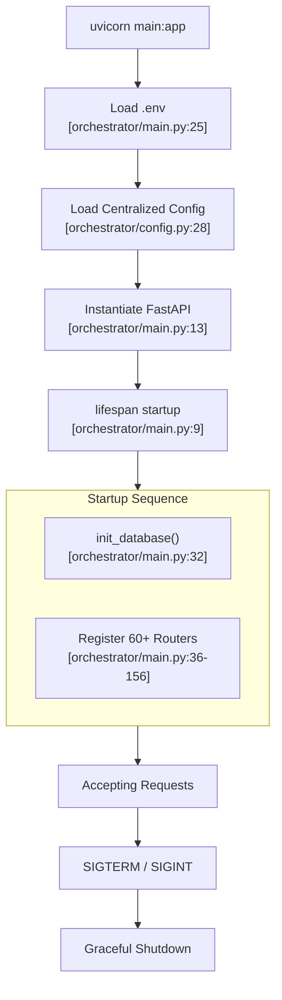
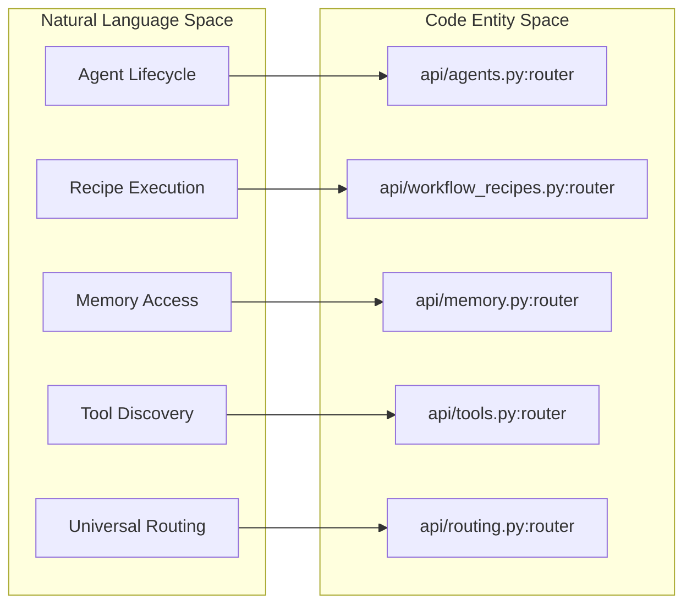
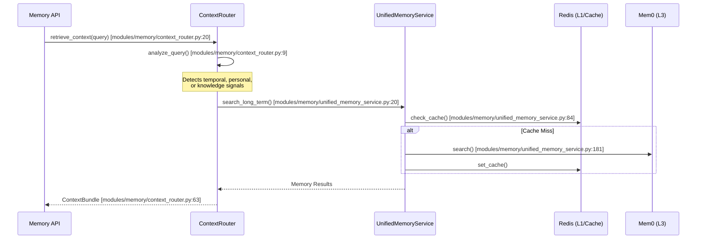

# FastAPI Application

Relevant source files

The following files were used as context for generating this wiki page:

- [frontend/tsconfig.tsbuildinfo](frontend/tsconfig.tsbuildinfo)
- [orchestrator/config.py](orchestrator/config.py)
- [orchestrator/main.py](orchestrator/main.py)
- [orchestrator/modules/memory/context_router.py](orchestrator/modules/memory/context_router.py)
- [orchestrator/modules/memory/unified_memory_service.py](orchestrator/modules/memory/unified_memory_service.py)
- [orchestrator/tests/test_unified_memory.py](orchestrator/tests/test_unified_memory.py)
- [scripts/ralph/IMPLEMENTATION_PLAN.md](scripts/ralph/IMPLEMENTATION_PLAN.md)
- [scripts/ralph/prd.json](scripts/ralph/prd.json)
- [scripts/ralph/progress.txt](scripts/ralph/progress.txt)

This document describes the core FastAPI application initialization, lifespan management, middleware pipeline, and router organization. It covers the `orchestrator` backend's main entry point and how requests flow through the system.

---

## Overview

The FastAPI application serves as the central engine for Automatos AI. It initializes backend services, registers over 60 API routers, configures security and monitoring middleware, and manages the application lifecycle. The application is designed to be a high-performance, asynchronous orchestrator for multi-agent workflows, real-time streaming chat, and complex mission coordination.

### Key Responsibilities
- **Application Initialization**: Loading environment variables via `load_dotenv` and centralized configuration from `config.py` [orchestrator/main.py:24-29]().
- **Lifespan Management**: Handling startup (database initialization) and graceful shutdown [orchestrator/main.py:9-18]().
- **Middleware Stack**: Executing CORS, request tracking, and authentication logic for every request [orchestrator/main.py:14-17]().
- **Router Organization**: Mounting specialized routers for agents, missions, tools, and memory [orchestrator/main.py:36-156]().

---

## System Entry Point & Lifespan

The application uses an `asynccontextmanager` called `lifespan` to coordinate the lifecycle of global resources. This ensures that the database is ready and services are active before the server begins accepting traffic.

### Application Initialization Flow

**Sources:** [orchestrator/main.py:9-32](), [orchestrator/main.py:36-156](), [orchestrator/config.py:28-32]()

---

## Middleware & Request Pipeline

The application implements a standard middleware stack to handle cross-cutting concerns, including security headers and rate limiting.

### Middleware Stack

| Component | Purpose | Source |
|:---|:---|:---|
| `CORSMiddleware` | Configures allowed origins, methods, and headers for the Next.js frontend. | [orchestrator/main.py:14]() |
| `Authentication` | `get_request_context_hybrid` resolves Clerk JWTs or API keys into a `RequestContext`. | [orchestrator/main.py:17]() |
| `Logging` | Standard Python logging for request/response cycles. | [orchestrator/main.py:8]() |

### Data Flow: Request Authentication
When a request enters the system, it typically passes through the `get_request_context_hybrid` dependency. This function extracts the `workspace_id` and user identity, which are then used by downstream services to ensure data isolation. The configuration for these security layers is managed centrally in `Config`, including `REQUIRE_AUTH` and `ORCHESTRATOR_API_KEY` resolution [orchestrator/config.py:128-130]().

**Sources:** [orchestrator/main.py:8-17](), [orchestrator/config.py:128-130]()

---

## Router Organization

The backend is modularized into specialized routers. These are registered in `main.py` using `app.include_router()`.

### Core Router Categories

| Category | Key Routers | Functionality |
|:---|:---|:---|
| **Agents** | `agents_router`, `agent_plugins_router` | CRUD, activation, and plugin management for AI agents [orchestrator/main.py:36-92](). |
| **Workflows** | `workflows_router`, `workflow_recipes_router` | Recipe execution and workflow history [orchestrator/main.py:37-53](). |
| **Chat & Routing** | `chat_router`, `routing_router` | SSE streaming and PRD-50 Universal Orchestrator Router [orchestrator/main.py:82-156](). |
| **Tools** | `tools_router`, `composio_router` | Integration with external apps and tool discovery [orchestrator/main.py:63-68](). |
| **Memory** | `memory_router`, `widget_memory_router` | L0-L4 memory tier access and session consolidation [orchestrator/main.py:50-51](). |
| **Business Intake** | `wizard_router` | PRD-130: Business Intake Wizard PoC [orchestrator/main.py:64](). |

### Code Entity Space: Router Mapping

This diagram associates the logical system components with their specific router entities in the code.

**Sources:** [orchestrator/main.py:36-156]()

---

## Memory System Integration

The FastAPI application mounts the `memory_router` which interfaces with the `UnifiedMemoryService`. This service manages a 5-layer memory stack, replacing fragmented memory implementations with a centralized architecture [modules/memory/unified_memory_service.py:8-13]().

### Context Routing Flow

Before an agent processes a query, the `ContextRouter` analyzes the input to determine which memory layers to fetch [orchestrator/modules/memory/context_router.py:5-6]().

### Key Memory Entities
- **UnifiedMemoryService**: Singleton service managing L1 (Redis), L2 (Postgres), and L3 (Mem0) [orchestrator/modules/memory/unified_memory_service.py:154-161]().
- **MemoryNamespace**: Standardized utility for building scoped `user_id` strings for multi-tenant isolation [orchestrator/modules/memory/unified_memory_service.py:39-48]().
- **SessionMemory**: L1 working memory structure stored in Redis per conversation [orchestrator/modules/memory/unified_memory_service.py:124-130]().

**Sources:** [orchestrator/modules/memory/unified_memory_service.py:8-188](), [orchestrator/modules/memory/context_router.py:1-33](), [orchestrator/main.py:50-51]()

---

## Configuration & Environment

The application relies on a centralized `Config` class in `config.py`. This is the **only** place where `os.getenv()` is permitted [orchestrator/config.py:5-9]().

### Critical Configuration Blocks

| Block | Parameters | Role |
|:---|:---|:---|
| **Database** | `DATABASE_URL`, `SQL_DEBUG` | PostgreSQL connection with SSL enforcement for production [orchestrator/config.py:37-58](). |
| **Redis** | `REDIS_URL`, `REDIS_HOST` | Caching, Pub/Sub, and L1 Session storage [orchestrator/config.py:63-79](). |
| **Memory** | `MEMORY_SESSION_TTL_SECONDS`, `MEMORY_DECAY_RATE` | TTLs and decay rates for the 5-layer memory stack [orchestrator/config.py:85-103](). |
| **Security** | `ORCHESTRATOR_API_KEY`, `REQUIRE_AUTH` | API key and JWT authentication enforcement [orchestrator/config.py:128-129](). |

**Sources:** [orchestrator/config.py:28-130]()

---

## Summary of Key Application Entities

| Entity | File Path | Role |
|:---|:---|:---|
| `app` | [orchestrator/main.py:13]() | The FastAPI application instance. |
| `UnifiedMemoryService` | [orchestrator/modules/memory/unified_memory_service.py:154]() | Singleton managing multi-tier memory access. |
| `ContextRouter` | [orchestrator/modules/memory/context_router.py:14]() | Pre-LLM signal detection and context assembly layer. |
| `MemoryNamespace` | [orchestrator/modules/memory/unified_memory_service.py:39]() | Standardized workspace/agent scoping for memory. |
| `Config` | [orchestrator/config.py:28]() | Centralized environment and settings management. |

**Sources:** [orchestrator/main.py:13](), [orchestrator/modules/memory/unified_memory_service.py:154](), [orchestrator/modules/memory/context_router.py:14](), [orchestrator/config.py:28]()

---