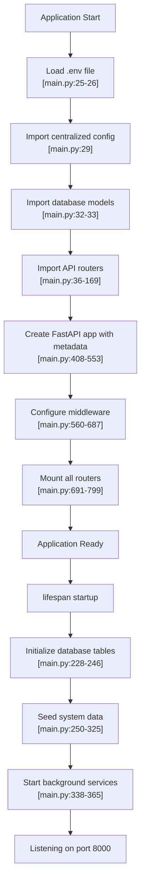
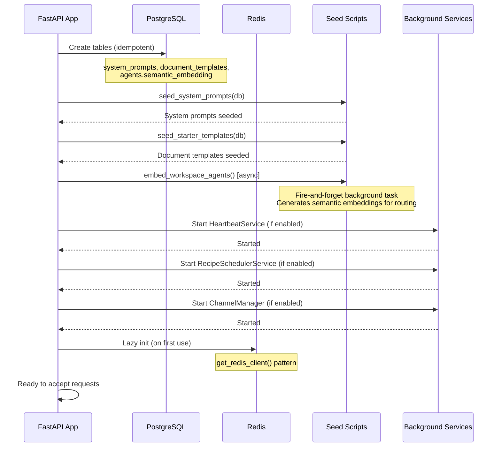
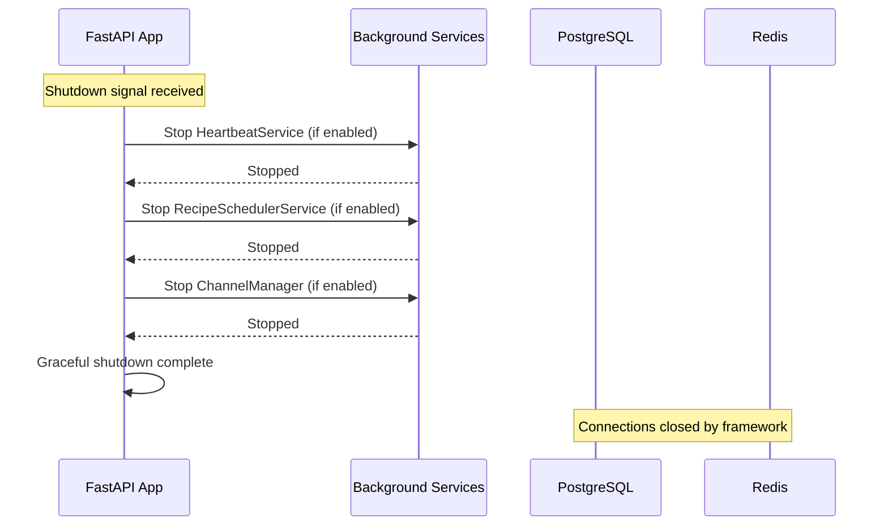
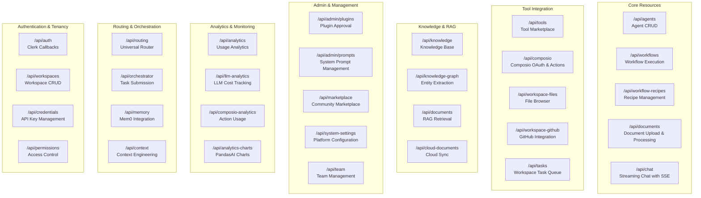
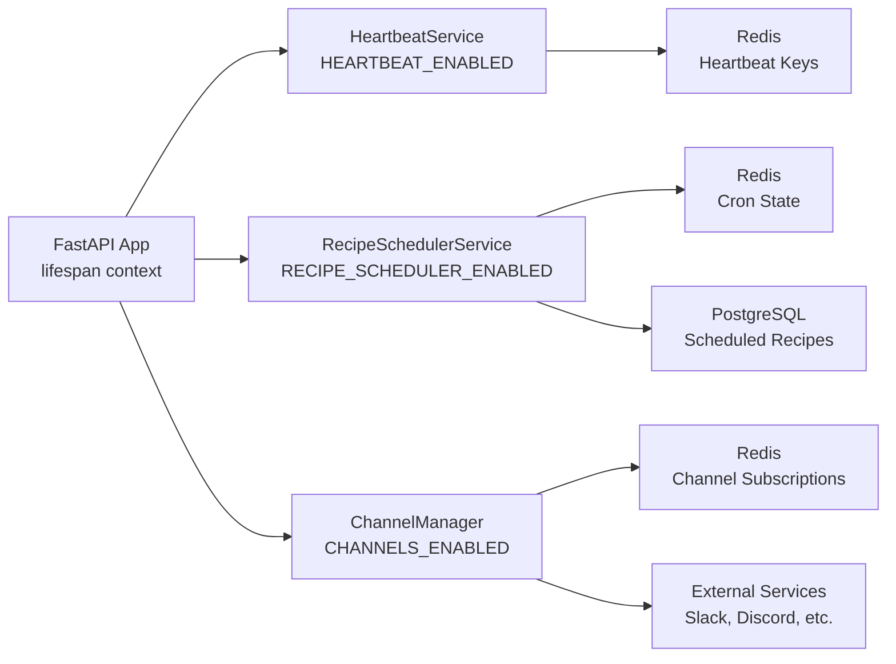

# FastAPI Application

<details>
<summary>Relevant source files</summary>

The following files were used as context for generating this wiki page:

- [frontend/app/admin/plugins/page.tsx](frontend/app/admin/plugins/page.tsx)
- [frontend/lib/api-client.ts](frontend/lib/api-client.ts)
- [orchestrator/.env.example](orchestrator/.env.example)
- [orchestrator/api/agent_plugins.py](orchestrator/api/agent_plugins.py)
- [orchestrator/config.py](orchestrator/config.py)
- [orchestrator/core/database/load_seed_data.py](orchestrator/core/database/load_seed_data.py)
- [orchestrator/core/seeds/seed_personas.py](orchestrator/core/seeds/seed_personas.py)
- [orchestrator/core/seeds/seed_plugin_categories.py](orchestrator/core/seeds/seed_plugin_categories.py)
- [orchestrator/core/services/plugin_cache.py](orchestrator/core/services/plugin_cache.py)
- [orchestrator/main.py](orchestrator/main.py)
- [scripts/ralph/prd.json](scripts/ralph/prd.json)

</details>


This document describes the core FastAPI application initialization, middleware pipeline, router registration, and lifespan management. It covers the orchestrator backend's main entry point and how requests flow through the system.

For information about individual API endpoints and their implementation, see [API Router Organization](#13.2). For database models and schema, see [Database Models](#13.3). For service layer patterns, see [Service Layer Patterns](#13.4).

---

## Purpose and Scope

The FastAPI application (`orchestrator/main.py`) is the central orchestrator for Automatos AI. It initializes all backend services, registers 40+ API routers, configures middleware, and manages the application lifecycle. This document focuses on:

- Application initialization and configuration loading
- Middleware pipeline and request processing flow
- Router registration and organization
- Lifespan management (startup and shutdown events)
- Background service coordination

---

## Application Architecture

The FastAPI application follows a layered architecture with clear separation of concerns:

### Application Initialization Flow



**Sources:** [orchestrator/main.py:1-830]()

---

## Configuration Management

All configuration is centralized in a single `Config` class that loads from environment variables. This eliminates scattered `os.getenv()` calls throughout the codebase.

### Configuration Categories

| Category | Key Variables | Purpose |
|----------|--------------|---------|
| **Database** | `POSTGRES_DB`, `POSTGRES_USER`, `POSTGRES_HOST`, `DATABASE_URL` | PostgreSQL connection with SSL enforcement for production |
| **Redis** | `REDIS_HOST`, `REDIS_PORT`, `REDIS_PASSWORD`, `REDIS_URL` | Caching, queues, and pub/sub |
| **Authentication** | `CLERK_SECRET_KEY`, `CLERK_JWKS_URL`, `CREDENTIAL_ENCRYPTION_KEY` | Clerk JWT validation and workspace context |
| **LLM Providers** | `OPENAI_API_KEY`, `ANTHROPIC_API_KEY`, `OPENROUTER_API_KEY`, etc. | Multi-provider LLM credentials |
| **External Services** | `COMPOSIO_API_KEY`, `FUTUREAGI_API_KEY`, `S3_VECTORS_BUCKET` | Third-party integrations |
| **Feature Flags** | `HEARTBEAT_ENABLED`, `RECIPE_SCHEDULER_ENABLED`, `CHANNELS_ENABLED` | Toggle optional services |
| **URLs** | `BACKEND_URL`, `FRONTEND_URL`, `API_URL` | Service discovery |

### Configuration Access Pattern

```python
# In any module
from config import config

# Access configuration
db_url = config.DATABASE_URL
llm_provider = config.LLM_PROVIDER  # Property that reads from system_settings table
redis_url = config.REDIS_URL  # Computed property from parts

# Validate on startup
if not config.validate():
    logger.error("Configuration incomplete")
```

**Key Design Principles:**

1. **Single Source of Truth:** Only `config.py` calls `os.getenv()`
2. **Type Safety:** All values have explicit types (`str`, `int`, `bool`, `float`)
3. **Computed Properties:** Complex values like `DATABASE_URL` use `@property` methods
4. **Database Integration:** Some settings (e.g., `LLM_PROVIDER`, `LLM_MODEL`) read from `system_settings` table with env var fallback
5. **SSL Enforcement:** Production database connections automatically append `sslmode=require` [orchestrator/config.py:47-58]()

**Sources:** [orchestrator/config.py:1-423](), [orchestrator/main.py:29]()

---

## Middleware Pipeline

Every HTTP request flows through a 7-layer middleware stack before reaching business logic. Middleware executes in the order it was added to the app.

### Middleware Execution Flow

```mermaid
flowchart LR
    Request["HTTP Request"] --> CORS["1. CORSMiddleware<br/>[main.py:560-567]"]
    CORS --> WidgetCORS["2. WidgetCORSMiddleware<br/>[main.py:570-574]"]
    WidgetCORS --> WidgetRL["3. WidgetRateLimitMiddleware<br/>[main.py:577-580]"]
    WidgetRL --> BodyLimit["4. Request Body Limiter<br/>[main.py:603-614]"]
    BodyLimit --> SecHeaders["5. Security Headers<br/>[main.py:617-627]"]
    SecHeaders --> RequestID["6. Request ID Injector<br/>[main.py:632-641]"]
    RequestID --> APITracking["7. API Tracking<br/>[main.py:643-687]"]
    APITracking --> Router["Route Handler"]
    Router --> Response["HTTP Response"]
```



### Middleware Details

#### 1. CORS Middleware
Handles cross-origin requests from the frontend. Origins are configurable via `CORS_ALLOW_ORIGINS` environment variable (comma-separated list).

```python
# Exposes routing headers to frontend
expose_headers=["X-Request-ID", "X-Routing-Agent-ID", 
                "X-Routing-Confidence", "X-Routing-Type", 
                "X-Routing-Reasoning", "X-Routing-Request-ID"]
```

**Sources:** [orchestrator/main.py:560-567](), [orchestrator/config.py:98-99]()

#### 2. Widget SDK Middleware
Optional middleware for widget embedding use cases. Provides additional CORS handling and rate limiting specific to widget requests.

**Sources:** [orchestrator/main.py:570-580]()

#### 3. Rate Limiting (SlowAPI)
Enforces default limit of 60 requests per minute per client IP. Respects `X-Forwarded-For` header for proxied requests.

```python
limiter = Limiter(key_func=_get_real_client_ip, default_limits=["60/minute"])
```

**Sources:** [orchestrator/main.py:582-596]()

#### 4. Request Body Size Limiter
Enforces maximum payload sizes:
- **Default:** 10MB for most endpoints
- **Upload endpoints:** 50MB for `/api/documents/upload`, `/api/admin/plugins/upload`, `/api/documents/templates/upload`

Returns `413 Payload Too Large` if exceeded.

**Sources:** [orchestrator/main.py:599-614]()

#### 5. Security Headers
Adds defense-in-depth HTTP headers:

| Header | Value | Purpose |
|--------|-------|---------|
| `X-Content-Type-Options` | `nosniff` | Prevent MIME sniffing |
| `X-Frame-Options` | `DENY` | Prevent clickjacking |
| `Referrer-Policy` | `strict-origin-when-cross-origin` | Limit referrer leakage |
| `Permissions-Policy` | `camera=(), microphone=(), geolocation=()` | Disable sensitive APIs |
| `Content-Security-Policy` | `default-src 'none'; frame-ancestors 'none'` | Strict CSP |
| `Strict-Transport-Security` | `max-age=63072000; includeSubDomains; preload` | HTTPS only (production) |

**Sources:** [orchestrator/main.py:617-627]()

#### 6. Request ID Middleware
Injects a unique request ID for distributed tracing. Uses incoming `X-Request-ID` header if present, otherwise generates a 12-character hex string.

```python
# Accessible in logs via request_id_var context variable
from core.utils.logging_adapter import request_id_var
current_id = request_id_var.get()
```

**Sources:** [orchestrator/main.py:632-641](), [orchestrator/main.py:192-197]()

#### 7. API Tracking Middleware
Collects real-time metrics for each endpoint:

- `call_count`: Total requests
- `total_time`, `avg_time`, `min_time`, `max_time`: Response time stats
- `recent_times`: Last 100 response times (deque)
- `error_count`: Failed requests (4xx/5xx)
- `status_codes`: Distribution of status codes
- `last_called`: ISO timestamp

Metrics stored in-memory in `api_call_stats` dict, keyed by `{METHOD} {route_template}` to prevent unbounded growth from path parameters.

**Sources:** [orchestrator/main.py:643-687](), [orchestrator/main.py:206-217]()

---

## Lifespan Management

The application uses an async context manager to coordinate startup and shutdown events. This replaces the deprecated `@app.on_event("startup")` pattern.

### Startup Sequence



**Key Startup Operations:**

1. **Table Creation:** Ensures `system_prompts`, `document_templates` tables exist and adds missing columns (idempotent) [orchestrator/main.py:228-278]()
2. **System Prompts Seed:** Loads default system prompts for agents [orchestrator/main.py:243-247]()
3. **Document Templates Seed:** Creates starter templates for all workspaces [orchestrator/main.py:250-262]()
4. **Semantic Embedding Seed:** Non-blocking background task that generates agent embeddings for tier 2.5 routing [orchestrator/main.py:280-325]()
5. **Background Services:** Conditionally starts optional services based on feature flags [orchestrator/main.py:338-365]()

**Sources:** [orchestrator/main.py:219-369]()

### Shutdown Sequence



**Shutdown is graceful and non-blocking:** All background services are stopped cleanly. Database and Redis connections are closed automatically by FastAPI's lifecycle management.

**Sources:** [orchestrator/main.py:373-405]()

---

## Router Registration

The application mounts 40+ API routers, each handling a specific domain. Routers are imported at the top of the file and included in the app during initialization.

### Router Organization by Domain



### Router Mounting Order

The order of router registration matters because FastAPI matches routes sequentially. More specific routes must be mounted before catch-all patterns.

**Critical Ordering Examples:**

1. **Widget Workflows before Workflows:** `/api/workflows/pause` must be mounted before `/api/workflows/{id}` to avoid `pause` being captured as an `{id}` parameter [orchestrator/main.py:693-694]()

2. **Document Generation before Documents:** `/api/documents/templates` and `/api/documents/generated` must precede `/api/documents/{document_id}` [orchestrator/main.py:700-701]()

3. **OpenRouter Marketplace before LLM Marketplace:** Separate sync endpoints for different model sources [orchestrator/main.py:764-765]()

**Sources:** [orchestrator/main.py:691-796]()

### Conditional Router Registration

Some routers are optional based on dependencies or feature flags:

```python
# Optional routers with try/except import
if composio_router is not None:
    app.include_router(composio_router)  # Requires composio SDK

if admin_prompts_router is not None:
    app.include_router(admin_prompts_router)  # Requires agent-opt integration

if workspace_github_router is not None:
    app.include_router(workspace_github_router)  # Requires Composio GitHub app
```

**Sources:** [orchestrator/main.py:62-130](), [orchestrator/main.py:721-788]()

---

## Background Services

Three optional background services run alongside the main request/response cycle. Each can be toggled via environment variables.

### Service Architecture



### HeartbeatService

**Purpose:** Tracks service health and availability for distributed systems.

**Configuration:**
- Enabled via `HEARTBEAT_ENABLED=true` (default: `true`)
- Managed by `services.heartbeat_service.get_heartbeat_service()`

**Lifecycle:**
- Started during app startup [orchestrator/main.py:338-345]()
- Stopped during app shutdown [orchestrator/main.py:376-383]()

**Sources:** [orchestrator/config.py:239](), [orchestrator/main.py:338-383]()

### RecipeSchedulerService

**Purpose:** Executes workflow recipes on cron schedules. Polls the database for recipes with `cron_schedule` fields and triggers execution at the specified times.

**Configuration:**
- Enabled via `RECIPE_SCHEDULER_ENABLED=true` (default: `true`)
- Managed by `services.recipe_scheduler.get_recipe_scheduler()`

**Lifecycle:**
- Started during app startup [orchestrator/main.py:348-355]()
- Stopped during app shutdown [orchestrator/main.py:385-392]()

**How it works:**
1. Polls `workflow_recipes` table every minute
2. Checks `cron_schedule` and `last_executed_at` fields
3. Enqueues execution via `execute_recipe_direct()` when schedule matches
4. Updates `last_executed_at` timestamp

**Sources:** [orchestrator/config.py:240](), [orchestrator/main.py:348-392]()

### ChannelManager

**Purpose:** Manages multi-channel integrations (Slack, Discord, email, etc.) for autonomous assistant workflows. Subscribes to external events and routes them to agents.

**Configuration:**
- Enabled via `CHANNELS_ENABLED=true` (default: `true`)
- Managed by `channels.manager.get_channel_manager()`

**Lifecycle:**
- Started during app startup [orchestrator/main.py:358-365]()
- Stopped during app shutdown [orchestrator/main.py:394-401]()

**Sources:** [orchestrator/config.py:241](), [orchestrator/main.py:358-401]()

---

## Health Check Endpoint

The application exposes a simple health check endpoint for monitoring and load balancer probes.

```python
@app.get("/health")
async def health_check():
    return {
        "status": "healthy",
        "timestamp": datetime.utcnow().isoformat(),
        "version": "1.0.0"
    }
```

**Sources:** [orchestrator/main.py:829-831]()

---

## Development vs Production Configuration

The application adapts its behavior based on the `ENVIRONMENT` variable:

| Feature | Development | Production |
|---------|-------------|------------|
| **API Documentation** | `/docs`, `/redoc` enabled | Disabled for security |
| **OpenAPI Schema** | `/openapi.json` public | Disabled |
| **HTTPS Enforcement** | Optional | `Strict-Transport-Security` header enforced |
| **Database SSL** | Disabled for localhost | `sslmode=require` appended automatically |
| **Error Details** | Full stack traces in responses | Generic error messages |
| **CORS Origins** | `http://localhost:3000` | Production frontend domains |
| **Mock Data** | Available via `api_client.setCurrentPage()` | Disabled entirely |

**Setting the environment:**
```bash
# Development
ENVIRONMENT=development

# Production
ENVIRONMENT=production
```

**Sources:** [orchestrator/main.py:533-534](), [orchestrator/main.py:625-626](), [orchestrator/config.py:47-58](), [orchestrator/config.py:141-150]()

---

## FastAPI App Metadata

The application includes extensive metadata for automatic API documentation generation:

```python
app = FastAPI(
    title="🤖 Automatos AI API",
    description="Comprehensive API for Automatos AI Platform...",
    version="1.0.0",
    contact={
        "name": "Automatos AI Development Team",
        "url": "https://github.com/AutomatosAI/automatos-ai",
        "email": "developers@automotas.ai"
    },
    license_info={
        "name": "MIT License",
        "url": "https://opensource.org/licenses/MIT"
    },
    servers=[
        {"url": "http://localhost:8000", "description": "Development server"},
        {"url": config.API_URL, "description": "Production server"}
    ],
    swagger_ui_parameters={...}  # Enhanced Swagger UI configuration
)
```

**Features:**
- Rich endpoint documentation with examples
- Interactive API testing via Swagger UI
- Organized endpoint grouping by tags
- Request/response schema validation
- Authentication flow documentation

**Sources:** [orchestrator/main.py:408-553]()

---

## Seed Data Loading

On startup, the application ensures baseline data exists in the database. This includes:

### System Prompts
Default system prompts for different agent types (loaded from `core.seeds.seed_system_prompts`).

**Sources:** [orchestrator/main.py:243-247]()

### Document Templates
Starter templates for document generation (e.g., "Meeting Notes", "Project Proposal", "Bug Report").

**Sources:** [orchestrator/main.py:250-262]()

### Semantic Embeddings
Background task that generates vector embeddings for all agents to enable semantic routing (tier 2.5 in the Universal Router).

**Process:**
1. Queries all workspaces
2. For each workspace, calls `embed_workspace_agents(workspace_id, db)`
3. Uses `EmbeddingManager` to generate embeddings from agent metadata
4. Stores embeddings in `agents.semantic_embedding` JSONB column
5. Logs coverage stats (e.g., "45/50 agents have embeddings")

**Sources:** [orchestrator/main.py:280-325]()

### Models, Skills, Personas, Plugin Categories
Additional seed scripts are invoked via `load_seed_data.py`:

- **LLM Models:** Populates `models` table with available providers
- **Skills:** Loads predefined skill definitions
- **Patterns:** Coordination and communication patterns
- **Personas:** Global personas (Senior Engineer, Sales Rep, etc.)
- **Plugin Categories:** Marketplace categories (Code Review, Testing, SEO, etc.)

**Sources:** [orchestrator/core/database/load_seed_data.py:115-170](), [orchestrator/core/seeds/seed_personas.py:1-257](), [orchestrator/core/seeds/seed_plugin_categories.py:1-214]()

---

## API Tracking and Metrics

The API tracking middleware collects real-time performance metrics for observability:

### Metrics Collected Per Endpoint

```python
api_call_stats[endpoint] = {
    "call_count": 0,
    "total_time": 0,
    "avg_time": 0,
    "min_time": float('inf'),
    "max_time": 0,
    "recent_times": deque(maxlen=100),  # Last 100 response times
    "error_count": 0,
    "last_called": None,
    "status_codes": defaultdict(int)
}
```

### Accessing Metrics

Metrics are stored in-memory and can be accessed by monitoring systems. The stats dict is capped at 500 endpoints to prevent unbounded memory growth.

**Key behavior:**
- Uses route templates (e.g., `/api/agents/{agent_id}`) instead of raw paths
- Skips tracking for WebSockets, static files, and OPTIONS requests
- Records response time in milliseconds
- Tracks status code distribution

**Sources:** [orchestrator/main.py:206-217](), [orchestrator/main.py:643-687]()

---

## Static File Serving

The application serves exported files (charts, images, etc.) via an authenticated endpoint rather than an open static mount. This ensures all file access is logged and authorized.

```python
@app.get("/exports/{file_path:path}")
async def serve_export(file_path: str, ctx = Depends(get_request_context_hybrid)):
    # Validates path is within exports directory (prevents traversal)
    # Returns 403 on invalid paths, 404 on missing files
    return FileResponse(requested)
```

**Security:**
- Path traversal prevention via `.resolve()` checks
- Requires authentication (via `get_request_context_hybrid`)
- No directory listing

**Sources:** [orchestrator/main.py:812-823]()

---

## Key Design Patterns

### 1. Lazy Initialization
Redis and other clients are not initialized during import. They use singleton factories that initialize on first use:

```python
# Redis client initialized when first requested
logger.info("Redis client will lazy-initialize on first use")
```

This prevents startup failures if optional services are unavailable.

**Sources:** [orchestrator/main.py:329-331]()

### 2. Feature Flags
Background services are conditionally started based on environment variables, allowing deployments to disable expensive features:

```python
if config.HEARTBEAT_ENABLED:
    await heartbeat_svc.start()
```

**Sources:** [orchestrator/main.py:338-365](), [orchestrator/config.py:238-242]()

### 3. Idempotent Migrations
Database table creation and seed scripts are idempotent—safe to run multiple times without duplicating data:

```python
# Creates tables if missing, skips if exist
create_tables()

# Upserts seed data on slug/name keys
seed_system_prompts(db)
```

**Sources:** [orchestrator/main.py:228-262]()

### 4. Non-Blocking Background Tasks
Heavy operations like semantic embedding generation run as fire-and-forget tasks to avoid blocking startup:

```python
asyncio.create_task(_embed_all_agents_on_startup())
```

**Sources:** [orchestrator/main.py:323]()

### 5. Centralized Configuration
All configuration reads flow through a single `Config` class, eliminating scattered `os.getenv()` calls and providing type safety.

**Sources:** [orchestrator/config.py:28-413]()

---

## Summary

The FastAPI application serves as the orchestration layer for Automatos AI, coordinating:

1. **Request Processing:** 7-layer middleware pipeline with CORS, rate limiting, security headers, and request tracking
2. **API Surface:** 40+ routers organized by domain (agents, workflows, tools, analytics, admin)
3. **Background Services:** Optional heartbeat monitoring, cron scheduling, and channel management
4. **Configuration:** Centralized environment variable loading with database-backed overrides
5. **Lifecycle Management:** Graceful startup with database seeding and graceful shutdown with service cleanup
6. **Observability:** In-memory metrics collection and distributed tracing via request IDs

The application is designed for resilience (lazy initialization, feature flags), security (SSL enforcement, security headers, path validation), and observability (request tracking, health checks).

---