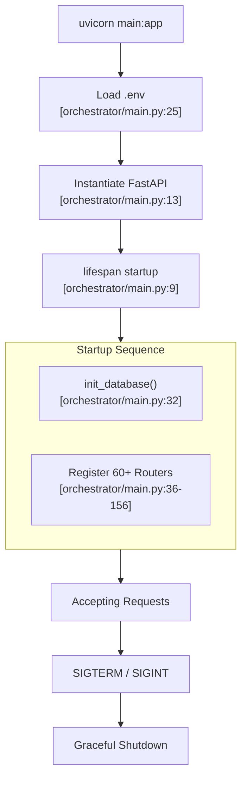
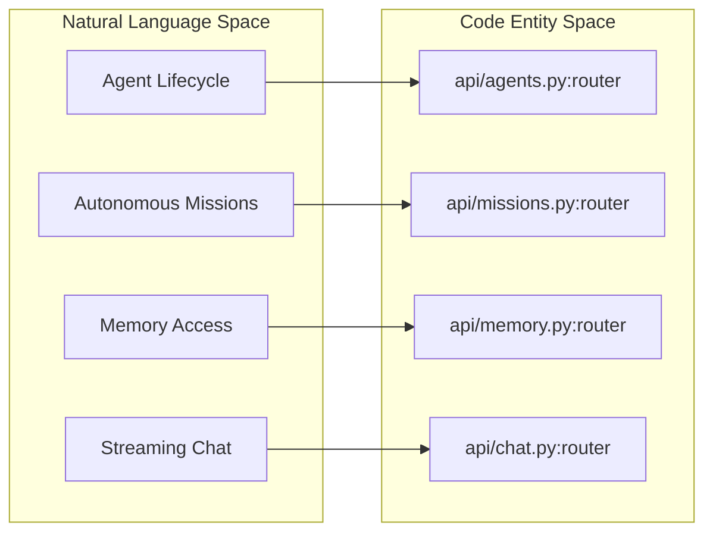
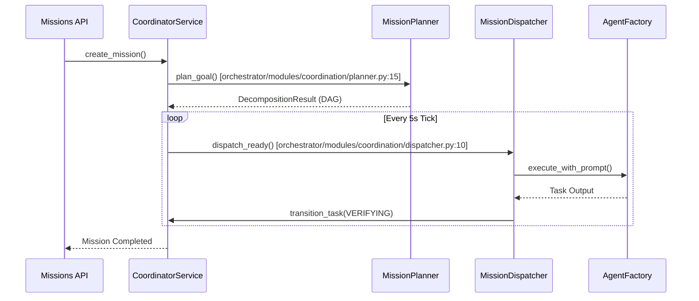

# FastAPI Application

Relevant source files

The following files were used as context for generating this wiki page:

- [frontend/components/widgets/CodingCanvasWidget/RepoSelector.tsx](frontend/components/widgets/CodingCanvasWidget/RepoSelector.tsx)
- [orchestrator/alembic/versions/prd123_checkpoint_count.py](orchestrator/alembic/versions/prd123_checkpoint_count.py)
- [orchestrator/api/main.py](orchestrator/api/main.py)
- [orchestrator/api/missions.py](orchestrator/api/missions.py)
- [orchestrator/api/tasks.py](orchestrator/api/tasks.py)
- [orchestrator/api/widgets/cors.py](orchestrator/api/widgets/cors.py)
- [orchestrator/api/widgets/rate_limit.py](orchestrator/api/widgets/rate_limit.py)
- [orchestrator/api/workspace_files.py](orchestrator/api/workspace_files.py)
- [orchestrator/api/workspace_github.py](orchestrator/api/workspace_github.py)
- [orchestrator/config.py](orchestrator/config.py)
- [orchestrator/core/context_guard.py](orchestrator/core/context_guard.py)
- [orchestrator/core/models/orchestration.py](orchestrator/core/models/orchestration.py)
- [orchestrator/core/models/orchestration_enums.py](orchestrator/core/models/orchestration_enums.py)
- [orchestrator/core/workspace_client.py](orchestrator/core/workspace_client.py)
- [orchestrator/main.py](orchestrator/main.py)
- [orchestrator/modules/coordination/dispatcher.py](orchestrator/modules/coordination/dispatcher.py)
- [orchestrator/modules/coordination/planner.py](orchestrator/modules/coordination/planner.py)
- [orchestrator/modules/coordination/reconciler.py](orchestrator/modules/coordination/reconciler.py)
- [orchestrator/modules/memory/context_router.py](orchestrator/modules/memory/context_router.py)
- [orchestrator/modules/memory/unified_memory_service.py](orchestrator/modules/memory/unified_memory_service.py)
- [orchestrator/modules/tools/discovery/action_registry.py](orchestrator/modules/tools/discovery/action_registry.py)
- [orchestrator/modules/tools/discovery/workspace_actions.py](orchestrator/modules/tools/discovery/workspace_actions.py)
- [orchestrator/modules/tools/execution/concurrency.py](orchestrator/modules/tools/execution/concurrency.py)
- [orchestrator/services/checkpoint_service.py](orchestrator/services/checkpoint_service.py)
- [orchestrator/services/coordinator_service.py](orchestrator/services/coordinator_service.py)
- [orchestrator/services/orchestration_state.py](orchestrator/services/orchestration_state.py)
- [orchestrator/tests/test_budget_gate.py](orchestrator/tests/test_budget_gate.py)
- [orchestrator/tests/test_dispatcher_parallel.py](orchestrator/tests/test_dispatcher_parallel.py)
- [orchestrator/tests/test_unified_memory.py](orchestrator/tests/test_unified_memory.py)
- [scripts/ralph/IMPLEMENTATION_PLAN.md](scripts/ralph/IMPLEMENTATION_PLAN.md)
- [scripts/ralph/progress.txt](scripts/ralph/progress.txt)
- [services/workspace-worker/executor.py](services/workspace-worker/executor.py)
- [services/workspace-worker/main.py](services/workspace-worker/main.py)
- [services/workspace-worker/workspace_manager.py](services/workspace-worker/workspace_manager.py)

This document describes the core FastAPI application initialization, lifespan management, middleware pipeline, and router organization. It covers the `orchestrator` backend's main entry point and how requests flow through the system.

---

## Overview

The FastAPI application serves as the central engine for Automatos AI. It initializes backend services, registers over 60 API routers, configures security and monitoring middleware, and manages the application lifecycle. The application is designed to be a high-performance, asynchronous orchestrator for multi-agent workflows, real-time streaming chat, and autonomous missions.

### Key Responsibilities
- **Application Initialization**: Loading environment variables via `load_dotenv` and centralized configuration from `config.py` [orchestrator/main.py:24-29]().
- **Lifespan Management**: Handling startup (database initialization, dashboard activation) and graceful shutdown [orchestrator/main.py:9-18]().
- **Middleware Stack**: Executing CORS, request tracking, and authentication logic for every request [orchestrator/main.py:14-17]().
- **Router Organization**: Mounting specialized routers for agents, missions, tools, and memory [orchestrator/main.py:36-156]().

---

## System Entry Point & Lifespan

The application uses an `asynccontextmanager` called `lifespan` to coordinate the lifecycle of global resources. This ensures that the database is ready and services are active before the server begins accepting traffic.

### Application Initialization Flow

**Sources:** [orchestrator/main.py:9-32](), [orchestrator/main.py:36-156]()

---

## Middleware & Request Pipeline

The application implements a standard middleware stack to handle cross-cutting concerns.

### Middleware Stack

| Component | Purpose | Source |
|:---|:---|:---|
| `CORSMiddleware` | Configures allowed origins, methods, and headers for the Next.js frontend. | [orchestrator/main.py:14]() |
| `Authentication` | `get_request_context_hybrid` resolves Clerk JWTs or API keys into a `RequestContext`. | [orchestrator/main.py:17]() |
| `Logging` | Standard Python logging for request/response cycles. | [orchestrator/main.py:8]() |

### Data Flow: Request Authentication
When a request enters the system, it typically passes through the `get_request_context_hybrid` dependency. This function extracts the `workspace_id` and user identity, which are then used by downstream services to ensure data isolation [orchestrator/main.py:17]().

**Sources:** [orchestrator/main.py:8-17]()

---

## Router Organization

The backend is modularized into specialized routers. These are registered in `main.py` using `app.include_router()`.

### Core Router Categories

| Category | Key Routers | Functionality |
|:---|:---|:---|
| **Agents** | `agents_router`, `agent_endpoints_router`, `personas_router` | CRUD, activation, and persona management for AI agents. |
| **Missions** | `missions_router`, `tasks_router`, `orchestrator_router` | Autonomous goal decomposition, DAG task execution, and coordination. |
| **Chat** | `chat_router`, `chatbot_router` | AI SDK SSE streaming for real-time interaction. |
| **Tools** | `tools_router`, `composio_router`, `skills_router` | Integration with external apps and capability resolution. |
| **Knowledge** | `knowledge_router`, `documents_router`, `knowledge_graph_router` | RAG, multimodal ingestion, and semantic search. |
| **Memory** | `memory_router`, `widget_memory_router` | L0-L4 memory tier access and session consolidation. |

### Code Entity Space: Router Mapping

This diagram associates the logical system components with their specific router entities in the code.

**Sources:** [orchestrator/main.py:36-156](), [orchestrator/api/missions.py:74]()

---

## Mission & Task Execution

A core part of the application logic is the `CoordinatorService`, which orchestrates sequential and parallel missions. It manages the lifecycle from planning to verification [orchestrator/services/coordinator_service.py:78-86]().

### Mission Execution Architecture

The `CoordinatorService` runs a 5-second tick loop to dispatch tasks and reconcile states [orchestrator/services/coordinator_service.py:82]().

### Key Components in Coordination
- **MissionPlanner**: Handles goal decomposition into a task DAG using LLM or templates [orchestrator/modules/coordination/planner.py:8-12]().
- **MissionDispatcher**: Atomically claims queued tasks using optimistic locking (`version_id`) to prevent double-dispatch [orchestrator/modules/coordination/dispatcher.py:120-140]().
- **UnifiedMemoryService**: Provides a 5-layer memory stack (L0-L4) for agents during execution, ensuring cross-task context [orchestrator/modules/memory/unified_memory_service.py:8-13]().

**Sources:** [orchestrator/services/coordinator_service.py:78-105](), [orchestrator/modules/coordination/planner.py:1-15](), [orchestrator/modules/coordination/dispatcher.py:1-18](), [orchestrator/modules/memory/unified_memory_service.py:1-21]()

---

## Workspace & File Integration

The FastAPI application provides routes for interacting with the sandboxed workspace environment, allowing agents and users to browse files and manage GitHub repositories.

### Workspace Data Flow

| Route | Functionality | Source |
|:---|:---|:---|
| `/api/workspace-files` | Browsing and viewing files in the agent's sandbox. | [orchestrator/main.py:125]() |
| `/api/workspace-github` | Listing and cloning repositories into the workspace. | [orchestrator/main.py:128]() |
| `/api/tasks` | Managing tasks on the workspace Kanban board. | [orchestrator/main.py:122]() |

**Sources:** [orchestrator/main.py:122-131](), [orchestrator/api/workspace_files.py:1-20]()

---

## Summary of Key Application Entities

| Entity | File Path | Role |
|:---|:---|:---|
| `app` | [orchestrator/main.py:13]() | The FastAPI application instance. |
| `CoordinatorService` | [orchestrator/services/coordinator_service.py:78]() | Stateless coordinator for mission orchestration. |
| `ActionRegistry` | [orchestrator/modules/tools/discovery/action_registry.py:55]() | Central registry for platform tools and OpenAI schemas. |
| `OrchestrationRun` | [orchestrator/core/models/orchestration.py:39]() | SQLAlchemy model representing a mission execution. |

**Sources:** [orchestrator/main.py:13](), [orchestrator/services/coordinator_service.py:78](), [orchestrator/modules/tools/discovery/action_registry.py:55](), [orchestrator/core/models/orchestration.py:39]()

---