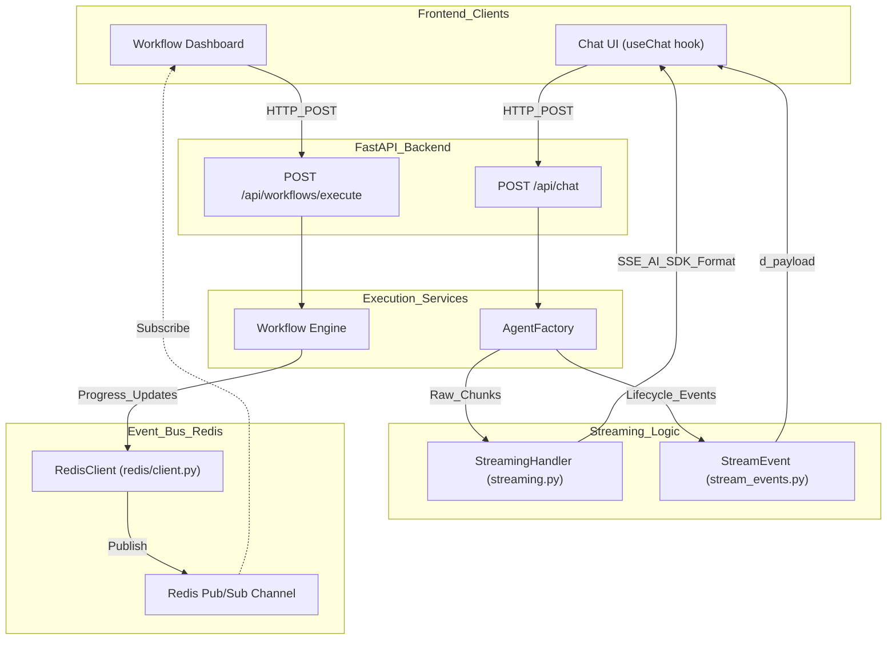
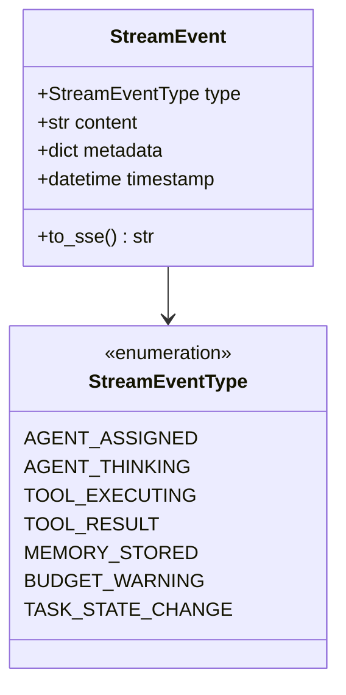

# Real-Time Updates

<details>
<summary>Relevant source files</summary>

The following files were used as context for generating this wiki page:

- [README.md](README.md)
- [docker-compose.yml](docker-compose.yml)
- [docs/README.md](docs/README.md)
- [frontend/.dockerignore](frontend/.dockerignore)
- [frontend/Dockerfile](frontend/Dockerfile)
- [orchestrator/Dockerfile](orchestrator/Dockerfile)
- [orchestrator/api/cloud_documents.py](orchestrator/api/cloud_documents.py)
- [orchestrator/consumers/chatbot/streaming.py](orchestrator/consumers/chatbot/streaming.py)
- [orchestrator/core/models/stream_events.py](orchestrator/core/models/stream_events.py)
- [orchestrator/core/redis/client.py](orchestrator/core/redis/client.py)
- [orchestrator/modules/tools/execution/exec_composio.py](orchestrator/modules/tools/execution/exec_composio.py)
- [orchestrator/modules/tools/execution/exec_document.py](orchestrator/modules/tools/execution/exec_document.py)
- [orchestrator/modules/tools/execution/exec_file_ops.py](orchestrator/modules/tools/execution/exec_file_ops.py)
- [orchestrator/modules/tools/execution/exec_multimodal.py](orchestrator/modules/tools/execution/exec_multimodal.py)
- [orchestrator/modules/tools/execution/exec_planning.py](orchestrator/modules/tools/execution/exec_planning.py)
- [orchestrator/modules/tools/services/__init__.py](orchestrator/modules/tools/services/__init__.py)
- [orchestrator/requirements.txt](orchestrator/requirements.txt)

</details>


This document covers the real-time update mechanisms in Automatos AI's backend architecture, including the **AI SDK Data Stream** protocol for chat streaming, **Redis Pub/Sub** for workflow events, and the structured **StreamEvent** system for lifecycle transparency.

---

## Overview

Automatos AI implements real-time updates through three primary mechanisms:

1.  **AI SDK Data Stream Protocol** — SSE-based streaming for chat responses with structured data chunks (text, tool calls, usage, and memory events) [[orchestrator/consumers/chatbot/streaming.py:102-103]]().
2.  **Redis Pub/Sub** — Event broadcasting for workflow stage updates and cross-service communication [[orchestrator/core/redis/client.py:1-4]]().
3.  **Structured Stream Events** — A typed event system (PRD-123) that extends the AI SDK format with granular agent and tool lifecycle states [[orchestrator/core/models/stream_events.py:1-7]]().

The system utilizes **Server-Sent Events (SSE)** for unidirectional streaming from the backend to the frontend, complemented by **Redis Pub/Sub** for broadcasting events across distributed worker processes like the `workspace-worker` [[docker-compose.yml:178-182]]().

**Sources:** [[orchestrator/consumers/chatbot/streaming.py:1-10]](), [[orchestrator/core/models/stream_events.py:1-7]](), [[orchestrator/core/redis/client.py:1-10]]()

---

## System Architecture

The following diagrams illustrate how the `StreamingHandler`, `StreamEvent` model, and `RedisClient` bridge the gap between internal execution logic and the real-time UI.

### Real-Time Update Data Flow



**Sources:** [[orchestrator/consumers/chatbot/streaming.py:21-30]](), [[orchestrator/core/redis/client.py:14-15]](), [[orchestrator/core/redis/client.py:91-97]](), [[orchestrator/core/models/stream_events.py:51-62]]()

---

## AI SDK Data Stream Protocol

The primary streaming mechanism for chat responses uses the **AI SDK Data Stream** format over SSE. The `StreamingHandler` class manages the formatting of these chunks to ensure compatibility with frontend hooks.

### Protocol Implementation

The system supports two formats:
1.  **Legacy SSE**: `data: {json}\n\n` used for backward compatibility [[orchestrator/consumers/chatbot/streaming.py:31-32]]().
2.  **AI SDK Data Stream**: Typed prefixes (e.g., `0:` for text, `d:` for data, `e:` for error) [[orchestrator/consumers/chatbot/streaming.py:102-103]]().

### Key Formatting Methods

| Method | Prefix | Description |
| :--- | :--- | :--- |
| `format_aisdk_text(text)` | `0:` | Escaped text chunk for the UI [[orchestrator/consumers/chatbot/streaming.py:105-108]](). |
| `format_aisdk_tool_start(...)` | `d:` | Notifies UI that a tool call has begun for lifecycle UI [[orchestrator/consumers/chatbot/streaming.py:125-139]](). |
| `format_aisdk_tool_end(...)` | `d:` | Sends tool execution results, success status, and duration [[orchestrator/consumers/chatbot/streaming.py:141-159]](). |
| `format_aisdk_memory_injected(...)` | `d:` | Sends retrieved memories used in context to the widget [[orchestrator/consumers/chatbot/streaming.py:182-194]](). |
| `format_aisdk_error(error)` | `e:` | Formats error messages for the stream [[orchestrator/consumers/chatbot/streaming.py:174-176]](). |

**Sources:** [[orchestrator/consumers/chatbot/streaming.py:102-176]](), [[orchestrator/consumers/chatbot/streaming.py:182-194]]()

---

## Typed Stream Events (PRD-123)

The `StreamEvent` class and `StreamEventType` enum provide a structured way to broadcast agent and tool lifecycle transitions during a stream [[orchestrator/core/models/stream_events.py:16-48]]().

### Event Categories



When a `StreamEvent` is serialized via `to_sse()`, it follows the `d:{json}\n` pattern, allowing the frontend to react to specific state changes like `AGENT_THINKING` or `CONTEXT_COMPACTED` [[orchestrator/core/models/stream_events.py:63-71]]().

**Sources:** [[orchestrator/core/models/stream_events.py:16-71]]()

---

## Redis Pub/Sub Event Broadcasting

For asynchronous operations like workflows, the `RedisClient` provides a broadcasting mechanism to update the UI as steps complete.

### Redis Client Configuration
The `RedisClient` uses a connection pool with `decode_responses=True` to handle JSON payloads efficiently [[orchestrator/core/redis/client.py:22-29]](). It supports both synchronous publishing and asynchronous subscription for WebSocket endpoints [[orchestrator/core/redis/client.py:48-64]]().

### Workflow Event Publication
The `publish_workflow_event` method standardizes the channel naming convention as `workflow:{workflow_id}:execution:{execution_id}` [[orchestrator/core/redis/client.py:110]]().

```python
# Example of event structure published to Redis
message = {
    "type": event_type, # e.g., 'execution_started', 'subtask_execution_update'
    "data": {
        "execution_id": execution_id,
        "workflow_id": workflow_id,
        **data
    }
}
```
**Sources:** [[orchestrator/core/redis/client.py:91-119]]()

---

## Infrastructure and Deployment

### Redis Service Definition
In `docker-compose.yml`, Redis is configured with a memory limit and LRU eviction policy [[docker-compose.yml:55-58]](). Security is enforced by renaming dangerous commands like `FLUSHDB` and `FLUSHALL` to empty strings [[docker-compose.yml:59-61]]().

### Connection Management
The backend initializes a global `RedisClient` instance using `REDIS_URL` (standard for Railway/Heroku) or fallback `REDIS_HOST` variables [[orchestrator/core/redis/client.py:149-162]](). If Redis is unavailable, real-time broadcasting features are gracefully disabled [[orchestrator/core/redis/client.py:188-190]]().

**Sources:** [[docker-compose.yml:48-73]](), [[orchestrator/core/redis/client.py:141-197]]()

---

## Summary of Real-Time Components

| Feature | Code Entity | File Path |
| :--- | :--- | :--- |
| **SSE Formatting** | `StreamingHandler` | [[orchestrator/consumers/chatbot/streaming.py:21]]() |
| **Typed Events** | `StreamEvent` | [[orchestrator/core/models/stream_events.py:51]]() |
| **Redis Pub/Sub** | `RedisClient` | [[orchestrator/core/redis/client.py:14]]() |
| **Async Subscriptions** | `get_async_pubsub` | [[orchestrator/core/redis/client.py:48]]() |
| **Workflow Events** | `publish_workflow_event` | [[orchestrator/core/redis/client.py:91]]() |

**Sources:** [[orchestrator/consumers/chatbot/streaming.py:21-172]](), [[orchestrator/core/redis/client.py:14-119]](), [[orchestrator/core/models/stream_events.py:51-62]]()

---