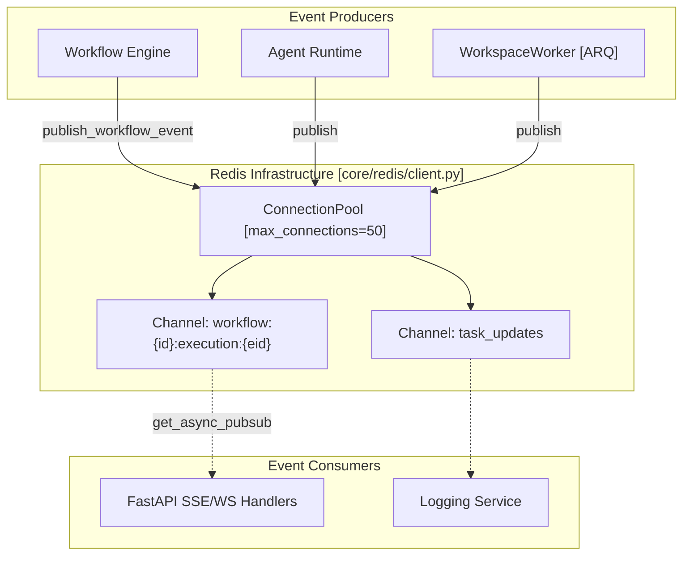
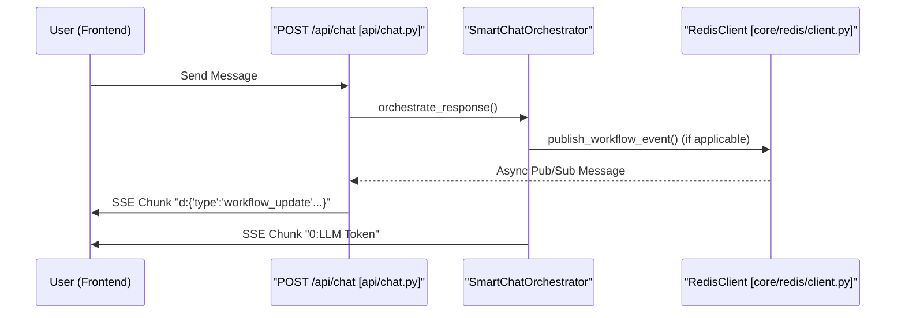

# Real-Time Updates

Relevant source files

The following files were used as context for generating this wiki page:

- [docker-compose.yml](docker-compose.yml)
- [frontend/.dockerignore](frontend/.dockerignore)
- [frontend/Dockerfile](frontend/Dockerfile)
- [orchestrator/Dockerfile](orchestrator/Dockerfile)
- [orchestrator/api/cloud_documents.py](orchestrator/api/cloud_documents.py)
- [orchestrator/core/redis/client.py](orchestrator/core/redis/client.py)
- [orchestrator/requirements.txt](orchestrator/requirements.txt)

This page details the real-time update architecture of Automatos AI, focusing on the integration of **Redis Pub/Sub** for cross-service event broadcasting, **Server-Sent Events (SSE)** for AI SDK Data Stream delivery, and the specialized **Workflow Event** pipeline.

---

## Overview

Automatos AI utilizes a multi-tiered real-time update system designed for high concurrency and low latency:

1.  **Redis Pub/Sub**: Acts as the backbone for distributed event broadcasting. It allows the FastAPI backend and independent workers (like the `workspace-worker`) to communicate status updates asynchronously `[orchestrator/core/redis/client.py:14-16]()`.
2.  **AI SDK Data Stream Protocol**: A specialized SSE implementation that streams structured data chunks (text, tool calls, and metadata) from the backend to the frontend.
3.  **Workflow Event Pipeline**: Uses dedicated Redis channels to track execution progress across multi-agent recipes `[orchestrator/core/redis/client.py:91-110]()`.

---

## Redis Pub/Sub Architecture

The `RedisClient` manages connections to the Redis instance, supporting both synchronous publishing and asynchronous subscription for non-blocking message delivery in WebSocket or SSE endpoints.

### Redis Event Flow

Title: Redis Pub/Sub Event Distribution Flow

**Sources:** `[orchestrator/core/redis/client.py:14-64]()`, `[orchestrator/core/redis/client.py:91-110]()`, `[docker-compose.yml:178-184]()`

### Implementation Details

| Component | Role | Code Entity |
| :--- | :--- | :--- |
| **Connection Management** | Manages a pool of 50 connections with `decode_responses=True` | `RedisClient.pool` `[orchestrator/core/redis/client.py:22-29]()` |
| **Async Streaming** | Provides `aioredis` pubsub clients for non-blocking SSE | `RedisClient.get_async_pubsub` `[orchestrator/core/redis/client.py:48-64]()` |
| **Workflow Tracking** | Formats and publishes events to specific workflow execution channels | `RedisClient.publish_workflow_event` `[orchestrator/core/redis/client.py:91-119]()` |
| **Global Access** | Singleton-style lazy initialization using `REDIS_URL` or env vars | `get_redis_client()` `[orchestrator/core/redis/client.py:149-197]()` |

---

## AI SDK Data Stream Protocol

The chat interface relies on the **AI SDK Data Stream** format. This protocol uses specific prefixes to distinguish between different types of data within a single SSE stream. The backend handles this via the `main.py` router and specialized streaming logic.

### Protocol Prefixes and Handlers

| Prefix | Protocol Type | Usage |
| :--- | :--- | :--- |
| `0:` | **Text** | Streaming LLM tokens |
| `d:` | **Data** | Tool calls, workflow updates, and complexity results |
| `e:` | **Error** | Streaming backend exceptions to the UI |
| `9:` | **Control** | Signaling end of stream with usage stats |

### Streaming Data Flow

Title: Chat Streaming Sequence (Natural Language to Code Entity)

**Sources:** `[orchestrator/core/redis/client.py:102-119]()`, `[orchestrator/api/cloud_documents.py:25-27]()`, `[orchestrator/requirements.txt:2-4]()`

---

## Workflow Events & Progress

Real-time updates for workflows are bridged through the backend API. This allows long-running agentic processes to report progress back to the user interface dynamically.

### Event Lifecycle
1.  **Execution**: The workflow engine triggers events like `execution_started` or `subtask_execution_update` `[orchestrator/core/redis/client.py:104]()`.
2.  **Publishing**: `RedisClient.publish_workflow_event` constructs a channel name using the pattern `workflow:{workflow_id}:execution:{execution_id}` `[orchestrator/core/redis/client.py:110-111]()`.
3.  **Consumption**: The API layer subscribes to this channel using `get_async_pubsub` and wraps the JSON payload into an SSE chunk `[orchestrator/core/redis/client.py:48-64]()`.

**Sources:** `[orchestrator/core/redis/client.py:91-119]()`, `[orchestrator/core/redis/client.py:48-64]()`

---

## Infrastructure Configuration

Real-time capabilities are dependent on the Redis service availability. The system is designed to degrade gracefully if Redis is unavailable.

-   **Docker Compose**: The `redis` service is defined with a `maxmemory` of 256MB and an `allkeys-lru` policy to ensure performance for transient real-time data `[docker-compose.yml:48-61]()`.
-   **Security**: Redis commands like `FLUSHALL` and `DEBUG` are renamed to empty strings in production to prevent accidental data loss `[docker-compose.yml:59-61]()`.
-   **Environment**: The backend connects via `REDIS_URL` or individual `REDIS_HOST`/`REDIS_PORT` variables. If these are missing, Redis features are disabled gracefully `[orchestrator/core/redis/client.py:161-197]()`.
-   **Dependencies**: The system uses `redis>=4.5.0` for sync operations and `aioredis` (via the main redis package) for async streaming `[orchestrator/requirements.txt:58]()`.

**Sources:** `[docker-compose.yml:48-73]()`, `[orchestrator/core/redis/client.py:161-197]()`, `[orchestrator/requirements.txt:58]()`

---