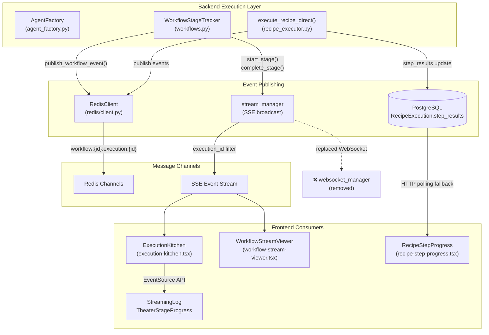
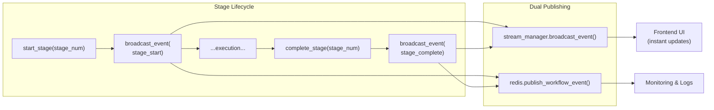
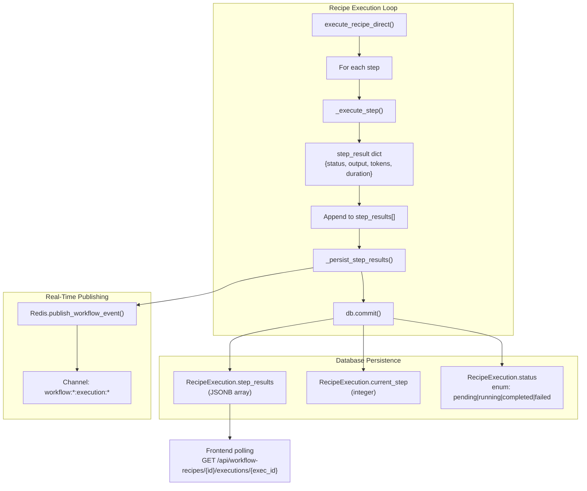

# Real-Time Updates

<details>
<summary>Relevant source files</summary>

The following files were used as context for generating this wiki page:

- [docker-compose.yml](docker-compose.yml)
- [frontend/.dockerignore](frontend/.dockerignore)
- [frontend/Dockerfile](frontend/Dockerfile)
- [orchestrator/Dockerfile](orchestrator/Dockerfile)
- [orchestrator/core/redis/client.py](orchestrator/core/redis/client.py)
- [orchestrator/requirements.txt](orchestrator/requirements.txt)

</details>


This document describes the real-time update infrastructure in Automatos AI, including Redis Pub/Sub messaging, SSE streaming to the frontend, and live progress tracking for workflow and recipe executions.

**Scope**: This page covers the event publishing, message routing, and frontend consumption of execution updates. For workflow execution logic, see [Execution Layer](#10.3). For recipe execution details, see [Recipe Execution](#4.2). For frontend state management, see [State Management](#11.2).

---

## Architecture Overview

Automatos AI uses a dual-path real-time update system: **Redis Pub/Sub** for backend event logging and monitoring, and **SSE (Server-Sent Events)** for direct streaming to the frontend UI.



**Sources**: [orchestrator/core/redis/client.py](), [orchestrator/api/workflows.py:37-136](), [frontend/components/workflows/execution-kitchen.tsx:1-50]()

---

## Redis Pub/Sub System

The `RedisClient` class provides a connection pool-based pub/sub infrastructure for workflow execution events.

### RedisClient Implementation

**Core Methods**:
- `publish(channel, message)` - Publish JSON message to Redis channel
- `publish_workflow_event(workflow_id, execution_id, event_type, data)` - Typed workflow event publisher
- `get_async_pubsub(channel)` - Get async Redis pubsub for non-blocking streaming
- `get_redis()` - Get connection from pool

**Configuration**:
```
REDIS_HOST / REDIS_URL (Railway)
REDIS_PORT (default: 6379)
REDIS_PASSWORD
```

**Lazy Initialization Pattern**:
The global `get_redis_client()` function supports both `REDIS_URL` (Railway/Heroku) and individual environment variables, returning `None` if Redis is unconfigured (optional service).

**Sources**: [orchestrator/core/redis/client.py:14-198]()

### Channel Naming Convention

Events are published to channels following the pattern:

```
workflow:{workflow_id}:execution:{execution_id}
```

Example: `workflow:42:execution:1337`

This allows frontend clients to subscribe to specific execution streams without receiving unrelated events.

**Sources**: [orchestrator/core/redis/client.py:110-119]()

### Message Structure

All Redis messages follow a consistent JSON structure:

```json
{
  "type": "stage_start|stage_complete|agent_spawn|task_progress|...",
  "data": {
    "execution_id": 1337,
    "workflow_id": 42,
    "stage": 4,
    "stage_name": "Agent Execution",
    "timestamp": "2025-01-15T10:30:45.123Z",
    ...
  }
}
```

**Sources**: [orchestrator/core/redis/client.py:91-119]()

---

## SSE Streaming to Frontend

The backend has transitioned from WebSockets to **SSE (Server-Sent Events)** for real-time updates, using a `stream_manager` for broadcast operations.

### WorkflowStageTracker SSE Integration

The `WorkflowStageTracker` class emits events during 9-stage workflow execution:



**Key Implementation Details**:
- `start_stage()` and `complete_stage()` both publish to SSE **and** Redis
- SSE provides instant UI updates via `stream_manager.broadcast_event()`
- Redis provides logging/monitoring via `redis.publish_workflow_event()`
- Stage duration calculated via `stage_start_times` dict
- Non-blocking error handling with `try/except` wrappers

**Sources**: [orchestrator/api/workflows.py:37-136]()

### 9-Stage Workflow Events

The `STAGES` dict defines the workflow pipeline stages:

| Stage | Name | Description |
|-------|------|-------------|
| 1 | Task Decomposition | Break down complex task into subtasks |
| 2 | Agent Selection | Choose agents for each subtask |
| 3 | Context Engineering | Build optimized context for agents |
| 4 | Agent Execution | Execute agents with tools |
| 5 | Result Aggregation | Combine outputs from agents |
| 6 | Learning Update | Update learning models |
| 7 | Quality Assessment | Score execution quality |
| 8 | Memory Storage | Persist learnings |
| 9 | Response Generation | Format final response |

**Sources**: [orchestrator/api/workflows.py:38-49](), [frontend/components/workflows/execution-kitchen.tsx:74-84]()

### Legacy WebSocket Removal

Comments throughout the codebase indicate WebSocket support was removed in favor of SSE:

```python
# Real-time updates now handled via SSE/AI SDK streaming (stream_manager)
# Legacy WebSocket broadcast removed
```

This appears at workflow update endpoints, delete endpoints, and creation endpoints where WebSocket broadcasts were previously emitted.

**Sources**: [orchestrator/api/workflows.py:394-396](), [orchestrator/api/workflows.py:442-443](), [orchestrator/api/workflows.py:598-599]()

---

## Recipe Step Progress Updates

Recipe executions use a different update pattern optimized for sequential step-by-step workflows.

### Direct Execution with Persistence

The `execute_recipe_direct()` function executes recipes step-by-step and persists progress in the database:



**Key Data Structures**:

1. **step_results** - Flat JSONB array persisted to database:
```python
[
  {
    "step_id": "step-1",
    "order": 1,
    "agent_id": 42,
    "agent_name": "Research Agent",
    "output_key": "research_output",
    "status": "completed",
    "output": "...",
    "tool_calls": [...],
    "duration_ms": 5423,
    "tokens_used": 1250,
    "started_at": "2025-01-15T10:30:45Z",
    "completed_at": "2025-01-15T10:30:50Z",
    "error": null,
    "retries": 0
  },
  ...
]
```

2. **step_outputs** - In-memory keyed dict for inter-step data passing:
```python
{
  "research_output": {
    "text": "Research findings...",
    "tool_calls": [...],
    "agent_name": "Research Agent",
    "step_order": 1
  },
  ...
}
```

**Sources**: [orchestrator/api/recipe_executor.py:313-555]()

### Step Result Persistence

The `_persist_step_results()` helper updates the execution record after each step:

```python
def _persist_step_results(db, execution, step_results):
    execution.step_results = step_results
    db.commit()
```

This ensures that partial progress is saved even if the recipe fails mid-execution, enabling resume/retry logic and frontend progress display.

**Sources**: [orchestrator/api/recipe_executor.py:578-583]()

---

## Event Types and Payloads

The system emits various event types throughout execution:

### Workflow Stage Events

**stage_start**:
```json
{
  "type": "stage_start",
  "data": {
    "execution_id": 1337,
    "stage": 4,
    "stage_name": "Agent Execution",
    "timestamp": "2025-01-15T10:30:45.123Z"
  }
}
```

**stage_complete**:
```json
{
  "type": "stage_complete",
  "data": {
    "execution_id": 1337,
    "stage": 4,
    "stage_name": "Agent Execution",
    "result": {"agent_count": 3, "success": true},
    "duration_ms": 5423,
    "timestamp": "2025-01-15T10:30:50.546Z"
  }
}
```

**Sources**: [orchestrator/api/workflows.py:58-93](), [orchestrator/api/workflows.py:95-135]()

### Agent Execution Events

Events generated during agent task execution (typically in Stage 4):

**agent_spawn**:
```json
{
  "type": "agent_spawn",
  "data": {
    "agent": "Research Agent",
    "task_description": "Analyze market trends",
    "model": "gpt-4"
  }
}
```

**task_progress**:
```json
{
  "type": "task_progress",
  "data": {
    "agent": "Research Agent",
    "message": "Executing tool: web_search",
    "tools_used": ["web_search"],
    "tokens": 450
  }
}
```

**task_complete**:
```json
{
  "type": "task_complete",
  "data": {
    "agent": "Research Agent",
    "full_response": "Market analysis results...",
    "tokens": 1250,
    "duration": 5423
  }
}
```

**task_error**:
```json
{
  "type": "task_error",
  "data": {
    "agent": "Research Agent",
    "error": "API rate limit exceeded",
    "details": "Retry in 60 seconds"
  }
}
```

**Sources**: [frontend/components/workflows/execution-kitchen.tsx:61-71]()

---

## Frontend Integration

Frontend components consume real-time updates via SSE streaming and HTTP polling.

### ExecutionKitchen Component

The `ExecutionKitchen` component provides a theater-style live execution viewer:

**Component Structure**:
```typescript
interface ExecutionKitchenProps {
  workflowId: number
  recipeExecutionId?: string
  recipeId?: string
  executionType?: 'workflow' | 'recipe'
  autoStart?: boolean
  onBack: () => void
}
```

**Key Features**:
- `StreamingLog` - Real-time log display with filtering and auto-scroll
- `TheaterStageProgress` - Visual 9-stage progress indicator
- `TheaterStepExecution` - Recipe step-by-step visualization
- `RecipeStepProgress` - Step completion tracker

**State Management**:
```typescript
const [logs, setLogs] = useState<LogEntry[]>([])
const [currentStage, setCurrentStage] = useState(1)
const [isExecuting, setIsExecuting] = useState(false)
const [selectedStage, setSelectedStage] = useState<number | null>(null)
```

**Sources**: [frontend/components/workflows/execution-kitchen.tsx:47-85]()

### SSE Event Processing

Frontend components use the `EventSource` API for SSE streaming:

```typescript
// Pseudo-code based on typical SSE integration
const eventSource = new EventSource(
  `/api/workflows/${workflowId}/executions/${executionId}/stream`
)

eventSource.addEventListener('stage_start', (event) => {
  const data = JSON.parse(event.data)
  setCurrentStage(data.stage)
  addLog({
    type: 'stage_start',
    stage: data.stage,
    message: `Stage ${data.stage}: ${data.stage_name}`,
    timestamp: new Date(data.timestamp)
  })
})

eventSource.addEventListener('stage_complete', (event) => {
  const data = JSON.parse(event.data)
  addLog({
    type: 'stage_complete',
    stage: data.stage,
    message: `✅ Completed ${data.stage_name}`,
    duration: data.duration_ms,
    timestamp: new Date(data.timestamp)
  })
})
```

**Sources**: [frontend/components/workflows/execution-kitchen.tsx:98-257]()

### Streaming Log Component

The `StreamingLog` displays events with expandable details:

**Features**:
- Auto-scroll toggle with manual override
- Stage filtering (click stage badge to filter)
- Expandable log entries for full response text
- Color-coded event types
- Timestamp display with millisecond precision

**Log Entry Structure**:
```typescript
interface LogEntry {
  id: string
  timestamp: Date
  stage: number
  type: 'stage_start' | 'stage_complete' | 'agent_spawn' | 'task_progress' | 'task_complete' | 'task_error' | 'inter_agent' | 'memory_write' | 'info'
  message: string
  agent?: string
  details?: string
  fullResponse?: string
  tokens?: number
  duration?: number
  model?: string
  taskDescription?: string
  toolsUsed?: string[]
}
```

**Sources**: [frontend/components/workflows/execution-kitchen.tsx:61-71](), [frontend/components/workflows/execution-kitchen.tsx:99-258]()

### HTTP Polling Fallback

For recipe executions, the frontend polls the REST API when SSE is unavailable:

```
GET /api/workflow-recipes/{recipe_id}/executions/{execution_id}
```

Response includes:
- `status`: "pending" | "running" | "completed" | "failed"
- `current_step`: Current step index (0-based)
- `step_results`: Array of completed step results
- `output_data`: Final execution output and metadata

**Sources**: [frontend/components/workflows/view-recipe-modal.tsx:251-329]()

---

## Performance Considerations

### Redis Connection Pooling

The `RedisClient` uses a connection pool to avoid connection overhead:

```python
self.pool = redis.ConnectionPool(
    host=host,
    port=port,
    password=password,
    db=db,
    decode_responses=True,
    max_connections=50
)
```

This allows up to 50 concurrent Redis connections, sufficient for multi-execution scenarios.

**Sources**: [orchestrator/core/redis/client.py:22-31]()

### Non-Blocking Event Publishing

Both SSE and Redis publishing use non-blocking error handling to prevent execution failures from broken connections:

```python
if self.stream_manager:
    try:
        await self.stream_manager.broadcast_event(...)
    except Exception as e:
        logger.warning(f"Failed to broadcast stage_start event: {e}")

if self.redis:
    try:
        self.redis.publish_workflow_event(...)
    except Exception as e:
        logger.warning(f"Failed to publish stage_start to Redis: {e}")
```

This ensures execution continues even if the real-time update infrastructure is unavailable.

**Sources**: [orchestrator/api/workflows.py:66-93](), [orchestrator/api/workflows.py:104-135]()

### JSONB Step Results Efficiency

Recipe step results are stored as JSONB in PostgreSQL, allowing:
- **Atomic updates**: Single `db.commit()` per step
- **Partial reads**: Frontend can query specific execution without full table scan
- **Schema flexibility**: Step result structure can evolve without migrations
- **Index support**: PostgreSQL can index into JSONB for filtering

Example query with JSONB filtering:
```sql
SELECT step_results
FROM recipe_executions
WHERE execution_id = 'exec-abc123'
  AND step_results @> '[{"status": "failed"}]'::jsonb;
```

**Sources**: [orchestrator/api/recipe_executor.py:413-528]()

### Frontend Auto-Scroll Optimization

The `StreamingLog` component uses a ref-based scroll mechanism with manual override:

```typescript
const scrollRef = useRef<HTMLDivElement>(null)
const [autoScroll, setAutoScroll] = useState(true)

useEffect(() => {
  if (autoScroll && scrollRef.current) {
    scrollRef.current.scrollIntoView({ behavior: 'smooth' })
  }
}, [logs, autoScroll])
```

This prevents excessive re-renders while maintaining smooth scroll behavior during high-frequency log updates.

**Sources**: [frontend/components/workflows/execution-kitchen.tsx:100-107]()

---

## Error Handling and Resilience

### Optional Redis Service

The system gracefully degrades when Redis is unavailable:

```python
def get_redis_client() -> Optional[RedisClient]:
    """Returns None if Redis is not configured (optional service)."""
    global _redis_client
    if _redis_client is None:
        # ... initialization logic ...
        if not host or not port:
            logger.warning("Redis not configured. Redis features disabled.")
            return None
```

When `get_redis_client()` returns `None`, workflow execution continues but real-time updates are logged to console instead of Redis.

**Sources**: [orchestrator/core/redis/client.py:149-197]()

### Step Error Handling

Recipe execution respects per-step `error_handling` configuration:

| Mode | Behavior |
|------|----------|
| `stop` | Halt execution immediately, mark as failed |
| `skip` | Log error, continue to next step |
| `retry` | Retry up to `max_retries` times with exponential backoff |

```python
if not success:
    step_result["status"] = "failed"
    step_result["error"] = last_error
    
    if error_handling == 'stop':
        await _fail_execution(db, recipe_execution_id, ...)
        return
    elif error_handling == 'skip':
        step_results.append(step_result)
        continue
```

**Sources**: [orchestrator/api/recipe_executor.py:497-525]()

### Connection Test Utility

The `RedisClient` provides a `test_connection()` method for health checks:

```python
def test_connection(self) -> bool:
    """Test Redis connection"""
    try:
        redis_client = self.get_redis()
        redis_client.ping()
        logger.info("✅ Redis connection test successful")
        return True
    except Exception as e:
        logger.error(f"❌ Redis connection test failed: {e}")
        return False
```

This is called during initialization to verify Redis availability.

**Sources**: [orchestrator/core/redis/client.py:121-134]()

---