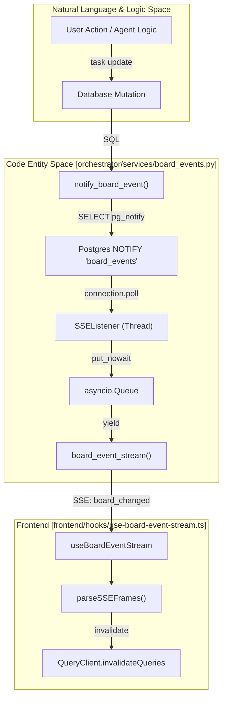
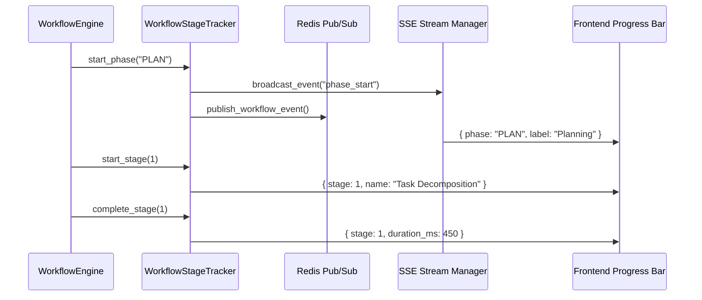

# Real-Time Updates

Relevant source files

The following files were used as context for generating this wiki page:

- [.github/workflows/test.yml](.github/workflows/test.yml)
- [docker-compose.yml](docker-compose.yml)
- [docs/PRDS/PRD-227-BOARD-LIGHT-UP.md](docs/PRDS/PRD-227-BOARD-LIGHT-UP.md)
- [docs/PRDS/PRD-WAVE-AUTO-MANAGER.md](docs/PRDS/PRD-WAVE-AUTO-MANAGER.md)
- [frontend/.dockerignore](frontend/.dockerignore)
- [frontend/Dockerfile](frontend/Dockerfile)
- [infrastructure/.env.example](infrastructure/.env.example)
- [infrastructure/railway-manifest.json](infrastructure/railway-manifest.json)
- [orchestrator/Dockerfile](orchestrator/Dockerfile)
- [orchestrator/core/redis/client.py](orchestrator/core/redis/client.py)
- [orchestrator/requirements.txt](orchestrator/requirements.txt)
- [orchestrator/services/audit_retention.py](orchestrator/services/audit_retention.py)
- [orchestrator/services/board_events.py](orchestrator/services/board_events.py)
- [orchestrator/services/chat_messenger.py](orchestrator/services/chat_messenger.py)
- [orchestrator/tests/conftest.py](orchestrator/tests/conftest.py)
- [orchestrator/tests/test_board_dispatch.py](orchestrator/tests/test_board_dispatch.py)
- [orchestrator/tests/test_board_sse_listen_notify.py](orchestrator/tests/test_board_sse_listen_notify.py)
- [orchestrator/tests/test_dockerfile_prod_parity.py](orchestrator/tests/test_dockerfile_prod_parity.py)
- [orchestrator/tests/test_p2w2_audit_retention.py](orchestrator/tests/test_p2w2_audit_retention.py)
- [orchestrator/tests/test_p2w2_governance_audit.py](orchestrator/tests/test_p2w2_governance_audit.py)
- [orchestrator/tests/test_p2w2_governance_policy_budget.py](orchestrator/tests/test_p2w2_governance_policy_budget.py)
- [orchestrator/tests/test_prd164_flywheel.py](orchestrator/tests/test_prd164_flywheel.py)
- [orchestrator/tests/test_prd204_run_verdict.py](orchestrator/tests/test_prd204_run_verdict.py)

This page details the real-time update architecture of Automatos AI, focusing on the integration of **Postgres LISTEN/NOTIFY** for UI event fan-out, **Redis Pub/Sub** for cross-service broadcasting, **SSE streaming** for the Command Centre, and the **AI SDK Data Stream** protocol for chat.

---

## Overview

Automatos AI utilizes a multi-tiered real-time update system designed for high concurrency and sub-second UI responsiveness:

1.  **Postgres LISTEN/NOTIFY**: Acts as the sub-second push spine for the Command Centre and Board. It proves lower latency than polling by using a dedicated raw connection to bridge database mutations directly to SSE streams `[orchestrator/services/board_events.py:1-18]()`.
2.  **Redis Pub/Sub**: Manages distributed event broadcasting between the FastAPI backend and independent workers (like the `workspace-worker`) `[orchestrator/requirements.txt:72-73]()`.
3.  **AI SDK Data Stream Protocol**: A specialized SSE implementation that streams structured data chunks (text, tool calls, and metadata) from the `StreamingChatService` to the frontend `[orchestrator/consumers/chatbot/streaming.py:102-103]()`.
4.  **Workflow Event Pipeline**: Uses dedicated Redis channels and the `WorkflowStageTracker` to track execution progress across multi-agent recipes and dynamic PRD-59 phases `[orchestrator/api/workflows.py:38-70]()`.

---

## Command Centre & Board Updates (SSE)

The Command Centre replaces legacy 60s polling with a real-time subscription to `GET /api/v1/tasks/stream`. This stream is driven by Postgres `NOTIFY` events fired during task mutations.

### Board Event Fan-Out

Sources: `[orchestrator/services/board_events.py:1-60]()`, `[frontend/hooks/use-board-event-stream.ts:1-20]()`, `[frontend/hooks/use-board-event-stream.ts:118-135]()`

### Implementation Details

| Component | Role | Code Entity |
| :--- | :--- | :--- |
| **Event Producer** | Fires `pg_notify` on the `board_events` channel after task/chat changes | `notify_board_event` `[orchestrator/services/board_events.py:38-51]()` |
| **Background Listener** | A daemon thread holding a raw `psycopg2` connection in `autocommit` mode | `_SSEListener` `[orchestrator/services/board_events.py:104-123]()` |
| **Stream Generator** | Yields SSE frames for a specific workspace; drops events for other tenants | `board_event_stream` `[orchestrator/services/board_events.py:167-183]()` |
| **Frontend Hook** | Manages `fetch` + `ReadableStream` to handle Auth headers (native `EventSource` limitation) | `useBoardEventStream` `[frontend/hooks/use-board-event-stream.ts:78-100]()` |

Sources: `[orchestrator/services/board_events.py:38-51]()`, `[orchestrator/services/board_events.py:104-123]()`, `[orchestrator/services/board_events.py:167-183]()`, `[frontend/hooks/use-board-event-stream.ts:78-100]()`

---

## AI SDK Data Stream Protocol

The chat interface relies on the **AI SDK Data Stream** format. This protocol uses specific prefixes to distinguish between different types of data within a single SSE stream.

### Protocol Prefixes and Handlers

The `StreamingHandler` class in `streaming.py` transforms internal execution signals into protocol-compliant strings.

| Prefix | Protocol Type | Handler Method | Usage |
| :--- | :--- | :--- | :--- |
| `0:` | **Text** | `format_aisdk_text` | Streaming LLM tokens `[orchestrator/consumers/chatbot/streaming.py:105-108]()` |
| `d:` | **Data** | `format_aisdk_data` | Tool calls, workflow updates, and complexity results `[orchestrator/consumers/chatbot/streaming.py:110-113]()` |
| `e:` | **Error** | `format_aisdk_error` | Streaming backend exceptions to the UI `[orchestrator/consumers/chatbot/streaming.py:174-176]()` |
| `9:` | **Control** | `format_aisdk_finish` | Signaling end of stream with usage stats `[orchestrator/consumers/chatbot/streaming.py:161-172]()` |

Sources: `[orchestrator/consumers/chatbot/streaming.py:102-172]()`, `[orchestrator/consumers/chatbot/service.py:12-13]()`

---

## Workflow Progress Tracking

Real-time updates for workflows support both legacy 9-stage processes and PRD-59 dynamic phases (PLAN, PREPARE, EXECUTE, EVALUATE, LEARN).

### Workflow Event Flow

Sources: `[orchestrator/api/workflows.py:38-70]()`, `[orchestrator/api/workflows.py:89-108]()`, `[orchestrator/api/workflows.py:127-141]()`

### Stage and Phase Definitions
-   **Phases**: Groupings of stages (e.g., `PLAN` includes Stage 1 and 2) `[orchestrator/api/workflows.py:63-69]()`.
-   **Dynamic Stages**: Supports sub-stages like `2b` (Agent Negotiation) and `3b` (Prompt Optimization) `[orchestrator/api/workflows.py:55-60]()`.
-   **Bridge**: The API layer subscribes to Redis channels and wraps payloads into `d:` chunks for the chat stream `[orchestrator/api/chat.py:143-149]()`.

Sources: `[orchestrator/api/workflows.py:63-69]()`, `[orchestrator/api/workflows.py:55-60]()`, `[orchestrator/api/chat.py:143-149]()`

---

## Background Message Delivery (ChatMessenger)

Producers (Watchers, Scheduled Tasks) use `ChatMessenger` to post messages to chats after the originating HTTP turn has ended.

1.  **Resolution**: Targets the originating chat if valid for the workspace, otherwise falls back to the user's **Auto thread** (`kind='auto'`) `[orchestrator/services/chat_messenger.py:121-147]()`.
2.  **Persistence**: Saves the message with a `source` label ("Auto · background") that survives reloads `[orchestrator/services/chat_messenger.py:150-168]()`.
3.  **Notification**: Triggers `notify_chat_event` to fire a `chat_changed` NOTIFY, which the frontend `useBoardEventStream` hook captures to dispatch a `CustomEvent` `[orchestrator/services/chat_messenger.py:170-179]()`, `[frontend/hooks/use-board-event-stream.ts:130-134]()`.

Sources: `[orchestrator/services/chat_messenger.py:1-20]()`, `[orchestrator/services/chat_messenger.py:186-202]()`, `[orchestrator/services/chat_messenger.py:121-147]()`, `[orchestrator/services/chat_messenger.py:150-168]()`, `[orchestrator/services/chat_messenger.py:170-179]()`, `[frontend/hooks/use-board-event-stream.ts:130-134]()`

---