# Service Layer Patterns

<details>
<summary>Relevant source files</summary>

The following files were used as context for generating this wiki page:

- [frontend/tsconfig.tsbuildinfo](frontend/tsconfig.tsbuildinfo)
- [orchestrator/api/workflows.py](orchestrator/api/workflows.py)
- [orchestrator/consumers/chatbot/service.py](orchestrator/consumers/chatbot/service.py)
- [orchestrator/core/llm/manager.py](orchestrator/core/llm/manager.py)
- [orchestrator/modules/agents/factory/agent_factory.py](orchestrator/modules/agents/factory/agent_factory.py)
- [orchestrator/modules/orchestrator/pipeline.py](orchestrator/modules/orchestrator/pipeline.py)
- [orchestrator/modules/orchestrator/service.py](orchestrator/modules/orchestrator/service.py)

</details>


This document describes the architectural patterns used in the service layer of Automatos AI. The service layer sits between the API routes (see [API Router Organization](#13.2)) and the database models (see [Database Models](#13.3)), providing business logic, orchestration, and resource management.

For information about specific services like RAG, tools, or agents, see the dedicated sections: [RAG Retrieval System](#5.4), [Tool Router & Execution](#6.3), [Agent Factory & Runtime](#3.5).

---

## Service Layer Architecture

The service layer implements the business logic tier in a three-layer architecture. Services consume database models, external APIs, and other services, while being consumed by API routes and other services.

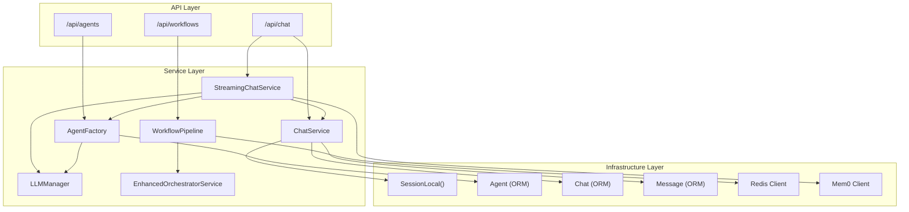

**Sources**: [orchestrator/consumers/chatbot/service.py:14-476](), [orchestrator/modules/agents/factory/agent_factory.py:503-517](), [orchestrator/modules/orchestrator/pipeline.py:134-279]()

---

## Database Session Injection Pattern

Services receive a `Session` object in their constructor rather than creating their own connections. This enables transaction management, testing with mock sessions, and proper connection pooling.

### Pattern Structure

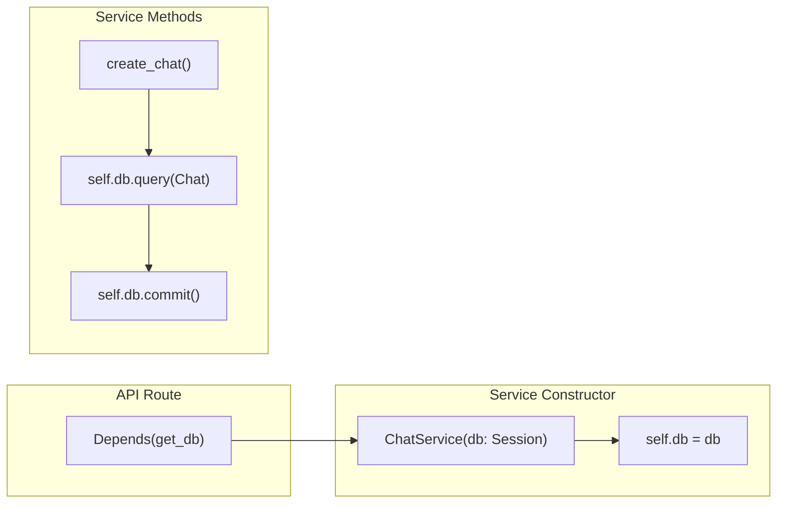

### Implementation Examples

**ChatService** receives session in constructor:
- Constructor: [orchestrator/consumers/chatbot/service.py:194-195]()
- Usage in methods: [orchestrator/consumers/chatbot/service.py:212-214]()

**AgentFactory** with fallback to SessionLocal:
- Constructor with fallback: [orchestrator/modules/agents/factory/agent_factory.py:510-516]()
- Session usage: [orchestrator/modules/agents/factory/agent_factory.py:820-823]()

**StreamingChatService** composes ChatService:
- Composition: [orchestrator/consumers/chatbot/service.py:462-464]()
- Passes session to sub-services: [orchestrator/consumers/chatbot/service.py:473-474]()

**Sources**: [orchestrator/consumers/chatbot/service.py:191-216](), [orchestrator/modules/agents/factory/agent_factory.py:510-519]()

---

## Service Composition Pattern

Services compose other services to delegate specialized functionality. This promotes separation of concerns and testability.

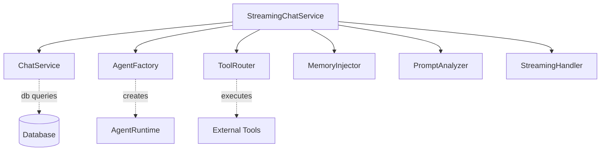

### StreamingChatService Composition

The `StreamingChatService` delegates to specialized services:

| Service | Responsibility | Initialization |
|---------|---------------|----------------|
| `ChatService` | Database CRUD for chats/messages | [service.py:464]() |
| `PromptAnalyzer` | Extract latest user text, detect fresh start | [service.py:465]() |
| `MemoryInjector` | Retrieve/inject memories from Mem0 | [service.py:466]() |
| `ToolRouter` | Execute tool calls | [service.py:467]() |
| `StreamingHandler` | Format AI SDK SSE events | [service.py:468]() |
| `AgentFactory` | Activate agents | [service.py:473-474]() |

**Sources**: [orchestrator/consumers/chatbot/service.py:456-475]()

### EnhancedOrchestratorService Composition

The `EnhancedOrchestratorService` composes 9-stage pipeline components:

- Task decomposer: [orchestrator/modules/orchestrator/service.py:84]()
- Agent selector: [orchestrator/modules/orchestrator/service.py:93]()
- Context integrator: [orchestrator/modules/orchestrator/service.py:94]()
- Execution manager: [orchestrator/modules/orchestrator/service.py:95]()
- Result aggregator: [orchestrator/modules/orchestrator/service.py:96]()
- Memory integrator: [orchestrator/modules/orchestrator/service.py:103]()
- Quality assessor: [orchestrator/modules/orchestrator/service.py:85]()

**Sources**: [orchestrator/modules/orchestrator/service.py:68-109]()

---

## Lazy Initialization Pattern

Services defer expensive operations (LLM provider creation, credential lookup) until first use. This prevents startup failures and improves performance.

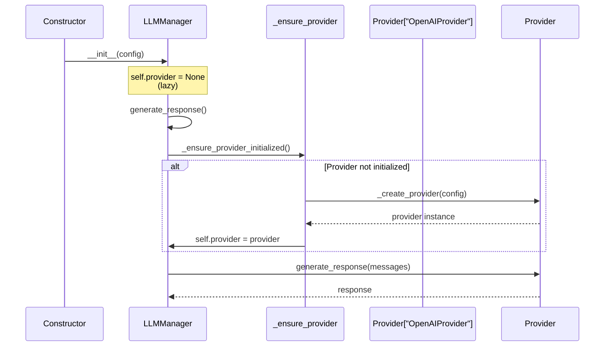

### LLMManager Lazy Provider

- Provider set to `None` in constructor: [orchestrator/core/llm/manager.py:421]()
- Lazy initialization check: [orchestrator/core/llm/manager.py:586-589]()
- Called before every request: [orchestrator/core/llm/manager.py:650]()

### EnhancedOrchestratorService Lazy LLM

- Constructor catches initialization errors: [orchestrator/modules/orchestrator/service.py:73-77]()
- Lazy retry mechanism: [orchestrator/modules/orchestrator/service.py:111-123]()
- Called at workflow start: [orchestrator/modules/orchestrator/service.py:146-147]()

**Sources**: [orchestrator/core/llm/manager.py:369-424](), [orchestrator/modules/orchestrator/service.py:111-123]()

---

## Credential Resolution Pattern

The `LLMManager` implements a 6-level credential resolution strategy with multiple fallback mechanisms. This ensures robustness when credentials are named inconsistently or stored in different environments.

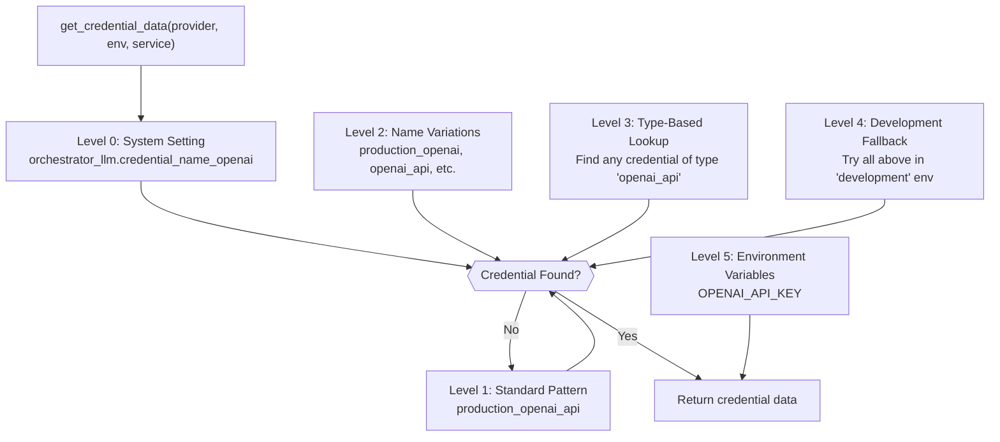

### Resolution Levels

**Level 0 - Explicit System Setting** (MVP feature):
- Check setting: [orchestrator/core/llm/manager.py:151-169]()
- Setting key format: `{category}.credential_name_{provider}`
- Example: `orchestrator_llm.credential_name_openai = "development_openai"`

**Level 1 - Standard Naming Pattern**:
- Primary format: `{environment}_{provider}_api`
- Example: `production_openai_api`
- Code: [orchestrator/core/llm/manager.py:199-208]()

**Level 2 - Name Variations**:
- Without `_api` suffix: `production_openai`
- Simple provider name: `openai`, `OpenAI`, `Openai`
- Special handling for HuggingFace capitalization
- Code: [orchestrator/core/llm/manager.py:211-230]()

**Level 3 - Type-Based Lookup**:
- Query credentials table by `credential_type`
- Find any active credential matching provider type
- Code: [orchestrator/core/llm/manager.py:256-292]()

**Level 4 - Development Fallback**:
- If production env fails, retry all above in `development` env
- Code: [orchestrator/core/llm/manager.py:295-342]()

**Level 5 - Environment Variables**:
- Last resort: check environment variables like `OPENAI_API_KEY`
- Code: [orchestrator/core/llm/manager.py:534-547]()

### Credential Type Mapping

| Provider | Credential Type | Primary Key Field |
|----------|----------------|-------------------|
| `openai` | `openai_api` | `api_key` |
| `anthropic` | `anthropic_api` | `api_key` |
| `google` | `google_api` | `api_key` |
| `azure` | `azure_openai` | `api_key`, `endpoint_url` |
| `huggingface` | `huggingface_api` | `api_token` |
| `aws_bedrock` | `aws_bedrock_api` | `bedrock_api_key` or `aws_access_key_id` |
| `grok` | `xai_api` | `api_key` |
| `openrouter` | `openrouter_api` | `api_key` |

**Sources**: [orchestrator/core/llm/manager.py:123-353](), [orchestrator/core/llm/manager.py:181-197]()

---

## Service Settings Resolution

Services load configuration from system settings with fallback to environment variables. The `SERVICE_CATEGORY_MAP` maps service names to settings categories.

### Service Category Mapping

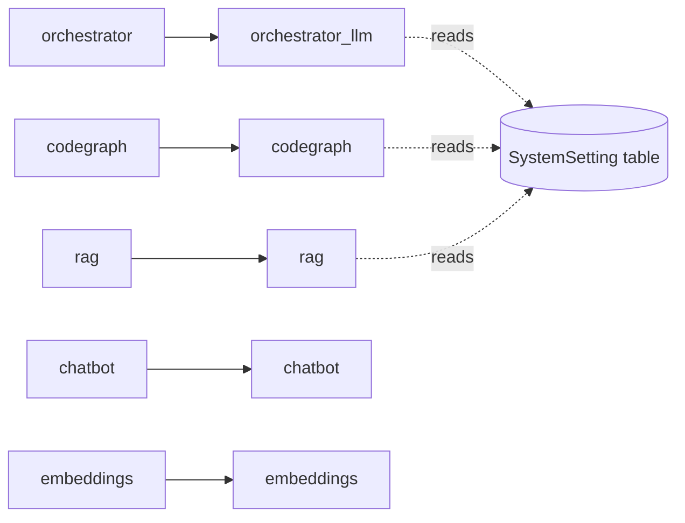

**Mapping definition**: [orchestrator/core/llm/manager.py:30-41]()

### Settings Retrieval Flow

1. **Service name** → **Category name** via `SERVICE_CATEGORY_MAP`
2. Query `SystemSetting` table: `category = category_name, key = setting_key`
3. Fallback to `config.py` constants if not found
4. Fallback to provider-specific defaults

Example for `orchestrator` service:
- Category: `orchestrator_llm`
- Keys: `llm_provider`, `llm_model`, `temperature`, `max_tokens`
- Implementation: [orchestrator/core/llm/manager.py:86-117]()

**Sources**: [orchestrator/core/llm/manager.py:30-117]()

---

## Manager Pattern: LLMManager

The `LLMManager` abstracts provider complexity and implements automatic fallback when models are unavailable.

### Provider Abstraction

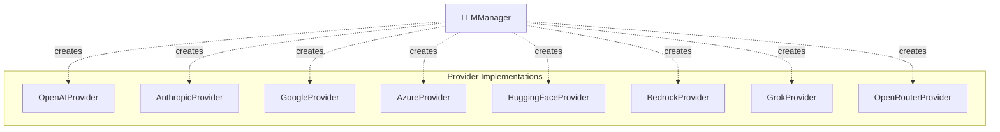

- Provider factory: [orchestrator/core/llm/manager.py:591-611]()
- Provider enum: [orchestrator/core/llm/manager.py:22-25]()

### Automatic Model Fallback

When a configured model returns a "dead model" error (404, "no endpoints found", "model not found"), the manager automatically retries with a fallback model on the same provider.

**Dead model detection patterns**:
- Regex patterns: [orchestrator/core/llm/manager.py:567-573]()
- Detection method: [orchestrator/core/llm/manager.py:613-619]()

**Fallback model resolution**:
1. Check user-configured fallback in system settings: `{category}.fallback_model`
2. Use provider-specific default (e.g., `gpt-4o-mini` for OpenAI)
3. Default fallbacks: [orchestrator/core/llm/manager.py:576-584]()

**Fallback execution flow**:
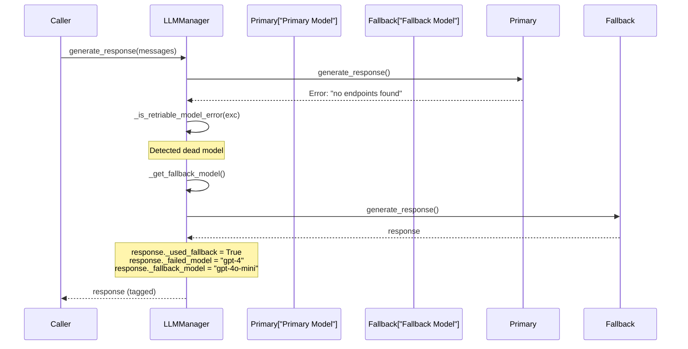

**Implementation**: [orchestrator/core/llm/manager.py:643-691]()

**Sources**: [orchestrator/core/llm/manager.py:355-728]()

---

## Pipeline Executor Pattern

The `WorkflowPipeline` implements a composable stage executor that runs dynamic subsets of stages determined by configuration. This replaces monolithic execution functions with a flexible, testable pipeline.

### Pipeline Architecture

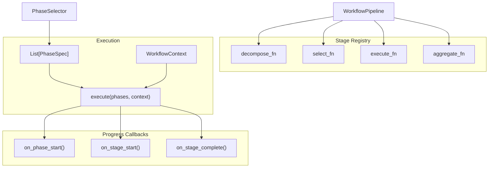

**Sources**: [orchestrator/modules/orchestrator/pipeline.py:134-279]()

### Stage Registration

Services register stage functions by name:
- Registration method: [orchestrator/modules/orchestrator/pipeline.py:155-157]()
- Stage function signature: [orchestrator/modules/orchestrator/pipeline.py:104]()

### WorkflowContext

Shared context object passed through the pipeline. Each stage reads from and writes to this context.

**Key fields**:
- Workflow metadata: `workflow_id`, `execution_id`, `workspace_id`, `task_description`
- Stage results: `decomposition`, `agent_assignments`, `execution_results`, `aggregated_results`
- Infrastructure: `db`, `execution`, `mem0_client`, `stage_tracker`
- Tracking: `stage_results` (list of `StageResult`)

**Definition**: [orchestrator/modules/orchestrator/pipeline.py:62-101]()

### Error Handling Strategies

| Strategy | Behavior | Use Case |
|----------|----------|----------|
| `ABORT` | Stop pipeline on any error | Critical workflows requiring atomicity |
| `SKIP` | Skip failed stage, continue | Non-critical stages with graceful degradation |
| `RETRY` | Retry once, then skip | Transient failures (network, rate limits) |
| `REPLAN` | Re-evaluate approach | Adaptive workflows |

**Enum definition**: [orchestrator/modules/orchestrator/pipeline.py:42-47]()

**Error handling logic**: [orchestrator/modules/orchestrator/pipeline.py:223-261]()

**Sources**: [orchestrator/modules/orchestrator/pipeline.py:42-279]()

---

## Progress Tracking Pattern

Services emit progress events via protocol-based callbacks. This decouples progress reporting from business logic.

### Progress Callback Protocol

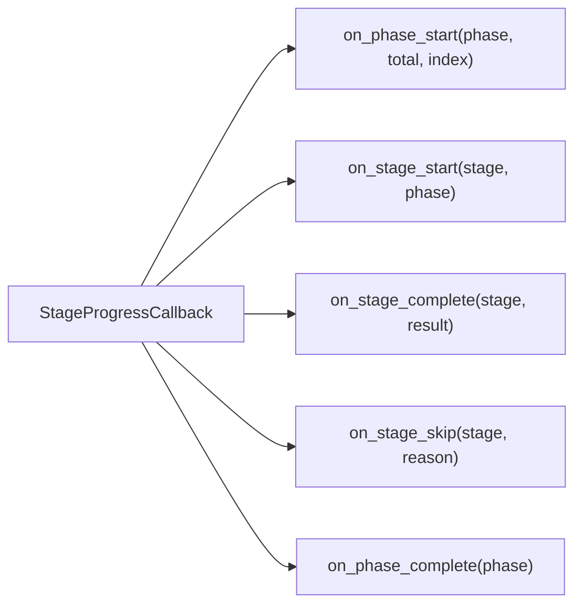

**Protocol definition**: [orchestrator/modules/orchestrator/pipeline.py:107-113]()

### Default vs Custom Implementations

**DefaultProgressCallback** logs to console:
- Implementation: [orchestrator/modules/orchestrator/pipeline.py:116-131]()

**WorkflowStageTracker** emits SSE events:
- SSE emission: [orchestrator/api/workflows.py:164-184]()
- Phase tracking: [orchestrator/api/workflows.py:91-127]()
- Stage tracking: [orchestrator/api/workflows.py:129-162]()

**Sources**: [orchestrator/modules/orchestrator/pipeline.py:107-131](), [orchestrator/api/workflows.py:40-185]()

---

## Tool Execution Deduplication Pattern

`ToolExecutionTracker` prevents infinite loops in tool calling by tracking exact and semantic duplicates.

### Tracking Mechanisms

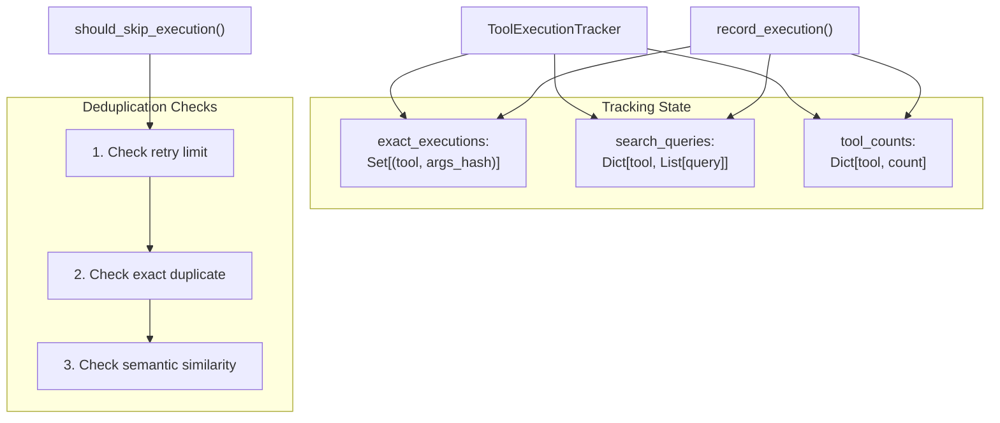

### Deduplication Strategies

**1. Exact Matching**: Hash tool arguments, prevent identical calls
- Implementation: [orchestrator/consumers/chatbot/service.py:126-153]()

**2. Semantic Similarity**: For search tools, normalize queries and use fuzzy matching
- Normalization: [orchestrator/consumers/chatbot/service.py:46-53]()
- Similarity check: [orchestrator/consumers/chatbot/service.py:56-73]()
- Query extraction: [orchestrator/consumers/chatbot/service.py:76-85]()

**3. Per-Tool Retry Limits**: Different limits per tool type
- Limits table: [orchestrator/consumers/chatbot/service.py:105-116]()
- Enforcement: [orchestrator/consumers/chatbot/service.py:141-146]()

### Usage in StreamingChatService

The tracker is instantiated per conversation turn and checked before each tool execution:

- Instance creation: [orchestrator/consumers/chatbot/service.py:891]()
- Check before execution: [orchestrator/consumers/chatbot/service.py:915-924]()
- Record after execution: [orchestrator/consumers/chatbot/service.py:1028-1029]()

**Sources**: [orchestrator/consumers/chatbot/service.py:42-186]()

---

## Service Instantiation Patterns

### Constructor Injection

Services receive dependencies in constructor:

```python
class ChatService:
    def __init__(self, db: Session):
        self.db = db
```

**Example**: [orchestrator/consumers/chatbot/service.py:194-195]()

### Factory Functions

Factory functions hide service creation complexity:

```python
def get_action_executor():
    from modules.agents.services.agent_action_executor import get_action_executor as _get_executor
    return _get_executor()
```

**Examples**: [orchestrator/modules/agents/factory/agent_factory.py:38-48]()

### Singleton Services

Some services use module-level singletons (e.g., RAG service, monitoring service):

```python
_monitoring_service = None

def get_monitoring_service():
    global _monitoring_service
    if _monitoring_service is None:
        _monitoring_service = MonitoringService()
    return _monitoring_service
```

**Sources**: [orchestrator/modules/agents/factory/agent_factory.py:38-53]()

---

## Best Practices Summary

| Pattern | Benefit | When to Use |
|---------|---------|-------------|
| Database Session Injection | Transaction control, testability | All services that access database |
| Service Composition | Separation of concerns, reusability | Complex services needing specialized functionality |
| Lazy Initialization | Fast startup, fail gracefully | Expensive operations (LLM providers, credential lookup) |
| Credential Resolution | Robustness, flexibility | Services using external APIs |
| Manager Pattern | Provider abstraction, consistent interface | Services wrapping multiple implementations |
| Pipeline Executor | Composability, testability | Multi-stage workflows with dynamic execution |
| Progress Callbacks | Decoupled progress reporting | Long-running operations requiring real-time updates |
| Deduplication Tracking | Prevent infinite loops | Tool calling, search operations |

**Sources**: [orchestrator/consumers/chatbot/service.py:1-1300](), [orchestrator/modules/agents/factory/agent_factory.py:1-1300](), [orchestrator/core/llm/manager.py:1-800](), [orchestrator/modules/orchestrator/pipeline.py:1-306]()

---