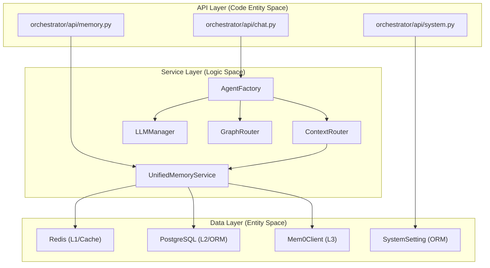
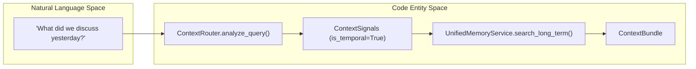

# Service Layer Patterns

Relevant source files

The following files were used as context for generating this wiki page:

- [frontend/tsconfig.tsbuildinfo](frontend/tsconfig.tsbuildinfo)
- [orchestrator/config.py](orchestrator/config.py)
- [orchestrator/main.py](orchestrator/main.py)
- [orchestrator/modules/memory/context_router.py](orchestrator/modules/memory/context_router.py)
- [orchestrator/modules/memory/unified_memory_service.py](orchestrator/modules/memory/unified_memory_service.py)
- [orchestrator/tests/test_unified_memory.py](orchestrator/tests/test_unified_memory.py)
- [scripts/ralph/IMPLEMENTATION_PLAN.md](scripts/ralph/IMPLEMENTATION_PLAN.md)
- [scripts/ralph/prd.json](scripts/ralph/prd.json)
- [scripts/ralph/progress.txt](scripts/ralph/progress.txt)

This document describes the architectural patterns used in the service layer of Automatos AI. The service layer provides business logic, orchestration, and resource management, sitting between API routers and the data persistence layer. It emphasizes the use of singleton services, dependency injection, and complex service composition.

---

## Service Layer Architecture

The service layer implements the business logic tier in a three-layer architecture. Services consume database models, external APIs, and other services, while being consumed by API routers (FastAPI) and background workers.

### Core Service Interaction

The following diagram maps high-level system components to their corresponding code entities and shows the flow of data through the service layer, bridging Natural Language Space to Code Entity Space.

**Sources**: [orchestrator/main.py:36-113](), [orchestrator/modules/memory/unified_memory_service.py:154-188](), [orchestrator/modules/memory/context_router.py:5-24](), [orchestrator/modules/agents/factory/agent_factory.py:158-175]()

---

## Singleton and Instance Patterns

Automatos AI utilizes the Singleton pattern via `get_instance()` methods and centralized factory functions to ensure consistent state and efficient resource usage across the application.

### Singleton Implementation (`get_instance`)

Core services use class-level `_instance` variables to manage shared state across the lifecycle of the FastAPI application.

- **Unified Memory Service**: `UnifiedMemoryService.get_instance()` ensures that only one shared `Mem0Client` and one Redis client connection pool are active at any time [orchestrator/modules/memory/unified_memory_service.py:163-170]().
- **Graph Router**: Implements a `get_graph_router()` factory to provide a singleton instance for tool routing logic [scripts/ralph/progress.txt:110-110]().
- **Agent Runtime Management**: `AgentFactory` maintains an internal `_agents` dictionary to cache `AgentRuntime` objects, preventing redundant LLM manager initializations [orchestrator/modules/agents/factory/agent_factory.py:215-225]().

### Instance Management Functions

| Function | Service Provided | Implementation Detail |
| :--- | :--- | :--- |
| `get_unified_memory_service()` | `UnifiedMemoryService` | Wraps `get_instance()` for memory operations [orchestrator/modules/memory/unified_memory_service.py:16-18]() |
| `get_monitoring_service()` | Monitoring Logic | Platform-level monitoring instance [orchestrator/modules/agents/factory/agent_factory.py:37-40]() |
| `get_redis_client()` | Redis Connection | Shared client for L1 session and L3 caching [orchestrator/modules/memory/unified_memory_service.py:184-186]() |

**Sources**: [orchestrator/modules/memory/unified_memory_service.py:154-188](), [orchestrator/modules/agents/factory/agent_factory.py:37-44](), [scripts/ralph/progress.txt:102-113]()

---

## Dependency Injection & Service Composition

Automatos AI uses composition to bridge different domains. Services are frequently composed to create complex pipelines, such as the `ContextRouter` which integrates with the `UnifiedMemoryService`.

### Memory Service Composition (PRD-79)

The `UnifiedMemoryService` encapsulates the 5-layer memory stack, composing multiple data backends into a single interface:

| Component | Responsibility | Code Reference |
| :--- | :--- | :--- |
| `MemoryNamespace` | Standardizes scoped IDs for Mem0 and Redis | [orchestrator/modules/memory/unified_memory_service.py:39-118]() |
| `SessionMemory` | Manages L1 working memory (Redis) | [orchestrator/modules/memory/unified_memory_service.py:124-149]() |
| `Mem0Client` | Interfaces with L3 long-term memory | [orchestrator/modules/memory/unified_memory_service.py:178-181]() |

### Context Assembly Pipeline

The `ContextRouter` demonstrates service composition by analyzing queries and orchestrating retrieval across memory layers:
1. **Signal Detection**: Uses regex patterns to detect `is_temporal`, `is_personal_fact`, etc. [orchestrator/modules/memory/context_router.py:40-56]().
2. **Context Retrieval**: Calls `UnifiedMemoryService` to fetch L1/L2/L3 data based on detected signals [orchestrator/modules/memory/context_router.py:10-12]().
3. **Budget Management**: Assembles a `ContextBundle` constrained by token budgets defined in `Config` [orchestrator/modules/memory/context_router.py:62-79](), [orchestrator/config.py:90-95]().

**Sources**: [orchestrator/modules/memory/unified_memory_service.py:1-32](), [orchestrator/modules/memory/context_router.py:1-33](), [orchestrator/config.py:82-124]()

---

## Service Layer Data Flow

The flow of data through services is often governed by "Signals" and "Bundles". The following diagram illustrates the lifecycle of a memory retrieval request.

**Sources**: [orchestrator/modules/memory/context_router.py:14-24](), [orchestrator/modules/memory/unified_memory_service.py:18-21]()

---

## Lazy Initialization & Resolution Patterns

Expensive resources or environment-dependent configurations are resolved lazily to ensure the system remains portable and responsive.

### API Key Resolution Strategy

The `AgentFactory` implements a 3-tier lazy resolution pattern for LLM API keys:
1. **BYOK (Bring Your Own Key)**: Checked first from the `Agent` model's own credentials [orchestrator/modules/agents/factory/agent_factory.py:281-285]().
2. **Platform Credentials**: Checked second from the `CredentialStore` [orchestrator/modules/agents/factory/agent_factory.py:287-291]().
3. **Environment Variables**: Final fallback to system-level `.env` values [orchestrator/modules/agents/factory/agent_factory.py:293-295]().

### Graph-Based Tool Routing

The `GraphRouter` service lazily expansions entry nodes through `tool_routing_edges` to build execution chains [scripts/ralph/progress.txt:102-104](). It utilizes a fallback pattern: if the graph is empty or a database error occurs, it returns single-action chains based on embedding scores [scripts/ralph/progress.txt:108-109]().

**Sources**: [orchestrator/modules/agents/factory/agent_factory.py:270-300](), [scripts/ralph/progress.txt:92-113]()

---

## Service Initialization & Background Jobs

The platform uses a robust seeding pattern and background job scheduling to maintain service health.

- **Background Memory Jobs**: The `UnifiedMemoryService` relies on background intervals for session consolidation (L1→L2), Ebbinghaus decay, and L2→L3 promotion [orchestrator/config.py:110-115]().
- **System Settings Seeding**: The `seed_system_settings` script ensures that categories like `GENERAL` and `ORCHESTRATOR_LLM` have valid defaults [orchestrator/core/seeds/seed_system_settings.py:8-11]().
- **Graphify Archival**: A monthly job (PRD-131d) folds aged L2+L3 memories into the workspace knowledge graph [orchestrator/config.py:116-123]().

**Sources**: [orchestrator/config.py:82-124](), [orchestrator/core/seeds/seed_system_settings.py:8-20]()

---