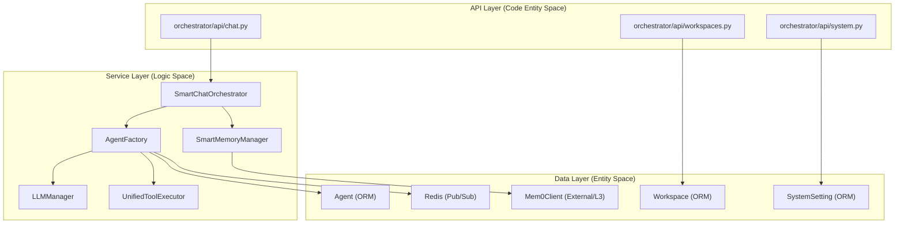
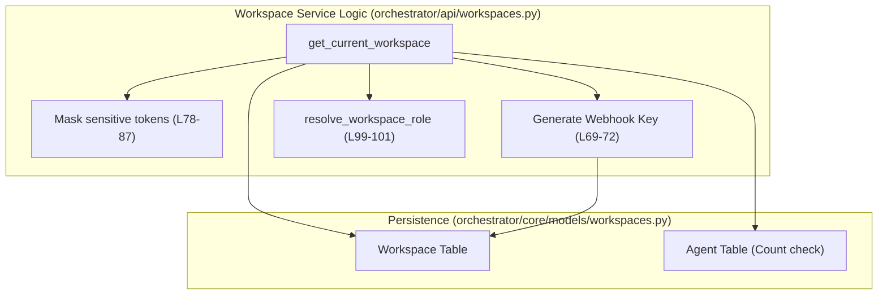

# Service Layer Patterns

<details>
<summary>Relevant source files</summary>

The following files were used as context for generating this wiki page:

- [docs/PRDS/PRD-227-BOARD-LIGHT-UP.md](docs/PRDS/PRD-227-BOARD-LIGHT-UP.md)
- [docs/PRDS/PRD-WAVE-AUTO-MANAGER.md](docs/PRDS/PRD-WAVE-AUTO-MANAGER.md)
- [orchestrator/alembic/versions/prd201_s1_message_context_trace.py](orchestrator/alembic/versions/prd201_s1_message_context_trace.py)
- [orchestrator/core/context_guard.py](orchestrator/core/context_guard.py)
- [orchestrator/core/llm/prompt_cache.py](orchestrator/core/llm/prompt_cache.py)
- [orchestrator/core/llm/request_scope.py](orchestrator/core/llm/request_scope.py)
- [orchestrator/core/observability/tracer.py](orchestrator/core/observability/tracer.py)
- [orchestrator/modules/context/result.py](orchestrator/modules/context/result.py)
- [orchestrator/modules/context/sections/base.py](orchestrator/modules/context/sections/base.py)
- [orchestrator/services/audit_retention.py](orchestrator/services/audit_retention.py)
- [orchestrator/services/board_events.py](orchestrator/services/board_events.py)
- [orchestrator/services/chat_messenger.py](orchestrator/services/chat_messenger.py)
- [orchestrator/services/orchestration_state.py](orchestrator/services/orchestration_state.py)
- [orchestrator/tests/conftest.py](orchestrator/tests/conftest.py)
- [orchestrator/tests/test_board_dispatch.py](orchestrator/tests/test_board_dispatch.py)
- [orchestrator/tests/test_board_sse_listen_notify.py](orchestrator/tests/test_board_sse_listen_notify.py)
- [orchestrator/tests/test_context_guard.py](orchestrator/tests/test_context_guard.py)
- [orchestrator/tests/test_p2w2_audit_retention.py](orchestrator/tests/test_p2w2_audit_retention.py)
- [orchestrator/tests/test_p2w2_governance_audit.py](orchestrator/tests/test_p2w2_governance_audit.py)
- [orchestrator/tests/test_p2w2_governance_policy_budget.py](orchestrator/tests/test_p2w2_governance_policy_budget.py)
- [orchestrator/tests/test_prd164_flywheel.py](orchestrator/tests/test_prd164_flywheel.py)
- [orchestrator/tests/test_prd204_run_verdict.py](orchestrator/tests/test_prd204_run_verdict.py)

</details>


This document describes the architectural patterns used in the service layer of Automatos AI. The service layer provides business logic, orchestration, and resource management, sitting between API routers and the data persistence layer.

---

## Service Layer Architecture

The service layer implements the business logic tier in a three-layer architecture. Services consume database models, external APIs, and other services, while being consumed by API routers (FastAPI) and background workers.

### Core Service Interaction

The following diagram maps high-level system components to their corresponding code entities and shows the flow of data through the service layer.



**Sources**: [orchestrator/api/chat.py:107-107](), [orchestrator/api/workspaces.py:43-58](), [orchestrator/main.py:37-81]()

---

## Singleton and Instance Patterns

Automatos AI utilizes the Singleton pattern and centralized factory functions for core registry and stateful services to ensure consistent state and efficient resource usage across the application.

### Singleton Implementation (`get_instance`)

Services often use factory functions that act as singletons or manage shared state across the lifecycle of the FastAPI application.

- **Centralized Config**: The `Config` class in `orchestrator/config.py` acts as the single source of truth for all environment variables, ensuring `os.getenv()` is only called in one place [orchestrator/config.py:28-32]().
- **Agent Runtime Management**: `AgentFactory` maintains an internal `_agents` dictionary to cache `AgentRuntime` objects, preventing redundant LLM manager initializations.
- **Monitoring**: `get_monitoring_service()` provides a platform-level monitoring instance used across agent executions.
- **Tool Execution**: `get_unified_tool_executor()` lazily initializes the routing and execution logic for tools.

**Sources**: [orchestrator/config.py:1-7](), [orchestrator/config.py:28-32](), [orchestrator/main.py:28-30]()

---

## Dependency Injection & Service Composition

Automatos AI uses composition to bridge different domains. Services are frequently composed to create complex pipelines, such as the `AgentFactory` which ties together LLM configuration, tool execution, and metadata management.

### Composition in Agent Execution

The `AgentFactory` composes several specialized entities to facilitate an agent's lifecycle:

| Component | Role | Code Reference |
| :--- | :--- | :--- |
| `AgentMetadata` | Encapsulates user-defined configuration and skills | [orchestrator/core/models/core.py:24-24]() |
| `ModelConfiguration` | Standardizes LLM parameters (temp, tokens, provider) | [orchestrator/core/llm/defaults.py:25-26]() |
| `UnifiedToolExecutor` | Routes and executes tool calls during agent loops | [orchestrator/main.py:60-60]() |

### System Settings Composition

The system settings architecture demonstrates a compositional approach to platform configuration, organizing settings into logical categories that services consume at runtime:
- **Orchestrator Settings**: Managed via `SystemLLMSettingsTab`, combining LLM configuration, personality (Soul), and Heartbeat autonomous settings [frontend/components/settings/SystemLLMSettingsTab.tsx:5-11]().
- **Workspace Context**: The `RequestContext` injected via `get_request_context_hybrid` provides a unified way for services to access `workspace_id` and user roles [orchestrator/api/workspaces.py:44-46]().

**Sources**: [frontend/components/settings/SystemLLMSettingsTab.tsx:5-11](), [orchestrator/api/workspaces.py:43-58](), [orchestrator/core/llm/defaults.py:25-26]()

---

## Lazy Initialization & Resolution Patterns

Expensive resources or environment-dependent configurations are resolved lazily to ensure the system remains portable and responsive.

### API Key Resolution Strategy

The platform implements a multi-tier resolution pattern for LLM API keys:
1. **BYOK (Bring Your Own Key)**: Checked first from workspace-specific settings [orchestrator/api/workspaces.py:186-200]().
2. **Platform Credentials**: Managed via `api/credentials.py` [orchestrator/main.py:58-58]().
3. **Environment Variables**: Final fallback to system-level `.env` values defined in `Config` [orchestrator/config.py:37-42]().

### Database Connection Resolution

The `Config.get_database_url()` method lazily computes the connection string, enforcing `sslmode=require` only for non-local hosts to ensure security in production while maintaining ease of use in local development [orchestrator/config.py:48-58]().

**Sources**: [orchestrator/config.py:48-58](), [orchestrator/api/workspaces.py:186-200](), [orchestrator/config.py:37-42]()

---

## Service State Management

Services manage both ephemeral runtime state and persistent database state, often bridging the two during high-frequency operations like agent execution.

### Workspace Context Persistence

The `api/workspaces.py` router demonstrates how service-level logic manages workspace state, such as auto-generating `webhook_key` for legacy workspaces [orchestrator/api/workspaces.py:69-72]() and masking sensitive integration tokens before returning them to the frontend [orchestrator/api/workspaces.py:78-87]().



**Sources**: [orchestrator/api/workspaces.py:43-118](), [orchestrator/api/workspaces.py:69-87]()

### Orchestration State Transitions

The `orchestration_state.py` service manages state transitions for `OrchestrationRun` and `OrchestrationTask` entities. It enforces valid transitions, updates timestamps, and records `OrchestrationEvent`s in the same transaction. This "dual-write" pattern ensures data consistency and provides an immutable audit trail of state changes. Optimistic locking is used to detect concurrent modifications, raising a `ConflictError` if a stale data error occurs.

```mermaid
graph TD
    A[Caller (e.g., CoordinatorService)] --> B{transition_task / transition_run};
    B --> C{Validate Transition};
    C -- Invalid --> D[InvalidTransitionError];
    C -- Valid --> E[Update Task/Run State & Timestamps];
    E --> F[Create OrchestrationEvent];
    F --> G{db.flush()};
    G -- StaleDataError --> H[ConflictError];
    G -- Success --> I[Return TaskTransition/RunTransition];
```
**Title**: Orchestration State Transition Flow
**Sources**: [orchestrator/services/orchestration_state.py:1-15](), [orchestrator/services/orchestration_state.py:84-185](), [orchestrator/services/orchestration_state.py:193-211]()

### Chat Messenger for Background Messages

The `chat_messenger.py` service provides a robust mechanism for background processes (e.g., watchers, scheduled tasks) to post messages into user conversations. It handles the resolution of target chats, ensuring messages are delivered to the correct workspace and user, falling back to a dedicated "Auto" chat thread if the specified chat is invalid or inaccessible. It also includes safeguards to prevent cross-user message leakage.

```mermaid
graph TD
    A[Background Producer] --> B[deliver_background_message];
    B --> C{post_background_message};
    C --> D{_resolve_user_int_id};
    D -- No User ID --> E[Log Warning];
    D -- User ID --> F{Resolve Target Chat};
    F -- Valid Chat ID & Owner Match --> G[Use Provided Chat];
    F -- Invalid Chat ID / Owner Mismatch --> H{find_or_create_auto_chat};
    H --> I[Create/Retrieve Auto Chat];
    G --> J[ChatService.add_message];
    I --> J;
    J --> K[db.commit()];
    K --> L[notify_chat_event];
    L --> M[Postgres LISTEN/NOTIFY];
    M --> N[SSE Stream to Frontend];
    C -- Failure --> O[Log Error (fail-soft)];
```
**Title**: Background Chat Message Delivery Flow
**Sources**: [orchestrator/services/chat_messenger.py:1-24](), [orchestrator/services/chat_messenger.py:41-48](), [orchestrator/services/chat_messenger.py:51-98](), [orchestrator/services/chat_messenger.py:121-131](), [orchestrator/services/chat_messenger.py:133-172]()

### Context Guard for LLM Calls

The `ContextGuard` in `core/context_guard.py` is a critical service for managing token usage before LLM calls. It prevents `context_length_exceeded` errors by dynamically compacting conversations when they approach the model's context limit. This involves counting tokens, resolving model-aware compaction thresholds, summarizing older turns, and flushing key facts to durable memory before discarding messages.

```mermaid
graph TD
    A[LLM Call Request] --> B{ContextGuard.check_and_compact};
    B --> C[Count Tokens in Messages];
    C --> D{Get Model Context Window};
    D --> E{Resolve Compaction Threshold};
    E -- Below Threshold --> F[Pass Messages Unchanged];
    E -- Above Threshold --> G[Compact Messages];
    G --> H[Summarize Older Turns];
    G --> I[Keep Recent Context];
    G --> J[Flush Key Facts to Durable Memory];
    J --> F;
    F --> K[Return (messages, was_compacted)];
```
**Title**: Context Guard Token Management Flow
**Sources**: [orchestrator/core/context_guard.py:1-28](), [orchestrator/core/context_guard.py:49-51](), [orchestrator/core/context_guard.py:87-109](), [orchestrator/core/context_guard.py:158-163]()

### Real-time Board Events

The `board_events.py` service enables real-time updates for the Command Center UI using PostgreSQL's `LISTEN/NOTIFY` mechanism. When a board task changes status, `notify_board_event` fires a `pg_notify` on the `board_events` channel. An `_SSEListener` thread, running a raw `psycopg2` connection, listens for these notifications and pushes them onto an `asyncio.Queue`. The `board_event_stream` then drains this queue and forwards the events as Server-Sent Events (SSE) to subscribed clients, ensuring sub-second UI updates. A similar mechanism exists for `notify_chat_event` to update chat interfaces.

```mermaid
graph TD
    A[Board Task Status Change] --> B{notify_board_event};
    B --> C[PostgreSQL: pg_notify("board_events", payload)];
    C --> D[_SSEListener Thread];
    D --> E[Raw psycopg2 LISTEN Connection];
    E -- Notification Received --> F[asyncio.Queue.put_nowait(payload)];
    F --> G[board_event_stream (AsyncIterator)];
    G --> H[SSE Client (Frontend Command Center)];
    I[Chat Message Landing] --> J{notify_chat_event};
    J --> C;
```
**Title**: Real-time Board and Chat Event Flow
**Sources**: [orchestrator/services/board_events.py:1-16](), [orchestrator/services/board_events.py:38-69](), [orchestrator/services/board_events.py:71-101](), [orchestrator/services/board_events.py:104-165]()

---

## Service Initialization & Seeding

The platform uses a robust seeding pattern to ensure that every workspace is initialized with a consistent set of core services and agents.

- **Auto Agent Seeding**: Every workspace receives exactly one "Auto" agent (slug `auto-{workspace_id}`) which serves as the default orchestrator and single source of truth for the workspace's LLM config and persona [orchestrator/core/seeds/seed_auto_agent.py:5-10]().
- **Skill Assignment**: Core skills like `platform-management` are idempotently assigned to system agents. The seeding process uses `pg_advisory_xact_lock` to prevent race conditions during concurrent workspace provisioning [orchestrator/core/seeds/seed_auto_agent.py:97-102]().
- **Onboarding Guard**: The `FirstLoginGuard` and `useAutoTour` hooks coordinate to ensure the "Welcome Modal" and Shepherd tours only fire for brand-new workspaces (where `is_new_workspace` is true) [frontend/components/onboarding/first-login-guard.tsx:20-24](), [frontend/hooks/use-auto-tour.ts:30-32]().

**Sources**: [orchestrator/core/seeds/seed_auto_agent.py:5-16](), [orchestrator/core/seeds/seed_auto_agent.py:97-102](), [frontend/components/onboarding/first-login-guard.tsx:20-28](), [frontend/hooks/use-auto-tour.ts:30-32]()

---