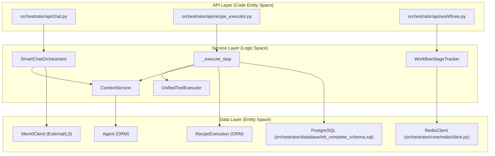
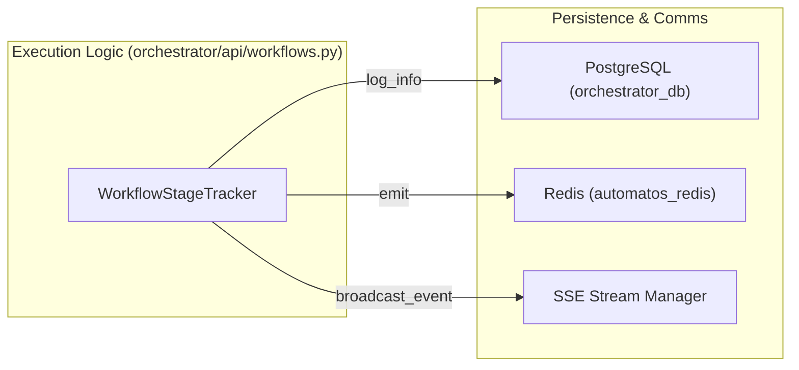

# Service Layer Patterns

Relevant source files

The following files were used as context for generating this wiki page:

- [README.md](README.md)
- [docker-compose.yml](docker-compose.yml)
- [docs/README.md](docs/README.md)
- [frontend/.dockerignore](frontend/.dockerignore)
- [frontend/Dockerfile](frontend/Dockerfile)
- [frontend/app/chat/page.tsx](frontend/app/chat/page.tsx)
- [frontend/next-env.d.ts](frontend/next-env.d.ts)
- [orchestrator/Dockerfile](orchestrator/Dockerfile)
- [orchestrator/alembic/versions/20260202_add_workspace_id_to_skills_patterns_models.py](orchestrator/alembic/versions/20260202_add_workspace_id_to_skills_patterns_models.py)
- [orchestrator/api/cloud_documents.py](orchestrator/api/cloud_documents.py)
- [orchestrator/api/context.py](orchestrator/api/context.py)
- [orchestrator/api/workflows.py](orchestrator/api/workflows.py)
- [orchestrator/core/llm/clients/openai_embedding.py](orchestrator/core/llm/clients/openai_embedding.py)
- [orchestrator/core/llm/rerank_manager.py](orchestrator/core/llm/rerank_manager.py)
- [orchestrator/core/redis/client.py](orchestrator/core/redis/client.py)
- [orchestrator/core/services/__init__.py](orchestrator/core/services/__init__.py)
- [orchestrator/modules/tools/services/__init__.py](orchestrator/modules/tools/services/__init__.py)
- [orchestrator/requirements.txt](orchestrator/requirements.txt)

This document describes the architectural patterns used in the service layer of Automatos AI. The service layer provides business logic, orchestration, and resource management, sitting between API routers and the data persistence layer.

---

## Service Layer Architecture

The service layer implements the business logic tier in a three-layer architecture. Services consume database models, external APIs, and other services, while being consumed by API routers (FastAPI) and background workers.

### Core Service Interaction

The following diagram maps high-level system components to their corresponding code entities and shows the flow of data through the service layer.

**Sources**: [orchestrator/api/workflows.py:37-70](), [orchestrator/core/redis/client.py:14-31](), [orchestrator/api/context.py:53-83](), [orchestrator/database/init_complete_schema.sql:1-50]()

---

## Singleton and Instance Patterns

Automatos AI utilizes the Singleton pattern for core registry and stateful services to ensure consistent state and efficient resource usage across the application.

### Singleton Implementation (`get_instance`)

Services like the `RedisClient` and `MonitoringService` use factory functions or singleton-like patterns to manage lifecycle and configuration injection.

- **Redis Singleton**: `get_redis_client()` provides a global, lazy-initialized instance that supports both `REDIS_URL` (for Railway/Heroku) and individual environment variables [orchestrator/core/redis/client.py:149-197]().
- **Monitoring Singleton**: `get_monitoring_service()` returns the global instance of `MonitoringService` for platform-level health tracking [orchestrator/core/services/__init__.py:8-14]().
- **Audit Singleton**: `get_audit_service()` manages the `AuditService` lifecycle for recording system events [orchestrator/core/services/__init__.py:10-19]().

**Sources**: [orchestrator/core/redis/client.py:149-197](), [orchestrator/core/services/__init__.py:8-20]()

---

## Dependency Injection & Service Composition

Automatos AI uses composition to bridge different domains. Services are frequently composed to create complex pipelines, such as the `RAGService` which interacts with database sessions and embedding providers.

### Composition in Context Engineering

The `RAGService` is injected into API routes via FastAPI's `Depends` mechanism, allowing it to interact with the database and vector store:

| Component | Role | Code Reference |
| :--- | :--- | :--- |
| `RAGService` | Core logic for retrieval and stats | [orchestrator/api/context.py:86-86]() |
| `Session` | Database persistence (Postgres) | [orchestrator/api/context.py:87-87]() |
| `get_rag_service` | Factory for RAG dependency injection | [orchestrator/api/context.py:20-20]() |

### Workflow Stage Composition

The `WorkflowStageTracker` composes `RedisClient` and a `stream_manager` to handle multi-channel event broadcasting [orchestrator/api/workflows.py:70-73](). It maps high-level "Phases" (PLAN, PREPARE, EXECUTE, EVALUATE, LEARN) to specific underlying stages [orchestrator/api/workflows.py:62-68]().

**Sources**: [orchestrator/api/context.py:84-105](), [orchestrator/api/workflows.py:53-78]()

---

## Lazy Initialization Pattern

Expensive resources, such as Redis connections or specific service connectors, are initialized only when first requested. This prevents application startup delays and handles optional modules gracefully.

### Lazy Redis Loading

The `get_redis_client` function defers the creation of the `RedisClient` until a service actually requires a connection.

- **Initial State**: The global `_redis_client` is set to `None` [orchestrator/core/redis/client.py:138-138]().
- **Initialization Trigger**: On first call, it parses `config.REDIS_URL` or fallback environment variables [orchestrator/core/redis/client.py:156-168]().
- **Connection Testing**: It immediately runs `test_connection()` during initialization to ensure the service is available [orchestrator/core/redis/client.py:145-145]().

**Sources**: [orchestrator/core/redis/client.py:137-197]()

---

## Service Reliability Patterns

Services interacting with external systems implement reliability patterns to handle timeouts and connection failures.

### Redis Connection Management

The `RedisClient` uses a `ConnectionPool` with a `max_connections` limit to prevent resource exhaustion [orchestrator/core/redis/client.py:22-29](). It also provides a synchronous `pubsub_client` context manager that ensures connections are closed even if an exception occurs during message processing [orchestrator/core/redis/client.py:37-46]().

### Async Streaming Reliability

For real-time updates, the `get_async_pubsub` method utilizes `aioredis` to provide non-blocking message delivery, essential for FastAPI's asynchronous event loop [orchestrator/core/redis/client.py:48-64]().

**Sources**: [orchestrator/core/redis/client.py:22-64]()

---

## Data Flow & Persistence

Services interact with the database using SQLAlchemy sessions, typically injected via FastAPI dependencies (`get_db`) or passed through service constructors.

### Workflow Event Pipeline

The `WorkflowStageTracker` manages the state of long-running executions and emits updates via SSE and Redis.

- **Phase Management**: Phases are marked as started/completed with millisecond-precision duration tracking [orchestrator/api/workflows.py:88-124]().
- **Multi-Channel Emission**: The `_emit` method ensures that every status update is sent to both the internal `stream_manager` (for active SSE connections) and Redis (for cross-worker synchronization) [orchestrator/api/workflows.py:161-179]().

**Sources**: [orchestrator/api/workflows.py:88-179](), [orchestrator/core/redis/client.py:91-120](), [orchestrator/api/context.py:55-83]()

---