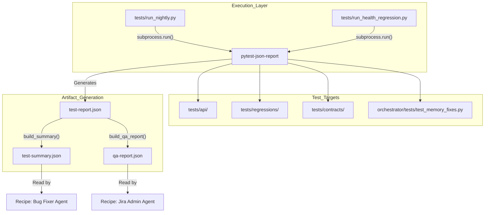
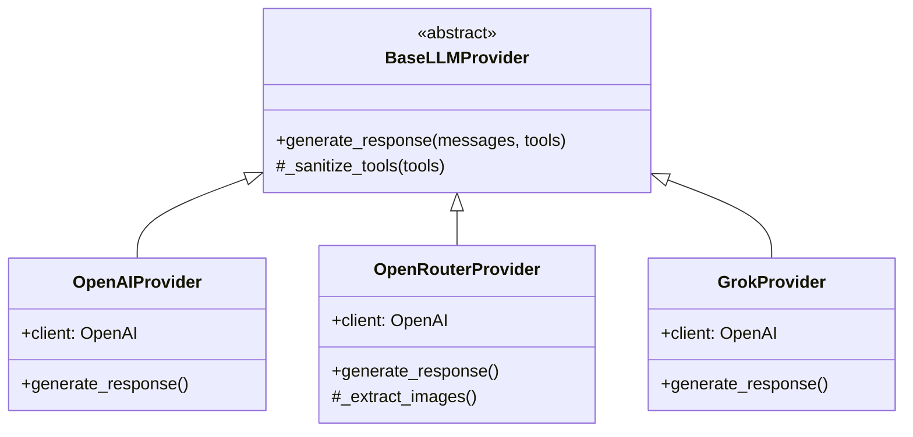

# Testing Infrastructure

Relevant source files

The following files were used as context for generating this wiki page:

- [docs/PRDS/71-UNIFIED-SKILLS-ARCHITECTURE.md](docs/PRDS/71-UNIFIED-SKILLS-ARCHITECTURE.md)
- [docs/PRDS/78-AUTONOMOUS-TEST-COVERAGE-QUALITY-MESH.md](docs/PRDS/78-AUTONOMOUS-TEST-COVERAGE-QUALITY-MESH.md)
- [orchestrator/core/llm/clients/azure_client.py](orchestrator/core/llm/clients/azure_client.py)
- [orchestrator/core/llm/clients/grok_client.py](orchestrator/core/llm/clients/grok_client.py)
- [orchestrator/core/llm/clients/openai_client.py](orchestrator/core/llm/clients/openai_client.py)
- [orchestrator/core/llm/clients/openrouter_client.py](orchestrator/core/llm/clients/openrouter_client.py)
- [orchestrator/tests/test_memory_fixes.py](orchestrator/tests/test_memory_fixes.py)
- [tests/RECIPE_RUNNERS.md](tests/RECIPE_RUNNERS.md)
- [tests/api/__init__.py](tests/api/__init__.py)
- [tests/api/helpers.py](tests/api/helpers.py)
- [tests/api/test_agents.py](tests/api/test_agents.py)
- [tests/api/test_analytics.py](tests/api/test_analytics.py)
- [tests/api/test_channels.py](tests/api/test_channels.py)
- [tests/api/test_chat.py](tests/api/test_chat.py)
- [tests/api/test_health.py](tests/api/test_health.py)
- [tests/api/test_heartbeat.py](tests/api/test_heartbeat.py)
- [tests/api/test_llm_config.py](tests/api/test_llm_config.py)
- [tests/api/test_recipes.py](tests/api/test_recipes.py)
- [tests/api/test_user_journeys.py](tests/api/test_user_journeys.py)
- [tests/audit_suite.py](tests/audit_suite.py)
- [tests/run_gap_finder.py](tests/run_gap_finder.py)
- [tests/run_health_regression.py](tests/run_health_regression.py)
- [tests/run_nightly.py](tests/run_nightly.py)

The Automatos AI testing infrastructure is a multi-layered validation system designed to ensure the reliability of autonomous agents, multi-agent orchestration, and API integrity. As of March 2026, the suite consists of over 370 tests categorized into fast deterministic logic checks, API integration journeys, and regression pins [docs/PRDS/78-AUTONOMOUS-TEST-COVERAGE-QUALITY-MESH.md:17-17]().

## Overview and Test Runners

The infrastructure provides three primary entry points for test execution, each serving a distinct operational cadence [docs/PRDS/78-AUTONOMOUS-TEST-COVERAGE-QUALITY-MESH.md:47-50]():

1.  **Nightly Self-Test Suite (`tests/run_nightly.py`)**: Runs the full broad suite of API, regression, and contract tests [tests/run_nightly.py:1-21]().
2.  **Health Regression Suite (`tests/run_health_regression.py`)**: A curated, high-signal subset of tests used for rapid environment validation and "smoke" checks [tests/run_health_regression.py:1-10]().
3.  **Gap Finder (`tests/run_gap_finder.py`)**: An audit tool that inventories the suite to detect functional domains lacking coverage [docs/PRDS/78-AUTONOMOUS-TEST-COVERAGE-QUALITY-MESH.md:23-23]().

### Test Execution Data Flow

The runners use `pytest` with the `pytest-json-report` plugin to generate machine-readable artifacts. These artifacts are consumed by "Bug Fixer" agents to automate platform maintenance [tests/run_nightly.py:4-15]().

**Automated Testing and Bug-Fixing Pipeline**

Sources: [tests/run_nightly.py:71-99](), [tests/run_nightly.py:140-191](), [tests/run_health_regression.py:143-183]()

## Regression Pins and Health Suites

"Regression Pins" are specialized tests designed to prevent the recurrence of specific, documented bugs. These tests are high-signal and often include explicit references to the source code file and line number where the original bug occurred [tests/api/test_llm_config.py:19-27]().

### Key Regression Pins
| Test Function | Target Domain | Bug Description | Source Reference |
| :--- | :--- | :--- | :--- |
| `test_llm_settings_categories_exist` | LLM Config | Prevents silent fallback degradation when categories like `complexity_assessor` are missing. | `manager.py:104` [tests/api/test_llm_config.py:16-40]() |
| `test_create_recipe_with_null_created_by` | Workflows | Fixes `500` errors when the frontend sends `created_by: null`. | `workflow_recipes.py:452` [tests/api/test_recipes.py:43-78]() |
| `test_channel_analytics_source_query` | Channels | Detects SQL errors caused by querying non-existent `source_channel` column. | `channels.py:326` [tests/api/test_channels.py:45-71]() |

Sources: [tests/api/test_llm_config.py:16-40](), [tests/api/test_recipes.py:43-78](), [tests/api/test_channels.py:45-71]()

## Running Tests Against a Live API

The infrastructure is designed for "Live API" testing rather than isolated unit mocks. This ensures that database constraints, Redis pub/sub, and LLM provider integrations are validated in a real-world state [docs/PRDS/78-AUTONOMOUS-TEST-COVERAGE-QUALITY-MESH.md:140-145]().

### Environment Configuration
Tests load configuration from `tests/.env`. Key variables include:
*   `API_URL`: Target backend endpoint [tests/run_nightly.py:67-68]().
*   `API_KEY`: Authentication credential for the hybrid auth layer [tests/run_nightly.py:67-68]().
*   `WORKSPACE_ID`: Scopes the test run to a specific tenant [tests/run_nightly.py:67-68]().

### Result Artifacts
*   **`test-report.json`**: The full raw output from pytest [tests/run_nightly.py:64-64]().
*   **`test-summary.json`**: A compact (~2KB) version containing `failures` with truncated error messages and `source_files` extracted from tracebacks via regex [tests/run_nightly.py:111-124](), [tests/run_nightly.py:140-191]().
*   **`qa-report.json`**: Generated by `run_health_regression.py`, this includes severity classification (P0-P3) based on keywords like `auth`, `security`, or `500` [tests/run_health_regression.py:101-109]().

## Test Journeys

Tests are grouped into "Journeys" to simulate end-to-end user interactions.

| Journey ID | Domain | Key Test File | Core Logic Validated |
| :--- | :--- | :--- | :--- |
| **01** | System Health | `test_health.py` | Basic `/health` and `/api/system/health` endpoints [tests/api/test_health.py:9-29]() |
| **02** | Chatbot | `test_chat.py` | SSE streaming, chat history, and message threading [tests/api/test_chat.py:1-11]() |
| **08** | Channels | `test_channels.py` | Channel CRUD and SQL-heavy analytics queries [tests/api/test_channels.py:12-44]() |
| **10** | Heartbeat | `test_heartbeat.py` | Proactive assistant scheduling and status checks [tests/api/test_heartbeat.py:1-31]() |
| **13** | Recipes | `test_recipes.py` | Workflow template creation and step-by-step validation [tests/api/test_recipes.py:1-42]() |
| **17** | LLM Configuration | `test_llm_config.py` | Multi-tier provider/model settings and fallbacks [tests/api/test_llm_config.py:1-13]() |

Sources: [tests/api/test_health.py:1-1](), [tests/api/test_chat.py:1-1](), [tests/api/test_channels.py:1-1](), [tests/api/test_heartbeat.py:1-1](), [tests/api/test_recipes.py:1-1](), [tests/api/test_llm_config.py:1-5]()

## LLM Provider Testing

Because the platform relies heavily on LLMs, the testing infrastructure includes specific checks for provider clients to ensure they handle tool-calling and image extraction correctly.

**LLM Provider Class Structure**

Sources: [orchestrator/core/llm/clients/openai_client.py:21-21](), [orchestrator/core/llm/clients/openrouter_client.py:26-26](), [orchestrator/core/llm/clients/grok_client.py:22-22]()

### Key Provider Logic
*   **Tool Choice Logic**: Providers like OpenAI and OpenRouter dynamically set `tool_choice` to `required` if the system prompt contains "You MUST call", otherwise defaulting to `auto` [orchestrator/core/llm/clients/openai_client.py:87-91](), [orchestrator/core/llm/clients/openrouter_client.py:81-85]().
*   **OpenRouter Image Extraction**: Handles non-standard image formats returned by models like Gemini via OpenRouter's `images` field [orchestrator/core/llm/clients/openrouter_client.py:143-164]().

---