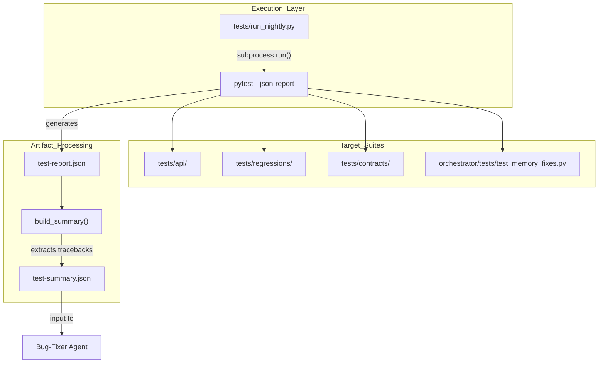
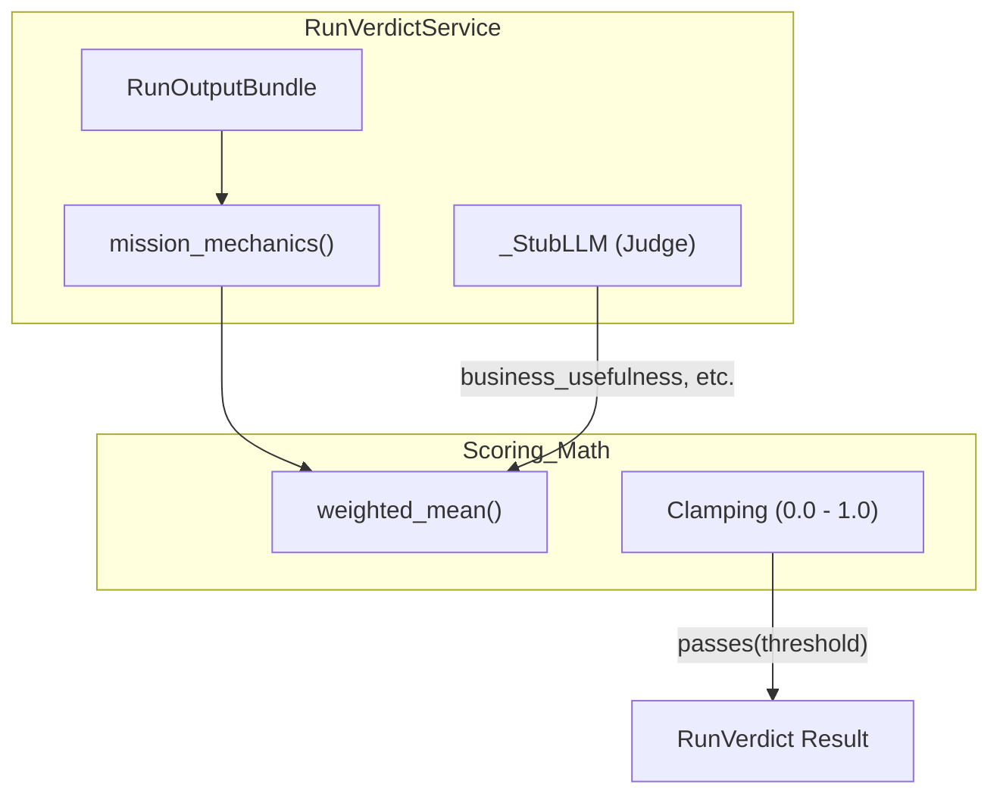
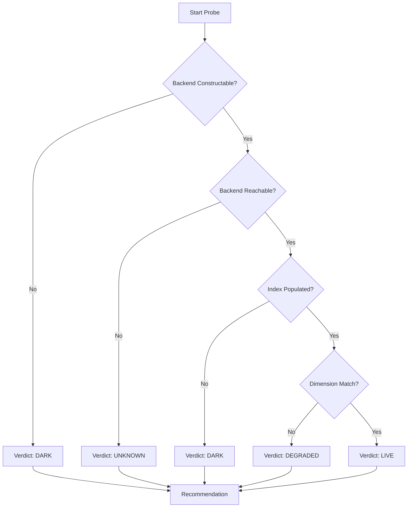

# Testing Infrastructure

Relevant source files

The following files were used as context for generating this wiki page:

- [docs/PRDS/71-UNIFIED-SKILLS-ARCHITECTURE.md](docs/PRDS/71-UNIFIED-SKILLS-ARCHITECTURE.md)
- [frontend/components/agents/agent-readiness-badge.tsx](frontend/components/agents/agent-readiness-badge.tsx)
- [orchestrator/alembic/versions/governance_blueprints.py](orchestrator/alembic/versions/governance_blueprints.py)
- [orchestrator/conftest.py](orchestrator/conftest.py)
- [orchestrator/core/database/migrations/044_pinned_documents.sql](orchestrator/core/database/migrations/044_pinned_documents.sql)
- [orchestrator/core/models/blueprints.py](orchestrator/core/models/blueprints.py)
- [orchestrator/modules/codegraph/tests/conftest.py](orchestrator/modules/codegraph/tests/conftest.py)
- [orchestrator/modules/learning/tests/conftest.py](orchestrator/modules/learning/tests/conftest.py)
- [orchestrator/modules/rag/pinned_context.py](orchestrator/modules/rag/pinned_context.py)
- [orchestrator/modules/rag/retrieval_filters.py](orchestrator/modules/rag/retrieval_filters.py)
- [orchestrator/modules/search/tests/conftest.py](orchestrator/modules/search/tests/conftest.py)
- [orchestrator/modules/search/tests/test_math_foundations.py](orchestrator/modules/search/tests/test_math_foundations.py)
- [orchestrator/modules/tools/discovery/actions_documents.py](orchestrator/modules/tools/discovery/actions_documents.py)
- [orchestrator/modules/tools/discovery/actions_governance.py](orchestrator/modules/tools/discovery/actions_governance.py)
- [orchestrator/modules/tools/discovery/handlers_documents.py](orchestrator/modules/tools/discovery/handlers_documents.py)
- [orchestrator/modules/tools/discovery/handlers_governance.py](orchestrator/modules/tools/discovery/handlers_governance.py)
- [orchestrator/pytest.ini](orchestrator/pytest.ini)
- [orchestrator/scripts/init_test_db.py](orchestrator/scripts/init_test_db.py)
- [orchestrator/scripts/probe_document_vectors.py](orchestrator/scripts/probe_document_vectors.py)
- [orchestrator/services/blueprint_validator.py](orchestrator/services/blueprint_validator.py)
- [orchestrator/services/escalation_service.py](orchestrator/services/escalation_service.py)
- [orchestrator/services/watch_actions.py](orchestrator/services/watch_actions.py)
- [orchestrator/services/watch_rerun.py](orchestrator/services/watch_rerun.py)
- [orchestrator/tests/requirements.txt](orchestrator/tests/requirements.txt)
- [orchestrator/tests/test_document_pinning.py](orchestrator/tests/test_document_pinning.py)
- [orchestrator/tests/test_prd204_rerun.py](orchestrator/tests/test_prd204_rerun.py)
- [orchestrator/tests/test_prd204_silent_holes.py](orchestrator/tests/test_prd204_silent_holes.py)
- [orchestrator/tests/test_prd204_watch_actions.py](orchestrator/tests/test_prd204_watch_actions.py)
- [orchestrator/tests/test_rag_perf_pass.py](orchestrator/tests/test_rag_perf_pass.py)
- [orchestrator/tests/test_read_document_tool.py](orchestrator/tests/test_read_document_tool.py)
- [orchestrator/tests/test_retrieval_filters.py](orchestrator/tests/test_retrieval_filters.py)
- [tests/api/__init__.py](tests/api/__init__.py)
- [tests/api/helpers.py](tests/api/helpers.py)
- [tests/api/test_agents.py](tests/api/test_agents.py)
- [tests/api/test_analytics.py](tests/api/test_analytics.py)
- [tests/api/test_channels.py](tests/api/test_channels.py)
- [tests/api/test_chat.py](tests/api/test_chat.py)
- [tests/api/test_health.py](tests/api/test_health.py)
- [tests/api/test_heartbeat.py](tests/api/test_heartbeat.py)
- [tests/api/test_llm_config.py](tests/api/test_llm_config.py)
- [tests/api/test_recipes.py](tests/api/test_recipes.py)
- [tests/api/test_user_journeys.py](tests/api/test_user_journeys.py)
- [tests/audit_suite.py](tests/audit_suite.py)
- [tests/run_nightly.py](tests/run_nightly.py)

The Automatos AI testing infrastructure is a multi-layered validation system designed to ensure the reliability of autonomous agent capabilities, multi-agent orchestration, and API integrity. It transitions from deterministic logic checks to live API "Journeys" and autonomous quality audits, supporting a "Quality Mesh" where AI agents can consume test artifacts to perform self-healing and bug fixing.

## Overview and Nightly Runner

The core of the infrastructure is the **Nightly API Test Runner** (`tests/run_nightly.py`). This runner orchestrates a suite of approximately 376 tests, producing machine-readable JSON artifacts specifically structured for consumption by downstream "Bug Fixer" and "QA Engineer" agents [tests/run_nightly.py:1-21]().

### Key Components
*   **API Integration Suite**: Located in `tests/api/`, these tests verify backend route contracts and stateful user journeys [tests/run_nightly.py:37-37]().
*   **Regression Pins**: Located in `tests/regressions/`, these are high-signal tests targeting specific historical bugs to prevent recurrence [tests/run_nightly.py:38-38]().
*   **Contract Tests**: Located in `tests/contracts/`, these validate that API responses adhere to expected schemas [tests/run_nightly.py:39-39]().
*   **Artifact Generation**: The runner produces `test-report.json` (full pytest output) and `test-summary.json` (a compact ~2KB summary for LLMs) [tests/run_nightly.py:4-15]().

### Test Execution Data Flow

The runner utilizes `pytest-json-report` to capture execution metadata, which is then processed into a structured summary containing failure node IDs, truncated tracebacks, and extracted assertion messages [tests/run_nightly.py:140-191]().

**Test Execution and Agent Handoff Flow**

Sources: [tests/run_nightly.py:71-99](), [tests/run_nightly.py:140-191]()

## Governance and Boundary Testing

Recent infrastructure expansions include deep validation for governance controls, super-admin boundaries, and data retention policies.

### PRD-143 Super-Admin Boundary Sweep
The boundary sweep (`orchestrator/tests/test_prd143_boundary_sweep.py`) ensures that no operator path can cross the observation lock. It uses the `ActionRegistry` to identify `super_admin_only` actions and proves their absence from the tool surface and semantic ranking [orchestrator/tests/test_prd143_boundary_sweep.py:1-24]().

### PRD-196 Governance Auditing
The governance suite validates audit log retention and policy enforcement:
*   **Audit Retention**: Validates the 180-day floor mandated by EU-AI-Act Art.12 [orchestrator/services/audit_retention.py:22-24](). The `sweep_expired_audit_logs` function performs bounded batched deletes to prevent table locking [orchestrator/services/audit_retention.py:58-88]().
*   **Policy Budget**: The `set_budget` function validates budget keys (cost, tokens, window) before any database write occurs [orchestrator/tests/test_p2w2_governance_policy_budget.py:46-58]().

Sources: [orchestrator/tests/test_prd143_boundary_sweep.py:1-28](), [orchestrator/services/audit_retention.py:1-46](), [orchestrator/tests/test_p2w2_governance_policy_budget.py:1-9]()

## Real-Time and Coordination Testing

### Board Dispatch and SSE
The `board_events` infrastructure is tested for real `LISTEN/NOTIFY` integrity. Tests verify that `notify_board_event` publishes JSON payloads that raw listeners receive, and that the SSE generator yields frames driven by real events rather than timed pings [orchestrator/tests/test_board_sse_listen_notify.py:1-16]().
*   **Concurrency**: The `test_four_workers_claim_each_task_exactly_once` test validates `FOR UPDATE SKIP LOCKED` logic by simulating 4 workers claiming 50 tasks [orchestrator/tests/test_board_dispatch.py:93-136]().

### Mission Coordination (PRD-204)
The coordination layer uses `RunVerdictService` to score mission outputs. Tests validate:
*   **Threshold Boundaries**: 0.79 fails while 0.80 passes [orchestrator/tests/test_prd204_run_verdict.py:150-157]().
*   **Mechanics Heuristics**: The `mission_mechanics` function scores reliability based on task verification and attempt counts [orchestrator/tests/test_prd204_run_verdict.py:131-143]().

**Coordination Scoring Logic**

Sources: [orchestrator/tests/test_board_dispatch.py:1-8](), [orchestrator/tests/test_prd204_run_verdict.py:19-30](), [orchestrator/tests/test_board_sse_listen_notify.py:63-90]()

## Infrastructure Maintenance

### Test Collection Safety
The `orchestrator/tests/conftest.py` file manages complex module shadowing issues. It includes a `pytest_collectstart` hook that restores real application modules over stubs injected by sibling tests, preventing collection-time failures on Linux CI environments [orchestrator/tests/conftest.py:113-142]().

### Clean-up Regressions
The infrastructure also tracks the deletion of legacy components. `orchestrator/tests/test_p2w3_checkpoints_deleted.py` verifies that the PRD-200 session-checkpoint stack is fully removed, including services, routes, and database columns [orchestrator/tests/test_p2w3_checkpoints_deleted.py:1-24]().

Sources: [orchestrator/tests/conftest.py:51-66](), [orchestrator/tests/test_p2w3_checkpoints_deleted.py:55-106]()

## Pytest Configuration and Fixtures

The `orchestrator/pytest.ini` file defines the core pytest configuration for the backend.
It sets the `rootdir` to `orchestrator/` to ensure absolute imports like `core.*` and `modules.*` resolve correctly [orchestrator/pytest.ini:6-7]().

### Test Paths
The `testpaths` configuration specifies where pytest should discover tests. Initially, it only included `tests`, but was expanded to include `modules` and `integrations` to ensure comprehensive test coverage for all components [orchestrator/pytest.ini:21-24](). This change was part of PRD-182 W12-S2 (F056) to address orphaned tests in `modules/*/tests` and `integrations/*/tests` [orchestrator/pytest.ini:9-19]().

### Asynchronous Testing
`asyncio_mode = strict` is explicitly set to ensure consistent behavior for `@pytest.mark.asyncio` tests, preventing silent changes in collection behavior due to future pytest-asyncio defaults [orchestrator/pytest.ini:28-29]().

### Custom Markers
Several custom markers are registered to categorize and filter tests:
*   `golden`: For end-to-end golden-journey backbone tests (J1-J10).
*   `integration`: For tests that interact with real infrastructure like PostgreSQL, S3, or vector stores. These require external services to be running.
*   `slow`: For long-running tests, allowing them to be deselected for faster inner-loop development.
*   `benchmark`: For `pytest-benchmark` latency benchmarks, which also require a live stack [orchestrator/pytest.ini:31-35]().

Sources: [orchestrator/pytest.ini:1-35]()

## Database Testing Infrastructure

The testing suite includes robust mechanisms for database interaction, ensuring tests are isolated and repeatable.

### Transactional Fixtures
The `orchestrator/conftest.py` provides session-scoped and function-scoped fixtures for database access.
*   `test_db_url`: Resolves the database URL from central configuration (`get_database_url()`) to avoid hardcoded credentials [orchestrator/conftest.py:31-37]().
*   `test_engine`: A session-scoped SQLAlchemy engine bound to the test database. It's imported lazily to prevent unnecessary database configuration for mock-only tests [orchestrator/conftest.py:40-47]().
*   `db_session`: A function-scoped transactional session. Each test runs within a transaction that is rolled back on teardown, ensuring tests do not interfere with each other's database state [orchestrator/conftest.py:50-66]().

### Test Database Initialization
The `orchestrator/scripts/init_test_db.py` script is used to initialize a test database. It creates all necessary tables from SQLAlchemy models without running full migrations, which is crucial for testing features like Cloud Document Sync (PRD-42) [orchestrator/scripts/init_test_db.py:1-5]().
*   **Model Import**: It imports all models from `core.models` and specifically `modules.memory.models` to ensure all relevant tables, including memory tables like `MemoryShortTerm`, are registered with `Base` and created [orchestrator/scripts/init_test_db.py:14-22]().
*   **Raw DDL Tables**: For tables without SQLAlchemy models, such as `document_chunks` and `codegraph_projects`, the script executes raw DDL to create them. This is important for integration tests that rely on these structures but don't use ORM models [orchestrator/scripts/init_test_db.py:60-151]().
*   **Pgvector Handling**: It includes logic to conditionally create `vector` type columns if the `pgvector` extension is available, allowing tests to run on both stock PostgreSQL (without `pgvector`) and `pgvector`-enabled environments [orchestrator/scripts/init_test_db.py:30-46]().

### Workspace Seeding
The `seed_workspace` fixture in `orchestrator/conftest.py` provides a factory to insert minimal `workspaces` rows, satisfying foreign key constraints for other tables like documents and chats. This allows tests to operate within a valid workspace context [orchestrator/conftest.py:69-93]().

Sources: [orchestrator/conftest.py:1-93](), [orchestrator/scripts/init_test_db.py:1-151]()

## Module-Specific Test Configurations

Many modules include their own `conftest.py` files to provide fixtures specific to their testing needs.

### Search Module
The `orchestrator/modules/search/tests/conftest.py` provides fixtures for the `ContextOptimizer` and sample embeddings.
*   `context_optimizer`: Provides an instance of `ContextOptimizer` for testing context optimization logic [orchestrator/modules/search/tests/conftest.py:26-29]().
*   `sample_embeddings`: A factory to generate random normalized embeddings of a specified dimension, used for vector-based tests [orchestrator/modules/search/tests/conftest.py:32-44]().
*   `sample_context_items` and `diverse_context_items`: Fixtures that generate `ContextItem` objects with varying content, sources, and relevance scores for testing context optimization and diversity [orchestrator/modules/search/tests/conftest.py:47-102]().

### CodeGraph Module
The `orchestrator/modules/codegraph/tests/conftest.py` provides fixtures for testing the CodeGraph service, including a `codegraph_service` fixture that stubs out external dependencies like the embedding manager and GitHub client for isolated testing.

### Learning Module
The `orchestrator/modules/learning/tests/conftest.py` provides fixtures for testing the learning module, such as `learning_service` and `mock_llm_client`, which allow for controlled testing of learning algorithms without external LLM calls.

Sources: [orchestrator/modules/search/tests/conftest.py:1-102]()

## Specific Test Suites and Examples

### Document Tools Testing
`orchestrator/tests/test_read_document_tool.py` tests the `platform_read_document` and `platform_grep_documents` agent tools.
*   **Reachability**: Verifies that these actions are registered in the `ActionRegistry` with correct permission levels and workspace scoping [orchestrator/tests/test_read_document_tool.py:25-33]().
*   **Handler Wiring**: Confirms that the handlers are correctly wired into the `PlatformActionExecutor` [orchestrator/tests/test_read_document_tool.py:35-41]().
*   **Validation (No DB)**: Tests validation paths that do not require database access, such as handling missing or invalid `document_id` or `pattern` parameters [orchestrator/tests/test_read_document_tool.py:44-73]().
*   **Integration (Real Postgres)**: Uses the `db_session` fixture to seed documents and chunks, then tests scenarios like reading paged content and team isolation for document access [orchestrator/tests/test_read_document_tool.py:107-142]().

### Pinned Documents Testing
`orchestrator/tests/test_document_pinning.py` covers the functionality of pinning documents to a chat context.
*   **Widget Scope Filter**: Tests `_filter_frontend_docs_by_scope` to ensure that only documents within the agent's scope are displayed in the UI [orchestrator/tests/test_document_pinning.py:23-64]().
*   **Pure Validation**: Tests `pin_document` and `build_pinned_context` for validation and empty paths without a real database [orchestrator/tests/test_document_pinning.py:89-105]().
*   **Integration**: Uses `db_session` to test the full lifecycle of pinning, unpinning, listing, and building system messages with pinned content [orchestrator/tests/test_document_pinning.py:111-158]().

### RAG Performance Testing
`orchestrator/tests/test_rag_perf_pass.py` focuses on the performance and efficiency of the Retrieval Augmented Generation (RAG) service.
*   **RAG Config Caching**: Verifies that RAG settings are loaded once and memoized, preventing redundant database calls [orchestrator/tests/test_rag_perf_pass.py:40-74]().
*   **S3 Backend Pooling**: Ensures that S3 document backends are pooled per workspace, avoiding re-initialization for each query [orchestrator/tests/test_rag_perf_pass:77-106]().
*   **Access Tracking Offloading**: Tests that document access tracking is offloaded to a separate thread when an asyncio event loop is running, preventing it from blocking the main retrieval path [orchestrator/tests/test_rag_perf_pass.py:109-138]().
*   **P50 Retrieval Benchmark**: An integration test marked with `@pytest.mark.benchmark` that measures the p50 retrieval latency on a seeded corpus, requiring a live stack and `pytest-benchmark` [orchestrator/tests/test_rag_perf_pass.py:141-163]().

### Watch Actions and Rerun Testing (PRD-204)
`orchestrator/tests/test_prd204_watch_actions.py` and `orchestrator/tests/test_prd204_rerun.py` cover the watch subsystem's autonomous actions and playbook rerun capabilities.
*   **Watch Actions**: Tests direction-change actions like `replan`, `reassign`, `spawn_agent`, and `escalate` under different autonomy policies (`full_auto`, `always_ask`). It stubs the coordinator replan and `AgentMatcher.rank` for isolated testing [orchestrator/tests/test_prd204_watch_actions.py:1-13]().
*   **Rerun and Tweak**: Validates the playbook rerun mechanism, including copying inputs, handling `retry_of` lineage, incrementing `attempt_count`, and applying `step_overrides` without mutating the original playbook definition [orchestrator/services/watch_rerun.py:151-184](). It also tests the approval gate for reruns, where `always_ask` creates an `ApprovalGrant` and `full_auto` launches immediately if within budget [orchestrator/services/watch_rerun.py:19-44]().
*   **Boundary Validation**: `validate_step_overrides` ensures that step overrides are correctly formatted and target existing steps [orchestrator/services/watch_rerun.py:89-120]().

Sources: [orchestrator/tests/test_read_document_tool.py:1-176](), [orchestrator/tests/test_document_pinning.py:1-158](), [orchestrator/tests/test_rag_perf_pass.py:1-163](), [orchestrator/tests/test_prd204_watch_actions.py:1-199](), [orchestrator/tests/test_prd204_rerun.py:1-180](), [orchestrator/services/watch_rerun.py:1-184]()

## Security Suites

### Document Vector Probe
The `orchestrator/scripts/probe_document_vectors.py` script is a read-only probe designed to assess the health and configuration of the document vector plane in production environments. It classifies the plane's status (live, degraded, dark, unknown) based on backend constructability, configured dimension, and population status [orchestrator/scripts/probe_document_vectors.py:58-95](). It also calculates the `stamped_fraction` to determine what percentage of sampled vectors carry a `workspace_id` stamp, which is critical for validating the fail-closed filter for unlabeled hits (PRD-186 S5) [orchestrator/scripts/probe_document_vectors.py:123-138]().

**Document Vector Plane Classification**

Sources: [orchestrator/scripts/probe_document_vectors.py:1-150]()

## End-to-End (E2E) Testing

While not explicitly detailed in the provided files, the mention of `playwright` in the page title suggests the use of Playwright for end-to-end testing. This would typically involve simulating user interactions in a browser to validate the entire application flow, from frontend to backend.

## CI Test Workflow

The CI test workflow integrates these testing components to ensure code quality and prevent regressions.
*   **Dedicated Jobs**: The `orchestrator-module-tests` job runs module-specific tests, some of which require live services like Redis or pgvector. This job is non-required, allowing the main `orchestrator-tests` job (which pins itself to `pytest tests`) to remain a green gate [orchestrator/pytest.ini:16-20]().
*   **Coverage Ratchet**: The CI pipeline likely includes a coverage ratchet to prevent code coverage from decreasing.
*   **Import Linter**: An import linter is used to enforce architectural boundaries and prevent unwanted dependencies between modules.
*   **Eval Gates**: Evaluation gates are used to ensure that performance and quality metrics meet predefined thresholds.

Sources: [orchestrator/pytest.ini:16-20]()

---