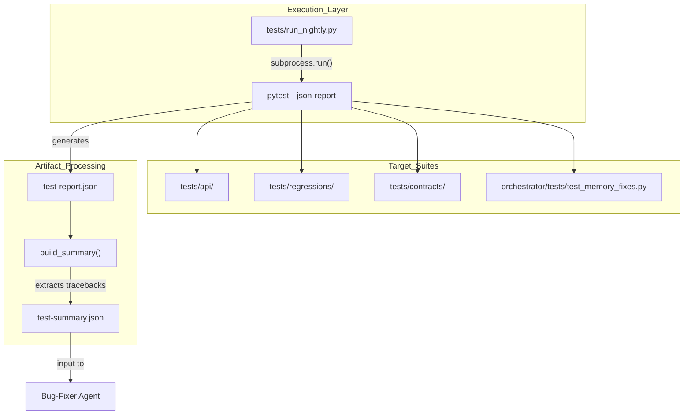
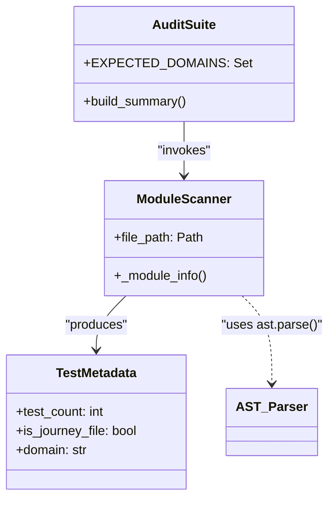

# Testing Infrastructure

Relevant source files

The following files were used as context for generating this wiki page:

- [docs/PRDS/71-UNIFIED-SKILLS-ARCHITECTURE.md](docs/PRDS/71-UNIFIED-SKILLS-ARCHITECTURE.md)
- [orchestrator/tests/test_memory_fixes.py](orchestrator/tests/test_memory_fixes.py)
- [tests/api/test_channels.py](tests/api/test_channels.py)
- [tests/api/test_llm_config.py](tests/api/test_llm_config.py)
- [tests/api/test_recipes.py](tests/api/test_recipes.py)
- [tests/api/test_user_journeys.py](tests/api/test_user_journeys.py)
- [tests/audit_suite.py](tests/audit_suite.py)
- [tests/run_nightly.py](tests/run_nightly.py)

The Automatos AI testing infrastructure is a multi-layered validation system designed to ensure the reliability of autonomous agent capabilities, multi-agent orchestration, and API integrity. It transitions from deterministic logic checks to live API "Journeys" and autonomous quality audits, supporting a "Quality Mesh" where AI agents can consume test artifacts to perform self-healing and bug fixing.

## Overview and Nightly Runner

The core of the infrastructure is the **Nightly API Test Runner** [tests/run_nightly.py:1-21](). This runner orchestrates a suite of approximately 376 tests, producing machine-readable JSON artifacts specifically structured for consumption by downstream "Bug Fixer" and "QA Engineer" agents.

### Key Components
*   **API Integration Suite**: Located in `tests/api/`, these tests verify backend route contracts and stateful user journeys [tests/run_nightly.py:37-37]().
*   **Regression Pins**: Located in `tests/regressions/`, these are high-signal tests targeting specific historical bugs to prevent recurrence [tests/run_nightly.py:38-38]().
*   **Contract Tests**: Located in `tests/contracts/`, these validate that API responses adhere to expected schemas [tests/run_nightly.py:39-39]().
*   **Artifact Generation**: The runner produces `test-report.json` (full pytest output) and `test-summary.json` (a compact ~2KB summary for LLMs) [tests/run_nightly.py:4-15]().

### Test Execution Data Flow

The runner utilizes `pytest-json-report` to capture execution metadata, which is then processed into a structured summary containing failure node IDs, truncated tracebacks, and extracted assertion messages [tests/run_nightly.py:140-191]().

**Test Execution and Agent Handoff Flow**

Sources: [tests/run_nightly.py:71-99](), [tests/run_nightly.py:140-191]()

## Health Regression Suite

The testing suite provides a curated, high-signal subset of tests used for rapid environment validation and "API Health Check" recipes. It categorizes failures by functional domain (e.g., `auth`, `chat`, `memory`) to facilitate automated ticket creation and self-healing [tests/run_nightly.py:140-191]().

### Regression Pins and Fix Hints
Regression tests are explicitly designed to guard against known issues identified in PRDs and past incidents. They often contain detailed comments pointing to the exact line of code where a bug was previously found.

| Test Name | File Path | Bug Reference / Logic |
| :--- | :--- | :--- |
| `test_llm_settings_categories_exist` | `tests/api/test_llm_config.py` | Guards against `ValueError` in `manager.py:104` [tests/api/test_llm_config.py:19-27]() |
| `test_create_recipe_with_null_created_by` | `tests/api/test_recipes.py` | Prevents NOT NULL violations in `workflow_recipes.py:452` [tests/api/test_recipes.py:43-53]() |
| `test_channel_analytics_source_query` | `tests/api/test_channels.py` | Fixes incorrect column name `source_channel` in `channels.py:326` [tests/api/test_channels.py:45-58]() |
| `test_mem0_search_sends_search_query` | `orchestrator/tests/test_memory_fixes.py` | Validates correct parameter naming for Mem0 search [orchestrator/tests/test_memory_fixes.py:45-84]() |

Sources: [tests/api/test_llm_config.py:16-40](), [tests/api/test_recipes.py:43-78](), [tests/api/test_channels.py:45-71](), [orchestrator/tests/test_memory_fixes.py:45-84]()

## Coverage Gap Finder

The infrastructure includes an automated audit tool, `tests/audit_suite.py`, which inventories the test suite against 60+ functional domains defined in the system's "Quality Mesh" [tests/audit_suite.py:20-66]().

### Audit Implementation
The audit system uses the Python `ast` module to perform static analysis on test files, extracting:
1.  **Journey Identification**: Detects "Journey" keywords in module docstrings [tests/audit_suite.py:85-85]().
2.  **Test Density**: Counts individual test functions per domain [tests/audit_suite.py:76-77]().
3.  **Domain Mapping**: Associates filenames (e.g., `test_chat.py`) with platform capabilities [tests/audit_suite.py:79-79]().

**Coverage Mapping Class Diagram**

Sources: [tests/audit_suite.py:20-66](), [tests/audit_suite.py:69-88](), [tests/audit_suite.py:91-128]()

## Live API Testing and User Journeys

Tests run against a live API environment configured via `tests/.env` [tests/run_nightly.py:67-68](). This ensures that the entire stack—including Redis, PostgreSQL, and LLM providers—is validated through stateful "Journeys" [tests/api/test_user_journeys.py:1-15]().

### Stateful Journey Validation
The `tests/api/test_user_journeys.py` suite validates cross-service interactions:
*   **Model Config Round-Trip**: Create agent -> update model settings -> verify persistence [tests/api/test_user_journeys.py:18-61]().
*   **Execution Handles**: Execute agent -> verify `execution_id` metadata [tests/api/test_user_journeys.py:63-79]().
*   **Chat Lifecycle**: Create chat -> rename -> verify title [tests/api/test_user_journeys.py:81-115]().
*   **Workflow Status**: Trigger workflow -> poll status endpoint [tests/api/test_user_journeys.py:117-144]().

### Unified Skills Validation
Following **PRD-71**, the testing infrastructure ensures that Skills and Plugins are no longer mutually exclusive [docs/PRDS/71-UNIFIED-SKILLS-ARCHITECTURE.md:20-33](). Tests verify that `AgentFactory` correctly loads all assigned skills without runtime keyword matching [docs/PRDS/71-UNIFIED-SKILLS-ARCHITECTURE.md:121-127]().

Sources: [tests/api/test_user_journeys.py:1-160](), [docs/PRDS/71-UNIFIED-SKILLS-ARCHITECTURE.md:48-115]()

## Test Taxonomy (Journeys)

Tests are organized into numbered "Journeys" to track end-to-end feature coverage.

| ID | Domain | File | Purpose |
| :--- | :--- | :--- | :--- |
| **08** | Channels | `test_channels.py` | External platform (Slack/Discord) integration [tests/api/test_channels.py:1-44]() |
| **13** | Recipes | `test_recipes.py` | Workflow template creation and discovery [tests/api/test_recipes.py:1-42]() |
| **17** | LLM Config | `test_llm_config.py` | Service-to-model mapping and fallback logic [tests/api/test_llm_config.py:1-13]() |
| **N/A** | User Journeys | `test_user_journeys.py` | Multi-step stateful flows across services [tests/api/test_user_journeys.py:1-15]() |
| **N/A** | Memory Fixes | `test_memory_fixes.py` | Regression pins for memory integration [orchestrator/tests/test_memory_fixes.py:1-10]() |

Sources: [tests/api/test_channels.py:1-1](), [tests/api/test_recipes.py:1-1](), [tests/api/test_llm_config.py:1-5](), [tests/api/test_user_journeys.py:1-1](), [orchestrator/tests/test_memory_fixes.py:1-11]()

---