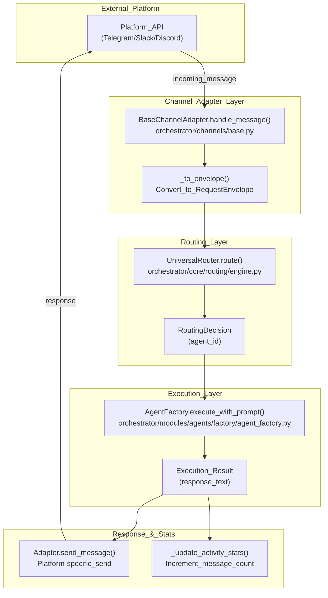

# Channel Integrations

<details>
<summary>Relevant source files</summary>

The following files were used as context for generating this wiki page:

- [docs/PRDS/55-AUTONOMOUS-ASSISTANT-PLATFORM.md](docs/PRDS/55-AUTONOMOUS-ASSISTANT-PLATFORM.md)
- [frontend/components/auth/sign-up-form.tsx](frontend/components/auth/sign-up-form.tsx)
- [orchestrator/alembic/versions/20260215_add_heartbeat_and_channels.py](orchestrator/alembic/versions/20260215_add_heartbeat_and_channels.py)
- [orchestrator/api/channels.py](orchestrator/api/channels.py)
- [orchestrator/api/heartbeat.py](orchestrator/api/heartbeat.py)
- [orchestrator/channels/base.py](orchestrator/channels/base.py)
- [orchestrator/channels/discord_adapter.py](orchestrator/channels/discord_adapter.py)
- [orchestrator/channels/google_chat_adapter.py](orchestrator/channels/google_chat_adapter.py)
- [orchestrator/channels/line_adapter.py](orchestrator/channels/line_adapter.py)
- [orchestrator/channels/manager.py](orchestrator/channels/manager.py)
- [orchestrator/channels/slack_adapter.py](orchestrator/channels/slack_adapter.py)
- [orchestrator/consumers/chatbot/smart_memory.py](orchestrator/consumers/chatbot/smart_memory.py)
- [orchestrator/core/models/channels.py](orchestrator/core/models/channels.py)
- [orchestrator/core/services/plugin_security_scanner.py](orchestrator/core/services/plugin_security_scanner.py)
- [orchestrator/modules/agents/__init__.py](orchestrator/modules/agents/__init__.py)
- [orchestrator/modules/agents/factory/__init__.py](orchestrator/modules/agents/factory/__init__.py)
- [orchestrator/modules/memory/integrations/mem0_client.py](orchestrator/modules/memory/integrations/mem0_client.py)

</details>


## Purpose and Scope

Channel Integrations enable Automatos AI to receive and respond to messages from external communication platforms (Telegram, Slack, Discord, LINE, Google Chat). This system converts platform-specific message formats into `RequestEnvelope` objects that flow through the Universal Router for intelligent agent selection and execution.

For information about message routing and agent selection, see [Universal Router](#10). For proactive assistant capabilities that send messages to channels, see [Heartbeat & Proactive Assistant](#11).

**Sources:** [docs/PRDS/55-AUTONOMOUS-ASSISTANT-PLATFORM.md:1-30](), [orchestrator/channels/base.py:1-10]()

---

## Channel Architecture

The channel integration system is built on three core components:

1.  **BaseChannelAdapter**: Abstract base class defining the adapter contract [orchestrator/channels/base.py:21-29]().
2.  **ChannelManager**: Singleton service managing adapter lifecycle [orchestrator/channels/manager.py:22-26]().
3.  **ChannelConnection**: Database model storing connection credentials and state [orchestrator/core/models/channels.py:19-33]().

### Channel System Class Hierarchy

```mermaid
graph TB
    subgraph "Core_Components"
        BaseChannelAdapter["BaseChannelAdapter<br/>(abstract base class)<br/>orchestrator/channels/base.py"]
        ChannelManager["ChannelManager<br/>(singleton)<br/>orchestrator/channels/manager.py"]
        ChannelConnection["ChannelConnection<br/>(SQLAlchemy model)<br/>orchestrator/core/models/channels.py"]
    end
    
    subgraph "Platform_Adapters"
        TelegramAdapter["TelegramAdapter<br/>orchestrator/channels/telegram_adapter.py"]
        SlackAdapter["SlackAdapter<br/>orchestrator/channels/slack_adapter.py"]
        DiscordAdapter["DiscordAdapter<br/>orchestrator/channels/discord_adapter.py"]
        LineAdapter["LineAdapter<br/>orchestrator/channels/line_adapter.py"]
        GoogleChatAdapter["GoogleChatAdapter<br/>orchestrator/channels/google_chat_adapter.py"]
    end
    
    subgraph "Database"
        DB[("channel_connections_table<br/>workspace_id, platform,<br/>config, status")]
    end
    
    BaseChannelAdapter -->|"implements"| TelegramAdapter
    BaseChannelAdapter -->|"implements"| SlackAdapter
    BaseChannelAdapter -->|"implements"| DiscordAdapter
    BaseChannelAdapter -->|"implements"| LineAdapter
    BaseChannelAdapter -->|"implements"| GoogleChatAdapter
    
    ChannelManager -->|"creates_&_manages"| TelegramAdapter
    ChannelManager -->|"creates_&_manages"| SlackAdapter
    ChannelManager -->|"creates_&_manages"| DiscordAdapter
    ChannelManager -->|"creates_&_manages"| LineAdapter
    ChannelManager -->|"creates_&_manages"| GoogleChatAdapter
    
    ChannelManager -->|"loads_from"| DB
    ChannelConnection -->|"mapped_to"| DB
```



**Sources:** [orchestrator/channels/base.py:21-29](), [orchestrator/channels/manager.py:22-26](), [orchestrator/core/models/channels.py:19-33]()

### BaseChannelAdapter Contract

All platform adapters must implement these abstract methods:

| Method | Purpose | Returns |
| :--- | :--- | :--- |
| `start()` | Initialize platform connection (bot login, webhook setup) | `None` |
| `stop()` | Gracefully shutdown the adapter | `None` |
| `send_message(channel_id, text, **kwargs)` | Send a message to a specific channel/conversation | `bool` |
| `test_connection()` | Validate credentials and platform connectivity | `Dict[str, Any]` |
| `_to_envelope(platform_message)` | Convert platform message to `RequestEnvelope` | `RequestEnvelope` or `None` |

**Sources:** [orchestrator/channels/base.py:34-63](), [orchestrator/channels/base.py:166-173]()

### ChannelConnection Model

The `ChannelConnection` model stores per-workspace channel configurations:

```python
# Fields from orchestrator/core/models/channels.py
id = Column(PGUUID(as_uuid=True), primary_key=True, default=uuid4)
workspace_id = Column(PGUUID(as_uuid=True), nullable=False, index=True)
platform = Column(String(50), nullable=False)  # telegram, slack, discord
config = Column(JSON, server_default="{}")  # encrypted credentials
status = Column(String(20), server_default="'inactive'")  # active, inactive, error
metadata_ = Column("metadata", JSON, server_default="{}")
default_agent_id = Column(Integer, nullable=True)  # US-027: default routing
message_count = Column(Integer, server_default="0")
last_activity_at = Column(DateTime, nullable=True)
```

**Sources:** [orchestrator/core/models/channels.py:23-33](), [orchestrator/alembic/versions/20260215_add_heartbeat_and_channels.py:43-57]()

### ChannelManager Lifecycle

The `ChannelManager` singleton (`get_channel_manager()`) manages all active adapters:

*   `start_all()`: Loads all connections with `status == "active"` from the DB and starts their adapters [orchestrator/channels/manager.py:32-56]().
*   `stop_all()`: Stops all running adapters and clears the internal registry [orchestrator/channels/manager.py:58-66]().
*   `start_adapter()`: Creates and starts a specific adapter instance [orchestrator/channels/manager.py:72-98]().
*   `_create_adapter()`: Uses lazy imports and a map (`_ADAPTER_MAP`) to instantiate the correct platform class [orchestrator/channels/manager.py:109-161]().

**Sources:** [orchestrator/channels/manager.py:22-193]()

---

## Message Pipeline

### End-to-End Message Flow



**Sources:** [orchestrator/channels/base.py:69-144]()

### Pipeline Implementation

The `BaseChannelAdapter.handle_message()` method orchestrates the full pipeline:

1.  **Normalization**: Converts platform-specific dicts to a `RequestEnvelope` using `_to_envelope()` [orchestrator/channels/base.py:80-82]().
2.  **Routing**: Calls `UniversalRouter.route()` to determine the target `agent_id` [orchestrator/channels/base.py:92-93]().
3.  **Execution**: Invokes `AgentFactory.execute_with_prompt()` with the message content [orchestrator/channels/base.py:113-121]().
4.  **Response**: Extracts text from the agent result and calls `send_message()` back to the source platform [orchestrator/channels/base.py:123-131]().
5.  **Stats**: Increments `message_count` and updates `last_activity_at` in the database [orchestrator/channels/base.py:146-165]().

**Sources:** [orchestrator/channels/base.py:69-173]()

---

## Platform Adapters

### Slack Adapter
Uses `slack-bolt` for async integration. It supports both Socket Mode (via `app_token`) and standard Events API [orchestrator/channels/slack_adapter.py:51-59]().
*   **Source Conversion**: Maps Slack `user_id` and `text` to the `RequestEnvelope` [orchestrator/channels/slack_adapter.py:145-166]().
*   **Filtering**: Ignores messages with `bot_id` or `subtype == "bot_message"` [orchestrator/channels/slack_adapter.py:118-119]().

### Discord Adapter
Uses `discord.py` v2.0+. It handles the 2000-character message limit by chunking responses [orchestrator/channels/discord_adapter.py:88-91]().
*   **Intents**: Requires `message_content = True` to process incoming text [orchestrator/channels/discord_adapter.py:36-37]().
*   **UX**: Triggers a typing indicator while the agent processes the request [orchestrator/channels/discord_adapter.py:118-119]().

### Google Chat Adapter
Integrates via service account credentials.
*   **Authentication**: Refreshes OAuth2 tokens automatically upon 401 errors.
*   **Retries**: Implements exponential backoff for 429 and 5xx status codes.

### Line Adapter
Uses `LINEAdapter` for integration with the LINE Messaging API [orchestrator/channels/line_adapter.py:21-32]().
*   **Features**: Implements signature verification using HMAC-SHA256 and handles message chunking for the 5000-character LINE limit [orchestrator/channels/line_adapter.py:182-198](), [orchestrator/channels/line_adapter.py:88-89]().
*   **Reply Token**: Prefers using `replyToken` for free messaging over the paid push API where possible [orchestrator/channels/line_adapter.py:101-121]().

---

## Channel API Reference

The channel management API (`/api/channels`) provides CRUD and lifecycle control.

*   `GET /api/channels`: Lists all connections for the current workspace [orchestrator/api/channels.py:45-73]().
*   `POST /api/channels`: Creates a new connection, validating required config fields like `bot_token` [orchestrator/api/channels.py:76-113]().
*   `DELETE /api/channels/{channel_id}`: Removes a connection and stops the associated adapter [orchestrator/api/channels.py:153-183]().
*   `POST /api/channels/{channel_id}/test`: Pings the platform API (e.g., `getMe` for Telegram) to verify credentials [orchestrator/api/channels.py:186-242]().

**Sources:** [orchestrator/api/channels.py:1-242]()

---