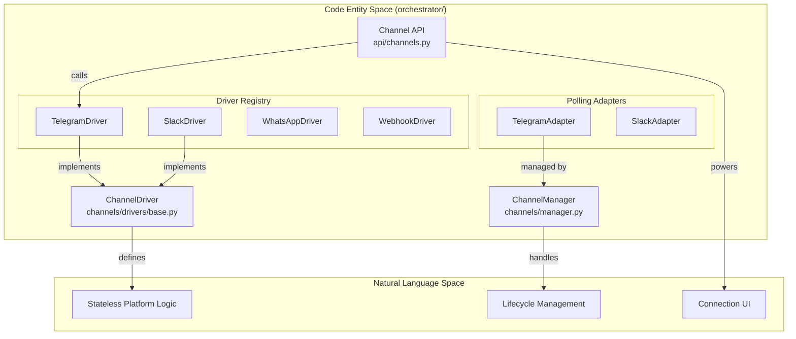
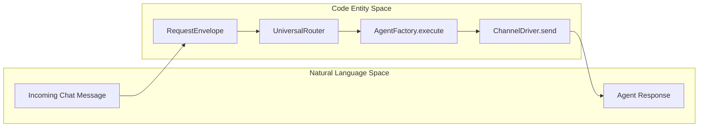

# Channel Integrations

Relevant source files

The following files were used as context for generating this wiki page:

- [docs/PRDS/55-AUTONOMOUS-ASSISTANT-PLATFORM.md](docs/PRDS/55-AUTONOMOUS-ASSISTANT-PLATFORM.md)
- [frontend/components/settings/ChannelsSettingsTab.tsx](frontend/components/settings/ChannelsSettingsTab.tsx)
- [orchestrator/alembic/versions/20260215_add_heartbeat_and_channels.py](orchestrator/alembic/versions/20260215_add_heartbeat_and_channels.py)
- [orchestrator/alembic/versions/prd008a4_channel_drivers.py](orchestrator/alembic/versions/prd008a4_channel_drivers.py)
- [orchestrator/api/channels.py](orchestrator/api/channels.py)
- [orchestrator/channels/drivers/__init__.py](orchestrator/channels/drivers/__init__.py)
- [orchestrator/channels/drivers/base.py](orchestrator/channels/drivers/base.py)
- [orchestrator/channels/drivers/discord.py](orchestrator/channels/drivers/discord.py)
- [orchestrator/channels/drivers/slack.py](orchestrator/channels/drivers/slack.py)
- [orchestrator/channels/drivers/telegram.py](orchestrator/channels/drivers/telegram.py)
- [orchestrator/channels/drivers/webhook.py](orchestrator/channels/drivers/webhook.py)
- [orchestrator/channels/drivers/whatsapp.py](orchestrator/channels/drivers/whatsapp.py)
- [orchestrator/channels/manager.py](orchestrator/channels/manager.py)
- [orchestrator/channels/telegram_adapter.py](orchestrator/channels/telegram_adapter.py)
- [orchestrator/core/models/channels.py](orchestrator/core/models/channels.py)
- [orchestrator/tests/test_channel_adapter_contract.py](orchestrator/tests/test_channel_adapter_contract.py)
- [orchestrator/tests/test_prd184_us005_legacy_channel_adapters_deleted.py](orchestrator/tests/test_prd184_us005_legacy_channel_adapters_deleted.py)

## Purpose and Scope

Channel Integrations enable Automatos AI to receive and respond to messages from external communication platforms (Telegram, Slack, Discord, WhatsApp, and Webhooks). This system converts platform-specific message formats into normalized envelopes that flow through the Universal Router for intelligent agent selection and execution [orchestrator/channels/base.py:1-10]().

The architecture has evolved from a legacy adapter-only model to a dual-layer system: **Drivers** handle stateless platform logic (verification, sending, webhook installation) [orchestrator/channels/drivers/base.py:1-24](), while **Adapters** manage stateful lifecycle operations like long-polling for platforms that require it [orchestrator/channels/manager.py:1-10]().

For details on the underlying architecture, see [Channel Architecture](#12.1).
For details on the data flow, see [Message Pipeline](#12.2).
For details on specific platform implementations, see [Platform Adapters](#12.3).
For details on management endpoints, see [Channel API Reference](#12.4).

---

## Channel Architecture

The system uses a driver-mediated architecture to decouple platform-specific SDKs from core business logic.

1.  **ChannelDriver**: A stateless abstraction for platform capabilities. It defines how to `verify` credentials, `send` messages, and `install_webhook` [orchestrator/channels/drivers/base.py:90-150]().
2.  **ChannelManager**: A singleton service that manages the lifecycle of stateful polling adapters. It starts polling loops for active connections on boot [orchestrator/channels/manager.py:22-68]().
3.  **ChannelConnection**: The database entity storing credentials, `mode` (webhook vs polling), `status`, and metrics like `message_count` [orchestrator/core/models/channels.py:19-46]().
4.  **Connectivity Modes**: Platforms connect via `WEBHOOK` (platform POSTs to us) or `POLLING` (we long-poll the platform) [orchestrator/channels/drivers/base.py:52-55]().

### Channel System Entity Mapping

This diagram maps the high-level channel concepts to the specific code entities and driver registry.

**Sources:** [orchestrator/channels/drivers/base.py:90-107](), [orchestrator/channels/manager.py:22-41](), [orchestrator/api/channels.py:29-36]()

For details, see [Channel Architecture](#12.1).

---

## Message Pipeline

The pipeline normalizes incoming events from disparate platforms into a unified execution flow.

### Pipeline Execution Flow

1.  **Ingestion**: Messages arrive via a webhook endpoint `/api/webhooks/ws/{key}` [orchestrator/api/channels.py:72]() or a polling loop in `ChannelManager` [orchestrator/channels/manager.py:32-41]().
2.  **Normalization**: Adapters convert platform payloads into a standard `RequestEnvelope` [orchestrator/tests/test_channel_adapter_contract.py:16-22]().
3.  **Routing**: The `UniversalRouter` determines which agent or workflow should handle the message.
4.  **Execution**: `AgentFactory` runs the agent, potentially involving tool use or memory retrieval.
5.  **Dispatch**: The `ChannelDriver.send()` method delivers the response back to the platform [orchestrator/channels/drivers/base.py:118-130]().
6.  **Telemetry**: Every interaction increments `message_count` and updates `last_activity_at` via `_update_activity_stats` [orchestrator/tests/test_channel_adapter_contract.py:23-27]().

### Data Normalization to Code Entities

**Sources:** [orchestrator/channels/drivers/base.py:118-130](), [orchestrator/tests/test_channel_adapter_contract.py:23-34]()

For details, see [Message Pipeline](#12.2).

---

## Platform Adapters

The system supports several major platforms, each with specific driver logic:

*   **Telegram**: Supports both `WEBHOOK` and `POLLING`. Uses `setWebhook` for registration [orchestrator/channels/drivers/telegram.py:55-166]().
*   **Slack**: Webhook-only (Events API). Requires `bot_token` and `signing_secret` [orchestrator/channels/drivers/slack.py:38-42]().
*   **WhatsApp**: Meta Cloud API integration. Requires `phone_number_id` and `access_token` [frontend/components/settings/ChannelsSettingsTab.tsx:28-37]().
*   **Discord**: Currently supports outbound `send` via REST API [orchestrator/channels/drivers/base.py:95-131]().
*   **Generic Webhook**: Outbound-only driver for delivering JSON payloads to external URLs [orchestrator/channels/drivers/base.py:95-131]().

**Note:** Legacy driverless adapters were removed in favor of the unified driver registry [orchestrator/tests/test_prd184_us005_legacy_channel_adapters_deleted.py:37-46]().

**Sources:** [orchestrator/channels/drivers/telegram.py:53-58](), [orchestrator/channels/drivers/slack.py:36-45](), [frontend/components/settings/ChannelsSettingsTab.tsx:28-37]()

For details, see [Platform Adapters](#12.3).

---

## Channel API Reference

The `channels` API manages the persistence and verification of these connections [orchestrator/api/channels.py:1-12]().

| Endpoint | Method | Description |
| :--- | :--- | :--- |
| `/api/channels` | `GET` | Lists all connections, reconciling DB status with `ChannelManager` [orchestrator/api/channels.py:171-185]() |
| `/api/channels/platforms` | `GET` | Returns available platforms from the driver registry [orchestrator/api/channels.py:29-36]() |
| `/api/channels/{id}/test` | `POST` | Triggers `driver.verify()` to check credentials [orchestrator/api/channels.py:81-93]() |
| `/api/channels/{id}/start` | `POST` | Explicitly starts a polling adapter [orchestrator/channels/manager.py:88-114]() |

**Sources:** [orchestrator/api/channels.py:171-185](), [orchestrator/channels/manager.py:88-114](), [frontend/components/settings/ChannelsSettingsTab.tsx:168-179]()

For details, see [Channel API Reference](#12.4).

---