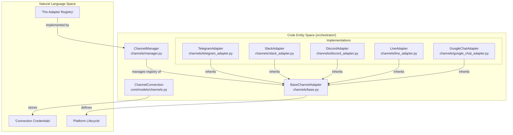
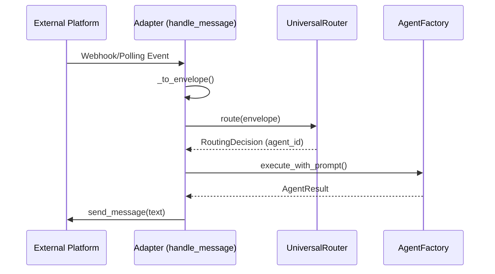

# Channel Integrations

Relevant source files

The following files were used as context for generating this wiki page:

- [docs/PRDS/55-AUTONOMOUS-ASSISTANT-PLATFORM.md](docs/PRDS/55-AUTONOMOUS-ASSISTANT-PLATFORM.md)
- [orchestrator/alembic/versions/20260215_add_heartbeat_and_channels.py](orchestrator/alembic/versions/20260215_add_heartbeat_and_channels.py)
- [orchestrator/api/channels.py](orchestrator/api/channels.py)
- [orchestrator/api/heartbeat.py](orchestrator/api/heartbeat.py)
- [orchestrator/channels/base.py](orchestrator/channels/base.py)
- [orchestrator/channels/manager.py](orchestrator/channels/manager.py)
- [orchestrator/channels/telegram_adapter.py](orchestrator/channels/telegram_adapter.py)
- [orchestrator/core/models/channels.py](orchestrator/core/models/channels.py)

## Purpose and Scope

Channel Integrations enable Automatos AI to receive and respond to messages from external communication platforms (Telegram, Slack, Discord, LINE, Google Chat). This system converts platform-specific message formats into `RequestEnvelope` objects that flow through the Universal Router for intelligent agent selection and execution [orchestrator/channels/base.py:1-10]().

This architecture transforms Automatos into an **always-on autonomous assistant** that meets users where they are, moving beyond a reactive web-only interface [docs/PRDS/55-AUTONOMOUS-ASSISTANT-PLATFORM.md:12-20](). It allows a "team of specialists with heartbeats" to proactively interact across multiple messaging channels [docs/PRDS/55-AUTONOMOUS-ASSISTANT-PLATFORM.md:14-15]().

For details on the underlying architecture, see [Channel Architecture](#12.1).
For details on the data flow, see [Message Pipeline](#12.2).
For details on specific platform implementations, see [Platform Adapters](#12.3).
For details on management endpoints, see [Channel API Reference](#12.4).

---

## Channel Architecture

The channel integration system is built on a modular adapter pattern that decouples platform-specific SDKs from the core routing logic.

1.  **BaseChannelAdapter**: Abstract base class defining the lifecycle (`start`, `stop`), messaging contract (`send_message`), and health checks (`test_connection`) [orchestrator/channels/base.py:22-64]().
2.  **ChannelManager**: Singleton service that manages the lifecycle of all adapters. It handles `start_all()` on system boot by loading active connections from the database and provides a factory `_create_adapter()` to instantiate platform-specific classes [orchestrator/channels/manager.py:22-115]().
3.  **ChannelConnection**: SQLAlchemy model storing workspace-scoped credentials (`config`), platform type, status, and activity metrics like `message_count` and `last_activity_at` [orchestrator/core/models/channels.py:19-33]().

### Channel System Entity Mapping

This diagram maps the high-level channel concepts to the specific code entities that implement them.

**Sources:** [orchestrator/channels/base.py:22-29](), [orchestrator/channels/manager.py:22-26](), [orchestrator/core/models/channels.py:19-33](), [orchestrator/channels/manager.py:123-135]()

For details, see [Channel Architecture](#12.1).

---

## Message Pipeline

The message pipeline normalizes incoming events into a standard format before routing them to the AI agents.

### Pipeline Execution Flow

The `BaseChannelAdapter.handle_message()` method orchestrates the full ingestion-to-response loop [orchestrator/channels/base.py:112-187]().

1.  **Normalization**: Platform-specific data is converted to a `RequestEnvelope` via `_to_envelope()` [orchestrator/channels/base.py:128-129]().
2.  **Routing**: The `UniversalRouter` selects an `agent_id` based on the envelope content [orchestrator/channels/base.py:143-144]().
3.  **Multimodal Handling**: Attachments (images/files) are downloaded by adapters, uploaded to the `AttachmentStore` via `upload_attachment()`, and linked to the execution [orchestrator/channels/base.py:70-106](), [orchestrator/channels/base.py:121-134]().
4.  **Execution**: `AgentFactory.execute_with_prompt()` runs the agent logic with the normalized prompt and context [orchestrator/channels/base.py:163-173]().
5.  **Response**: The result is sent back to the source platform via `send_message()` [orchestrator/channels/base.py:178-183]().
6.  **Stats**: Activity stats are updated on the `ChannelConnection` record [orchestrator/channels/base.py:186]().

**Sources:** [orchestrator/channels/base.py:112-187](), [orchestrator/channels/base.py:70-106]()

For details, see [Message Pipeline](#12.2).

---

## Platform Adapters

Each adapter encapsulates the specific library and authentication requirements for its platform.

*   **Telegram**: Uses `python-telegram-bot` with background polling. It handles `/start` and `/help` commands and persists `telegram_default_chat_id` to workspace settings [orchestrator/channels/telegram_adapter.py:27-50](), [orchestrator/channels/telegram_adapter.py:118-147]().
*   **Slack**: Uses `slack-bolt` with support for Socket Mode or Events API.
*   **Discord**: Uses `discord.py` and handles message chunking for the 4000-character Telegram limit (and similar platform constraints) [orchestrator/channels/telegram_adapter.py:79-82]().
*   **LINE**: Uses the Messaging API via `LineAdapter`.
*   **Google Chat**: Uses service account authentication via `GoogleChatAdapter`.

**Sources:** [orchestrator/channels/telegram_adapter.py:19-147](), [orchestrator/channels/manager.py:123-135]()

For details, see [Platform Adapters](#12.3).

---

## Channel API Reference

The `channels` API router provides management endpoints for CRUD operations and connectivity testing. It enforces platform-specific configuration requirements, such as `bot_token` for Telegram or `service_account_key` for Google Chat [orchestrator/api/channels.py:30-42]().

| Endpoint | Method | Description |
| :--- | :--- | :--- |
| `/api/channels` | `GET` | List all channel connections for the workspace [orchestrator/api/channels.py:45-73]() |
| `/api/channels` | `POST` | Create a new connection and auto-start the adapter [orchestrator/api/channels.py:76-130]() |
| `/api/channels/{id}` | `PUT` | Update configuration or `default_agent_id` [orchestrator/api/channels.py:133-168]() |
| `/api/channels/{id}` | `DELETE` | Stop the adapter and delete the connection record [orchestrator/api/channels.py:170-200]() |
| `/api/channels/{id}/test` | `POST` | Ping the platform API to verify credentials [orchestrator/api/channels.py:203-209]() |

**Sources:** [orchestrator/api/channels.py:22-209]()

For details, see [Channel API Reference](#12.4).

---