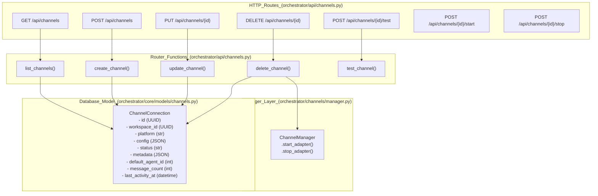
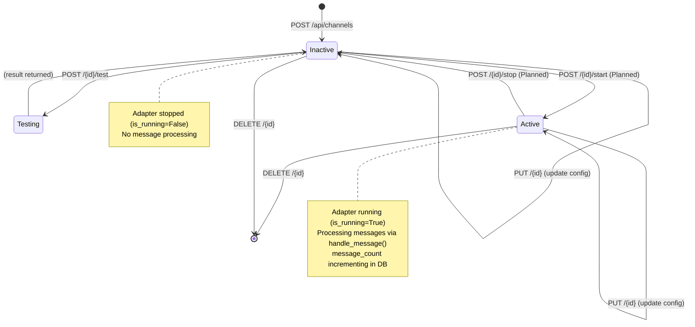
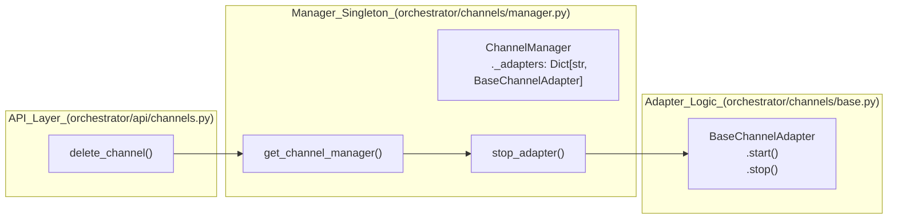

# Channel API Reference

Relevant source files

The following files were used as context for generating this wiki page:

- [docs/PRDS/55-AUTONOMOUS-ASSISTANT-PLATFORM.md](docs/PRDS/55-AUTONOMOUS-ASSISTANT-PLATFORM.md)
- [frontend/components/auth/sign-up-form.tsx](frontend/components/auth/sign-up-form.tsx)
- [orchestrator/alembic/versions/20260215_add_heartbeat_and_channels.py](orchestrator/alembic/versions/20260215_add_heartbeat_and_channels.py)
- [orchestrator/api/channels.py](orchestrator/api/channels.py)
- [orchestrator/api/heartbeat.py](orchestrator/api/heartbeat.py)
- [orchestrator/channels/base.py](orchestrator/channels/base.py)
- [orchestrator/channels/discord_adapter.py](orchestrator/channels/discord_adapter.py)
- [orchestrator/channels/google_chat_adapter.py](orchestrator/channels/google_chat_adapter.py)
- [orchestrator/channels/line_adapter.py](orchestrator/channels/line_adapter.py)
- [orchestrator/channels/manager.py](orchestrator/channels/manager.py)
- [orchestrator/channels/slack_adapter.py](orchestrator/channels/slack_adapter.py)
- [orchestrator/consumers/chatbot/smart_memory.py](orchestrator/consumers/chatbot/smart_memory.py)
- [orchestrator/core/models/channels.py](orchestrator/core/models/channels.py)
- [orchestrator/core/services/plugin_security_scanner.py](orchestrator/core/services/plugin_security_scanner.py)
- [orchestrator/modules/agents/__init__.py](orchestrator/modules/agents/__init__.py)
- [orchestrator/modules/agents/factory/__init__.py](orchestrator/modules/agents/factory/__init__.py)
- [orchestrator/modules/memory/integrations/mem0_client.py](orchestrator/modules/memory/integrations/mem0_client.py)

This page documents the HTTP API endpoints for managing channel connections (Telegram, Slack, Discord, LINE, Google Chat). These endpoints allow programmatic creation, configuration, lifecycle control, and monitoring of messaging platform integrations.

For the internal architecture and message processing pipeline, see [Channel Architecture](#12.1). For platform-specific adapter implementations, see [Platform Adapters](#12.3).

---

## Overview

The Channel API provides REST endpoints for:
- **CRUD operations** on channel connections (create, read, update, delete).
- **Lifecycle control** (start, stop, test).
- **Analytics** (message counts, activity metrics).

All endpoints require workspace-scoped authentication via `get_request_context_hybrid` [orchestrator/api/channels.py:17]() and enforce workspace isolation at the database level through the `workspace_id` foreign key on the `channel_connections` table [orchestrator/core/models/channels.py:24]().

**Sources:** [orchestrator/api/channels.py:1-42](), [orchestrator/core/models/channels.py:1-40]()

---

## Endpoint Mapping

The following diagram maps HTTP routes to handler functions and database operations:

Title: Channel API Route Mapping

**Sources:** [orchestrator/api/channels.py:22-183](), [orchestrator/core/models/channels.py:19-40](), [orchestrator/channels/manager.py:22-193]()

---

## Endpoint Reference

### List Channels

**Endpoint:** `GET /api/channels`

**Description:** Retrieve all channel connections for the current workspace [orchestrator/api/channels.py:45-50]().

**Authentication:** Required (workspace-scoped via `get_request_context_hybrid`) [orchestrator/api/channels.py:47]().

**Response Schema:**
Returns a list of channel connection objects containing `id`, `platform`, `status`, `metadata`, `default_agent_id`, `message_count`, and activity timestamps [orchestrator/api/channels.py:61-73]().

**Sources:** [orchestrator/api/channels.py:45-73]()

---

### Create Channel

**Endpoint:** `POST /api/channels`

**Description:** Create a new channel connection with platform-specific configuration. It initializes the status as `inactive` [orchestrator/api/channels.py:76-113]().

**Required Configuration by Platform:**

| Platform | Required Fields | Source |
|----------|----------------|--------|
| `telegram` | `bot_token` | [orchestrator/api/channels.py:31]() |
| `slack` | `bot_token`, `signing_secret` | [orchestrator/api/channels.py:32]() |
| `discord` | `bot_token` | [orchestrator/api/channels.py:33]() |
| `teams` | `app_id`, `app_password` | [orchestrator/api/channels.py:34]() |
| `google_chat` | `service_account_key` | [orchestrator/api/channels.py:35]() |
| `line` | `channel_access_token`, `channel_secret` | [orchestrator/api/channels.py:40]() |

**Sources:** [orchestrator/api/channels.py:24-42](), [orchestrator/api/channels.py:76-113]()

---

### Update Channel

**Endpoint:** `PUT /api/channels/{channel_id}`

**Description:** Update channel configuration or default agent routing [orchestrator/api/channels.py:116-123]().

**Response Schema:**
`{"status": "updated"}` [orchestrator/api/channels.py:150]()

**Sources:** [orchestrator/api/channels.py:116-151]()

---

### Delete Channel

**Endpoint:** `DELETE /api/channels/{channel_id}`

**Description:** Delete a channel connection and stop its adapter if running via `ChannelManager.stop_adapter` [orchestrator/api/channels.py:153-183]().

**Sources:** [orchestrator/api/channels.py:153-183](), [orchestrator/channels/manager.py:99-104]()

---

### Test Connection

**Endpoint:** `POST /api/channels/{channel_id}/test`

**Description:** Test platform API credentials by pinging the platform's API [orchestrator/api/channels.py:186-192]().

**Platform-Specific Test Behavior:**

| Platform | Implementation Detail | Source |
|----------|-----------------------|--------|
| Telegram | `GET https://api.telegram.org/bot{token}/getMe` | [orchestrator/api/channels.py:208-210]() |
| Slack | `POST https://slack.com/api/auth.test` | [orchestrator/channels/slack_adapter.py:98-113]() |
| Discord | `GET https://discord.com/api/v10/users/@me` | [orchestrator/channels/discord_adapter.py:97-112]() |
| LINE | `GET https://api.line.me/v2/bot/info` | [orchestrator/channels/line_adapter.py:53-70]() |

**Sources:** [orchestrator/api/channels.py:186-212](), [orchestrator/channels/slack_adapter.py:98-113](), [orchestrator/channels/discord_adapter.py:97-112](), [orchestrator/channels/line_adapter.py:53-70]()

---

## Channel Connection Lifecycle

The following diagram illustrates the state transitions and API calls for managing a channel connection:

Title: Channel Lifecycle State Machine

**Sources:** [orchestrator/api/channels.py:76-183](), [orchestrator/channels/base.py:28](), [orchestrator/channels/base.py:146-165]()

---

## Database Schema

The `channel_connections` table schema [orchestrator/core/models/channels.py:19-33]():

| Column | Type | Description |
|--------|------|-------------|
| `id` | PGUUID | Primary key (UUID) [orchestrator/core/models/channels.py:23]() |
| `workspace_id` | PGUUID | Workspace isolation key [orchestrator/core/models/channels.py:24]() |
| `platform` | String(50) | e.g., telegram, slack, discord [orchestrator/core/models/channels.py:25]() |
| `config` | JSON | Configuration/credentials [orchestrator/core/models/channels.py:26]() |
| `status` | String(20) | active, inactive, error [orchestrator/core/models/channels.py:27]() |
| `metadata` | JSON | Non-sensitive platform info [orchestrator/core/models/channels.py:28]() |
| `default_agent_id`| Integer | US-027: Default routing target [orchestrator/core/models/channels.py:29]() |
| `message_count` | Integer | Incremented on every message [orchestrator/core/models/channels.py:30]() |
| `last_activity_at`| DateTime | Updated on every message [orchestrator/core/models/channels.py:31]() |

**Sources:** [orchestrator/core/models/channels.py:19-40](), [orchestrator/alembic/versions/20260215_add_heartbeat_and_channels.py:42-60]()

---

## Integration with ChannelManager

The API layer interacts with the `ChannelManager` singleton to control adapter processes.

Title: API to Manager Data Flow

**Sources:** [orchestrator/api/channels.py:170-174](), [orchestrator/channels/manager.py:184-192](), [orchestrator/channels/base.py:21-52]()

---