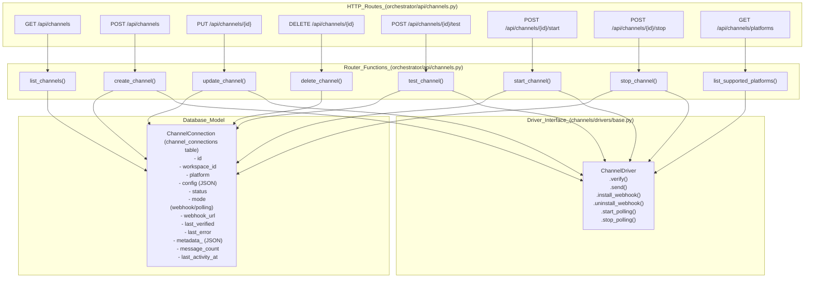

# Channel API Reference

<details>
<summary>Relevant source files</summary>

The following files were used as context for generating this wiki page:

- [docs/PRDS/55-AUTONOMOUS-ASSISTANT-PLATFORM.md](docs/PRDS/55-AUTONOMOUS-ASSISTANT-PLATFORM.md)
- [frontend/components/settings/ChannelsSettingsTab.tsx](frontend/components/settings/ChannelsSettingsTab.tsx)
- [orchestrator/alembic/versions/20260215_add_heartbeat_and_channels.py](orchestrator/alembic/versions/20260215_add_heartbeat_and_channels.py)
- [orchestrator/alembic/versions/prd008a4_channel_drivers.py](orchestrator/alembic/versions/prd008a4_channel_drivers.py)
- [orchestrator/api/channels.py](orchestrator/api/channels.py)
- [orchestrator/channels/drivers/__init__.py](orchestrator/channels/drivers/__init__.py)
- [orchestrator/channels/drivers/base.py](orchestrator/channels/drivers/base.py)
- [orchestrator/channels/drivers/discord.py](orchestrator/channels/drivers/discord.py)
- [orchestrator/channels/drivers/slack.py](orchestrator/channels/drivers/slack.py)
- [orchestrator/channels/drivers/telegram.py](orchestrator/channels/drivers/telegram.py)
- [orchestrator/channels/drivers/webhook.py](orchestrator/channels/drivers/webhook.py)
- [orchestrator/channels/drivers/whatsapp.py](orchestrator/channels/drivers/whatsapp.py)
- [orchestrator/channels/manager.py](orchestrator/channels/manager.py)
- [orchestrator/channels/telegram_adapter.py](orchestrator/channels/telegram_adapter.py)
- [orchestrator/core/models/channels.py](orchestrator/core/models/channels.py)
- [orchestrator/tests/test_channel_adapter_contract.py](orchestrator/tests/test_channel_adapter_contract.py)
- [orchestrator/tests/test_prd184_us005_legacy_channel_adapters_deleted.py](orchestrator/tests/test_prd184_us005_legacy_channel_adapters_deleted.py)

</details>


This page documents the HTTP API endpoints for managing channel connections (Telegram, Slack, Discord, WhatsApp, and Webhooks). These endpoints allow programmatic creation, configuration, lifecycle control, and monitoring of messaging platform integrations via a driver-mediated architecture.

For the internal architecture and message processing pipeline, see [Channel Architecture](#12.1). For platform-specific driver implementations, see [Platform Adapters](#12.3).

---

## Overview

The Channel API (PRD-55 US-023) provides REST endpoints for:
- **CRUD operations** on channel connections with driver-based validation [orchestrator/api/channels.py:5-11]().
- **Connectivity Modes**: Support for both `webhook` (inbound POSTs) and `polling` (long-poll loops) [orchestrator/api/channels.py:29-36]().
- **Lifecycle control**: Start/stop polling adapters and automated webhook installation [orchestrator/api/channels.py:246-324]().
- **Verification**: Real-time credential testing against platform APIs [orchestrator/api/channels.py:188-243]().

All endpoints require workspace-scoped authentication and enforce isolation through the `workspace_id` foreign key on the `channel_connections` table [orchestrator/core/models/channels.py:24-25]().

**Sources:** [orchestrator/api/channels.py:1-55](), [orchestrator/channels/drivers/base.py:10-24](), [orchestrator/core/models/channels.py:24-25]()

---

## Endpoint Mapping

The following diagram maps HTTP routes to handler functions, driver interactions, and database models.

Title: "Channel API Route Mapping"


**Sources:** [orchestrator/api/channels.py:171-761](), [orchestrator/channels/drivers/base.py:90-197](), [orchestrator/core/models/channels.py:19-45]()

---

## Endpoint Reference

### List Channels
**Endpoint:** `GET /api/channels`  
**Description:** Lists all channel connections for the current workspace. The `status` column is reconciled against `ChannelManager` at read time to reflect the actual running state of polling adapters [orchestrator/api/channels.py:177-188]().
**Response:** `List[ChannelConnection]`

### Create Channel
**Endpoint:** `POST /api/channels`  
**Description:** Creates a new channel connection. It validates the provided `config` using the platform's driver. If the mode is `webhook`, it attempts to install the webhook on the platform [orchestrator/api/channels.py:327-420]().
**Request Body:**
```json
{
  "platform": "telegram",
  "mode": "webhook",
  "config": {
    "bot_token": "YOUR_BOT_TOKEN"
  }
}
```
**Response:** `ChannelConnection`

### Get Channel Details
**Endpoint:** `GET /api/channels/{id}`  
**Description:** Retrieves details for a specific channel connection by its ID [orchestrator/api/channels.py:423-446]().
**Response:** `ChannelConnection`

### Update Channel
**Endpoint:** `PUT /api/channels/{id}`  
**Description:** Updates an existing channel connection. It re-validates the configuration and manages webhook installation/uninstallation or polling adapter restarts based on changes to `mode` or `config` [orchestrator/api/channels.py:449-600]().
**Request Body:**
```json
{
  "platform": "telegram",
  "mode": "polling",
  "config": {
    "bot_token": "YOUR_NEW_BOT_TOKEN"
  }
}
```
**Response:** `ChannelConnection`

### Delete Channel
**Endpoint:** `DELETE /api/channels/{id}`  
**Description:** Deletes a channel connection. If it's a polling adapter, it will be stopped. If it's a webhook, the webhook will be uninstalled from the platform [orchestrator/api/channels.py:603-640]().
**Response:** `{"message": "Channel connection deleted"}`

### Test Connection
**Endpoint:** `POST /api/channels/{id}/test`  
**Description:** Tests the connectivity of a channel using its driver's `verify()` method. For webhook-mode channels, it also attempts to install the webhook to ensure the URL is correctly registered [orchestrator/api/channels.py:643-700]().
**Response:** `{"status": "connected" | "error", "detail": "..."}`

### Start Polling
**Endpoint:** `POST /api/channels/{id}/start`  
**Description:** Starts the polling adapter for a channel configured in `polling` mode. This is handled by the `ChannelManager` [orchestrator/api/channels.py:703-732]().
**Response:** `{"message": "Polling started"}`

### Stop Polling
**Endpoint:** `POST /api/channels/{id}/stop`  
**Description:** Stops the polling adapter for a channel configured in `polling` mode. This is handled by the `ChannelManager` [orchestrator/api/channels.py:735-761]().
**Response:** `{"message": "Polling stopped"}`

### List Supported Platforms
**Endpoint:** `GET /api/channels/platforms`  
**Description:** Returns a list of all supported channel platforms and their configuration requirements, sourced from the `channels.drivers` registry [orchestrator/api/channels.py:171-175](). This is used by the frontend to dynamically render connection forms.
**Response:** `List[Dict[str, Any]]` (e.g., `{"id": "telegram", "name": "Telegram", "modes": ["webhook", "polling"], "required_config": [...]}`)

**Sources:** [orchestrator/api/channels.py:171-761](), [orchestrator/channels/manager.py:88-121]()

---

## Platform Driver Capabilities

Drivers define the required configuration and supported connectivity modes. Legacy adapters for Teams, Google Chat, Signal, iMessage, IRC, Matrix, and LINE have been removed in favor of the driver registry [orchestrator/tests/test_prd184_us005_legacy_channel_adapters_deleted.py:38-46]().

| Platform | Mode Support | Required Config Keys | Source |
| :--- | :--- | :--- | :--- |
| **Telegram** | Webhook, Polling | `bot_token` | [orchestrator/channels/drivers/telegram.py:55-58]() |
| **Slack** | Webhook | `bot_token`, `signing_secret` | [orchestrator/channels/drivers/slack.py:38-42]() |
| **Discord** | Webhook | `bot_token` | [orchestrator/channels/drivers/discord.py:43-46]() |
| **WhatsApp** | Webhook | `phone_number_id`, `access_token` | [orchestrator/channels/drivers/whatsapp.py:40-44]() |
| **Webhook** | Webhook (Outbound) | `webhook_url` | [orchestrator/channels/drivers/webhook.py:40-43]() |

**Sources:** [orchestrator/channels/drivers/base.py:52-55](), [orchestrator/api/channels.py:156-168](), [orchestrator/channels/drivers/telegram.py:55-58](), [orchestrator/channels/drivers/slack.py:38-42](), [orchestrator/channels/drivers/discord.py:43-46](), [orchestrator/channels/drivers/whatsapp.py:40-44](), [orchestrator/channels/drivers/webhook.py:40-43]()

---

## Channel Lifecycle State Machine

Title: "Driver-Mediated Channel Lifecycle"
```mermaid
stateDiagram-v2
    [*] --> Inactive: "Initial state or after deletion"
    
    Inactive --> Active: "POST /api/channels (create) or PUT /api/channels/{id} (update) with successful verify()"
    Active --> Error: "verify() Fails / last_error set"
    Error --> Active: "POST /api/channels/{id}/test (re-verify) succeeds"
    
    state "Active (Status)" {
        WebhookMode --> PollingMode: "PUT /api/channels/{id} changes mode to 'polling' and POST /{id}/start"
        PollingMode --> WebhookMode: "PUT /api/channels/{id} changes mode to 'webhook' and POST /{id}/stop"
        PollingMode --> PollingMode: "POST /{id}/start (idempotent)"
        WebhookMode --> WebhookMode: "POST /{id}/test (re-installs webhook)"
    }
    
    Active --> [*]: "DELETE /api/channels/{id}"
    
    note right of WebhookMode
        Platform POSTs inbound messages to
        /api/webhooks/ws/{workspace_key}
        No in-process adapter needed for ingress
        Outbound replies via driver.send()
    end note
    
    note right of PollingMode
        ChannelManager.start_adapter()
        Local process runs getUpdates loop (e.g., TelegramAdapter)
        Outbound replies via driver.send()
    end note
```

**Sources:** [orchestrator/api/channels.py:89-138](), [orchestrator/channels/manager.py:32-68](), [orchestrator/core/models/channels.py:30-39]()

---

## Database Schema: `channel_connections`

The `channel_connections` table stores the configuration and state for each channel integration. It was introduced as part of PRD-55 and extended in `prd008a4` to support the driver model [orchestrator/alembic/versions/20260215_add_heartbeat_and_channels.py:43-56](), [orchestrator/core/models/channels.py:19-45]().

| Column | Type | Description |
| :--- | :--- | :--- |
| `id` | `PGUUID` | Primary key, unique identifier for the connection. |
| `workspace_id` | `PGUUID` | Foreign key to the workspace, ensuring multi-tenancy. |
| `platform` | `String(50)` | The messaging platform (e.g., `telegram`, `slack`). |
| `config` | `JSON` | Driver-specific credentials and settings (e.g., `bot_token`, `signing_secret`). |
| `status` | `String(20)` | Current status: `active`, `inactive`, `error`. Default `inactive`. |
| `mode` | `String(20)` | Connectivity mode: `webhook` or `polling`. Default `webhook`. |
| `webhook_url` | `String` | The URL the platform should POST inbound traffic to (if in webhook mode). |
| `last_verified` | `DateTime` | Timestamp of the last successful `verify()` operation. |
| `last_error` | `String` | The error message from the most recent verification or operation failure. |
| `metadata_` | `JSON` | Additional metadata returned by the driver during verification (e.g., bot username, team ID). |
| `default_agent_id` | `Integer` | Optional ID of an agent to route messages to by default. |
| `message_count` | `Integer` | Counter for messages processed through this channel. |
| `last_activity_at` | `DateTime` | Timestamp of the last message activity on this channel. |
| `created_at` | `DateTime` | Timestamp of creation. |
| `updated_at` | `DateTime` | Timestamp of last update. |

**Sources:** [orchestrator/core/models/channels.py:19-45](), [orchestrator/alembic/versions/20260215_add_heartbeat_and_channels.py:43-56]()

---

## Technical Implementation Details

### Webhook Provisioning
The `_webhook_url_for` helper function [orchestrator/api/channels.py:67-78]() constructs the inbound webhook URL. This URL incorporates the workspace's `webhook_key` [orchestrator/api/channels.py:73-78](), which serves as a URL-as-secret for authenticating incoming requests without requiring additional headers. This ensures that only requests with the correct, unique key are processed.

### Polling Reconciliation
The `ChannelManager` [orchestrator/channels/manager.py:22-225]() is responsible for managing the lifecycle of polling adapters. During `list_channels` [orchestrator/api/channels.py:177-188](), the API checks `ChannelManager.is_running(connection_id)` [orchestrator/channels/manager.py:176-187](). If the database `status` is `inactive` but the `ChannelManager` reports the adapter as running (e.g., due to an orchestrator restart or a crash/restart mismatch), the API updates the database status to `active` to reflect the true state.

### Contract Enforcement
All channel drivers must adhere to the `ChannelDriver` abstract base class [orchestrator/channels/drivers/base.py:95-197](). This contract mandates the implementation of `verify()` and `send()` methods. Drivers supporting polling must also implement `start_polling()` and `stop_polling()`, while webhook-capable drivers implement `install_webhook()` and `uninstall_webhook()`. The `test_channel_adapter_contract.py` [orchestrator/tests/test_channel_adapter_contract.py:149-157]() ensures that all concrete adapter implementations (e.g., `TelegramAdapter` [orchestrator/channels/telegram_adapter.py:19-258]()) conform to this interface, preventing silent breakage during refactors.

### Frontend UI (`ChannelsSettingsTab`)
The `ChannelsSettingsTab.tsx` [frontend/components/settings/ChannelsSettingsTab.tsx:155-434]() component in the frontend provides the user interface for managing channel connections. It dynamically renders input fields based on the `required_config` and `optional_config` defined by each driver [frontend/components/settings/ChannelsSettingsTab.tsx:26-134](). It also handles the display of connection status, errors, and allows users to initiate `connect`, `test`, `start`, `stop`, and `delete` actions by calling the respective API endpoints [frontend/components/settings/ChannelsSettingsTab.tsx:181-370](). The `MULTI_MODE_PLATFORMS` constant [frontend/components/settings/ChannelsSettingsTab.tsx:140-153]() determines which platforms offer a choice between webhook and polling modes.

**Sources:** [orchestrator/api/channels.py:61-78](), [orchestrator/channels/manager.py:176-187](), [orchestrator/tests/test_channel_adapter_contract.py:1-49](), [orchestrator/channels/drivers/base.py:95-197](), [frontend/components/settings/ChannelsSettingsTab.tsx:1-434]()

---