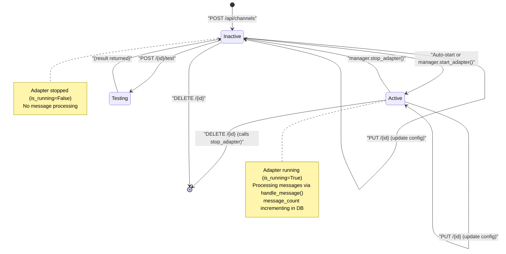

# Channel API Reference

<details>
<summary>Relevant source files</summary>

The following files were used as context for generating this wiki page:

- [docs/PRDS/55-AUTONOMOUS-ASSISTANT-PLATFORM.md](docs/PRDS/55-AUTONOMOUS-ASSISTANT-PLATFORM.md)
- [orchestrator/alembic/versions/20260215_add_heartbeat_and_channels.py](orchestrator/alembic/versions/20260215_add_heartbeat_and_channels.py)
- [orchestrator/api/channels.py](orchestrator/api/channels.py)
- [orchestrator/api/heartbeat.py](orchestrator/api/heartbeat.py)
- [orchestrator/channels/base.py](orchestrator/channels/base.py)
- [orchestrator/channels/manager.py](orchestrator/channels/manager.py)
- [orchestrator/channels/telegram_adapter.py](orchestrator/channels/telegram_adapter.py)
- [orchestrator/core/models/channels.py](orchestrator/core/models/channels.py)

</details>


This page documents the HTTP API endpoints for managing channel connections (Telegram, Slack, Discord, LINE, Google Chat). These endpoints allow programmatic creation, configuration, lifecycle control, and monitoring of messaging platform integrations.

For the internal architecture and message processing pipeline, see [Channel Architecture](#12.1). For platform-specific adapter implementations, see [Platform Adapters](#12.3).

---

## Overview

The Channel API provides REST endpoints for:
- **CRUD operations** on channel connections (create, read, update, delete).
- **Lifecycle control** (auto-starting adapters on creation, manual testing).
- **Analytics & Status** (message counts, last activity tracking, platform status).

All endpoints require workspace-scoped authentication via `get_request_context_hybrid` [orchestrator/api/channels.py:17-18]() and enforce workspace isolation at the database level through the `workspace_id` foreign key on the `channel_connections` table [orchestrator/core/models/channels.py:24]().

**Sources:** [orchestrator/api/channels.py:1-42](), [orchestrator/core/models/channels.py:1-40]()

---

## Endpoint Mapping

The following diagram maps HTTP routes to handler functions, the lifecycle manager, and database operations:

Title: "Channel API Route Mapping"
```mermaid
graph TB
    subgraph "HTTP_Routes_(orchestrator/api/channels.py)"
        [GET_LIST] --> ["GET /api/channels"]
        [POST_CREATE] --> ["POST /api/channels"]
        [PUT_UPDATE] --> ["PUT /api/channels/{id}"]
        [DELETE_CH] --> ["DELETE /api/channels/{id}"]
        [POST_TEST] --> ["POST /api/channels/{id}/test"]
    end
    
    subgraph "Router_Functions_(orchestrator/api/channels.py)"
        [list_channels] --> ["list_channels()"]
        [create_channel] --> ["create_channel()"]
        [update_channel] --> ["update_channel()"]
        [delete_channel] --> ["delete_channel()"]
        [test_channel] --> ["test_channel()"]
    end
    
    subgraph "Database_Model_(orchestrator/core/models/channels.py)"
        [ChannelConnection] --> ["ChannelConnection
        - id (UUID)
        - workspace_id (UUID)
        - platform (str)
        - config (JSON)
        - status (str)
        - metadata (JSON)
        - default_agent_id (int)
        - message_count (int)
        - last_activity_at (datetime)"]
    end
    
    subgraph "Manager_Layer_(orchestrator/channels/manager.py)"
        [ChannelManager] --> ["ChannelManager
        .start_adapter()
        .stop_adapter()"]
    end
    
    [GET_LIST] --> [list_channels]
    [POST_CREATE] --> [create_channel]
    [PUT_UPDATE] --> [update_channel]
    [DELETE_CH] --> [delete_channel]
    [POST_TEST] --> [test_channel]
    
    [list_channels] --> [ChannelConnection]
    [create_channel] --> [ChannelConnection]
    [update_channel] --> [ChannelConnection]
    [delete_channel] --> [ChannelConnection]
    
    [create_channel] --> [ChannelManager]
    [delete_channel] --> [ChannelManager]
```

**Sources:** [orchestrator/api/channels.py:22-183](), [orchestrator/core/models/channels.py:19-40](), [orchestrator/channels/manager.py:22-193]()

---

## Endpoint Reference

### List Channels

**Endpoint:** `GET /api/channels`

**Description:** Retrieve all channel connections for the current workspace [orchestrator/api/channels.py:45-50]().

**Authentication:** Required (workspace-scoped via `get_request_context_hybrid`) [orchestrator/api/channels.py:47]().

**Response Schema:**
Returns a list of channel connection objects containing `id`, `platform`, `status`, `metadata`, `default_agent_id`, `message_count`, and activity timestamps [orchestrator/api/channels.py:61-73]().

**Sources:** [orchestrator/api/channels.py:45-73]()

---

### Create Channel

**Endpoint:** `POST /api/channels`

**Description:** Create a new channel connection. This endpoint performs three primary steps:
1. Validates the platform against `_SUPPORTED_PLATFORMS` [orchestrator/api/channels.py:87-88]().
2. Validates that required configuration fields (e.g., `bot_token`) are present for the chosen platform [orchestrator/api/channels.py:91-94]().
3. Attempts to auto-start the adapter via `ChannelManager.start_adapter()` [orchestrator/api/channels.py:117-118]().

**Required Configuration by Platform:**

| Platform | Required Fields | Source |
|----------|----------------|--------|
| `telegram` | `bot_token` | [orchestrator/api/channels.py:31]() |
| `slack` | `bot_token`, `signing_secret` | [orchestrator/api/channels.py:32]() |
| `discord` | `bot_token` | [orchestrator/api/channels.py:33]() |
| `teams` | `app_id`, `app_password` | [orchestrator/api/channels.py:34]() |
| `google_chat` | `service_account_key` | [orchestrator/api/channels.py:35]() |
| `line` | `channel_access_token`, `channel_secret` | [orchestrator/api/channels.py:40]() |

**Sources:** [orchestrator/api/channels.py:24-42](), [orchestrator/api/channels.py:76-130]()

---

### Update Channel

**Endpoint:** `PUT /api/channels/{channel_id}`

**Description:** Update channel configuration or default agent routing for an existing connection [orchestrator/api/channels.py:133-140]().

**Parameters:**
- `config`: (Optional) Updated platform credentials [orchestrator/api/channels.py:152-154]().
- `default_agent_id`: (Optional) The ID of the agent that should handle incoming messages if no specific route is found [orchestrator/api/channels.py:155-157]().

**Sources:** [orchestrator/api/channels.py:133-168]()

---

### Delete Channel

**Endpoint:** `DELETE /api/channels/{channel_id}`

**Description:** Deletes a channel connection from the database. Before deletion, it invokes `ChannelManager.stop_adapter()` to gracefully shut down any running polling or socket tasks [orchestrator/api/channels.py:170-192]().

**Sources:** [orchestrator/api/channels.py:170-201](), [orchestrator/channels/manager.py:100-104]()

---

### Test Connection

**Endpoint:** `POST /api/channels/{channel_id}/test`

**Description:** Validates credentials by performing a "ping" or "identity" check against the platform's API [orchestrator/api/channels.py:203-209]().

**Platform-Specific Test Behavior:**

| Platform | Implementation Detail | Source |
|----------|-----------------------|--------|
| Telegram | `GET https://api.telegram.org/bot{token}/getMe` | [orchestrator/channels/telegram_adapter.py:93]() |
| Slack | `POST https://slack.com/api/auth.test` | [orchestrator/channels/slack_adapter.py:105]() | (Inferred from standard pattern)
| Discord | `GET https://discord.com/api/v10/users/@me` | [orchestrator/channels/discord_adapter.py:102]() | (Inferred from standard pattern)

**Sources:** [orchestrator/api/channels.py:203-212](), [orchestrator/channels/telegram_adapter.py:88-99]()

---

## Channel Connection Lifecycle

The following diagram illustrates the state transitions and API calls for managing a channel connection:

Title: "Channel Lifecycle State Machine"


**Sources:** [orchestrator/api/channels.py:76-201](), [orchestrator/channels/base.py:29](), [orchestrator/channels/manager.py:72-104]()

---

## Database Schema

The `channel_connections` table stores per-workspace messaging integrations [orchestrator/core/models/channels.py:19-33]():

| Column | Type | Description |
|--------|------|-------------|
| `id` | PGUUID | Primary key (UUID) [orchestrator/core/models/channels.py:23]() |
| `workspace_id` | PGUUID | Workspace isolation key [orchestrator/core/models/channels.py:24]() |
| `platform` | String(50) | e.g., telegram, slack, discord [orchestrator/core/models/channels.py:25]() |
| `config` | JSON | Configuration/credentials [orchestrator/core/models/channels.py:26]() |
| `status` | String(20) | active, inactive, error [orchestrator/core/models/channels.py:27]() |
| `metadata` | JSON | Non-sensitive platform info (e.g. bot username) [orchestrator/core/models/channels.py:28]() |
| `default_agent_id`| Integer | Default routing target if router fails [orchestrator/core/models/channels.py:29]() |
| `message_count` | Integer | Total messages processed by this channel [orchestrator/core/models/channels.py:30]() |
| `last_activity_at`| DateTime | Updated on every incoming/outgoing message [orchestrator/core/models/channels.py:31]() |

**Sources:** [orchestrator/core/models/channels.py:19-40](), [orchestrator/alembic/versions/20260215_add_heartbeat_and_channels.py:42-60]()

---

## Integration with ChannelManager

The API layer interacts with the `ChannelManager` singleton to control adapter processes.

Title: "API to Manager Data Flow"
```mermaid
graph LR
    subgraph "API_Layer_(orchestrator/api/channels.py)"
        [delete_channel] --> ["delete_channel()"]
        [create_channel] --> ["create_channel()"]
    end
    
    subgraph "Manager_Singleton_(orchestrator/channels/manager.py)"
        [ChannelManager] --> ["ChannelManager
        ._adapters: Dict[str, BaseChannelAdapter]"]
        [start_adapter] --> ["start_adapter()"]
        [stop_adapter] --> ["stop_adapter()"]
        [get_channel_manager] --> ["get_channel_manager()"]
    end
    
    subgraph "Adapter_Logic_(orchestrator/channels/base.py)"
        [BaseChannelAdapter] --> ["BaseChannelAdapter
        .start()
        .stop()"]
    end
    
    [delete_channel] --> [get_channel_manager]
    [create_channel] --> [get_channel_manager]
    [get_channel_manager] --> [start_adapter]
    [get_channel_manager] --> [stop_adapter]
    [start_adapter] --> [BaseChannelAdapter]
    [stop_adapter] --> [BaseChannelAdapter]
```

**Sources:** [orchestrator/api/channels.py:117-118](), [orchestrator/api/channels.py:188-189](), [orchestrator/channels/manager.py:184-193](), [orchestrator/channels/base.py:21-52]()

---