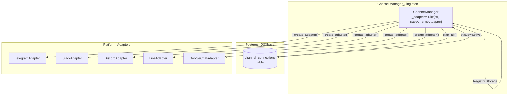
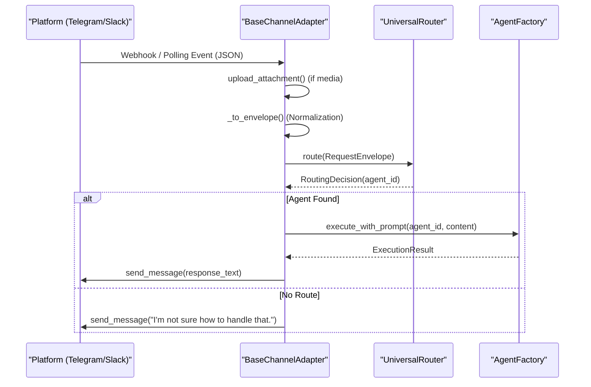

# Channel Architecture

<details>
<summary>Relevant source files</summary>

The following files were used as context for generating this wiki page:

- [docs/PRDS/55-AUTONOMOUS-ASSISTANT-PLATFORM.md](docs/PRDS/55-AUTONOMOUS-ASSISTANT-PLATFORM.md)
- [orchestrator/alembic/versions/20260215_add_heartbeat_and_channels.py](orchestrator/alembic/versions/20260215_add_heartbeat_and_channels.py)
- [orchestrator/api/channels.py](orchestrator/api/channels.py)
- [orchestrator/api/heartbeat.py](orchestrator/api/heartbeat.py)
- [orchestrator/channels/base.py](orchestrator/channels/base.py)
- [orchestrator/channels/manager.py](orchestrator/channels/manager.py)
- [orchestrator/channels/telegram_adapter.py](orchestrator/channels/telegram_adapter.py)
- [orchestrator/core/models/channels.py](orchestrator/core/models/channels.py)

</details>


The Channel Architecture defines the base framework for integrating external messaging platforms (Telegram, Slack, Discord, LINE, Google Chat) into the Automatos routing pipeline. This architecture enables the platform to act as an "always-on" autonomous assistant by meeting users on their preferred communication platforms, as defined in PRD-55 [docs/PRDS/55-AUTONOMOUS-ASSISTANT-PLATFORM.md:12-22]().

---

## Core Components

The channel system is built on three foundational components: `BaseChannelAdapter` (abstract interface), `ChannelManager` (lifecycle orchestrator), and `ChannelConnection` (database model).

### BaseChannelAdapter

`BaseChannelAdapter` is the abstract base class for all platform adapters. It provides the lifecycle hooks, message handling pipeline, and attachment handling for multimodal support.

**Class Diagram: Adapter Hierarchy**
```mermaid
classDiagram
    class "BaseChannelAdapter" {
        +"connection_id: str"
        +"workspace_id: str"
        +"config: Dict"
        +"is_running: bool"
        +start() async*
        +stop() async*
        +send_message(channel_id, text) async*
        +test_connection() async*
        +upload_attachment(content, filename) async
        +handle_message(platform_message) async
        #_to_envelope(platform_message) RequestEnvelope*
    }
    
    class "TelegramAdapter" {
        -_app: Application
        -_task: asyncio.Task
        +_on_message(update, context) async
        +_on_command(update, context) async
    }
    
    class "SlackAdapter" {
        -_app: AsyncApp
        -_handler: AsyncSocketModeHandler
    }
    
    class "DiscordAdapter" {
        -_client: discord.Client
        -_task: asyncio.Task
    }

    class "LineAdapter" {
        -_channel_access_token: str
        +handle_webhook(body) async
    }

    class "GoogleChatAdapter" {
        -_service_account_json: str
        -_credentials: Credentials
    }
    
    "BaseChannelAdapter" <|-- "TelegramAdapter"
    "BaseChannelAdapter" <|-- "SlackAdapter"
    "BaseChannelAdapter" <|-- "DiscordAdapter"
    "BaseChannelAdapter" <|-- "LineAdapter"
    "BaseChannelAdapter" <|-- "GoogleChatAdapter"
```

**Key Features:**
- **Lifecycle Management**: Abstract `start` and `stop` methods for managing platform-specific connections. For example, `TelegramAdapter` uses `ApplicationBuilder` and `start_polling()` [orchestrator/channels/telegram_adapter.py:27-51](), while others use socket mode or webhooks [orchestrator/channels/base.py:35-43]().
- **Attachment Handling**: `upload_attachment` integrates with `get_attachment_store` to persist inbound media (photos, documents) from channels, enabling multimodal agent reasoning via `attachment_ids` [orchestrator/channels/base.py:70-106]().
- **Ingest Pipeline**: `handle_message` orchestrates the flow from platform event to `UniversalRouter` and `AgentFactory` [orchestrator/channels/base.py:112-192]().

**Sources:** [orchestrator/channels/base.py:22-192](), [orchestrator/channels/telegram_adapter.py:19-72](), [orchestrator/channels/manager.py:123-135]()

### ChannelConnection Model

The `ChannelConnection` model stores per-workspace channel configurations, including encrypted credentials and default routing targets.

| Column | Type | Description |
|--------|------|-------------|
| `id` | UUID | Primary key [orchestrator/core/models/channels.py:23]() |
| `workspace_id` | UUID | Workspace isolation key [orchestrator/core/models/channels.py:24]() |
| `platform` | String | Identifier (e.g., `telegram`, `slack`, `discord`) [orchestrator/core/models/channels.py:25]() |
| `config` | JSON | Credentials like `bot_token` [orchestrator/core/models/channels.py:26]() |
| `status` | String | Connection state: `active`, `inactive`, `error` [orchestrator/core/models/channels.py:27]() |
| `default_agent_id` | Integer | Target agent for unrouted messages [orchestrator/core/models/channels.py:29]() |
| `message_count` | Integer | Analytics: Total messages processed [orchestrator/core/models/channels.py:30]() |

**Sources:** [orchestrator/core/models/channels.py:19-40](), [orchestrator/alembic/versions/20260215_add_heartbeat_and_channels.py:43-57]()

### ChannelManager

`ChannelManager` is a singleton service responsible for the global lifecycle of all active adapters. It manages the transition from database records to running process instances.

**Component Interaction: Registry & Lifecycle**


**Key Methods:**
- `start_all()`: Queries the DB for all `active` connections and initializes their adapters via `start_adapter` [orchestrator/channels/manager.py:32-56]().
- `stop_all()`: Gracefully shuts down every registered adapter in the `_adapters` dictionary [orchestrator/channels/manager.py:58-66]().
- `_create_adapter()`: A factory method that uses `importlib.import_module` to load platform-specific modules only when needed [orchestrator/channels/manager.py:110-161]().

**Sources:** [orchestrator/channels/manager.py:22-194]()

---

## Message Pipeline

The message pipeline bridges the gap between external "Platform Events" and internal "Code Entities" like the `UniversalRouter` and `AgentFactory`.

**Sequence Diagram: Natural Language to Code Execution**


### Pipeline Stages

1.  **Normalization (`_to_envelope`)**: Adapters translate platform-specific payloads into a standard `RequestEnvelope`. For `TelegramAdapter`, this occurs inside `_on_message` [orchestrator/channels/telegram_adapter.py:148-185]().
2.  **Routing**: The `UniversalRouter` uses the envelope's content and workspace context to select the best agent [orchestrator/channels/base.py:143-144]().
3.  **Execution**: `AgentFactory.execute_with_prompt` runs the agent logic, including multi-modal resolution if `attachment_ids` are present [orchestrator/channels/base.py:163-173]().
4.  **Analytics**: After execution, the adapter calls `_update_activity_stats` to update the `message_count` and `last_activity_at` in the `channel_connections` table [orchestrator/channels/base.py:186-192]().

**Sources:** [orchestrator/channels/base.py:112-192](), [orchestrator/channels/telegram_adapter.py:148-210]()

---

## Adapter Registry & Factory

The `ChannelManager` maintains an internal `_ADAPTER_MAP` mapping platform identifiers to their respective implementation classes [orchestrator/channels/manager.py:123-135]().

| Platform | Adapter Class | Module Path |
| :--- | :--- | :--- |
| `telegram` | `TelegramAdapter` | `.telegram_adapter` |
| `slack` | `SlackAdapter` | `.slack_adapter` |
| `discord` | `DiscordAdapter` | `.discord_adapter` |
| `teams` | `TeamsAdapter` | `.teams_adapter` |
| `google_chat` | `GoogleChatAdapter` | `.google_chat_adapter` |
| `line` | `LineAdapter` | `.line_adapter` |

**Dynamic Loading Implementation**:
The factory uses `importlib.import_module` within `_create_adapter` to load the adapter code only when a connection of that type is started. This prevents the entire system from failing if a specific platform's dependencies (e.g., `python-telegram-bot`) are missing [orchestrator/channels/manager.py:143-154]().

**Sources:** [orchestrator/channels/manager.py:122-161]()

---

## API & Management

Channel connections are managed via the `/api/channels` router [orchestrator/api/channels.py:22]().

- **Listing**: `GET /api/channels` returns all connections for the current workspace, including `status` and `message_count` [orchestrator/api/channels.py:45-73]().
- **Creation**: `POST /api/channels` validates required configuration fields (e.g., `bot_token` for Telegram) before inserting into the `channel_connections` table [orchestrator/api/channels.py:76-114](). It also attempts to auto-start the adapter using `manager.start_adapter` [orchestrator/api/channels.py:115-130]().
- **Testing**: `POST /api/channels/{channel_id}/test` performs a live ping to the platform API (e.g., `getMe` for Telegram) to verify credentials [orchestrator/api/channels.py:203-233]().
- **Lifecycle Control**: Deleting a channel via `DELETE /api/channels/{channel_id}` automatically triggers `manager.stop_adapter(channel_id)` to kill background tasks before removing the database record [orchestrator/api/channels.py:170-201]().

**Sources:** [orchestrator/api/channels.py:22-242](), [orchestrator/channels/telegram_adapter.py:88-99]()

---