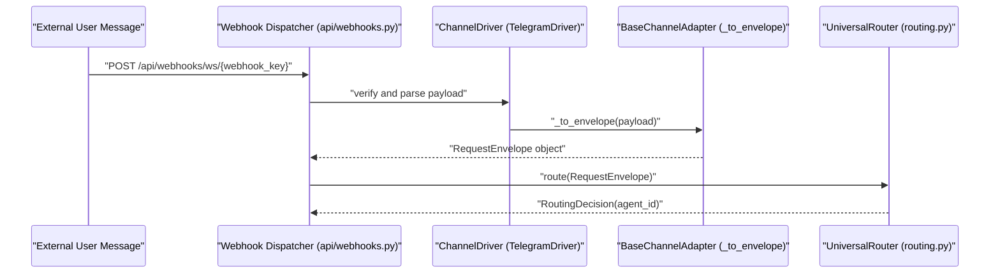

# Channel Architecture

<details>
<summary>Relevant source files</summary>

The following files were used as context for generating this wiki page:

- [docs/PRDS/55-AUTONOMOUS-ASSISTANT-PLATFORM.md](docs/PRDS/55-AUTONOMOUS-ASSISTANT-PLATFORM.md)
- [frontend/components/settings/ChannelsSettingsTab.tsx](frontend/components/settings/ChannelsSettingsTab.tsx)
- [orchestrator/alembic/versions/20260215_add_heartbeat_and_channels.py](orchestrator/alembic/versions/20260215_add_heartbeat_and_channels.py)
- [orchestrator/alembic/versions/prd008a4_channel_drivers.py](orchestrator/alembic/versions/prd008a4_channel_drivers.py)
- [orchestrator/api/channels.py](orchestrator/api/channels.py)
- [orchestrator/channels/drivers/__init__.py](orchestrator/channels/drivers/__init__.py)
- [orchestrator/channels/drivers/base.py](orchestrator/channels/drivers/base.py)
- [orchestrator/channels/drivers/discord.py](orchestrator/channels/drivers/discord.py)
- [orchestrator/channels/drivers/slack.py](orchestrator/channels/drivers/slack.py)
- [orchestrator/channels/drivers/telegram.py](orchestrator/channels/drivers/telegram.py)
- [orchestrator/channels/drivers/webhook.py](orchestrator/channels/drivers/webhook.py)
- [orchestrator/channels/drivers/whatsapp.py](orchestrator/channels/drivers/whatsapp.py)
- [orchestrator/channels/manager.py](orchestrator/channels/manager.py)
- [orchestrator/channels/telegram_adapter.py](orchestrator/channels/telegram_adapter.py)
- [orchestrator/core/models/channels.py](orchestrator/core/models/channels.py)
- [orchestrator/tests/test_channel_adapter_contract.py](orchestrator/tests/test_channel_adapter_contract.py)
- [orchestrator/tests/test_prd184_us005_legacy_channel_adapters_deleted.py](orchestrator/tests/test_prd184_us005_legacy_channel_adapters_deleted.py)

</details>


## Purpose and Scope

The Channel Architecture defines the technical framework for integrating external messaging platforms—specifically Telegram, Slack, Discord, WhatsApp, and generic webhooks—into the Automatos AI routing pipeline [orchestrator/api/channels.py:2-11](), [docs/PRDS/55-AUTONOMOUS-ASSISTANT-PLATFORM.md:33-37](). This subsystem enables the platform to operate as an always-on assistant by handling inbound communication, tracking message delivery metrics, enforcing tenant isolation, and managing platform-specific connection lifecycles [orchestrator/channels/manager.py:1-10](), [orchestrator/tests/test_channel_adapter_contract.py:14-48]().

---

## 1. Driver-Mediated Contract & Registry (`ChannelDriver` & `BaseChannelAdapter`)

The channel integration subsystem separates platform-agnostic management from platform-specific execution using a **Driver-Mediated Registry** [orchestrator/api/channels.py:5-11](). Stateless platform drivers (`ChannelDriver` subclasses) handle credential verification, message transmission, and webhook installation, while stateful adapters (`BaseChannelAdapter` subclasses) manage background polling loops and event ingestion [orchestrator/channels/drivers/base.py:95-181](), [orchestrator/channels/telegram_adapter.py:19-58]().

### Diagram: Natural Language Space to Code Entity Space (Driver Architecture)

```mermaid
classDiagram
    direction TB
    class "Telegram Bot Driver" {
        +String display_name = "Telegram"
        +Tuple supported_modes = (WEBHOOK, POLLING)
    }
    class "TelegramDriver" {
        +verify(workspace_id, config) VerifyResult
        +send(workspace_id, config, target, text) SendResult
        +install_webhook(workspace_id, config, webhook_url) VerifyResult
    }
    class "Slack Bot Driver" {
        +String display_name = "Slack"
        +Tuple supported_modes = (WEBHOOK)
    }
    class "SlackDriver" {
        +verify(workspace_id, config) VerifyResult
        +send(workspace_id, config, target, text) SendResult
        +install_webhook(workspace_id, config, webhook_url) VerifyResult
    }

    "Telegram Bot Driver" --> TelegramDriver : "implemented by orchestrator/channels/drivers/telegram.py"
    "Slack Bot Driver" --> SlackDriver : "implemented by orchestrator/channels/drivers/slack.py"

    class "ChannelDriver" {
        <<abstract>>
        +verify()* VerifyResult
        +send()* SendResult
        +install_webhook() VerifyResult
    }

    ChannelDriver <|-- TelegramDriver : "inherits from"
    ChannelDriver <|-- SlackDriver : "inherits from"
```

The driver abstract base class establishes strict typing via `VerifyResult`, `SendResult`, and `ConnectivityMode` (`WEBHOOK` vs `POLLING`) [orchestrator/channels/drivers/base.py:52-90](). Every driver must be stateless and accept the workspace identifier and configuration maps via method parameters rather than database state [orchestrator/channels/drivers/base.py:95-97]().

Sources: `orchestrator/channels/drivers/base.py:52-181`, `orchestrator/channels/drivers/telegram.py:53-100`, `orchestrator/channels/drivers/slack.py:36-78`, `orchestrator/tests/test_channel_adapter_contract.py:14-48`

---

## 2. ChannelManager Lifecycle Control

The `ChannelManager` class coordinates the runtime lifecycles of active channel connections across the orchestrator [orchestrator/channels/manager.py:22-27](). 

### Startup and Polling Execution
During system boot, `ChannelManager.start_all()` queries the database for active channel records operating in `polling` mode and spins up their respective adapter loops [orchestrator/channels/manager.py:32-68](). 
* **Webhook Skip**: Webhook-mode connections are intentionally skipped during `start_all()` because incoming messages post directly to `/api/webhooks/ws/{workspace_key}` without requiring an in-process daemon [orchestrator/channels/manager.py:36-41]().
* **Lazy Loading**: Platform adapters are imported dynamically via `importlib` within `_create_adapter()` to prevent heavy optional SDK dependencies (such as `python-telegram-bot`) from causing import failures when unused [orchestrator/channels/manager.py:126-170]().

Sources: `orchestrator/channels/manager.py:22-197`

---

## 3. ChannelConnection Model & Persistence

Per-workspace messaging integrations are persisted via the `ChannelConnection` SQLAlchemy model [orchestrator/core/models/channels.py:19-51]().

### Table Schema (`channel_connections`)
- `id`: `PGUUID` primary key generated via `uuid4()` [orchestrator/core/models/channels.py:23]()
- `workspace_id`: `PGUUID` foreign key enforcing tenant isolation, indexed for fast lookup [orchestrator/core/models/channels.py:24]()
- `platform`: String identifier for the messaging provider (e.g., `telegram`, `slack`, `discord`, `whatsapp`) [orchestrator/core/models/channels.py:25]()
- `config`: JSONB payload storing platform credentials and settings securely [orchestrator/core/models/channels.py:29]()
- `status`: String state indicator (`active`, `inactive`, or `error`) [orchestrator/core/models/channels.py:30]()
- `mode`: String connectivity mode (`webhook` or `polling`) [orchestrator/core/models/channels.py:36]()
- `message_count`: Integer tracking total inbound/outbound throughput [orchestrator/core/models/channels.py:42]()
- `last_activity_at`: Timestamp recording the most recent message exchange [orchestrator/core/models/channels.py:43]()

Sources: `orchestrator/core/models/channels.py:19-51`, `orchestrator/alembic/versions/20260215_add_heartbeat_and_channels.py:42-60`

---

## 4. Message Pipeline & Ingress

The message pipeline normalizes inbound platform events into internal `RequestEnvelope` objects and dispatches them to the routing engine [orchestrator/channels/telegram_adapter.py:6-6]().

### Diagram: Natural Language Space to Code Entity Space (Message Pipeline)



### Pipeline Guarantees
1. **Contract Uniformity**: Subclasses of `BaseChannelAdapter` implement standardized handlers for normalization and envelope dispatch [orchestrator/tests/test_channel_adapter_contract.py:16-22]().
2. **Activity Accounting**: `BaseChannelAdapter._update_activity_stats` executes an atomic SQL increment on `message_count` and updates `last_activity_at` restricted strictly to the adapter's connection ID [orchestrator/tests/test_channel_adapter_contract.py:23-27]().
3. **Tenant Security**: `workspace_id` is bound immutably at adapter instantiation, preventing payload-level spoofing across workspace boundaries [orchestrator/tests/test_channel_adapter_contract.py:28-34]().

Sources: `orchestrator/channels/telegram_adapter.py:1-167`, `orchestrator/tests/test_channel_adapter_contract.py:14-48`

---

## 5. Management API & Frontend UI

Platform-agnostic REST endpoints handle configuration CRUD and credential verification under `/api/channels` [orchestrator/api/channels.py:5-46]().

### Key Endpoints & Helpers
- `GET /api/channels`: Lists all workspace connections, reconciling DB status flags with runtime checks from `ChannelManager` [orchestrator/api/channels.py:177-188]().
- `POST /api/channels`: Validates required configuration keys against driver definitions before persistence [orchestrator/api/channels.py:156-168]().
- `_save_verify_outcome`: Persists verification metrics (`status`, `last_verified`, `last_error`, and merged JSON metadata) safely without raising unhandled exceptions [orchestrator/api/channels.py:95-148]().

### Frontend Integration
The frontend settings interface (`ChannelsSettingsTab.tsx`) consumes these APIs to render platform configuration cards, multi-mode selectors (such as webhook versus polling for Telegram), and interactive connection validation triggers [frontend/components/settings/ChannelsSettingsTab.tsx:137-189]().

Sources: `orchestrator/api/channels.py:95-188`, `frontend/components/settings/ChannelsSettingsTab.tsx:137-189`

---