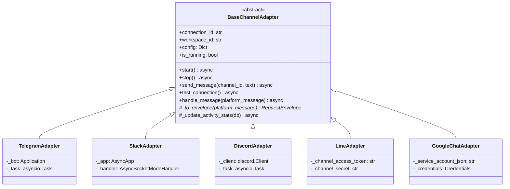
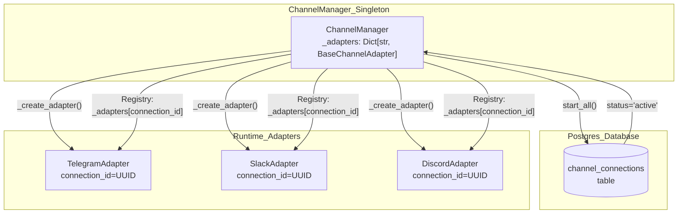
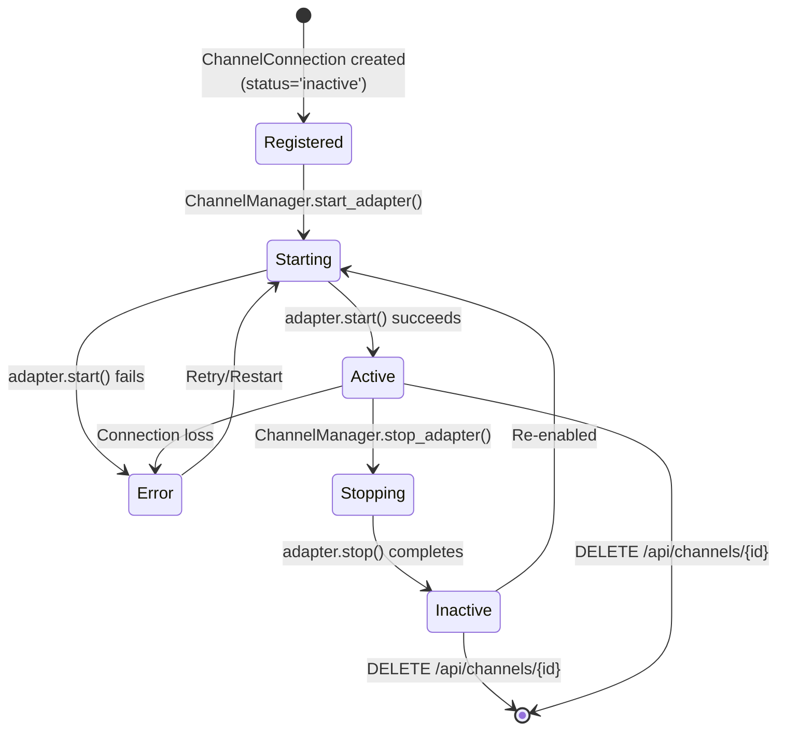
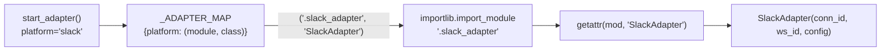
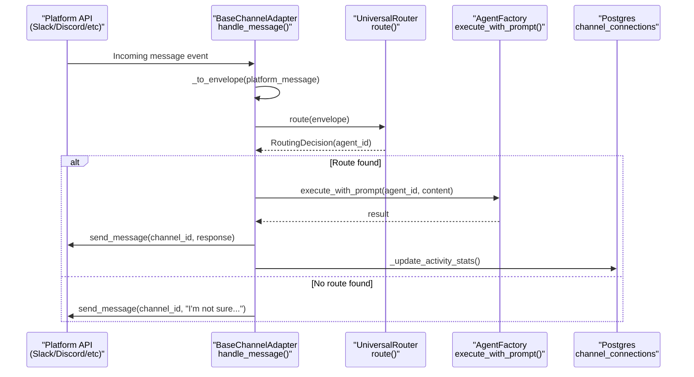

# Channel Architecture

<details>
<summary>Relevant source files</summary>

The following files were used as context for generating this wiki page:

- [docs/PRDS/55-AUTONOMOUS-ASSISTANT-PLATFORM.md](docs/PRDS/55-AUTONOMOUS-ASSISTANT-PLATFORM.md)
- [frontend/components/auth/sign-up-form.tsx](frontend/components/auth/sign-up-form.tsx)
- [orchestrator/alembic/versions/20260215_add_heartbeat_and_channels.py](orchestrator/alembic/versions/20260215_add_heartbeat_and_channels.py)
- [orchestrator/api/channels.py](orchestrator/api/channels.py)
- [orchestrator/api/heartbeat.py](orchestrator/api/heartbeat.py)
- [orchestrator/channels/base.py](orchestrator/channels/base.py)
- [orchestrator/channels/discord_adapter.py](orchestrator/channels/discord_adapter.py)
- [orchestrator/channels/google_chat_adapter.py](orchestrator/channels/google_chat_adapter.py)
- [orchestrator/channels/line_adapter.py](orchestrator/channels/line_adapter.py)
- [orchestrator/channels/manager.py](orchestrator/channels/manager.py)
- [orchestrator/channels/slack_adapter.py](orchestrator/channels/slack_adapter.py)
- [orchestrator/consumers/chatbot/smart_memory.py](orchestrator/consumers/chatbot/smart_memory.py)
- [orchestrator/core/models/channels.py](orchestrator/core/models/channels.py)
- [orchestrator/core/services/plugin_security_scanner.py](orchestrator/core/services/plugin_security_scanner.py)
- [orchestrator/modules/agents/__init__.py](orchestrator/modules/agents/__init__.py)
- [orchestrator/modules/agents/factory/__init__.py](orchestrator/modules/agents/factory/__init__.py)
- [orchestrator/modules/memory/integrations/mem0_client.py](orchestrator/modules/memory/integrations/mem0_client.py)

</details>


The Channel Architecture defines the base framework for integrating external messaging platforms (Telegram, Slack, Discord, LINE, Google Chat) into the Automatos routing pipeline. This page covers the abstract base class, lifecycle management, adapter registry, and factory patterns that enable platform-agnostic message handling.

For message normalization and routing logic, see [Message Pipeline](#12.2). For platform-specific implementations, see [Platform Adapters](#12.3). For API endpoints, see [Channel API Reference](#12.4).

---

## Core Components

The channel system is built on three foundational components: `BaseChannelAdapter` (abstract interface), `ChannelManager` (lifecycle orchestrator), and `ChannelConnection` (database model).

### BaseChannelAdapter

`BaseChannelAdapter` defines the contract that all platform adapters must implement. It provides the lifecycle hooks, message handling pipeline, and health check interface.

**Class Diagram: Adapter Hierarchy**


**Abstract Methods**

All adapters must implement:
- `start()`: Initialize platform connection (polling loops, webhooks, socket mode) [[orchestrator/channels/base.py:34-37]()]
- `stop()`: Gracefully shutdown connections and background tasks [[orchestrator/channels/base.py:39-42]()]
- `send_message(channel_id, text)`: Send outbound message to platform [[orchestrator/channels/base.py:48-51]()]
- `test_connection()`: Validate credentials and return connection status [[orchestrator/channels/base.py:57-63]()]
- `_to_envelope(platform_message)`: Convert platform-specific message to `RequestEnvelope` [[orchestrator/channels/base.py:166-173]()]

**Sources:** [orchestrator/channels/base.py:21-173]()

### ChannelConnection Model

The `ChannelConnection` model stores per-workspace channel configurations with credentials and routing defaults.

| Column | Type | Description |
|--------|------|-------------|
| `id` | UUID | Primary key [[orchestrator/core/models/channels.py:23]()] |
| `workspace_id` | UUID | Foreign key to workspace (isolation) [[orchestrator/core/models/channels.py:24]()] |
| `platform` | String(50) | Platform identifier (telegram, slack, discord, etc.) [[orchestrator/core/models/channels.py:25]()] |
| `config` | JSONB | Platform credentials (bot_token, signing_secret, etc.) [[orchestrator/core/models/channels.py:26]()] |
| `status` | String(20) | `active`, `inactive`, `error` [[orchestrator/core/models/channels.py:27]()] |
| `metadata_` | JSONB | Platform-specific metadata [[orchestrator/core/models/channels.py:28]()] |
| `default_agent_id` | Integer | Optional default routing target [[orchestrator/core/models/channels.py:29]()] |
| `message_count` | Integer | Total messages processed [[orchestrator/core/models/channels.py:30]()] |
| `last_activity_at` | DateTime | Last message timestamp [[orchestrator/core/models/channels.py:31]()] |

**Sources:** [orchestrator/core/models/channels.py:19-40](), [orchestrator/alembic/versions/20260215_add_heartbeat_and_channels.py:43-57]()

### ChannelManager

`ChannelManager` is a singleton that manages the lifecycle of all active channel adapters. It loads connections from the database on startup and provides runtime start/stop control.

**Component Interaction: Channel Management**


**Key Methods:**

| Method | Description |
|--------|-------------|
| `start_all()` | Load all `status='active'` connections from DB, instantiate adapters [[orchestrator/channels/manager.py:32-56]()] |
| `stop_all()` | Gracefully stop all running adapters, clear registry [[orchestrator/channels/manager.py:58-66]()] |
| `start_adapter(...)` | Start/restart single adapter by ID [[orchestrator/channels/manager.py:72-98]()] |
| `stop_adapter(id)` | Stop single adapter by connection ID [[orchestrator/channels/manager.py:99-103]()] |
| `_create_adapter(...)` | Factory method using lazy imports for platform modules [[orchestrator/channels/manager.py:109-160]()] |
| `get_status()` | Return snapshot of all adapters (platform, running state) [[orchestrator/channels/manager.py:166-177]()] |

**Sources:** [orchestrator/channels/manager.py:22-193]()

---

## Adapter Lifecycle

Each adapter progresses through a well-defined lifecycle managed by `ChannelManager`.

**State Diagram: Adapter Lifecycle**


### Startup Flow

When `ChannelManager.start_all()` is called (typically during FastAPI lifespan startup):

1. **Load Active Connections**: Query `channel_connections` where `status='active'` [[orchestrator/channels/manager.py:40-44]()]
2. **Factory Pattern**: For each connection, call `_create_adapter(connection_id, workspace_id, platform, config)` [[orchestrator/channels/manager.py:84]()]
3. **Lazy Import**: Import platform-specific module (e.g., `.slack_adapter`) [[orchestrator/channels/manager.py:144]()]
4. **Instantiation**: Create adapter instance: `adapter_cls(connection_id, workspace_id, config)` [[orchestrator/channels/manager.py:146]()]
5. **Start Adapter**: Call `await adapter.start()` to initialize platform connection [[orchestrator/channels/manager.py:89]()]
6. **Registry**: Store in `self._adapters[connection_id]` [[orchestrator/channels/manager.py:90]()]

**Sources:** [orchestrator/channels/manager.py:32-98]()

---

## Adapter Factory Pattern

The `ChannelManager._create_adapter()` method uses a registry pattern with lazy imports to instantiate platform-specific adapters.

**Flow Diagram: Adapter Creation**


### Platform Registry

The factory maintains a static registry mapping platform names to module paths and class names [[orchestrator/channels/manager.py:122-134]()]:

```python
_ADAPTER_MAP = {
    "telegram":    (".telegram_adapter",     "TelegramAdapter"),
    "slack":       (".slack_adapter",        "SlackAdapter"),
    "discord":     (".discord_adapter",      "DiscordAdapter"),
    "google_chat": (".google_chat_adapter",  "GoogleChatAdapter"),
    "line":        (".line_adapter",         "LineAdapter"),
    # ... other platforms
}
```

**Lazy Import Benefits:**
- Missing dependencies (e.g., `slack-bolt`) only fail when that specific adapter is requested [[orchestrator/channels/manager.py:147-153]()]
- Reduces startup time and memory footprint by only loading active adapters.

**Sources:** [orchestrator/channels/manager.py:109-160]()

---

## Message Handling Pipeline

The `BaseChannelAdapter.handle_message()` method implements the universal message handling pipeline inherited by all adapters.

**Sequence Diagram: Ingest Pipeline**


### Pipeline Steps

1. **Normalization**: Convert platform-specific dict to `RequestEnvelope` via `_to_envelope()` [[orchestrator/channels/base.py:80]()]
2. **Routing**: Call `UniversalRouter.route(envelope)` to determine target `agent_id` [[orchestrator/channels/base.py:93]()]
3. **Execution**: Invoke `AgentFactory.execute_with_prompt()` with the resolved agent and message content [[orchestrator/channels/base.py:113-121]()]
4. **Response**: Call the platform-specific `send_message()` implementation [[orchestrator/channels/base.py:131]()]
5. **Analytics**: Increment `message_count` and update `last_activity_at` via `_update_activity_stats()` [[orchestrator/channels/base.py:134, 146-162]()]

**Sources:** [orchestrator/channels/base.py:69-165]()

---

## Configuration & Validation

Channel configurations are stored in JSONB and validated via API schemas.

### Required Config Fields

The API enforces required fields for each platform [[orchestrator/api/channels.py:30-42]()]:

| Platform | Required Config Fields |
|----------|------------------------|
| **Telegram** | `bot_token` |
| **Slack** | `bot_token`, `signing_secret` |
| **Discord** | `bot_token` |
| **Google Chat** | `service_account_key` |
| **Line** | `channel_access_token`, `channel_secret` |

### Connection Testing

Each adapter provides a `test_connection()` method to verify credentials before activation.
- **Slack**: Calls `auth.test` via `requests` [[orchestrator/channels/slack_adapter.py:98-113]()]
- **Discord**: Calls `@me` endpoint via `requests` [[orchestrator/channels/discord_adapter.py:97-112]()]
- **LINE**: Calls `bot/info` endpoint via `httpx` [[orchestrator/channels/line_adapter.py:53-70]()]

**Sources:** [orchestrator/api/channels.py:186-242](), [orchestrator/channels/base.py:57-63]()

---

## Workspace Isolation

Multi-tenancy is enforced through `workspace_id` scoping at every layer.

1. **Database Isolation**: All queries for channel connections filter by `workspace_id` [[orchestrator/api/channels.py:55, 126, 162]()]
2. **Execution Context**: The `workspace_id` is injected into the `RequestEnvelope` and passed to the `AgentFactory` [[orchestrator/channels/base.py:118]()]
3. **Routing Rules**: Routing decisions can be restricted by `source_channel` or workspace-specific rules [[orchestrator/alembic/versions/20260215_add_heartbeat_and_channels.py:40]()]

**Sources:** [orchestrator/api/channels.py:45-184](), [orchestrator/core/models/channels.py:24]()

---