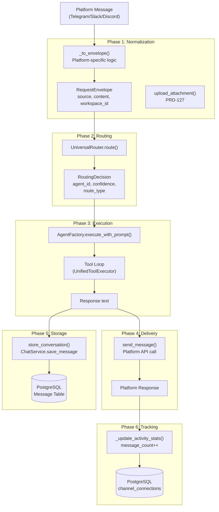
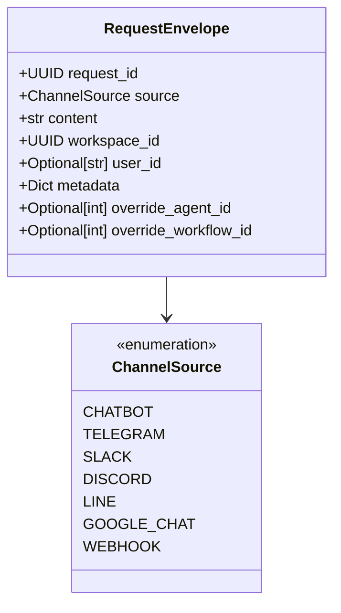
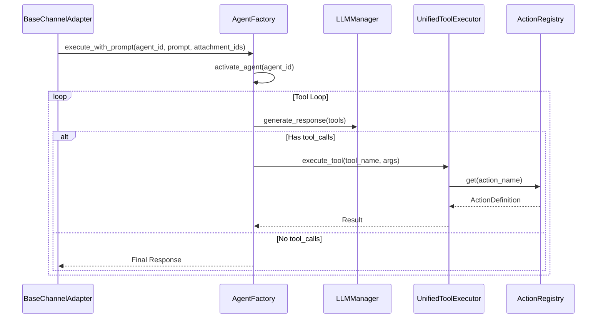

# Message Pipeline

Relevant source files

The following files were used as context for generating this wiki page:

- [docs/PRDS/55-AUTONOMOUS-ASSISTANT-PLATFORM.md](docs/PRDS/55-AUTONOMOUS-ASSISTANT-PLATFORM.md)
- [orchestrator/alembic/versions/20260215_add_heartbeat_and_channels.py](orchestrator/alembic/versions/20260215_add_heartbeat_and_channels.py)
- [orchestrator/api/channels.py](orchestrator/api/channels.py)
- [orchestrator/api/heartbeat.py](orchestrator/api/heartbeat.py)
- [orchestrator/channels/base.py](orchestrator/channels/base.py)
- [orchestrator/channels/manager.py](orchestrator/channels/manager.py)
- [orchestrator/channels/telegram_adapter.py](orchestrator/channels/telegram_adapter.py)
- [orchestrator/core/models/channels.py](orchestrator/core/models/channels.py)

This page documents the end-to-end message processing pipeline for channel integrations. It covers the flow from when a user sends a message on a platform (Telegram, Slack, Discord, etc.) through normalization, routing, agent execution, and response delivery.

---

## Purpose and Scope

The Message Pipeline transforms platform-specific messages into standardized `RequestEnvelope` objects, routes them to appropriate agents via the `UniversalRouter`, executes the selected agent, and delivers responses back through the originating platform. This pipeline enables consistent multi-agent orchestration across all supported channels while preserving platform-specific features like threading and attachments.

**Scope:**
- Message normalization from platform formats to `RequestEnvelope` via `_to_envelope` [orchestrator/channels/base.py:128]().
- Routing decisions via `UniversalRouter.route` [orchestrator/channels/base.py:144]().
- Agent execution via `AgentFactory.execute_with_prompt` [orchestrator/channels/base.py:164-173]().
- Response delivery via platform-specific `send_message` [orchestrator/channels/base.py:50-52]().
- Attachment handling and multimodal ingestion (PRD-127) [orchestrator/channels/base.py:70-106]().
- Activity tracking in the `channel_connections` table [orchestrator/core/models/channels.py:19-33]().

Sources: [orchestrator/channels/base.py:1-21](), [orchestrator/channels/base.py:112-188](), [orchestrator/core/models/channels.py:19-33]()

---

## Pipeline Overview

The message pipeline consists of six sequential phases, orchestrated in `BaseChannelAdapter.handle_message()` [orchestrator/channels/base.py:112-188]().

Title: Message Pipeline Flow

Sources: [orchestrator/channels/base.py:112-188](), [orchestrator/channels/base.py:70-106]()

---

## Phase 1: Message Normalization

Each platform adapter implements `_to_envelope()` to convert platform-specific message objects into the standardized `RequestEnvelope` format. For example, `TelegramAdapter` processes incoming `Update` objects from `python-telegram-bot` [orchestrator/channels/telegram_adapter.py:148-185]().

### RequestEnvelope Structure
The `RequestEnvelope` acts as the universal currency for the routing engine.

Title: RequestEnvelope Entity Association

Sources: [orchestrator/api/channels.py:24-28](), [orchestrator/channels/telegram_adapter.py:148-185]()

### Attachment Handling (PRD-127)
Subclasses call `upload_attachment()` when receiving inbound media [orchestrator/channels/base.py:70-106](). In `TelegramAdapter`, this handles photos and documents by downloading them from Telegram servers and storing them in the `AttachmentStore` [orchestrator/channels/telegram_adapter.py:168-180](). The resulting `attachment_ids` are passed to `AgentFactory` for multimodal analysis [orchestrator/channels/base.py:164-173]().

---

## Phase 2: Routing

The `UniversalRouter.route()` function processes the envelope through a tiered strategy to resolve a `RoutingDecision`.

1.  **Tier 0 (Override):** Checks for explicit agent or workflow IDs in the envelope.
2.  **Tier 1 (Cache):** Checks `RoutingCache` for normalized content hashes.
3.  **Tier 2a (Rules):** Matches `source_pattern` or `source_channel` in the `routing_rules` table [orchestrator/alembic/versions/20260215_add_heartbeat_and_channels.py:39-40]().
4.  **Tier 2b (Trigger):** Handles `TriggerSubscription` (e.g., Jira events).
5.  **Tier 2.5 (Semantic):** Performs cosine similarity on agent embeddings.
6.  **Tier 2c (Intent):** Uses `IntentClassifier` for keyword matching against rules.
7.  **Tier 3 (LLM):** Fallback to LLM classification for final agent/workflow selection.

Sources: [orchestrator/channels/base.py:143-160](), [orchestrator/alembic/versions/20260215_add_heartbeat_and_channels.py:39-40]()

---

## Phase 3: Agent Execution

Execution is handled by `AgentFactory.execute_with_prompt()`, which triggers the agent's lifecycle and tool loop [orchestrator/channels/base.py:163-173]().

Title: Execution Pipeline to Code Entities

**Context Injection:** The adapter injects `source`, `workspace_id`, and `connection_id` into the execution context to allow agents to be aware of the communication channel [orchestrator/channels/base.py:167-171]().

Sources: [orchestrator/channels/base.py:163-173](), [orchestrator/channels/telegram_adapter.py:164-166]()

---

## Phase 4: Response Delivery

The adapter's `send_message()` method handles platform-specific delivery [orchestrator/channels/base.py:50-52](). `TelegramAdapter` implements auto-chunking for messages exceeding the 4096 character limit [orchestrator/channels/telegram_adapter.py:74-86]().

| Platform | Typical Limit | Adapter Implementation |
|----------|---------------|------------------------|
| **Slack** | 3000 chars | `SlackAdapter` [orchestrator/channels/manager.py:125]() |
| **Discord** | 2000 chars | `DiscordAdapter` [orchestrator/channels/manager.py:126]() |
| **Telegram** | 4096 chars | `TelegramAdapter` [orchestrator/channels/telegram_adapter.py:79-82]() |
| **Line** | - | `LineAdapter` [orchestrator/channels/manager.py:133]() |
| **Google Chat**| - | `GoogleChatAdapter` [orchestrator/channels/manager.py:128]() |

Sources: [orchestrator/channels/base.py:50-52](), [orchestrator/channels/telegram_adapter.py:74-86](), [orchestrator/channels/manager.py:123-135]()

---

## Phase 5 & 6: Storage and Tracking

### Activity Tracking
After successful message delivery, the pipeline calls `_update_activity_stats(db)` [orchestrator/channels/base.py:185-186](). This increments the `message_count` and updates `last_activity_at` in the `channel_connections` table [orchestrator/core/models/channels.py:19-33]().

### Heartbeat Proactive Execution
The `HeartbeatService` can bypass the inbound normalization phase by directly calling `run_orchestrator_heartbeat` or `schedule_agent_heartbeat` [orchestrator/api/heartbeat.py:114-126](), [orchestrator/api/heartbeat.py:165-178](). These proactive ticks use the same `AgentFactory` execution logic but are triggered by `APScheduler` instead of an external message. Results are stored in the `heartbeat_results` table [orchestrator/alembic/versions/20260215_add_heartbeat_and_channels.py:21-34]().

Sources: [orchestrator/channels/base.py:185-188](), [orchestrator/core/models/channels.py:19-33](), [orchestrator/api/heartbeat.py:88-126](), [orchestrator/alembic/versions/20260215_add_heartbeat_and_channels.py:21-34]()

---