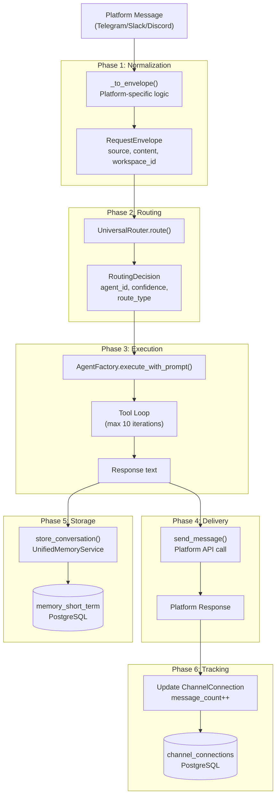
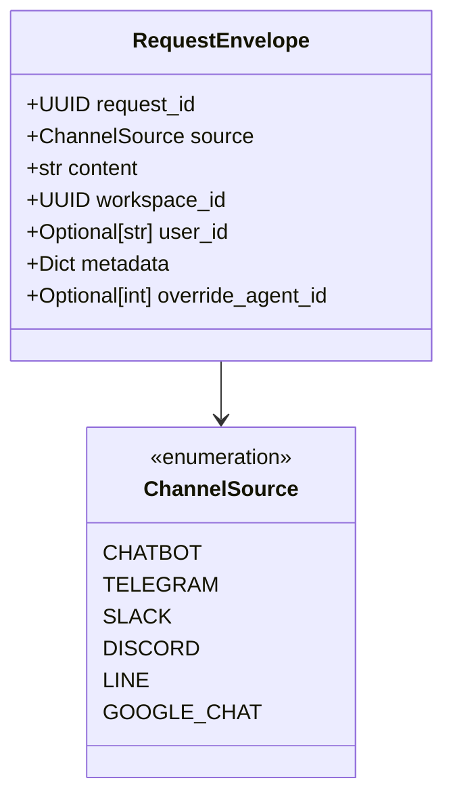
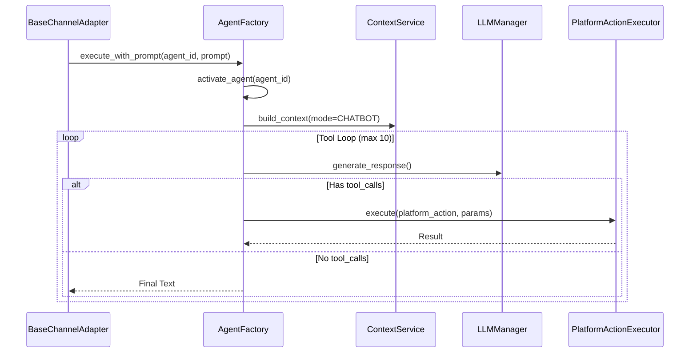

# Message Pipeline

Relevant source files

The following files were used as context for generating this wiki page:

- [docs/PRDS/55-AUTONOMOUS-ASSISTANT-PLATFORM.md](docs/PRDS/55-AUTONOMOUS-ASSISTANT-PLATFORM.md)
- [docs/reviews/COMPOSIO-TOOL-REGRESSION-REVIEW.md](docs/reviews/COMPOSIO-TOOL-REGRESSION-REVIEW.md)
- [frontend/components/auth/sign-up-form.tsx](frontend/components/auth/sign-up-form.tsx)
- [orchestrator/alembic/versions/20260215_add_heartbeat_and_channels.py](orchestrator/alembic/versions/20260215_add_heartbeat_and_channels.py)
- [orchestrator/api/channels.py](orchestrator/api/channels.py)
- [orchestrator/api/chat.py](orchestrator/api/chat.py)
- [orchestrator/api/chat_voice.py](orchestrator/api/chat_voice.py)
- [orchestrator/api/heartbeat.py](orchestrator/api/heartbeat.py)
- [orchestrator/channels/base.py](orchestrator/channels/base.py)
- [orchestrator/channels/discord_adapter.py](orchestrator/channels/discord_adapter.py)
- [orchestrator/channels/google_chat_adapter.py](orchestrator/channels/google_chat_adapter.py)
- [orchestrator/channels/line_adapter.py](orchestrator/channels/line_adapter.py)
- [orchestrator/channels/manager.py](orchestrator/channels/manager.py)
- [orchestrator/channels/slack_adapter.py](orchestrator/channels/slack_adapter.py)
- [orchestrator/consumers/chatbot/auto.py](orchestrator/consumers/chatbot/auto.py)
- [orchestrator/consumers/chatbot/intent_classifier.py](orchestrator/consumers/chatbot/intent_classifier.py)
- [orchestrator/consumers/chatbot/personality.py](orchestrator/consumers/chatbot/personality.py)
- [orchestrator/consumers/chatbot/service.py](orchestrator/consumers/chatbot/service.py)
- [orchestrator/consumers/chatbot/smart_memory.py](orchestrator/consumers/chatbot/smart_memory.py)
- [orchestrator/consumers/chatbot/smart_tool_router.py](orchestrator/consumers/chatbot/smart_tool_router.py)
- [orchestrator/core/llm/manager.py](orchestrator/core/llm/manager.py)
- [orchestrator/core/models/channels.py](orchestrator/core/models/channels.py)
- [orchestrator/core/routing/engine.py](orchestrator/core/routing/engine.py)
- [orchestrator/core/services/plugin_security_scanner.py](orchestrator/core/services/plugin_security_scanner.py)
- [orchestrator/modules/agents/__init__.py](orchestrator/modules/agents/__init__.py)
- [orchestrator/modules/agents/factory/__init__.py](orchestrator/modules/agents/factory/__init__.py)
- [orchestrator/modules/memory/integrations/mem0_client.py](orchestrator/modules/memory/integrations/mem0_client.py)
- [orchestrator/modules/orchestrator/service.py](orchestrator/modules/orchestrator/service.py)
- [orchestrator/modules/tools/discovery/actions_analytics_enhanced.py](orchestrator/modules/tools/discovery/actions_analytics_enhanced.py)
- [orchestrator/modules/tools/discovery/handlers_analytics_enhanced.py](orchestrator/modules/tools/discovery/handlers_analytics_enhanced.py)
- [orchestrator/modules/tools/discovery/handlers_search.py](orchestrator/modules/tools/discovery/handlers_search.py)
- [orchestrator/modules/tools/discovery/platform_actions.py](orchestrator/modules/tools/discovery/platform_actions.py)
- [orchestrator/modules/tools/discovery/platform_executor.py](orchestrator/modules/tools/discovery/platform_executor.py)
- [orchestrator/modules/tools/tool_router.py](orchestrator/modules/tools/tool_router.py)

This page documents the end-to-end message processing pipeline for channel integrations. It covers the flow from when a user sends a message on a platform (Telegram, Slack, Discord, etc.) through normalization, routing, agent execution, and response delivery.

---

## Purpose and Scope

The Message Pipeline transforms platform-specific messages into standardized `RequestEnvelope` objects, routes them to appropriate agents via the `UniversalRouter`, executes the selected agent, and delivers responses back through the originating platform. This pipeline enables consistent multi-agent orchestration across all supported channels while preserving platform-specific features like threading, reactions, and attachments.

**Scope:**
- Message normalization from platform formats to `RequestEnvelope` via `_to_envelope`.
- Routing decisions via `UniversalRouter.route`.
- Agent execution and tool loop via `AgentFactory.execute_with_prompt`.
- Response delivery via platform-specific `send_message`.
- Conversation storage in `memory_short_term` (L2) and Mem0 (L3).
- Activity tracking in the `channel_connections` table.

Sources: [orchestrator/channels/base.py:1-135](), [orchestrator/core/routing/engine.py:1-163]()

---

## Pipeline Overview

The message pipeline consists of six sequential phases, orchestrated in `BaseChannelAdapter.handle_message()`:

Title: Message Pipeline Flow

Sources: [orchestrator/channels/base.py:69-130](), [orchestrator/core/routing/engine.py:79-163]()

---

## Phase 1: Message Normalization

Each platform adapter implements `_to_envelope()` to convert platform-specific message objects into the standardized `RequestEnvelope` format.

### RequestEnvelope Structure
The `RequestEnvelope` acts as the universal currency for the routing engine.

Title: RequestEnvelope Entity Association

Sources: [orchestrator/core/models/routing.py:1-50](), [orchestrator/core/routing/engine.py:52-55]()

### Platform Normalization Rules
| Platform | Text Extraction | User ID Prefix | Metadata Preservation |
|----------|----------------|----------------|-----------------------|
| **Telegram** | `message.text` | `telegram_` | `chat_id`, `message_id` |
| **Slack** | `event['text']` | `slack_` | `channel`, `thread_ts` |
| **Discord** | `message.content` | `discord_` | `channel_id`, `guild_id` |
| **LINE** | `event['message']['text']` | `line_` | `reply_token` |

Sources: [orchestrator/channels/slack_adapter.py:97-124](), [orchestrator/channels/discord_adapter.py:81-108](), [orchestrator/channels/line_adapter.py:80-107]()

---

## Phase 2: Routing

The `UniversalRouter.route()` function processes the envelope through a tiered strategy to resolve a `RoutingDecision`.

1.  **Tier 0 (Override):** Checks `envelope.override_agent_id` or `override_workflow_id` [orchestrator/core/routing/engine.py:169-176]().
2.  **Tier 1 (Cache):** Checks `RoutingCache` for normalized content hashes [orchestrator/core/routing/engine.py:102-107]().
3.  **Tier 2 (Rules):** Matches `source_pattern` in the `routing_rules` table [orchestrator/core/routing/engine.py:109-114]().
4.  **Tier 2.5 (Semantic):** Performs cosine similarity on agent embeddings (PRD-64) [orchestrator/core/routing/engine.py:123-136]().
5.  **Tier 2c (Intent):** Uses `IntentClassifier` for keyword matching [orchestrator/core/routing/engine.py:138-146]().
6.  **Tier 3 (LLM):** Fallback to LLM classification for agent selection [orchestrator/core/routing/engine.py:148-158]().

Sources: [orchestrator/core/routing/engine.py:79-163](), [orchestrator/api/chat.py:23-24]()

---

## Phase 3: Agent Execution

Execution is handled by `AgentFactory.execute_with_prompt()`, which triggers the agent's lifecycle and tool loop.

Title: Execution Pipeline to Code Entities

### Complexity and Platform Actions
For high-complexity tasks (ATOM → ORGANISM), the `AutoBrain` assessment determines if the request needs specific memory layers or tool hints [orchestrator/consumers/chatbot/auto.py:5-22](). If platform keywords are detected (e.g., "list my agents"), the `PlatformActionExecutor` routes calls to specific domain handlers [orchestrator/modules/tools/discovery/platform_executor.py:173-225]().

**Tool Loop Prevention:** The `ToolExecutionTracker` implements exact and semantic deduplication to prevent infinite loops during the execution phase [orchestrator/consumers/chatbot/service.py:78-156]().

Sources: [orchestrator/consumers/chatbot/auto.py:5-22](), [orchestrator/modules/tools/discovery/platform_executor.py:164-225](), [orchestrator/consumers/chatbot/service.py:78-156]()

---

## Phase 4: Response Delivery

The adapter's `send_message()` method handles platform-specific constraints such as character limits and markdown formatting.

| Platform | Limit | Delivery Call | Formatting |
|----------|-------|---------------|------------|
| **Slack** | 3000 | `chat_postMessage` | `mrkdwn=true` |
| **Discord** | 2000 | `channel.send` | Discord MD |
| **Telegram** | 4096 | `send_message` | `parse_mode=Markdown` |
| **LINE** | 5000 | `reply_message` | Plain Text |

Sources: [orchestrator/channels/slack_adapter.py:127-176](), [orchestrator/channels/discord_adapter.py:111-156](), [orchestrator/channels/line_adapter.py:110-180]()

---

## Phase 5 & 6: Storage and Tracking

### Conversation Storage
The `store_conversation()` method in `BaseChannelAdapter` ensures the exchange is persisted for context retrieval.
- **L2 Memory:** Immediate write to `Message` table [orchestrator/consumers/chatbot/service.py:184-188]().
- **L3 Memory:** Async extraction of facts via `Mem0Client` which connects to the internal Railway instance [orchestrator/modules/memory/integrations/mem0_client.py:66-100]().

### Activity Tracking
Successful exchanges update the `channel_connections` table:
- `message_count`: Incremented by 1.
- `last_activity_at`: Updated to current timestamp [orchestrator/api/chat.py:55-57]().
- `status`: Updated to `active`.

Sources: [orchestrator/channels/base.py:120-130](), [orchestrator/consumers/chatbot/service.py:184-188](), [orchestrator/modules/memory/integrations/mem0_client.py:66-100]()

---

## Error Handling

The pipeline implements defensive checks at every stage:
- **Normalization:** Invalid messages are logged and dropped.
- **Routing:** If no agent is found, the system falls back to the `default_agent_id` defined in the `ChannelConnection`.
- **Execution:** `ToolExecutionTracker` prevents infinite loops by tracking `exact_executions` and `search_queries` [orchestrator/consumers/chatbot/service.py:107-112]().
- **Security:** The `PluginSecurityScanner` performs static and LLM-based analysis on code patterns before execution [orchestrator/core/services/plugin_security_scanner.py:23-37]().
- **Mem0 Reliability:** The `Mem0Client` uses a `_CircuitBreaker` to fail fast after 5 consecutive failures, preventing pipeline stalls [orchestrator/modules/memory/integrations/mem0_client.py:27-63]().

Sources: [orchestrator/consumers/chatbot/service.py:107-112](), [orchestrator/core/services/plugin_security_scanner.py:1-85](), [orchestrator/modules/memory/integrations/mem0_client.py:27-63]()

---