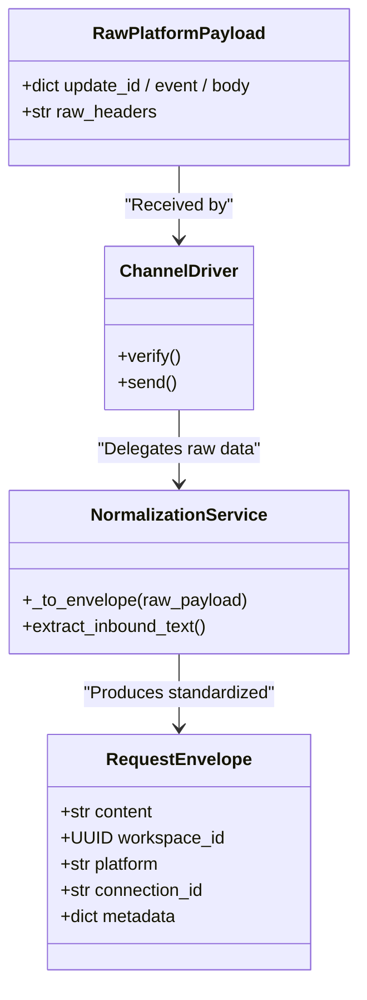

# Message Pipeline

<details>
<summary>Relevant source files</summary>

The following files were used as context for generating this wiki page:

- [docs/PRDS/55-AUTONOMOUS-ASSISTANT-PLATFORM.md](docs/PRDS/55-AUTONOMOUS-ASSISTANT-PLATFORM.md)
- [frontend/components/settings/ChannelsSettingsTab.tsx](frontend/components/settings/ChannelsSettingsTab.tsx)
- [frontend/components/workflows/execution-kitchen.tsx](frontend/components/workflows/execution-kitchen.tsx)
- [orchestrator/alembic/versions/20260215_add_heartbeat_and_channels.py](orchestrator/alembic/versions/20260215_add_heartbeat_and_channels.py)
- [orchestrator/alembic/versions/prd008a4_channel_drivers.py](orchestrator/alembic/versions/prd008a4_channel_drivers.py)
- [orchestrator/api/channels.py](orchestrator/api/channels.py)
- [orchestrator/api/composio.py](orchestrator/api/composio.py)
- [orchestrator/api/recipe_executor.py](orchestrator/api/recipe_executor.py)
- [orchestrator/api/skills.py](orchestrator/api/skills.py)
- [orchestrator/api/tools.py](orchestrator/api/tools.py)
- [orchestrator/api/webhooks.py](orchestrator/api/webhooks.py)
- [orchestrator/api/workflow_recipes.py](orchestrator/api/workflow_recipes.py)
- [orchestrator/channels/drivers/__init__.py](orchestrator/channels/drivers/__init__.py)
- [orchestrator/channels/drivers/base.py](orchestrator/channels/drivers/base.py)
- [orchestrator/channels/drivers/discord.py](orchestrator/channels/drivers/discord.py)
- [orchestrator/channels/drivers/slack.py](orchestrator/channels/drivers/slack.py)
- [orchestrator/channels/drivers/telegram.py](orchestrator/channels/drivers/telegram.py)
- [orchestrator/channels/drivers/webhook.py](orchestrator/channels/drivers/webhook.py)
- [orchestrator/channels/drivers/whatsapp.py](orchestrator/channels/drivers/whatsapp.py)
- [orchestrator/channels/manager.py](orchestrator/channels/manager.py)
- [orchestrator/channels/telegram_adapter.py](orchestrator/channels/telegram_adapter.py)
- [orchestrator/core/composio/client.py](orchestrator/core/composio/client.py)
- [orchestrator/core/composio/linkedin_image_workaround.py](orchestrator/core/composio/linkedin_image_workaround.py)
- [orchestrator/core/composio/tool_executor.py](orchestrator/core/composio/tool_executor.py)
- [orchestrator/core/credentials/tester.py](orchestrator/core/credentials/tester.py)
- [orchestrator/core/credentials/types.py](orchestrator/core/credentials/types.py)
- [orchestrator/core/database/credential_types_seed.json](orchestrator/core/database/credential_types_seed.json)
- [orchestrator/core/models/channels.py](orchestrator/core/models/channels.py)
- [orchestrator/core/routing/ingestors/webhook.py](orchestrator/core/routing/ingestors/webhook.py)
- [orchestrator/services/metadata_sync_service.py](orchestrator/services/metadata_sync_service.py)
- [orchestrator/services/webhook_dedup.py](orchestrator/services/webhook_dedup.py)
- [orchestrator/tests/test_channel_adapter_contract.py](orchestrator/tests/test_channel_adapter_contract.py)
- [orchestrator/tests/test_p2w0_service_imports_resolve.py](orchestrator/tests/test_p2w0_service_imports_resolve.py)
- [orchestrator/tests/test_p2w2_webhook_dedup.py](orchestrator/tests/test_p2w2_webhook_dedup.py)
- [orchestrator/tests/test_p2w2_webhook_signature_reject.py](orchestrator/tests/test_p2w2_webhook_signature_reject.py)
- [orchestrator/tests/test_prd184_us005_legacy_channel_adapters_deleted.py](orchestrator/tests/test_prd184_us005_legacy_channel_adapters_deleted.py)

</details>


This page documents the end-to-end message processing pipeline for channel integrations. It covers the flow from when a user sends a message on an external platform (Telegram, Slack, Discord, WhatsApp, etc.) or webhook endpoint through trust gate evaluation, normalization, universal routing, agent execution, conversation storage, and outbound delivery.

---

## Purpose and Scope

The Message Pipeline ingests raw platform payloads, enforces trust and security policies at the ingress boundary, normalizes messages into standardized `RequestEnvelope` objects, routes them to the appropriate agent via the `UniversalRouter`, executes the agent logic, persists the conversation state, and delivers responses back through the originating platform driver.

**Scope:**
- **Ingress & Trust Gate:** Verifying signatures and applying channel-level trust gates via `services.ingress_gate` [orchestrator/api/channels.py:37-43]() and `orchestrator/api/webhooks.py:50-93]().
- **Normalization:** Converting platform-specific payloads into a `RequestEnvelope` via `_to_envelope` normalization functions [orchestrator/tests/test_channel_adapter_contract.py:16-22]().
- **Routing:** Determining the target agent or workflow using `UniversalRouter.route` [orchestrator/api/webhooks.py:33]().
- **Agent Execution & Storage:** Invoking agent runtimes, tool loops, and persisting turns in conversation memory stores.
- **Outbound Delivery:** Sending generated responses back to the user via platform-specific `send` / `send_message` implementations [orchestrator/channels/drivers/base.py:119-130]().
- **Lifecycle Management:** Starting and stopping polling/webhook adapters via `ChannelManager` [orchestrator/channels/manager.py:88-114]().

Sources: [orchestrator/channels/manager.py:1-10](), [orchestrator/channels/drivers/base.py:1-24](), [orchestrator/api/channels.py:37-43](), [orchestrator/api/webhooks.py:50-93]()

---

## Pipeline Architecture & Data Flow

The pipeline operates across webhook and polling modes, passing data through distinct security, normalization, routing, and execution phases.

### End-to-End Message Pipeline Flow
Title: "End-to-End Message Pipeline Flow"
```mermaid
graph TB
    subgraph "NaturalLanguageSpace"
        UserMsg[""User Platform Message"<br/>(Telegram/Slack/Webhook)""]
    end

    subgraph "CodeEntitySpace"
        Ingress[""WebhookRoute /api/webhooks/ws/{key}<br/>orchestrator/api/webhooks.py""]
        TrustGate[""Trust Gate & HMAC Verify<br/>services.ingress_gate & _verify_webhook_signature""]
        Normalize[""Payload Normalization<br/>_to_envelope()""]
        Router[""UniversalRouter.route()<br/>core/routing/engine.py""]
        Exec[""Agent Execution & Tool Loop<br/>AgentFactory.execute()""]
        Store[""Conversation Storage<br/>UnifiedMemoryService""]
        Send[""Outbound Driver send_message()<br/>orchestrator/channels/drivers/""]
    end

    UserMsg --> Ingress
    Ingress --> TrustGate
    TrustGate --> Normalize
    Normalize --> Router
    Router --> Exec
    Exec --> Store
    Exec --> Send
```
Sources: [orchestrator/api/webhooks.py:6-11](), [orchestrator/api/channels.py:37-43](), [orchestrator/channels/drivers/base.py:119-130]()

---

## Phase 1: Ingress & Trust Gate

When an incoming webhook request reaches the backend (e.g., `POST /api/webhooks/ws/{workspace_key}` or platform-specific endpoints), it must pass authentication and trust gates before any compute resources are allocated.

### Workspace Key & Signature Verification
- **URL-as-Secret Floor:** The `workspace_key` embedded in the webhook URL serves as the baseline credential for tenant lookup [orchestrator/api/webhooks.py:6-10]().
- **HMAC-SHA256 Signature Verification:** When a webhook secret or platform signing secret (e.g., Slack signing secret) is configured, `_verify_webhook_signature` or `_verify_slack_signature` validates headers (`X-Hub-Signature-256`, `X-Composio-Signature`, `X-Slack-Signature`) against the raw request body [orchestrator/api/webhooks.py:50-93](). Mismatches or missing required signatures reject the request with `401 Unauthorized` [orchestrator/api/webhooks.py:60-64]().

### Per-Channel Trust Gate
The ingress gate subsystem (`services.ingress_gate`) evaluates `trigger_mode_of` and `normalize_trigger_mode` to ensure that inbound messages comply with workspace governance settings, channel policies, and rate limits [orchestrator/api/channels.py:37-43]().

Sources: [orchestrator/api/webhooks.py:50-153](), [orchestrator/api/channels.py:37-43]()

---

## Phase 2: Message Normalization (`_to_envelope`)

Once verified, platform-specific payloads (Telegram updates, Slack events, WhatsApp messages) are converted into a standardized internal structure known as a `RequestEnvelope`.

### Normalization Bridge
Title: "Normalization Bridge: Platform Payload to RequestEnvelope"


The normalization helper `_to_envelope` extracts the sender identifier, message body text, attachment references, and thread context into a uniform schema consumed by the routing engine [orchestrator/tests/test_channel_adapter_contract.py:16-22]().

Sources: [orchestrator/api/webhooks.py:34](), [orchestrator/tests/test_channel_adapter_contract.py:16-22]()

---

## Phase 3: Universal Routing (`UniversalRouter.route`)

The normalized `RequestEnvelope` is passed to the `UniversalRouter` to determine which agent or workflow should handle the request [orchestrator/api/webhooks.py:33]().

The routing engine evaluates multiple tiers:
- **Tier 0:** Explicit user overrides (if an agent ID is specified in the request context).
- **Tier 1:** Routing cache lookup (`RoutingCache`) for fast workspace-scoped matches.
- **Tier 2:** Rule-based matching and trigger subscriptions [orchestrator/api/workflow_recipes.py:52-60]().
- **Tier 2.5:** Semantic similarity via vector embeddings against agent capabilities.
- **Tier 3:** LLM-based classification when deterministic heuristics do not yield a confident match.

Sources: [orchestrator/api/webhooks.py:32-34](), [orchestrator/core/routing/engine.py]()

---

## Phase 4: Agent Execution & Conversation Storage

Upon receiving a routing decision containing a target `agent_id`, the execution engine instantiates the agent context:

1. **Context Assembly:** `ContextService` builds the system prompt and memory layers (L0 through L4) [orchestrator/api/recipe_executor.py:9-12]().
2. **LLM Invocation:** The model generates a response, potentially triggering tool loops via `UnifiedToolExecutor` [orchestrator/api/recipe_executor.py:11-12]().
3. **Conversation Storage:** Exchanges, user prompts, and agent responses are persisted via the `UnifiedMemoryService` to maintain session continuity and update temporal memory logs.

Sources: [orchestrator/api/recipe_executor.py:5-19]()

---

## Phase 5: Outbound Delivery (`send_message`) & Tracking

After execution, the response is dispatched back to the user via the originating platform driver.

### Outbound Delivery (`send`)
Each platform adapter implements an asynchronous `send` or `send_message` method. For instance:
- **Slack Driver:** Uses `chat.postMessage` [orchestrator/channels/drivers/slack.py:101-106]()
- **WhatsApp Driver:** Posts via HTTP to the Meta Graph API [orchestrator/channels/drivers/whatsapp.py:101-113]()

### Activity Tracking and Connection Reconciliation
The system records usage statistics via `_update_activity_stats`, which performs a tenant-isolated SQL update:
- Increments `message_count` by 1.
- Updates `last_activity_at` to `NOW()`.

Additionally, `GET /api/channels` reconciles database status entries with active polling adapters managed by `ChannelManager` [orchestrator/api/channels.py:171-185]().

Sources: [orchestrator/api/channels.py:89-141](), [orchestrator/channels/manager.py:176-195](), [orchestrator/tests/test_channel_adapter_contract.py:23-34]()

---

## Channel Management UI

Administrators configure and manage channel integrations through the `ChannelsSettingsTab` in the frontend:
- **Platform Selectors:** Choose integrations (Telegram, Slack, Discord, WhatsApp, etc.) [frontend/components/settings/ChannelsSettingsTab.tsx:26-135]().
- **Mode Toggles:** Switch between Webhook and Polling modes where supported [frontend/components/settings/ChannelsSettingsTab.tsx:140-153]().
- **Credential Testing:** Validate connection integrity via backend driver `verify` calls [frontend/components/settings/ChannelsSettingsTab.tsx:181-205]().

Sources: [frontend/components/settings/ChannelsSettingsTab.tsx:13-153]()

---