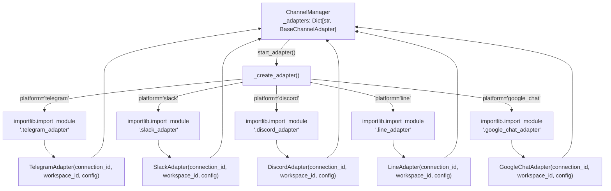
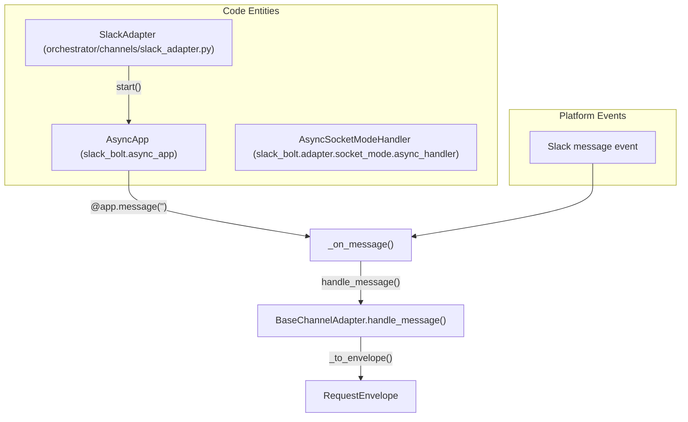
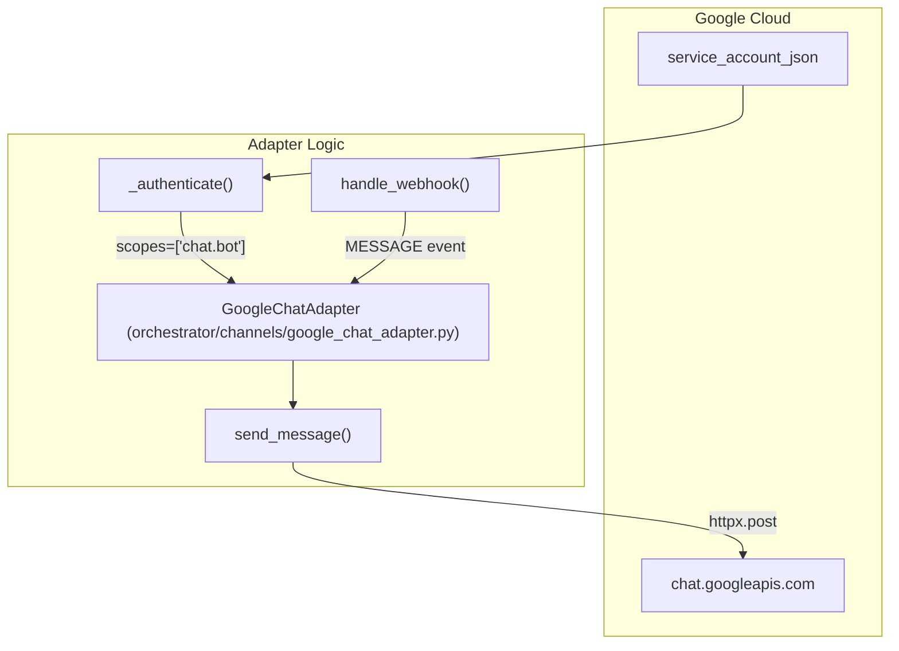

# Platform Adapters

<details>
<summary>Relevant source files</summary>

The following files were used as context for generating this wiki page:

- [docs/PRDS/55-AUTONOMOUS-ASSISTANT-PLATFORM.md](docs/PRDS/55-AUTONOMOUS-ASSISTANT-PLATFORM.md)
- [frontend/components/auth/sign-up-form.tsx](frontend/components/auth/sign-up-form.tsx)
- [orchestrator/alembic/versions/20260215_add_heartbeat_and_channels.py](orchestrator/alembic/versions/20260215_add_heartbeat_and_channels.py)
- [orchestrator/api/channels.py](orchestrator/api/channels.py)
- [orchestrator/api/heartbeat.py](orchestrator/api/heartbeat.py)
- [orchestrator/channels/base.py](orchestrator/channels/base.py)
- [orchestrator/channels/discord_adapter.py](orchestrator/channels/discord_adapter.py)
- [orchestrator/channels/google_chat_adapter.py](orchestrator/channels/google_chat_adapter.py)
- [orchestrator/channels/line_adapter.py](orchestrator/channels/line_adapter.py)
- [orchestrator/channels/manager.py](orchestrator/channels/manager.py)
- [orchestrator/channels/slack_adapter.py](orchestrator/channels/slack_adapter.py)
- [orchestrator/consumers/chatbot/smart_memory.py](orchestrator/consumers/chatbot/smart_memory.py)
- [orchestrator/core/models/channels.py](orchestrator/core/models/channels.py)
- [orchestrator/core/services/plugin_security_scanner.py](orchestrator/core/services/plugin_security_scanner.py)
- [orchestrator/modules/agents/__init__.py](orchestrator/modules/agents/__init__.py)
- [orchestrator/modules/agents/factory/__init__.py](orchestrator/modules/agents/factory/__init__.py)
- [orchestrator/modules/memory/integrations/mem0_client.py](orchestrator/modules/memory/integrations/mem0_client.py)

</details>


This page documents the individual platform adapter implementations for Telegram, Slack, Discord, LINE, and Google Chat. Each adapter translates platform-specific message formats into the universal `RequestEnvelope` format and routes responses back through platform APIs.

For the architecture and lifecycle management of all adapters, see [12.1 Channel Architecture](). For the message processing pipeline that all adapters share, see [12.2 Message Pipeline](). For API endpoints to manage channel connections, see [12.4 Channel API Reference]().

---

## Adapter Overview

Automatos supports five messaging platforms through dedicated adapter implementations. Each adapter extends `BaseChannelAdapter` and implements platform-specific authentication, message handling, and API communication patterns.

**Adapter Implementations**

| Platform | Class | Library | Mode | Max Message Length |
|----------|-------|---------|------|-------------------|
| Telegram | `TelegramAdapter` | `python-telegram-bot` v22.6+ | Polling | 4,096 chars |
| Slack | `SlackAdapter` | `slack-bolt` v1.27+ | Socket Mode / Events API | No hard limit |
| Discord | `DiscordAdapter` | `discord.py` v2.0+ | Event Listener | 2,000 chars |
| LINE | `LineAdapter` | `httpx` (HTTP API) | Webhook | 5,000 chars |
| Google Chat | `GoogleChatAdapter` | `httpx` + `google-auth` | Webhook + Service Account | 4,096 chars |

Sources: [orchestrator/channels/manager.py:122-134](), [orchestrator/channels/slack_adapter.py:19-26](), [orchestrator/channels/discord_adapter.py:19-25](), [orchestrator/api/channels.py:30-42](), [docs/PRDS/55-AUTONOMOUS-ASSISTANT-PLATFORM.md:33-43]()

---

## Adapter Factory and Registry

The `ChannelManager` dynamically instantiates platform adapters using lazy imports to avoid requiring all optional dependencies at startup.

**Adapter Resolution Diagram**


**Adapter Map**

The factory uses a static map `_ADAPTER_MAP` in `orchestrator/channels/manager.py` to resolve platform names to module paths [orchestrator/channels/manager.py:122-134](). Missing dependencies (e.g., `slack-bolt` not installed) result in an `ImportError`, which is caught and logged as a warning [orchestrator/channels/manager.py:147-153]().

Sources: [orchestrator/channels/manager.py:109-161]()

---

## Telegram Adapter

**Status:** Implemented (referenced in PRD-55 and manager).

**Connection Mode:** Long polling via `python-telegram-bot` library [docs/PRDS/55-AUTONOMOUS-ASSISTANT-PLATFORM.md:20]().

**Authentication:** Bot token obtained from @BotFather.

**Key Features:**
- Asynchronous polling loop.
- Supports text messages and typing indicators.
- Auto-chunking for messages > 4,096 characters.

**Configuration Requirements:**
```json
{
  "bot_token": "123456:ABC-DEF1234ghIkl-zyx57W2v1u123ew11"
}
```

Sources: [docs/PRDS/55-AUTONOMOUS-ASSISTANT-PLATFORM.md:362-365](), [orchestrator/channels/manager.py:123](), [orchestrator/api/channels.py:31]()

---

## Slack Adapter

**Code Entity Space Mapping**


**Implementation Details**

The `SlackAdapter` uses the official `slack-bolt` async SDK [orchestrator/channels/slack_adapter.py:31](). It supports two connection modes:

1. **Socket Mode**: WebSocket connection via `AsyncSocketModeHandler`. Requires `app_token` (starts with `xapp-`) [orchestrator/channels/slack_adapter.py:53-56]().
2. **Events API Mode**: HTTP webhooks. Used when `app_token` is not provided [orchestrator/channels/slack_adapter.py:58]().

**Message Handler Registration**

The adapter registers a catch-all message handler:
```python
@self._app.message("")
async def handle_message(message, say):
    await self._on_message(message, say)
```
[orchestrator/channels/slack_adapter.py:47-49]()

It filters bot messages by checking `message.get("bot_id")` or `subtype == "bot_message"` to prevent infinite loops [orchestrator/channels/slack_adapter.py:118-119]().

**Thread Support**

Responses preserve thread context by passing `thread_ts` from the original message metadata [orchestrator/channels/slack_adapter.py:87-92]().

Sources: [orchestrator/channels/slack_adapter.py:1-167](), [orchestrator/api/channels.py:216-225]()

---

## Discord Adapter

**Implementation Details**

The `DiscordAdapter` uses `discord.py` v2.0+ with event-driven message handling [orchestrator/channels/discord_adapter.py:20]().

**Intents Configuration**

Discord requires explicit intent declarations for accessing message content:
```python
intents = discord.Intents.default()
intents.message_content = True
```
[orchestrator/channels/discord_adapter.py:36-37]()

**Message Filtering**

The adapter ignores messages from bots and its own messages to prevent loops [orchestrator/channels/discord_adapter.py:47-52]().

**Typing Indicators**

Shows typing indicator while processing requests:
```python
async with message.channel.typing():
    # ... handle message
```
[orchestrator/channels/discord_adapter.py:118]()

**Message Chunking**

Discord enforces a 2,000 character limit. Messages are split into chunks [orchestrator/channels/discord_adapter.py:89-91]().

**Channel Resolution**

Attempts cached lookup first, falls back to API fetch:
```python
channel = self._client.get_channel(int(channel_id))
if not channel:
    channel = await self._client.fetch_channel(int(channel_id))
```
[orchestrator/channels/discord_adapter.py:84-86]()

Sources: [orchestrator/channels/discord_adapter.py:1-160](), [orchestrator/api/channels.py:227-236]()

---

## LINE Adapter

**Implementation Details**

The `LineAdapter` operates in **webhook mode** and uses `httpx` for both outbound API calls and signature verification.

**Authentication and Verification**

- `channel_access_token`: Bearer token for API calls [orchestrator/api/channels.py:40]().
- `channel_secret`: Used to verify `x-line-signature` headers via HMAC-SHA256 [orchestrator/api/channels.py:40]().

**Message Limits**

- **Text length**: 5,000 characters per message chunk.
- **Batching**: LINE allows a maximum of 5 messages per reply/push request.

Sources: [orchestrator/channels/manager.py:132](), [orchestrator/api/channels.py:40]()

---

## Google Chat Adapter

**Code Entity Space Mapping**


**Implementation Details**

The `GoogleChatAdapter` operates in **webhook mode** and uses **service account authentication** for outbound API calls [orchestrator/channels/manager.py:127]().

**Authentication**

Google Chat apps use service accounts instead of user-based OAuth. The `service_account_key` is required in the connection configuration [orchestrator/api/channels.py:35]().

**Event Types**

Google Chat typically sends:
1. **`ADDED_TO_SPACE`**: Bot added to a space or DM.
2. **`MESSAGE`**: User sent a message. Routes through the standard pipeline.

Sources: [orchestrator/channels/manager.py:127](), [orchestrator/api/channels.py:35]()

---

## Configuration Storage

All adapter configurations are stored in the `channel_connections` table with workspace-scoped isolation [orchestrator/core/models/channels.py:24]().

**ChannelConnection Model**

| Field | Type | Description |
|-------|------|-------------|
| `platform` | String | telegram, slack, discord, line, google_chat [orchestrator/core/models/channels.py:25]() |
| `config` | JSON | Encrypted credentials [orchestrator/core/models/channels.py:26]() |
| `status` | String | active, inactive, error [orchestrator/core/models/channels.py:27]() |
| `default_agent_id` | Integer | Optional default routing target [orchestrator/core/models/channels.py:29]() |

**Required Configuration by Platform**

| Platform | Required Fields |
|----------|----------------|
| Telegram | `bot_token` [orchestrator/api/channels.py:31]() |
| Slack | `bot_token`, `signing_secret` [orchestrator/api/channels.py:32]() |
| Discord | `bot_token` [orchestrator/api/channels.py:33]() |
| LINE | `channel_access_token`, `channel_secret` [orchestrator/api/channels.py:40]() |
| Google Chat | `service_account_key` [orchestrator/api/channels.py:35]() |

Sources: [orchestrator/core/models/channels.py:1-40](), [orchestrator/api/channels.py:30-42]()

---

## Adapter Lifecycle

All adapters share a common lifecycle managed by `ChannelManager`.

**Startup Sequence**

1. `ChannelManager.start_all()` queries all connections with `status == "active"` [orchestrator/channels/manager.py:32-44]().
2. `start_adapter()` stops any existing instance for that connection ID [orchestrator/channels/manager.py:81-82]().
3. `_create_adapter()` uses `importlib` to perform a lazy import of the platform module [orchestrator/channels/manager.py:143-145]().
4. `adapter.start()` is called to initialize platform listeners [orchestrator/channels/manager.py:89]().

**Shutdown Sequence**

`ChannelManager.stop_adapter()` removes the adapter from the internal registry and calls its `stop()` method [orchestrator/channels/manager.py:99-103]().

Sources: [orchestrator/channels/manager.py:22-178]()

---