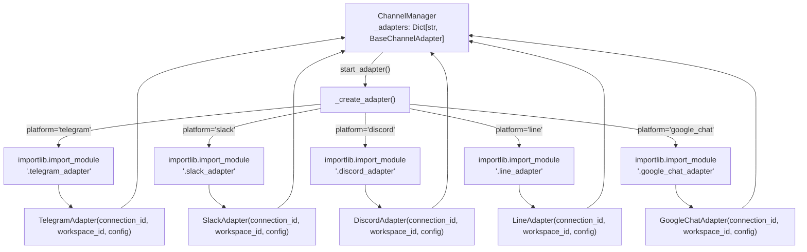

# Platform Adapters

Relevant source files

The following files were used as context for generating this wiki page:

- [docs/PRDS/55-AUTONOMOUS-ASSISTANT-PLATFORM.md](docs/PRDS/55-AUTONOMOUS-ASSISTANT-PLATFORM.md)
- [orchestrator/alembic/versions/20260215_add_heartbeat_and_channels.py](orchestrator/alembic/versions/20260215_add_heartbeat_and_channels.py)
- [orchestrator/api/channels.py](orchestrator/api/channels.py)
- [orchestrator/api/heartbeat.py](orchestrator/api/heartbeat.py)
- [orchestrator/channels/base.py](orchestrator/channels/base.py)
- [orchestrator/channels/manager.py](orchestrator/channels/manager.py)
- [orchestrator/channels/telegram_adapter.py](orchestrator/channels/telegram_adapter.py)
- [orchestrator/core/models/channels.py](orchestrator/core/models/channels.py)

This page documents the individual platform adapter implementations for Telegram, Slack, Discord, LINE, and Google Chat. Each adapter translates platform-specific message formats into the universal `RequestEnvelope` format and routes responses back through platform APIs.

For the architecture and lifecycle management of all adapters, see [12.1 Channel Architecture](). For the message processing pipeline that all adapters share, see [12.2 Message Pipeline](). For API endpoints to manage channel connections, see [12.4 Channel API Reference]().

---

## Adapter Overview

Automatos supports five messaging platforms through dedicated adapter implementations. Each adapter extends `BaseChannelAdapter` [orchestrator/channels/base.py:22-23]() and implements platform-specific authentication, message handling, and API communication patterns.

**Adapter Implementations**

| Platform | Class | Library | Mode | Max Message Length |
|----------|-------|---------|------|-------------------|
| Telegram | `TelegramAdapter` | `python-telegram-bot` v22+ | Polling | 4,096 chars |
| Slack | `SlackAdapter` | `slack-bolt` | Socket Mode / Events API | No hard limit |
| Discord | `DiscordAdapter` | `discord.py` v2.0+ | Event Listener | 2,000 chars |
| LINE | `LineAdapter` | `httpx` (HTTP API) | Webhook | 5,000 chars |
| Google Chat | `GoogleChatAdapter` | `httpx` + `google-auth` | Webhook + Service Account | 4,096 chars |

Sources: [orchestrator/channels/manager.py:122-134](), [orchestrator/api/channels.py:24-42](), [docs/PRDS/55-AUTONOMOUS-ASSISTANT-PLATFORM.md:33-42]()

---

## Adapter Factory and Registry

The `ChannelManager` dynamically instantiates platform adapters using lazy imports to avoid requiring all optional dependencies at startup [orchestrator/channels/manager.py:116-121]().

**Adapter Resolution Diagram**

**Adapter Map**

The factory uses a static map `_ADAPTER_MAP` in `orchestrator/channels/manager.py` to resolve platform names to module paths [orchestrator/channels/manager.py:122-134](). Missing dependencies (e.g., `python-telegram-bot` not installed) result in an `ImportError`, which is caught and logged as a warning [orchestrator/channels/manager.py:147-153]().

Sources: [orchestrator/channels/manager.py:109-161]()

---

## Telegram Adapter

**Implementation Details**

The `TelegramAdapter` uses `python-telegram-bot` v22+ for asynchronous bot integration [orchestrator/channels/telegram_adapter.py:5-6]().

**Connection Mode**
It operates in **Long Polling** mode by initializing the `ApplicationBuilder` and starting the updater via `self._app.updater.start_polling()` [orchestrator/channels/telegram_adapter.py:36-48]().

**Multimodal Support (PRD-127)**
The adapter handles text, photos, and documents [orchestrator/channels/telegram_adapter.py:156-158]().
- **Photos**: Downloads the highest resolution version via `context.bot.get_file(photo.file_id)` and uploads it to the `AttachmentStore` using `self.upload_attachment()` [orchestrator/channels/telegram_adapter.py:171-178]().
- **Documents**: Downloads files and preserves the original filename and mime type.

**Persistence**
The adapter captures the `chat_id` from incoming `/start` or `/help` commands and persists it to `workspace.settings.integrations.telegram_default_chat_id` to enable proactive notifications [orchestrator/channels/telegram_adapter.py:101-142]().

**Message Chunking**
Telegram enforces a 4,096 character limit. The `send_message` implementation automatically chunks outbound text to comply [orchestrator/channels/telegram_adapter.py:79-82]().

Sources: [orchestrator/channels/telegram_adapter.py:19-178](), [orchestrator/api/channels.py:31](), [docs/PRDS/55-AUTONOMOUS-ASSISTANT-PLATFORM.md:20]()

---

## Slack Adapter

**Code Entity Space Mapping**

**Implementation Details**

The `SlackAdapter` uses the `slack-bolt` async SDK. It supports two connection modes:

1. **Socket Mode**: WebSocket connection via `AsyncSocketModeHandler`. Requires `app_token` (starts with `xapp-`).
2. **Events API Mode**: HTTP webhooks. Used when `app_token` is not provided.

**Multimodal Support (PRD-127)**
It downloads files from Slack using the `bot_token` for authorization and uploads them to the platform's `AttachmentStore` using the inherited `upload_attachment` method [orchestrator/channels/base.py:70-106]().

**Thread Support**
Responses preserve thread context by passing `thread_ts` from the original message metadata to `chat_postMessage`.

Sources: [orchestrator/channels/manager.py:125](), [orchestrator/api/channels.py:32](), [orchestrator/channels/base.py:112-186]()

---

## Discord Adapter

**Implementation Details**

The `DiscordAdapter` uses `discord.py` v2.0+ with event-driven message handling.

**Intents Configuration**
Discord requires explicit intent declarations for accessing message content, specifically `intents.message_content = True`.

**Multimodal Support (PRD-127)**
Iterates through `message.attachments`, downloads bytes via `attachment.read()`, and populates `attachment_ids` before calling the core `handle_message()` logic [orchestrator/channels/base.py:112-133]().

**Message Chunking**
Discord enforces a 2,000 character limit. Outbound messages are split into chunks in `send_message`.

Sources: [orchestrator/channels/manager.py:126](), [orchestrator/api/channels.py:33](), [orchestrator/channels/base.py:112-186]()

---

## Line Adapter

**Implementation Details**

The `LineAdapter` implements the LINE Messaging API using `httpx` for asynchronous communication.

**Messaging Strategy**
- **Reply Token**: Prefers using `replyToken` for responding to incoming webhooks, as this is typically free under LINE's pricing model.
- **Push API**: Uses `send_message()` to push messages to users when a reply token is unavailable or expired.

**Signature Verification**
Verifies webhook authenticity using HMAC-SHA256 with the `channel_secret`.

Sources: [orchestrator/channels/manager.py:133](), [orchestrator/api/channels.py:40]()

---

## Google Chat Adapter

**Code Entity Space Mapping**

**Implementation Details**

The `GoogleChatAdapter` operates in **webhook mode** and uses **service account authentication** for outbound API calls.

**Authentication Lifecycle**
- Loads credentials from `service_account_key` provided in the connection config [orchestrator/api/channels.py:35]().
- Performs async credential refresh using `google-auth`.
- Automatically refreshes tokens on `401 Unauthorized` responses during `send_message`.

Sources: [orchestrator/channels/manager.py:128](), [orchestrator/api/channels.py:35]()

---

## Configuration Storage

All adapter configurations are stored in the `channel_connections` table with workspace-scoped isolation [orchestrator/core/models/channels.py:24]().

**ChannelConnection Model**

| Field | Type | Description |
|-------|------|-------------|
| `platform` | String | telegram, slack, discord, line, google_chat [orchestrator/core/models/channels.py:25]() |
| `config` | JSON | Stores credentials (e.g. `bot_token`) [orchestrator/core/models/channels.py:26]() |
| `status` | String | active, inactive, error [orchestrator/core/models/channels.py:27]() |
| `default_agent_id` | Integer | Optional default routing target [orchestrator/core/models/channels.py:29]() |

**Required Configuration by Platform**

| Platform | Required Fields |
|----------|----------------|
| Telegram | `bot_token` [orchestrator/api/channels.py:31]() |
| Slack | `bot_token`, `signing_secret` [orchestrator/api/channels.py:32]() |
| Discord | `bot_token` [orchestrator/api/channels.py:33]() |
| LINE | `channel_access_token`, `channel_secret` [orchestrator/api/channels.py:40]() |
| Google Chat | `service_account_key` [orchestrator/api/channels.py:35]() |

Sources: [orchestrator/core/models/channels.py:19-33](), [orchestrator/api/channels.py:30-42]()

---

## Adapter Lifecycle

All adapters share a common lifecycle managed by the `ChannelManager` singleton [orchestrator/channels/manager.py:187-192]().

**Startup Sequence**
1. `ChannelManager.start_all()` queries all connections with `status == "active"` [orchestrator/channels/manager.py:32-44]().
2. `start_adapter()` stops any existing instance for that connection ID [orchestrator/channels/manager.py:81-82]().
3. `_create_adapter()` uses `importlib` to perform a lazy import of the platform module [orchestrator/channels/manager.py:143-145]().
4. `adapter.start()` is called to initialize platform listeners [orchestrator/channels/manager.py:89]().

**Shutdown Sequence**
`ChannelManager.stop_adapter()` removes the adapter from the internal registry and calls its `stop()` method to close network connections and cancel background tasks [orchestrator/channels/manager.py:99-103]().

Sources: [orchestrator/channels/manager.py:22-178]()

---