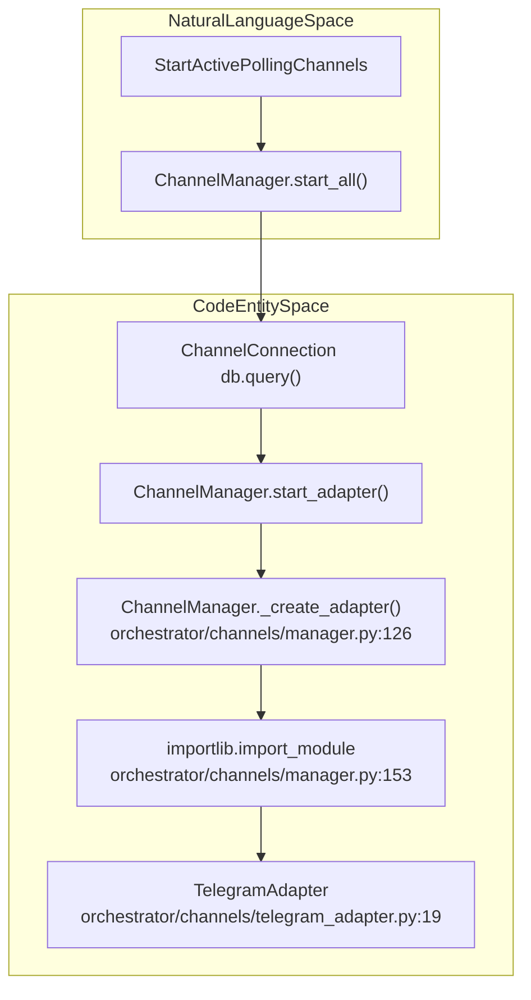
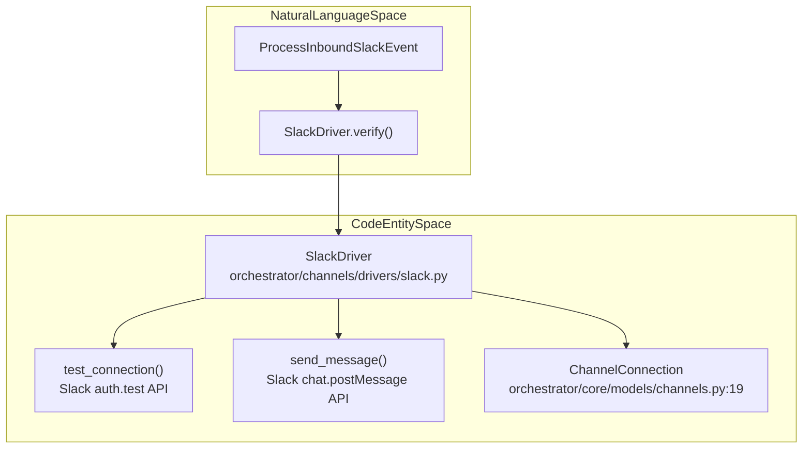

# Platform Adapters

Relevant source files

The following files were used as context for generating this wiki page:

- [docs/PRDS/55-AUTONOMOUS-ASSISTANT-PLATFORM.md](docs/PRDS/55-AUTONOMOUS-ASSISTANT-PLATFORM.md)
- [frontend/app/sign-in/[[...rest]]/page.tsx](frontend/app/sign-in/[[...rest]]/page.tsx)
- [frontend/app/sign-up/[[...rest]]/page.tsx](frontend/app/sign-up/[[...rest]]/page.tsx)
- [frontend/app/tools/callback/page.tsx](frontend/app/tools/callback/page.tsx)
- [frontend/components/__tests__/prd175-auth-edition.test.tsx](frontend/components/__tests__/prd175-auth-edition.test.tsx)
- [frontend/components/auth/sign-up-form.tsx](frontend/components/auth/sign-up-form.tsx)
- [frontend/components/local-auth-provider.tsx](frontend/components/local-auth-provider.tsx)
- [frontend/components/settings/ChannelsSettingsTab.tsx](frontend/components/settings/ChannelsSettingsTab.tsx)
- [frontend/lib/auth-edition.ts](frontend/lib/auth-edition.ts)
- [orchestrator/alembic/versions/20260215_add_heartbeat_and_channels.py](orchestrator/alembic/versions/20260215_add_heartbeat_and_channels.py)
- [orchestrator/alembic/versions/prd008a4_channel_drivers.py](orchestrator/alembic/versions/prd008a4_channel_drivers.py)
- [orchestrator/api/channels.py](orchestrator/api/channels.py)
- [orchestrator/api/heartbeat.py](orchestrator/api/heartbeat.py)
- [orchestrator/channels/discord_adapter.py](orchestrator/channels/discord_adapter.py)
- [orchestrator/channels/drivers/__init__.py](orchestrator/channels/drivers/__init__.py)
- [orchestrator/channels/drivers/base.py](orchestrator/channels/drivers/base.py)
- [orchestrator/channels/drivers/discord.py](orchestrator/channels/drivers/discord.py)
- [orchestrator/channels/drivers/slack.py](orchestrator/channels/drivers/slack.py)
- [orchestrator/channels/drivers/telegram.py](orchestrator/channels/drivers/telegram.py)
- [orchestrator/channels/drivers/webhook.py](orchestrator/channels/drivers/webhook.py)
- [orchestrator/channels/drivers/whatsapp.py](orchestrator/channels/drivers/whatsapp.py)
- [orchestrator/channels/manager.py](orchestrator/channels/manager.py)
- [orchestrator/channels/slack_adapter.py](orchestrator/channels/slack_adapter.py)
- [orchestrator/channels/telegram_adapter.py](orchestrator/channels/telegram_adapter.py)
- [orchestrator/core/composio/entity_manager.py](orchestrator/core/composio/entity_manager.py)
- [orchestrator/core/models/channels.py](orchestrator/core/models/channels.py)
- [orchestrator/tests/test_channel_adapter_contract.py](orchestrator/tests/test_channel_adapter_contract.py)
- [orchestrator/tests/test_prd175_auth_edition.py](orchestrator/tests/test_prd175_auth_edition.py)
- [orchestrator/tests/test_prd184_us005_legacy_channel_adapters_deleted.py](orchestrator/tests/test_prd184_us005_legacy_channel_adapters_deleted.py)

This page documents the individual platform adapter implementations for Telegram, Slack, Discord, and WhatsApp. Each adapter translates platform-specific message formats into the universal `RequestEnvelope` format and routes responses back through platform APIs.

For the architecture and lifecycle management of all adapters, see [12.1 Channel Architecture](). For the message processing pipeline that all adapters share, see [12.2 Message Pipeline](). For API endpoints to manage channel connections, see [12.4 Channel API Reference]().

---

## Adapter Overview & Shipped Drivers

Automatos supports messaging platforms through dedicated adapter implementations. The system utilizes a driver-mediated architecture where `ChannelDriver` defines the interface for platform interactions, while `BaseChannelAdapter` [orchestrator/channels/base.py:22]() (and its subclasses) handles the runtime lifecycle within the orchestrator [orchestrator/api/channels.py:5-11]().

**Adapter Implementations**

| Platform | Driver Class | Supported Modes | Required Config |
|----------|--------------|-----------------|-----------------|
| Telegram | `TelegramDriver` | Webhook, Polling | `bot_token` |
| Slack | `SlackDriver` | Webhook, Socket | `bot_token`, `signing_secret` |
| Discord | `DiscordDriver` | Webhook, Events | `bot_token` |
| WhatsApp | `WhatsAppDriver` | Webhook | `phone_number_id`, `access_token` |
| Webhook | `WebhookDriver` | Webhook (Outbound POST) | `webhook_url` |

Sources: [orchestrator/api/channels.py:5-60](), [orchestrator/core/models/channels.py:19-46]()

---

## Adapter Factory and Registry

The `ChannelManager` dynamically instantiates platform adapters using lazy imports inside `_create_adapter()` [orchestrator/channels/manager.py:126-170](). It reconciles database connection status with the actual running state of polling adapters at read time via `is_running()` [orchestrator/channels/manager.py:176-187]().

**Diagram: Natural Language Space to Code Entity Space — Adapter Resolution**

Sources: [orchestrator/channels/manager.py:32-170](), [orchestrator/tests/test_channel_adapter_contract.py:80-90]()

---

## Telegram Adapter

**Implementation Details**
The `TelegramAdapter` manages async Telegram bot interactions using `python-telegram-bot` [orchestrator/channels/telegram_adapter.py:19-21]().

- **Polling Mode**: Spawns an async task running `_app.updater.start_polling()` [orchestrator/channels/telegram_adapter.py:48]().
- **Webhook Mode**: Delegates inbound parsing to the webhook endpoint handler.
- **Set-Once Default Chat ID**: Captures inbound chat IDs via `/start` or regular messages to anchor `telegram_default_chat_id` in workspace settings without allowing arbitrary inbound updates to hijack target routing [orchestrator/channels/telegram_adapter.py:118-126]().

Sources: [orchestrator/channels/telegram_adapter.py:1-167](), [orchestrator/channels/drivers/telegram.py:53-58]()

---

## Slack Adapter & Code Entity Space Mapping

**Diagram: Natural Language Space to Code Entity Space — Slack Integration**

Sources: [orchestrator/core/models/channels.py:19-51](), [orchestrator/channels/drivers/slack.py:36-106]()

**Implementation Details**
The `SlackDriver` requires a `bot_token` (typically prefixed with `xoxb-`) and a `signing_secret` [orchestrator/channels/drivers/slack.py:40-41](). Verification performs an `auth.test` call against the Slack Web API, and outgoing messages dispatch via `chat.postMessage` [orchestrator/channels/drivers/slack.py:54-106]().

Sources: [orchestrator/channels/drivers/slack.py:36-146](), [frontend/components/settings/ChannelsSettingsTab.tsx:47-54]()

---

## Discord and WhatsApp Adapters

**Discord Implementation**
The `DiscordDriver` handles outbound and event-driven communications using bot tokens. It verifies tokens against the `users/@me` endpoint and sends messages via `channels/{target}/messages` [orchestrator/channels/drivers/discord.py:39-132]().

**WhatsApp Implementation**
The `WhatsAppDriver` integrates with the Meta Cloud API. It requires a `phone_number_id` and an `access_token`, verifying metadata against the Graph API and posting outbound messages to the Meta messaging endpoint [orchestrator/channels/drivers/whatsapp.py:38-148]().

Sources: [orchestrator/channels/drivers/discord.py:39-132](), [orchestrator/channels/drivers/whatsapp.py:38-148]()

---

## Configuration, Schema, and Contract Testing

All channel configurations are stored persistently in the database via the `ChannelConnection` model [orchestrator/core/models/channels.py:19-46]().

**ChannelConnection Schema Properties**
- `platform`: String identifier (`telegram`, `slack`, `discord`, `whatsapp`) [orchestrator/core/models/channels.py:25]()
- `mode`: Connectivity mode (`webhook` or `polling`) [orchestrator/core/models/channels.py:36]()
- `config`: Encrypted JSON object holding platform tokens and secrets [orchestrator/core/models/channels.py:29]()
- `status`: Lifecycle state (`active`, `inactive`, `error`) [orchestrator/core/models/channels.py:30]()

**Adapter Contract Verification**
The adapter suite is verified via parameterized contract tests [orchestrator/tests/test_channel_adapter_contract.py:1-49]() ensuring every `BaseChannelAdapter` subclass strictly exposes the mandatory 5-method surface: `start`, `stop`, `send_message`, `test_connection`, and `_to_envelope` [orchestrator/tests/test_channel_adapter_contract.py:16-22]().

Sources: [orchestrator/core/models/channels.py:1-51](), [orchestrator/tests/test_channel_adapter_contract.py:1-93]()

---