# Chat Interface

<details>
<summary>Relevant source files</summary>

The following files were used as context for generating this wiki page:

- [frontend/components/chatbot/chat-widget.tsx](frontend/components/chatbot/chat-widget.tsx)
- [frontend/components/chatbot/chat.tsx](frontend/components/chatbot/chat.tsx)
- [frontend/components/chatbot/multimodal-input.tsx](frontend/components/chatbot/multimodal-input.tsx)
- [frontend/public/brand/jira-logo.svg](frontend/public/brand/jira-logo.svg)
- [frontend/tsconfig.tsbuildinfo](frontend/tsconfig.tsbuildinfo)
- [orchestrator/api/chat.py](orchestrator/api/chat.py)
- [orchestrator/api/routing.py](orchestrator/api/routing.py)
- [orchestrator/api/workflows.py](orchestrator/api/workflows.py)
- [orchestrator/consumers/chatbot/auto.py](orchestrator/consumers/chatbot/auto.py)
- [orchestrator/consumers/chatbot/intent_classifier.py](orchestrator/consumers/chatbot/intent_classifier.py)
- [orchestrator/consumers/chatbot/personality.py](orchestrator/consumers/chatbot/personality.py)
- [orchestrator/consumers/chatbot/service.py](orchestrator/consumers/chatbot/service.py)
- [orchestrator/consumers/chatbot/smart_orchestrator.py](orchestrator/consumers/chatbot/smart_orchestrator.py)
- [orchestrator/consumers/chatbot/smart_tool_router.py](orchestrator/consumers/chatbot/smart_tool_router.py)
- [orchestrator/core/llm/manager.py](orchestrator/core/llm/manager.py)
- [orchestrator/core/models/system_settings.py](orchestrator/core/models/system_settings.py)
- [orchestrator/core/routing/engine.py](orchestrator/core/routing/engine.py)
- [orchestrator/modules/agents/factory/agent_factory.py](orchestrator/modules/agents/factory/agent_factory.py)
- [orchestrator/modules/documents/generation_service.py](orchestrator/modules/documents/generation_service.py)
- [orchestrator/modules/orchestrator/pipeline.py](orchestrator/modules/orchestrator/pipeline.py)
- [orchestrator/modules/orchestrator/service.py](orchestrator/modules/orchestrator/service.py)
- [orchestrator/modules/tools/discovery/__init__.py](orchestrator/modules/tools/discovery/__init__.py)
- [orchestrator/modules/tools/discovery/platform_actions.py](orchestrator/modules/tools/discovery/platform_actions.py)
- [orchestrator/modules/tools/discovery/platform_executor.py](orchestrator/modules/tools/discovery/platform_executor.py)
- [orchestrator/scripts/setup_jira_trigger.py](orchestrator/scripts/setup_jira_trigger.py)

</details>


The Chat Interface is the primary conversational UI for interacting with AI agents, executing workflows, and visualizing results. It provides a multimodal input system supporting text and file attachments, dynamic model/agent selection, real-time streaming responses, and an integrated widget workspace for rich data visualization.

For information about agent configuration and management, see [Agents](#3). For workflow execution and recipes, see [Workflows & Recipes](#4). For tool integrations via Composio, see [Tools & Integrations](#6).

---

## Architecture Overview

The Chat Interface follows a full-stack streaming architecture with three main layers: the frontend conversation view, the backend orchestration layer, and the agent execution layer. Messages stream from the backend via Server-Sent Events (SSE), and tool results automatically create widgets in the canvas for interactive exploration.

### End-to-End Chat Flow

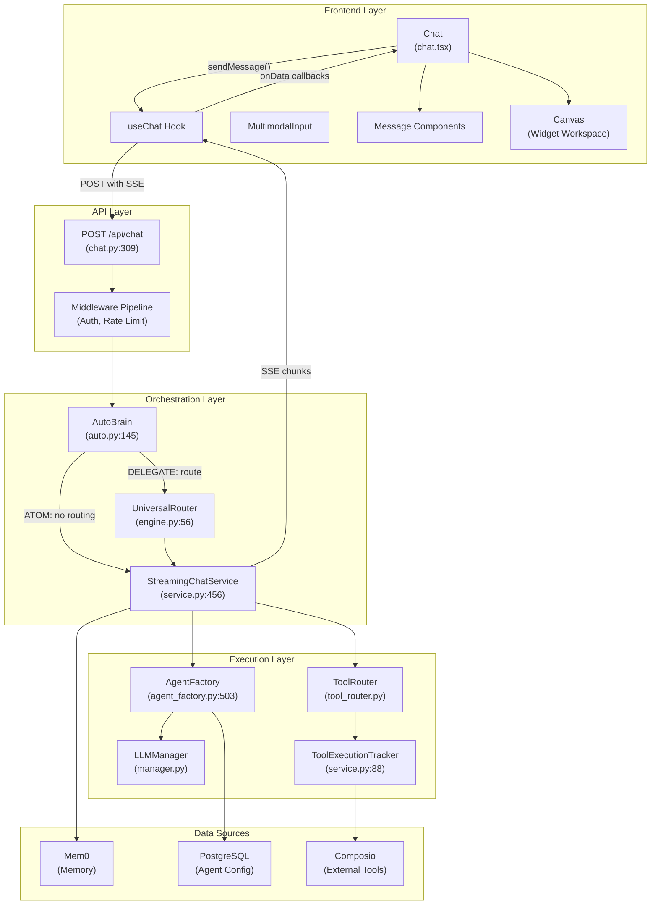

**Sources**: [orchestrator/api/chat.py:309-571](), [orchestrator/consumers/chatbot/service.py:456-950](), [orchestrator/consumers/chatbot/auto.py:145-304](), [orchestrator/core/routing/engine.py:56-496](), [orchestrator/modules/agents/factory/agent_factory.py:503-1100]()

---

## Complexity Assessment (AutoBrain)

The chat system uses a three-tier complexity assessment to determine how to handle each message. This progressive routing system (PRD-68) prevents unnecessary tool loading and LLM calls for simple requests.

### Three-Tier Assessment Pipeline

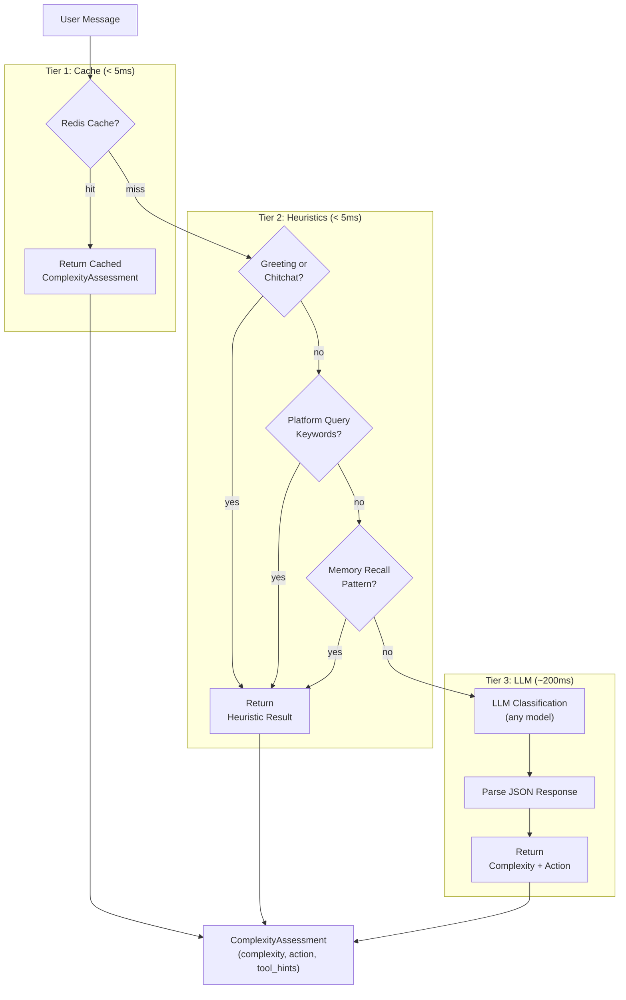

### Complexity Levels

| Level | Action | Description | Example |
|-------|--------|-------------|---------|
| `ATOM` | `RESPOND` | Simple greeting or chitchat, no tools needed | "hi", "thanks", "what can you do?" |
| `MOLECULE` | `DELEGATE` | Single tool or agent required | "send an email", "check Jira" |
| `CELL` | `DELEGATE` | Needs tools + memory + reasoning | "reply to that email we discussed" |
| `ORGAN` | `WORKFLOW` | Multi-agent coordination required | "research bug, plan fix, open PR" |
| `ORGANISM` | `WORKFLOW` | Enterprise-scale multi-step pipeline | "refactor auth across all services" |

### AutoBrain Integration

The `AutoBrain` class ([orchestrator/consumers/chatbot/auto.py:145-304]()) assesses every incoming message:

```python
# Chat API invokes AutoBrain
auto_brain = AutoBrain(db, str(ctx.workspace_id))
complexity_assessment = await auto_brain.assess(message_text, len(message_history))

if complexity_assessment.action == Action.RESPOND:
    # Direct response, no routing
    effective_agent_id = _fallback_agent_id
    use_system_llm = True
elif complexity_assessment.action == Action.DELEGATE:
    # Route to specialized agent via Universal Router
    routing_decision = await universal_router.route(envelope)
elif complexity_assessment.action == Action.WORKFLOW:
    # Trigger full Neural Swarm workflow
    _use_workflow_bridge = True
```

The `ComplexityAssessment` dataclass includes:
- `complexity`: The determined complexity level
- `action`: What Auto should do (RESPOND, DELEGATE, WORKFLOW)
- `tool_hints`: Domain keywords for tool discovery (e.g., ["email", "github"])
- `needs_memory`: Whether memory retrieval is needed
- `confidence`: Classification confidence score

**Sources**: [orchestrator/consumers/chatbot/auto.py:145-304](), [orchestrator/api/chat.py:438-464]()

---

## Universal Router Integration

When `AutoBrain` determines `Action.DELEGATE`, the chat system invokes the six-tier `UniversalRouter` to select the best agent for the task.

### Six-Tier Routing Strategy

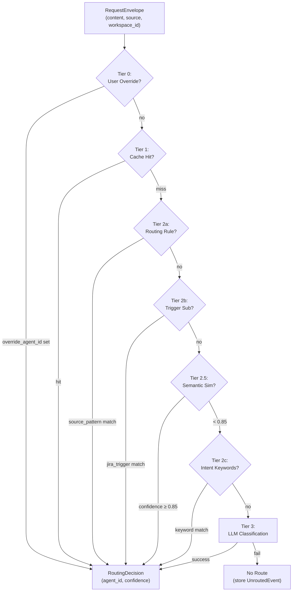

### Tier 2.5: Semantic Similarity (PRD-64)

The router uses pre-computed agent embeddings for semantic matching ([orchestrator/core/routing/engine.py:360-475]()):

```python
async def _tier2_5_semantic(envelope: RequestEnvelope) -> tuple[Optional[RoutingDecision], list]:
    """Use agent embeddings for cosine similarity routing."""
    from core.routing.semantic_indexer import find_similar_agents, SIMILARITY_DIRECT_ROUTE
    
    scored = await find_similar_agents(
        envelope.content, envelope.workspace_id, self._db
    )
    
    if scored and scored[0][1] >= SIMILARITY_DIRECT_ROUTE:  # Default: 0.85
        return RoutingDecision(
            route_type="agent",
            agent_id=scored[0][0].id,
            confidence=scored[0][1],
            reasoning=f"Semantic match (similarity={scored[0][1]:.2f})"
        ), []
    
    # Return candidates for Tier 3 LLM classification
    return None, scored[:MAX_LLM_CANDIDATES]
```

The semantic indexer computes embeddings for each agent's name, description, and skills, then uses cosine similarity to find the best match. High-confidence matches (≥ 0.85) route directly; ambiguous results (< 0.85) are passed to Tier 3 LLM for final classification.

**Sources**: [orchestrator/core/routing/engine.py:56-496](), [orchestrator/api/chat.py:466-504]()

---

## Chat Component

The `Chat` component ([frontend/components/chatbot/chat.tsx]()) is the main orchestrator, managing message state, streaming responses, widget creation, and layout switching between normal chat view and widget workspace view.

### Component State and Props

| Prop | Type | Description |
|------|------|-------------|
| `id` | `string` | Chat session ID |
| `initialMessages` | `ChatMessage[]` | Pre-loaded messages for existing chats |
| `initialChatModel` | `string` | Default model (e.g., `'gpt-4'`) |
| `initialVisibilityType` | `VisibilityType` | `'private'` or `'public'` |
| `isReadonly` | `boolean` | Disable input for archived chats |
| `autoResume` | `boolean` | Auto-resume streaming |
| `initialLastContext` | `AppUsage` | Token usage from last interaction |

### Layout States

The chat interface has two primary layout modes:

1. **Normal Chat View** ([frontend/components/chatbot/chat.tsx:815-1020]()): Full-width conversation with centered messages, welcome card for empty state, and bottom input.

2. **Widget Workspace View** ([frontend/components/chatbot/chat.tsx:667-738]()): Split-screen layout with chat in a 400px left column and widgets in the right canvas. Triggered when `widgetIds.length > 0`.

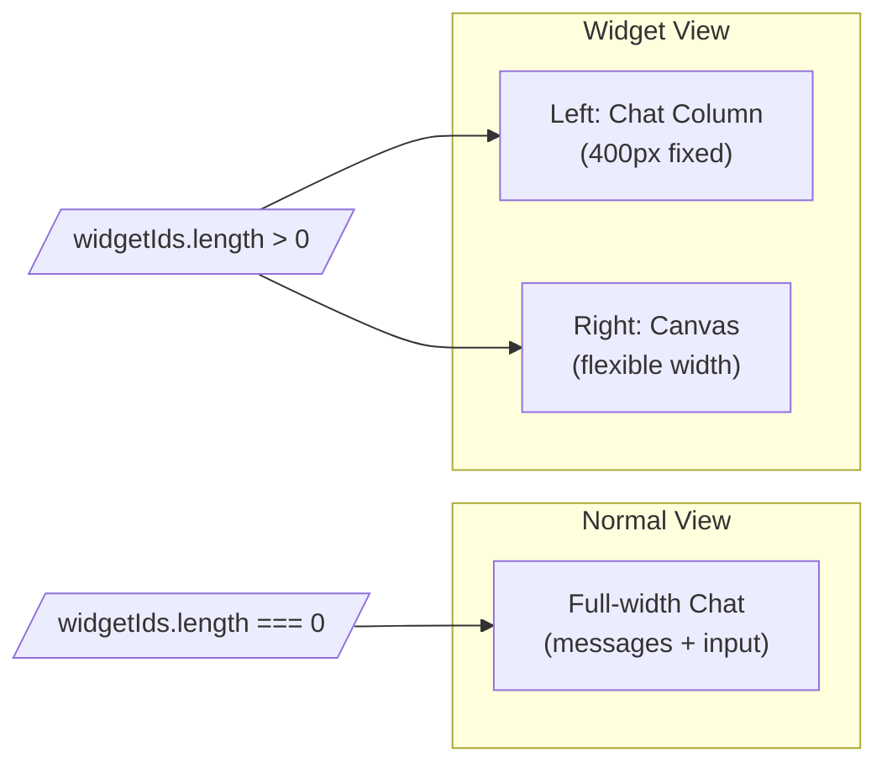

**Sources**: [frontend/components/chatbot/chat.tsx:52-56, 667-738, 815-1020]()

---

## Message Component

The `Message` component ([frontend/components/chatbot/message.tsx]()) renders individual chat messages with support for markdown, tool calls, routing indicators, and interactive result previews.

### Message Rendering Pipeline

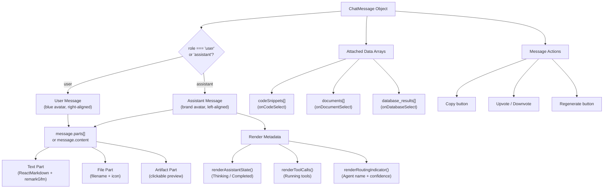

**Sources**: [frontend/components/chatbot/message.tsx:28-576]()

### Markdown Rendering

The message component uses `react-markdown` with `remark-gfm` for GitHub-flavored markdown support. Custom components provide dark mode styling for all markdown elements:

- **Code blocks**: Syntax highlighting with copy button ([frontend/components/chatbot/message.tsx:91-101]())
- **Tables**: Hover effects and responsive overflow ([frontend/components/chatbot/message.tsx:102-127]())
- **Lists**: Card-style list items with borders ([frontend/components/chatbot/message.tsx:80-90]())
- **Links**: External links open in new tabs ([frontend/components/chatbot/message.tsx:70-79]())

### Tool Call Lifecycle Display

Tool calls display their execution state with color-coded badges:

| State | Badge Color | Icon | When Shown |
|-------|-------------|------|------------|
| `running` | Orange | `Loader2` (spinning) | Tool is executing |
| `error` | Red | `XCircle` | Tool failed |
| `completed` | - | - | Hidden (cleaner UX) |

The `composio_execute` tool is filtered out from display since it's an internal execution detail ([frontend/components/chatbot/message.tsx:248]()).

**Sources**: [frontend/components/chatbot/message.tsx:242-283]()

### Routing Transparency (PRD-50)

When a message is auto-routed to an agent, the routing decision is displayed with a lightning bolt icon, agent name, and confidence score:

```typescript
// Example routing indicator
<div className="inline-flex items-center gap-1.5 rounded-full px-2.5 py-1 text-xs bg-orange-500/10 border border-orange-500/20">
  <Zap className="w-3 h-3" />
  <span>Routed to: <span className="font-medium">{displayName}</span></span>
  <span className="text-orange-300/60">{(confidence * 100).toFixed(0)}%</span>
</div>
```

Agent names are resolved asynchronously and cached in `agentNameCache.current` to avoid repeated API calls ([frontend/components/chatbot/chat.tsx:72-74, 309-327]()).

**Sources**: [frontend/components/chatbot/message.tsx:285-298](), [frontend/components/chatbot/chat.tsx:72-74, 305-337]()

---

## Multimodal Input

The `MultimodalInput` component ([frontend/components/chatbot/multimodal-input.tsx]()) provides a rich input experience supporting text, file attachments, model/agent selection, and dynamic tool suggestions.

### Input Component Architecture

```mermaid
graph TB
    FormContainer["<form> Container"]
    HiddenFileInput["Hidden <input type='file'>"]
    AttachmentPreview["Attachment Preview Pills"]
    
    MainInputBox["Large Input Box<br/>(rounded-3xl border)"]
    Textarea["Textarea<br/>(auto-resize, min 100px)"]
    
    BottomToolbar["Bottom Toolbar<br/>(inside input border)"]
    
    LeftSection["Left Section"]
    AttachBtn["Attach Button<br/>(Paperclip)"]
    Selector{onAgentChange<br/>provided?}
    AgentSel["AgentSelector"]
    ModelSel["ModelSelector"]
    
    RightSection["Right Section"]
    ToolIcons["Active Agent Tool Icons<br/>(up to 4 + overflow)"]
    SendStopBtn["Send / Stop Button<br/>(gradient orange)"]
    
    UsageInfo["Usage Info<br/>(tokens + cost)"]
    
    FormContainer --> HiddenFileInput
    FormContainer --> AttachmentPreview
    FormContainer --> MainInputBox
    FormContainer --> UsageInfo
    
    MainInputBox --> Textarea
    MainInputBox --> BottomToolbar
    
    BottomToolbar --> LeftSection
    BottomToolbar --> RightSection
    
    LeftSection --> AttachBtn
    LeftSection --> Selector
    Selector -->|yes| AgentSel
    Selector -->|no| ModelSel
    
    RightSection --> ToolIcons
    RightSection --> SendStopBtn
```

**Sources**: [frontend/components/chatbot/multimodal-input.tsx:104-286]()

### File Upload Flow

File uploads are handled through the hidden file input and `apiClient.uploadDocument()`:

1. User clicks paperclip icon → triggers hidden `<input type="file">` ([frontend/components/chatbot/multimodal-input.tsx:204]())
2. Files are added to `uploadQueue` state for loading indicator ([frontend/components/chatbot/multimodal-input.tsx:115]())
3. Each file is uploaded via `Promise.all()` to `apiClient.uploadDocument()` ([frontend/components/chatbot/multimodal-input.tsx:118-120]())
4. Successful uploads move to `uploadedDocs` state with `document_id` ([frontend/components/chatbot/multimodal-input.tsx:122-129]())
5. On submit, uploaded docs are sent as `file` parts in the message ([frontend/components/chatbot/multimodal-input.tsx:69-74]())

**Sources**: [frontend/components/chatbot/multimodal-input.tsx:106-141]()

### Agent Selector and Tool Icons

When `onAgentChange` prop is provided, the input displays `AgentSelector` instead of `ModelSelector`. The selected agent's tools are displayed as clickable icons next to the send button:

```typescript
// Tool icons with click handler for suggestions
{activeAgent?.tools && activeAgent.tools.length > 0 && (
  <div className="flex gap-2 items-center">
    {activeAgent.tools.slice(0, 4).map((tool) => (
      <button
        key={tool.id}
        type="button"
        onClick={() => onToolIconClick?.(tool.name)}
        className="hover:scale-110 transition-all"
      >
        <ToolLogo name={tool.name} logo={tool.icon} size={28} />
      </button>
    ))}
  </div>
)}
```

**Sources**: [frontend/components/chatbot/multimodal-input.tsx:210-252]()

---

## Widget Architecture

The Widget Architecture (PRD-38.1) provides a VS Code-style tabbed workspace for visualizing tool results. Widgets are automatically created from tool output and displayed in a Canvas component.

### Widget Creation Flow

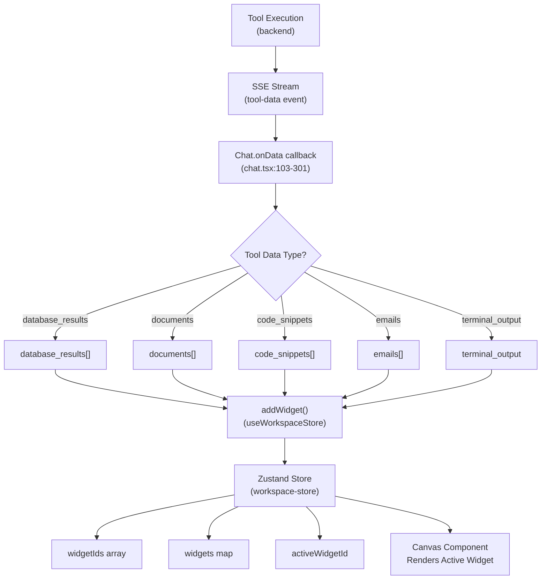

**Sources**: [frontend/components/chatbot/chat.tsx:103-301]()

### Widget Types

| Widget Type | Data Source | Purpose |
|-------------|-------------|---------|
| `code` | `code_snippets[]` from CodeGraph | Display code with syntax highlighting, file path, line numbers |
| `data` | `database_results[]` from NL2SQL | Display query results as tables, charts (PandasAI), SQL |
| `document` | `documents[]` from RAG | Display document content with chunks, similarity scores |
| `email` | `emails[]` from Composio Gmail/Outlook | Display email list or single email with attachments |
| `terminal` | `terminal_output` from shell executor | Display command output with exit code, stderr |
| `image` | Image artifacts | Display images with zoom controls |
| `workflow` | Workflow execution results | Display workflow steps and status |
| `memory` | Memory search results | Display agent memory entries |
| `file` | File system operations | Display file contents |

**Sources**: [frontend/components/chatbot/chat.tsx:108-300](), [frontend/components/workspace/Canvas.tsx:24-35]()

### Canvas Component

The `Canvas` component ([frontend/components/workspace/Canvas.tsx]()) provides a VS Code-style tabbed interface for viewing widgets:

#### Canvas Features

1. **Tab Bar**: Horizontal scrollable tabs with widget type icons, titles, and close buttons ([frontend/components/workspace/Canvas.tsx:94-144]())
2. **Active Widget Display**: Full-height widget content area ([frontend/components/workspace/Canvas.tsx:164-177]())
3. **Close Canvas Button**: Returns to normal chat view by calling `clearWidgets()` ([frontend/components/workspace/Canvas.tsx:146-159]())
4. **Empty State**: Displays when no widgets exist ([frontend/components/workspace/Canvas.tsx:64-89]())

#### Tab Management

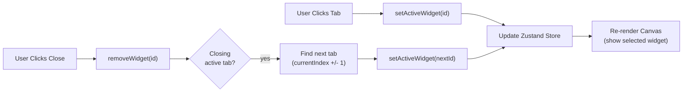

**Sources**: [frontend/components/workspace/Canvas.tsx:51-61, 107-108]()

---

## Tool Suggestions (PRD-40/41)

The Tool Suggestions system provides context-aware action prompts when users click on tool icons in the input area.

### Suggestion Flow

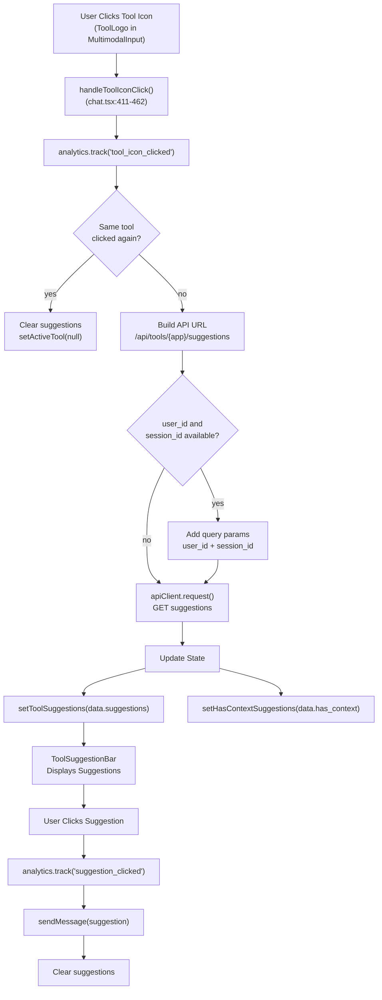

**Sources**: [frontend/components/chatbot/chat.tsx:76-79, 410-478]()

### Suggestion Sources

The backend returns suggestions with a `source` field:

- `"curated"`: Pre-defined suggestions from a static list
- `"generated"`: LLM-generated suggestions based on user context

Context-aware suggestions (PRD-41) include the `has_context` flag, indicating that user history or session data influenced the suggestions ([frontend/components/chatbot/chat.tsx:445]()).

**Sources**: [frontend/components/chatbot/chat.tsx:443-453](), [frontend/components/suggestions/types.ts:10-19]()

---

## State Management

The Chat Interface uses a hybrid state management approach combining React hooks, React Query, and Zustand.

### State Architecture

```mermaid
graph TB
    subgraph "Message State (useChat)"
        Messages["messages: ChatMessage[]"]
        SendMessage["sendMessage(message)"]
        Status["status: 'idle' | 'streaming' | 'awaiting_message'"]
        Stop["stop()"]
        Reload["reload()"]
    end
    
    subgraph "Workspace State (Zustand)"
        Widgets["widgets: Record<string, Widget>"]
        WidgetIds["widgetIds: string[]"]
        ActiveWidget["activeWidgetId: string | null"]
        AddWidget["addWidget(widget)"]
        RemoveWidget["removeWidget(id)"]
        ClearWidgets["clearWidgets()"]
        SetActive["setActiveWidget(id)"]
    end
    
    subgraph "Server State (React Query)"
        Agents["Agent Data"]
        ChatHistory["Chat History"]
        Models["Model List"]
        QueryCache["Query Cache"]
    end
    
    subgraph "Local UI State (useState)"
        SelectedAgent["selectedAgentId"]
        SelectedModel["currentModelId"]
        InputText["input"]
        UploadQueue["uploadQueue"]
        ActiveTool["activeTool"]
        ToolSuggestions["toolSuggestions"]
    end
    
    ChatComponent["Chat Component"]
    
    ChatComponent --> Messages
    ChatComponent --> Widgets
    ChatComponent --> Agents
    ChatComponent --> SelectedAgent
    
    Messages --> SendMessage
    Messages --> Status
    
    Widgets --> AddWidget
    Widgets --> RemoveWidget
    WidgetIds --> ClearWidgets
    ActiveWidget --> SetActive
```

**Sources**: [frontend/components/chatbot/chat.tsx:48-98]()

### useChat Hook

The `useChat` hook ([frontend/lib/chat/hooks](), referenced in [frontend/components/chatbot/chat.tsx:98-338]()) manages message state and streaming:

| Function | Purpose |
|----------|---------|
| `sendMessage(message)` | Send user message, initiate streaming |
| `stop()` | Cancel active streaming request |
| `reload()` | Regenerate last assistant message |
| `setMessages(fn)` | Update message array (functional updates) |

### Callback Handlers

```typescript
// Chat component callbacks for useChat
{
  onData: (dataPart) => {
    // Handle streaming data (usage, tool-data, artifacts)
  },
  onChatIdUpdate: (newChatId) => {
    // Update active chat ID when backend creates new chat
  },
  onRoutingDecision: (info) => {
    // Store routing decision and resolve agent name
  }
}
```

**Sources**: [frontend/components/chatbot/chat.tsx:98-338]()

---

## Backend Streaming Architecture

The chat backend implements a sophisticated streaming pipeline with session queuing, concurrent request handling, and AI SDK SSE format.

### StreamingChatService Pipeline

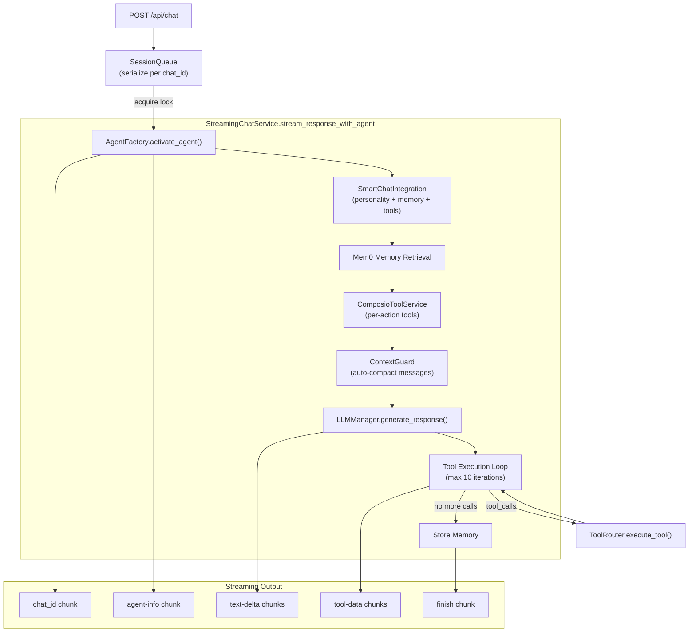

### Session-Scoped Queueing

Chat API uses `get_session_queue()` to serialize concurrent requests for the same chat ([orchestrator/api/chat.py:531-567]()):

```python
session_key = f"{ctx.workspace_id}:{chat_id}"
session_queue = get_session_queue()

async def _guarded_stream():
    async with session_queue.acquire(session_key):
        async for chunk in streaming_service.stream_response_with_agent(...):
            yield chunk

return StreamingResponse(_guarded_stream(), media_type="text/plain; charset=utf-8")
```

This prevents race conditions where multiple requests for the same chat could interleave messages or duplicate tool calls.

### Tool Execution Loop with Deduplication

`StreamingChatService` includes a tool loop ([orchestrator/consumers/chatbot/service.py:880-1096]()) with `ToolExecutionTracker` to prevent infinite loops:

```python
tool_tracker = ToolExecutionTracker()

while response.tool_calls and loop_count < max_iterations:
    for tool_call in response.tool_calls:
        should_skip, reason = tool_tracker.should_skip_execution(
            tool_call.name, tool_call.arguments
        )
        if should_skip:
            logger.warning(f"Skipping duplicate: {reason}")
            continue
        
        result = self.tool_router.execute_tool(tool_call.name, tool_call.arguments)
        tool_tracker.record_execution(tool_call.name, tool_call.arguments)
    
    loop_count += 1
```

The tracker implements three deduplication strategies:
- **Exact matching**: Hash of tool name + arguments
- **Semantic deduplication**: Similar queries for search tools (75% threshold)
- **Per-tool retry limits**: Configurable max executions per tool

**Sources**: [orchestrator/consumers/chatbot/service.py:456-1260](), [orchestrator/api/chat.py:531-571](), [orchestrator/consumers/chatbot/service.py:88-186]()

---

## Frontend Real-Time Updates

The Chat Interface receives real-time updates via Server-Sent Events (SSE) from the backend. The `useChat` hook establishes a streaming connection and processes incoming data parts.

### AI SDK SSE Format

The backend streams responses in AI SDK format ([orchestrator/consumers/chatbot/streaming.py](), referenced in [orchestrator/consumers/chatbot/service.py:546-709]()):

| Data Type | Format | Handler Location | Purpose |
|-----------|--------|------------------|---------|
| `chat_id` | `2:"<chat_id>"` | `useChat` internal | Update active chat ID |
| `agent-info` | `d:{"type":"agent-info",...}` | `chat.tsx:568-581` | Display agent metadata |
| `text-delta` | `0:"text chunk"` | `useChat` internal | Stream message content |
| `tool-data` | `d:{"type":"tool-data",...}` | `chat.tsx:151-367` | Create widgets |
| `memory-injected` | `d:{"type":"memory-injected",...}` | `chat.tsx:370-372` | Show memory usage |
| `finish` | `d:{"finishReason":"stop",...}` | `useChat` internal | End streaming |

### Auto-Scroll Behavior

The chat automatically scrolls to the bottom during streaming to keep the latest content visible:

```typescript
useEffect(() => {
  if (status === 'streaming') {
    requestAnimationFrame(() => {
      messagesContainerRef.current?.scrollTo({
        top: messagesContainerRef.current.scrollHeight,
        behavior: 'smooth',
      })
    })
  }
}, [status])
```

**Sources**: [frontend/components/chatbot/chat.tsx:462-472]()

### Scroll Position Tracking

The interface tracks whether the user is at the bottom of the message list to show/hide a "scroll to bottom" button:

```typescript
const checkScroll = () => {
  const { scrollTop, scrollHeight, clientHeight } = container
  setIsAtBottom(scrollHeight - scrollTop - clientHeight < 50)
}
```

**Sources**: [frontend/components/chatbot/chat.tsx:442-459]()

---

## Chat History and Sidebar

The `AppSidebar` component ([frontend/components/chatbot/sidebar.tsx]()) provides navigation between chat sessions with search and grouping.

### Sidebar Features

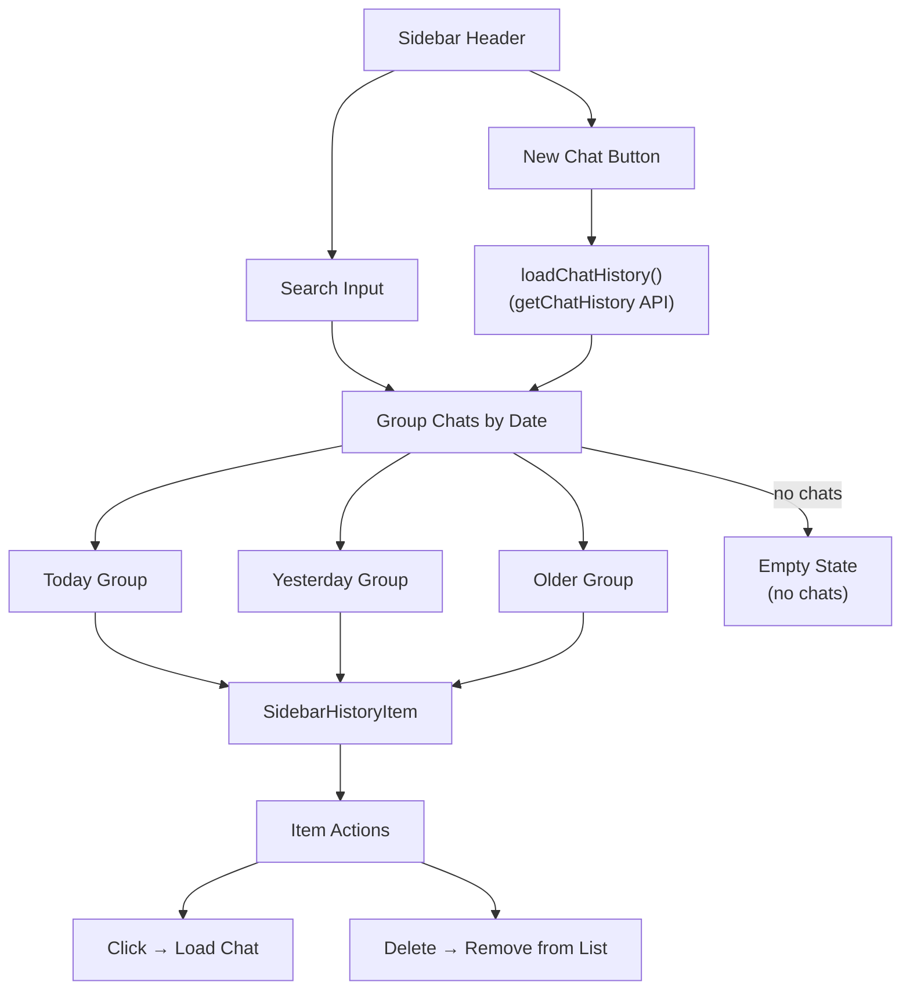

**Sources**: [frontend/components/chatbot/sidebar.tsx:25-221]()

### Chat Grouping Logic

Chats are grouped into mutually exclusive date buckets:

```typescript
// Today: chats from current calendar day
const todayChats = filteredChats.filter(c => {
  const chatDate = new Date(c.createdAt)
  return chatDate.toDateString() === todayDateString
})

// Yesterday: chats from previous calendar day
const yesterdayChats = filteredChats.filter(c => {
  const chatDate = new Date(c.createdAt)
  return chatDate.toDateString() === yesterdayDateString
})

// Older: chats before yesterday
const olderChats = filteredChats.filter(c => {
  const chatDate = new Date(c.createdAt)
  return chatDate < startOfYesterday
})
```

**Sources**: [frontend/components/chatbot/sidebar.tsx:65-94]()

---

## Title Generation

Chat titles are automatically generated from the first user message using the `generateTitle()` utility:

```typescript
useEffect(() => {
  if (!hasGeneratedTitle && messages.length >= 2 && activeChatId) {
    const firstUserMessage = messages.find(m => m.role === 'user')
    if (firstUserMessage && firstUserMessage.parts) {
      const textPart = firstUserMessage.parts.find(p => p.type === 'text')
      if (textPart && 'text' in textPart) {
        const title = generateTitle(textPart.text)
        updateChatTitle(activeChatId, title).catch(console.error)
        setHasGeneratedTitle(true)
      }
    }
  }
}, [messages, activeChatId, hasGeneratedTitle])
```

The `generateTitle()` function truncates the message to 50 characters and ensures a clean title by removing line breaks.

**Sources**: [frontend/components/chatbot/chat.tsx:395-408]()

---

## Agent Routing Corrections (PRD-50)

When a user manually selects a different agent after an auto-routing decision, the system records a correction for learning:

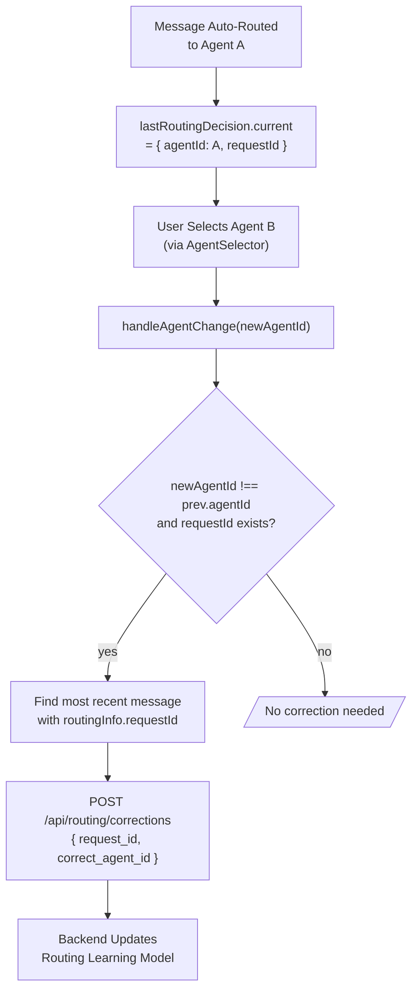

**Sources**: [frontend/components/chatbot/chat.tsx:342-361]()

---

## Welcome Card and Quick Actions

When no messages exist in the chat, a centered welcome card displays with suggested actions and quick links:

### Welcome Card Content

1. **Hero Header**: "AI Services That [Elevate] Your Workflow" with animated brand icon
2. **Description**: Brief system overview
3. **Suggested Actions**: 4 pre-defined prompts focused on data visualization ([frontend/components/chatbot/chat.tsx:648-653]())
4. **Quick Links**: Navigation to Agents, Knowledge Base, Workflows, Tools ([frontend/components/chatbot/chat.tsx:655-660]())

The card uses an Incredible-style design with gradient borders and glow effects:

```typescript
className={[
  'relative w-full max-w-3xl overflow-hidden rounded-3xl',
  'border border-orange-500/12 bg-background/40 backdrop-blur-xl',
  'shadow-[0_0_64px_rgba(249,115,22,0.10)]',
].join(' ')}
```

**Sources**: [frontend/components/chatbot/chat.tsx:818-927]()

---

## Performance Optimizations

### Agent Name Caching

Agent names are fetched asynchronously when routing indicators appear and cached in a ref to avoid redundant API calls:

```typescript
const agentNameCache = useRef<Record<number, string>>({})

// On routing decision
if (!agentNameCache.current[info.agentId]) {
  apiClient.request(`/api/agents/${info.agentId}`)
    .then((agent) => {
      agentNameCache.current[info.agentId] = agent?.name || `Agent #${info.agentId}`
      // Update all messages with this agent's routing info
    })
}
```

**Sources**: [frontend/components/chatbot/chat.tsx:72-74, 309-327]()

### Widget Deduplication

Before creating a new widget, the system checks if an identical widget already exists and activates it instead:

```typescript
const existingWidget = Object.values(existingWidgets).find(
  w => w.type === 'code' && 
       (w.data as any)?.filePath === code.file_path &&
       (w.data as any)?.symbolName === code.symbol_name
)
if (existingWidget) {
  useWorkspaceStore.getState().setActiveWidget(existingWidget.id)
  return
}
```

**Sources**: [frontend/components/chatbot/chat.tsx:491-501]()

### Textarea Auto-Resize

The multimodal input textarea automatically adjusts height based on content, up to a maximum of 200px:

```typescript
const adjustHeight = useCallback(() => {
  if (textareaRef.current) {
    textareaRef.current.style.height = 'auto'
    textareaRef.current.style.height = `${Math.min(textareaRef.current.scrollHeight, 200)}px`
  }
}, [])

useEffect(() => {
  adjustHeight()
}, [safeInput, adjustHeight])
```

**Sources**: [frontend/components/chatbot/multimodal-input.tsx:52-61]()

---

## Type Definitions

The chat system uses comprehensive TypeScript types defined in [frontend/types/chat.ts]():

### Core Types

| Type | Description |
|------|-------------|
| `ChatMessage` | Extended message with `parts`, `toolCalls`, `routingInfo`, `codeSnippets`, `documents`, `database_results` |
| `MessagePart` | Union type: text, file, tool-result, artifact |
| `ToolCall` | Tool execution state: `toolCallId`, `toolName`, `state`, `input`, `error`, `durationMs` |
| `RoutingInfo` | Routing decision: `requestId`, `agentId`, `agentName`, `confidence`, `routeType`, `reasoning` |
| `Artifact` | Standalone content: `id`, `kind`, `title`, `content`, `language`, `metadata` |
| `CodeSnippet` | Code from CodeGraph: `language`, `code`, `file_path`, `line_number`, `symbol_name`, `explanation` |
| `DocumentReference` | Document from RAG: `id`, `filename`, `excerpt`, `similarity`, `chunk_count`, `has_full_content` |
| `DatabaseResult` | Query result: `database`, `sql`, `data`, `columns`, `execution_time_ms`, `pandas_ai` |
| `AppUsage` | Token tracking: `promptTokens`, `completionTokens`, `totalTokens`, `cost` |

**Sources**: [frontend/types/chat.ts:1-292]()

---

## Error Handling

### Upload Failures

File upload errors display a toast notification and clear the upload queue:

```typescript
catch (error: any) {
  console.error('Document upload failed', error)
  toast.error(error?.message || 'Failed to upload document(s)')
} finally {
  setUploadQueue([])
  if (fileInputRef.current) fileInputRef.current.value = ''
}
```

**Sources**: [frontend/components/chatbot/multimodal-input.tsx:132-139]()

### Suggestion Fetch Failures

Tool suggestion errors fall back to empty suggestions and clear the active tool:

```typescript
catch (error) {
  console.error('Failed to fetch tool suggestions:', error)
  toast.error(`Failed to load suggestions for ${appName}`)
  setToolSuggestions([])
  setActiveTool(null)
}
```

**Sources**: [frontend/components/chatbot/chat.tsx:454-459]()

### Widget Content Failures

If full document content fails to load, the widget displays an error state:

```typescript
catch ((error) => {
  console.error('Failed to load document content', error)
  toast.error('Failed to load full document content')
  useWorkspaceStore.getState().updateWidget(widgetId, {
    state: 'error',
    error: { message: 'Failed to load full document' },
  })
})
```

**Sources**: [frontend/components/chatbot/chat.tsx:593-600]()

---

## Integration Points

### Backend API Routes

| Endpoint | Method | Purpose |
|----------|--------|---------|
| `/api/chat` | POST | Send message, receive streaming response |
| `/api/chat/:id/messages` | GET | Load chat history |
| `/api/chat/:id/title` | PUT | Update chat title |
| `/api/chat/:id/vote` | POST | Vote on message (thumbs up/down) |
| `/api/chat/:id` | DELETE | Delete chat |
| `/api/agents/:id` | GET | Fetch agent details (for name resolution) |
| `/api/tools/:app/suggestions` | GET | Fetch tool suggestions (PRD-40) |
| `/api/routing/corrections` | POST | Record routing correction (PRD-50) |
| `/api/documents/:id/content` | GET | Fetch full document content |
| `/api/documents/upload` | POST | Upload document file |

**Sources**: [frontend/components/chatbot/chat.tsx:311, 353, 576](), [frontend/components/chatbot/multimodal-input.tsx:119]()

### Related Components

- **Agent Management** ([Agents](#3)): Agent selection, configuration, and tool assignment
- **Workflows & Recipes** ([Workflows & Recipes](#4)): Workflow execution triggers from chat
- **Tools & Integrations** ([Tools & Integrations](#6)): Tool suggestions and Composio integrations
- **Authentication** ([Authentication & Multi-Tenancy](#9)): User context and workspace resolution

---