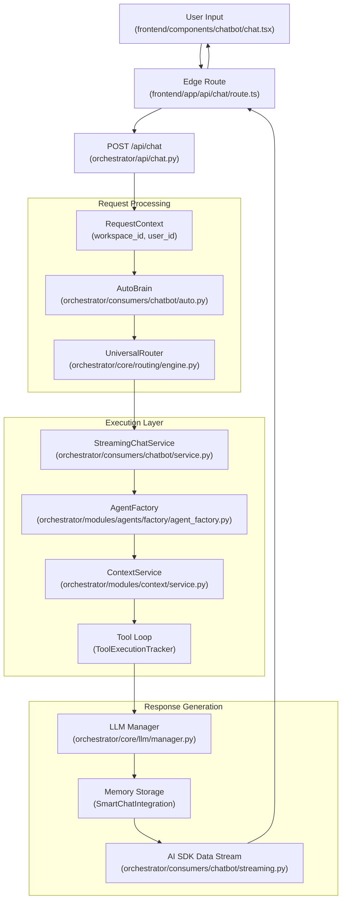

# Chat Interface

<details>
<summary>Relevant source files</summary>

The following files were used as context for generating this wiki page:

- [docs/reviews/COMPOSIO-TOOL-REGRESSION-REVIEW.md](docs/reviews/COMPOSIO-TOOL-REGRESSION-REVIEW.md)
- [frontend/app/api/chat/route.ts](frontend/app/api/chat/route.ts)
- [frontend/components/chatbot/chat-mode-bar.tsx](frontend/components/chatbot/chat-mode-bar.tsx)
- [frontend/components/chatbot/chat.tsx](frontend/components/chatbot/chat.tsx)
- [frontend/components/chatbot/message-actions.tsx](frontend/components/chatbot/message-actions.tsx)
- [frontend/components/chatbot/message.tsx](frontend/components/chatbot/message.tsx)
- [frontend/components/chatbot/mission-suggestion-card.tsx](frontend/components/chatbot/mission-suggestion-card.tsx)
- [frontend/components/missions/create-mission-modal.tsx](frontend/components/missions/create-mission-modal.tsx)
- [frontend/lib/chat/hooks.ts](frontend/lib/chat/hooks.ts)
- [frontend/stores/mission-store.ts](frontend/stores/mission-store.ts)
- [frontend/types/chat.ts](frontend/types/chat.ts)
- [orchestrator/api/chat.py](orchestrator/api/chat.py)
- [orchestrator/api/chat_voice.py](orchestrator/api/chat_voice.py)
- [orchestrator/consumers/chatbot/auto.py](orchestrator/consumers/chatbot/auto.py)
- [orchestrator/consumers/chatbot/intent_classifier.py](orchestrator/consumers/chatbot/intent_classifier.py)
- [orchestrator/consumers/chatbot/personality.py](orchestrator/consumers/chatbot/personality.py)
- [orchestrator/consumers/chatbot/service.py](orchestrator/consumers/chatbot/service.py)
- [orchestrator/consumers/chatbot/smart_tool_router.py](orchestrator/consumers/chatbot/smart_tool_router.py)
- [orchestrator/core/llm/manager.py](orchestrator/core/llm/manager.py)
- [orchestrator/core/routing/engine.py](orchestrator/core/routing/engine.py)
- [orchestrator/modules/orchestrator/service.py](orchestrator/modules/orchestrator/service.py)
- [orchestrator/modules/tools/discovery/actions_analytics_enhanced.py](orchestrator/modules/tools/discovery/actions_analytics_enhanced.py)
- [orchestrator/modules/tools/discovery/handlers_analytics_enhanced.py](orchestrator/modules/tools/discovery/handlers_analytics_enhanced.py)
- [orchestrator/modules/tools/discovery/handlers_search.py](orchestrator/modules/tools/discovery/handlers_search.py)
- [orchestrator/modules/tools/discovery/platform_actions.py](orchestrator/modules/tools/discovery/platform_actions.py)
- [orchestrator/modules/tools/discovery/platform_executor.py](orchestrator/modules/tools/discovery/platform_executor.py)
- [orchestrator/modules/tools/tool_router.py](orchestrator/modules/tools/tool_router.py)

</details>


The Chat Interface is the primary user-facing conversational layer in Automatos AI. It provides a streaming chat experience with intelligent routing, complexity-based execution strategies, tool calling, and multi-tier memory integration. The interface handles everything from simple greetings to complex multi-step workflows, adapting its execution strategy based on the detected complexity of each request.

For agent execution details, see [Agents](#5). For routing logic, see [Universal Router](#10). For memory retrieval, see [Memory System](#3).

---

## Architecture Overview

The chat system follows a request-response pipeline with streaming support, complexity assessment, and adaptive tool loading.

**Chat Request Pipeline**



Sources: [orchestrator/api/chat.py:63-63](), [orchestrator/consumers/chatbot/service.py:11-12](), [orchestrator/consumers/chatbot/streaming.py:21-25](), [orchestrator/core/routing/engine.py:58-68]()

---

## Chat API & Streaming

The chat API provides a single streaming endpoint that handles both new conversations and continuations. It uses the AI SDK Data Stream format for Server-Sent Events (SSE).

**API Endpoint**

```
POST /api/chat
Content-Type: application/json
Authorization: Bearer <clerk-jwt> OR x-api-key: <api-key>
X-Workspace-ID: <workspace-uuid>
```

**Request Schema**

| Field | Type | Description |
|-------|------|-------------|
| `id` | `string?` | Chat session ID (UUID). Omit to create new chat. |
| `message` | `ChatMessageRequest` | User message with role and parts. |
| `agentId` | `int?` | Selected agent ID for explicit routing. |
| `missionMode` | `boolean?` | Conversational mission planning [frontend/lib/chat/hooks.ts:118-119](). |
| `planMode` | `boolean?` | Research and strategy mode [frontend/lib/chat/hooks.ts:120-121](). |

**Response Format (AI SDK Data Stream)**

The response is a `text/plain` SSE stream. The backend sets routing headers like `x-routing-agent-id` and `x-routing-confidence` which are extracted by the frontend hook [frontend/lib/chat/hooks.ts:142-146](). The `StreamingHandler` formats chunks as `0:"text"` (text parts) or `d:{"type":"..."}` (data parts) [orchestrator/consumers/chatbot/streaming.py:105-115]().

Sources: [orchestrator/api/chat.py:63-63](), [orchestrator/consumers/chatbot/streaming.py:102-177](), [frontend/lib/chat/hooks.ts:98-124]()

---

## Complexity Assessment (AutoBrain)

AutoBrain (PRD-68) performs **3-tier progressive complexity assessment** (Atom → Organism) to determine the execution strategy [orchestrator/consumers/chatbot/auto.py:14-22]().

**Complexity Scale**

| Level | Name | Description |
|-------|------|-------------|
| **ATOM** | `Complexity.ATOM` | Simple: greetings, factual, chitchat [orchestrator/consumers/chatbot/auto.py:44-44](). |
| **MOLECULE** | `Complexity.MOLECULE` | Needs a single tool or specific agent skill [orchestrator/consumers/chatbot/auto.py:45-45](). |
| **CELL** | `Complexity.CELL` | Needs memory + tool + reasoning [orchestrator/consumers/chatbot/auto.py:46-46](). |
| **ORGAN** | `Complexity.ORGAN` | Multi-agent coordination; triggers workflow bridge [orchestrator/consumers/chatbot/auto.py:47-47](). |
| **ORGANISM** | `Complexity.ORGANISM` | Enterprise pipeline with learning + feedback [orchestrator/consumers/chatbot/auto.py:48-48](). |

**3-Tier Assessment Flow**

1.  **Tier 1: Cache**: Redis lookup for identical previous queries [orchestrator/consumers/chatbot/auto.py:15-15]().
2.  **Tier 2: Heuristics**: Fast-path regex patterns for greetings (`_ATOM_PATTERNS`) and platform keywords (`_PLATFORM_KEYWORDS`) [orchestrator/consumers/chatbot/auto.py:92-116]().
3.  **Tier 3: LLM**: Classification using a model to determine complexity, action, and tool hints [orchestrator/consumers/chatbot/auto.py:59-73]().

Sources: [orchestrator/consumers/chatbot/auto.py:1-85](), [orchestrator/api/chat.py:70-88]()

---

## Streaming Chat Service

`StreamingChatService` orchestrates the response generation. For high-complexity tasks (**ORGAN** or **ORGANISM**), it utilizes a `_stream_workflow_bridge` [orchestrator/api/chat.py:70-88]().

**Workflow Bridge Pipeline**
1.  **Create Transient Workflow**: Generates a `Workflow` object from the user message, tagged as `chat_generated` [orchestrator/api/chat.py:101-120]().
2.  **Execution**: Triggers `execute_workflow_with_progress` with a 120s safety timeout [orchestrator/api/chat.py:153-161]().
3.  **Streaming**: Forwards workflow updates (started, error, result) back to the chat response [orchestrator/api/chat.py:143-177]().

Sources: [orchestrator/api/chat.py:70-190](), [orchestrator/consumers/chatbot/service.py:11-13]()

---

## Tool Loop Prevention

To prevent infinite loops, the system uses a `ToolExecutionTracker` within each conversation turn [orchestrator/consumers/chatbot/service.py:78-85]().

**Deduplication Strategies:**
- **Exact Deduplication**: Skips if the same tool name and argument hash are detected [orchestrator/consumers/chatbot/service.py:126-129]().
- **Semantic Deduplication**: For search tools (e.g., `search_knowledge`), checks for similar queries using `SequenceMatcher` [orchestrator/consumers/chatbot/service.py:57-67](), [orchestrator/consumers/chatbot/service.py:131-137]().
- **Per-Tool Limits**: Enforces `TOOL_RETRY_LIMITS` (e.g., `composio_execute` is limited to 2 calls per turn) [orchestrator/consumers/chatbot/service.py:93-104]().

Sources: [orchestrator/consumers/chatbot/service.py:48-156]()

---

## Memory Integration

The chat interface integrates with memory through several specialized handlers and tool routers:
- **`SmartToolRouter`**: Categorizes tools (data, search, memory) and filters them based on detected intent (e.g., `Intent.MEMORY_RECALL`) [orchestrator/consumers/chatbot/smart_tool_router.py:112-125]().
- **`platform_search_memory`**: A promoted tool always available for memory-related queries [orchestrator/consumers/chatbot/smart_tool_router.py:66-73]().
- **`PlatformActionExecutor`**: Routes platform-specific memory actions like `platform_store_memory` and `platform_get_memory_stats` to domain handlers [orchestrator/modules/tools/discovery/platform_executor.py:183-193]().

Sources: [orchestrator/consumers/chatbot/smart_tool_router.py:1-135](), [orchestrator/modules/tools/discovery/platform_executor.py:49-54]()

---

## Chat UI Components

The frontend is built with Next.js and uses a custom `useChat` hook to manage state and streaming [frontend/lib/chat/hooks.ts:8-28]().

**Key Components:**
- **`Chat`**: Main container managing artifacts, resizable panels, and workspace context [frontend/components/chatbot/chat.tsx:56-64]().
- **`MultimodalInput`**: Handles text and file uploads for the chat session [frontend/components/chatbot/chat.tsx:9-9]().
- **`ChatModeBar`**: Toggles between different interaction modes (e.g., Mission mode, Plan mode) [frontend/components/chatbot/chat.tsx:38-38]().
- **`ToolSuggestionBar`**: Provides dynamic tool suggestions based on the current context (PRD-40) [frontend/components/chatbot/chat.tsx:29-32]().

Sources: [frontend/components/chatbot/chat.tsx:1-166](), [frontend/lib/chat/hooks.ts:1-180]()

---

## Widget System

The system supports a **Widget Architecture** (PRD-38.1) for isolated memory and task access [frontend/components/chatbot/chat.tsx:19-22]().

**Integration Points:**
- **`useWorkspaceStore`**: Dispatches events like `memory-injected`, `memory-stored`, and `workflow-update` to update widget states [frontend/components/chatbot/chat.tsx:75-78]().
- **`CodingCanvasWidgetData`**: Opens a dedicated "Code Canvas" widget for sandboxed code execution and file management [frontend/components/chatbot/chat.tsx:113-124]().
- **`Canvas`**: The rendering layer for active widgets within the workspace [frontend/components/chatbot/chat.tsx:21-21]().

Sources: [frontend/components/chatbot/chat.tsx:68-132](), [frontend/stores/workspace-store.ts]()

---