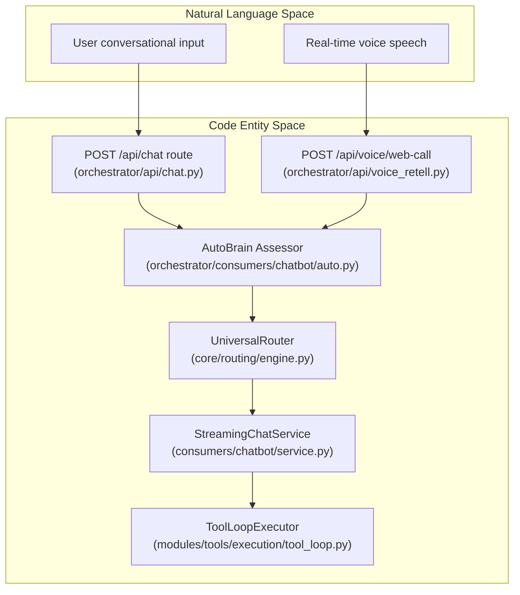
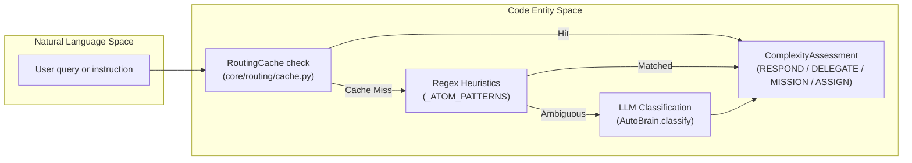

# Chat Interface

Relevant source files

The following files were used as context for generating this wiki page:

- [frontend/app/api/chat/route.ts](frontend/app/api/chat/route.ts)
- [frontend/app/chat/page.tsx](frontend/app/chat/page.tsx)
- [frontend/components/chatbot/__tests__/widget-quick-prompts.test.ts](frontend/components/chatbot/__tests__/widget-quick-prompts.test.ts)
- [frontend/components/chatbot/artifact-viewer.tsx](frontend/components/chatbot/artifact-viewer.tsx)
- [frontend/components/chatbot/chat-widget.tsx](frontend/components/chatbot/chat-widget.tsx)
- [frontend/components/chatbot/message.tsx](frontend/components/chatbot/message.tsx)
- [frontend/components/chatbot/multimodal-input.tsx](frontend/components/chatbot/multimodal-input.tsx)
- [frontend/components/chatbot/sidebar-history-item.tsx](frontend/components/chatbot/sidebar-history-item.tsx)
- [frontend/components/chatbot/sidebar.tsx](frontend/components/chatbot/sidebar.tsx)
- [frontend/components/chatbot/studio-chat-shell.tsx](frontend/components/chatbot/studio-chat-shell.tsx)
- [frontend/components/chatbot/text-artifact.tsx](frontend/components/chatbot/text-artifact.tsx)
- [frontend/lib/chat/api.ts](frontend/lib/chat/api.ts)
- [frontend/lib/chat/hooks.ts](frontend/lib/chat/hooks.ts)
- [frontend/types/chat.ts](frontend/types/chat.ts)
- [orchestrator/api/chat.py](orchestrator/api/chat.py)
- [orchestrator/api/routing.py](orchestrator/api/routing.py)
- [orchestrator/consumers/chatbot/auto.py](orchestrator/consumers/chatbot/auto.py)
- [orchestrator/consumers/chatbot/service.py](orchestrator/consumers/chatbot/service.py)
- [orchestrator/consumers/chatbot/streaming.py](orchestrator/consumers/chatbot/streaming.py)
- [orchestrator/core/llm/manager.py](orchestrator/core/llm/manager.py)
- [orchestrator/core/models/stream_events.py](orchestrator/core/models/stream_events.py)
- [orchestrator/core/routing/engine.py](orchestrator/core/routing/engine.py)
- [orchestrator/modules/agents/factory/agent_factory.py](orchestrator/modules/agents/factory/agent_factory.py)
- [orchestrator/modules/tools/discovery/platform_actions.py](orchestrator/modules/tools/discovery/platform_actions.py)
- [orchestrator/modules/tools/discovery/platform_executor.py](orchestrator/modules/tools/discovery/platform_executor.py)
- [orchestrator/scripts/setup_jira_trigger.py](orchestrator/scripts/setup_jira_trigger.py)
- [orchestrator/services/heartbeat_service.py](orchestrator/services/heartbeat_service.py)
- [orchestrator/services/page_context.py](orchestrator/services/page_context.py)
- [orchestrator/tests/test_prd221_page_context.py](orchestrator/tests/test_prd221_page_context.py)
- [orchestrator/tests/test_prd221_page_prior_tools.py](orchestrator/tests/test_prd221_page_prior_tools.py)
- [orchestrator/tests/test_us009_limit_reporting.py](orchestrator/tests/test_us009_limit_reporting.py)

The Chat Interface is the primary user-facing conversational layer in Automatos AI. It provides a streaming chat experience with intelligent routing, complexity-based execution strategies, tool calling, and multi-tier memory integration. The interface handles everything from simple greetings to complex multi-step missions, adapting its execution strategy based on the detected complexity of each request.

This is a PARENT page. For detailed technical specifications, refer to the child pages:
- [Chat API & Streaming](#9.1)
- [Complexity Assessment (AutoBrain)](#9.2)
- [Streaming Chat Service](#9.3)
- [Tool Loop Prevention](#9.4)
- [Memory Integration](#9.5)
- [Chat UI Components](#9.6)
- [Rich Tool Result Widgets](#9.7)

---

## Architecture Overview

The chat subsystem bridges user intent expressed in Natural Language Space to concrete execution routines within Code Entity Space. Incoming messages traverse authentication boundaries, complexity classifiers, and routing engines before hitting the streaming chat service and tool loop executor.

Sources: [orchestrator/api/chat.py:32-38](), [orchestrator/consumers/chatbot/auto.py:5-22](), [orchestrator/consumers/chatbot/service.py:11-35](), [orchestrator/core/routing/engine.py:58-85]()

---

## Chat API & Streaming

The chat API exposes endpoints for conversation management, SSE streaming, and voting. It formats responses using the AI SDK Data Stream protocol and manages principal resolution through hybrid auth dependencies.

For complete details, see [Chat API & Streaming](#9.1).

Sources: [orchestrator/api/chat.py:4-173]()

---

## Complexity Assessment (AutoBrain)

AutoBrain executes a 3-tier progressive complexity evaluation (Atom → Organism) to establish whether a prompt requires direct answering, single tool assistance, memory context, or multi-agent swarm workflows.

For complete details, see [Complexity Assessment (AutoBrain)](#9.2).

Sources: [orchestrator/consumers/chatbot/auto.py:5-149](), [orchestrator/core/routing/cache.py:1-50]()

---

## Streaming Chat Service

The streaming layer coordinates prompt preparation, model invocation, and event streaming. It relies on orchestrator utilities to handle empty completions and fallback content safely.

For complete details, see [Streaming Chat Service](#9.3).

Sources: [orchestrator/consumers/chatbot/service.py:11-65]()

---

## Tool Loop Prevention

To eliminate infinite execution loops and redundant calls, the backend tracks tool invocations via deterministic iteration limits and semantic query comparisons.

For complete details, see [Tool Loop Prevention](#9.4).

Sources: [orchestrator/consumers/chatbot/service.py:73-190]()

---

## Memory Integration

Chat exchanges integrate seamlessly with the layered memory service. Context sections are injected prior to model execution, and completed exchanges are persisted asynchronously for temporal continuity.

For complete details, see [Memory Integration](#9.5).

Sources: [orchestrator/consumers/chatbot/service.py:5-9]()

---

## Chat UI Components

The frontend chat interface handles multimodal message input, markdown rendering, tool call activity trails, and live session hydration using specialized React hooks and components.

For complete details, see [Chat UI Components](#9.6).

Sources: [frontend/components/chatbot/chat-widget.tsx:1-189](), [frontend/lib/chat/hooks.ts:1-163]()

---

## Rich Tool Result Widgets

Tool outputs are rendered via a dynamic widget router that maps specialized execution payloads into interactive UI components such as code canvases, file viewers, terminals, and approval dialogs.

For complete details, see [Rich Tool Result Widgets](#9.7).

Sources: [frontend/components/chatbot/message.tsx:83-133]()

---