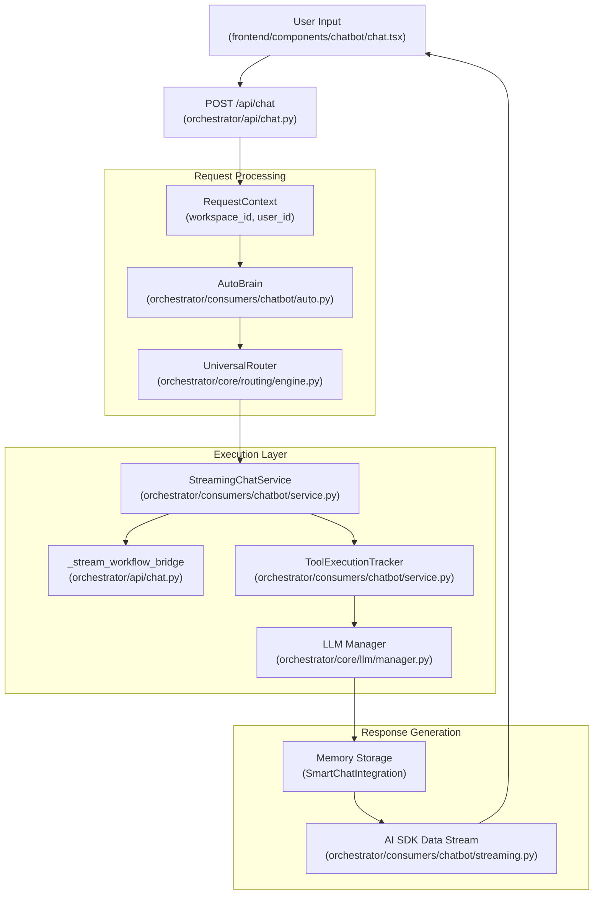

# Chat Interface

<details>
<summary>Relevant source files</summary>

The following files were used as context for generating this wiki page:

- [frontend/app/api/chat/route.ts](frontend/app/api/chat/route.ts)
- [frontend/components/chatbot/chat.tsx](frontend/components/chatbot/chat.tsx)
- [frontend/components/chatbot/message.tsx](frontend/components/chatbot/message.tsx)
- [frontend/components/chatbot/mission-suggestion-card.tsx](frontend/components/chatbot/mission-suggestion-card.tsx)
- [frontend/components/chatbot/multimodal-input.tsx](frontend/components/chatbot/multimodal-input.tsx)
- [frontend/components/voice/VoiceMessage.tsx](frontend/components/voice/VoiceMessage.tsx)
- [frontend/components/voice/VoiceMicButton.tsx](frontend/components/voice/VoiceMicButton.tsx)
- [frontend/components/voice/VoicePlayer.tsx](frontend/components/voice/VoicePlayer.tsx)
- [frontend/components/voice/VoiceRecordingIndicator.tsx](frontend/components/voice/VoiceRecordingIndicator.tsx)
- [frontend/hooks/use-voice-playback.ts](frontend/hooks/use-voice-playback.ts)
- [frontend/hooks/use-voice-recorder.ts](frontend/hooks/use-voice-recorder.ts)
- [frontend/lib/chat/hooks.ts](frontend/lib/chat/hooks.ts)
- [frontend/lib/voice-client.ts](frontend/lib/voice-client.ts)
- [frontend/stores/mission-store.ts](frontend/stores/mission-store.ts)
- [frontend/types/chat.ts](frontend/types/chat.ts)
- [orchestrator/api/chat.py](orchestrator/api/chat.py)
- [orchestrator/api/recipe_executor.py](orchestrator/api/recipe_executor.py)
- [orchestrator/consumers/chatbot/service.py](orchestrator/consumers/chatbot/service.py)
- [orchestrator/consumers/chatbot/streaming.py](orchestrator/consumers/chatbot/streaming.py)
- [orchestrator/core/models/stream_events.py](orchestrator/core/models/stream_events.py)
- [orchestrator/modules/agents/factory/agent_factory.py](orchestrator/modules/agents/factory/agent_factory.py)

</details>


The Chat Interface is the primary user-facing conversational layer in Automatos AI. It provides a streaming chat experience with intelligent routing, complexity-based execution strategies, tool calling, and multi-tier memory integration. The interface handles everything from simple greetings to complex multi-step workflows, adapting its execution strategy based on the detected complexity of each request.

For agent execution details, see [Agents](#5). For routing logic, see [Universal Router](#10). For memory retrieval, see [Memory System](#3).

---

## Architecture Overview

The chat system follows a request-response pipeline with streaming support, complexity assessment, and adaptive tool loading.

**Chat Request Pipeline**



Sources: [orchestrator/api/chat.py:30-30](), [orchestrator/consumers/chatbot/service.py:11-12](), [orchestrator/core/llm/manager.py:25-25]()

---

## Chat API & Streaming

The chat API provides a single streaming endpoint that handles both new conversations and continuations. It uses the AI SDK Data Stream format for Server-Sent Events (SSE).

**API Endpoint**

```
POST /api/chat
Content-Type: application/json
Authorization: Bearer <clerk-jwt> OR x-api-key: <api-key>
X-Workspace-ID: <workspace-uuid>
```

**Request Schema**

| Field | Type | Description |
|-------|------|-------------|
| `id` | `string?` | Chat session ID (UUID). Omit to create new chat [orchestrator/api/chat.py:186-191](). |
| `message` | `ChatMessageRequest` | User message with role and parts [orchestrator/api/chat.py:186-188](). |
| `agentId` | `int?` | Selected agent ID for explicit routing [frontend/lib/chat/hooks.ts:116-117](). |
| `missionMode` | `boolean?` | Conversational mission planning [frontend/lib/chat/hooks.ts:119-120](). |
| `planMode` | `boolean?` | Research and strategy mode [frontend/lib/chat/hooks.ts:121-122](). |

**Response Format (AI SDK Data Stream)**

The response is a `text/plain` SSE stream. The backend forwards routing headers like `x-routing-agent-id` and `x-routing-confidence` [frontend/lib/chat/hooks.ts:143-147](). The frontend `useChat` hook parses the stream, handling text chunks (`0:`), tool calls, and custom data events (`d:`) [frontend/lib/chat/hooks.ts:182-200]().

Sources: [orchestrator/api/chat.py:30-190](), [frontend/lib/chat/hooks.ts:99-165](), [orchestrator/consumers/chatbot/streaming.py:105-176]()

---

## Complexity Assessment (AutoBrain)

AutoBrain performs progressive complexity assessment to determine if a request can be handled as a simple chat or requires a full workflow execution [orchestrator/api/chat.py:45-45]().

**Complexity Scale**

| Level | Name | Description |
|-------|------|-------------|
| **ATOM** | `Complexity.ATOM` | Simple greetings or factual chitchat. |
| **MOLECULE** | `Complexity.MOLECULE` | Needs a single tool or specific agent skill. |
| **CELL** | `Complexity.CELL` | Needs memory + tool + reasoning. |
| **ORGAN** | `Complexity.ORGAN` | Multi-agent coordination; triggers workflow bridge [orchestrator/api/chat.py:48-48](). |
| **ORGANISM** | `Complexity.ORGANISM` | Enterprise pipeline, learning + feedback. |

Sources: [orchestrator/api/chat.py:37-55](), [orchestrator/consumers/chatbot/service.py:34-34]()

---

## Streaming Chat Service

`StreamingChatService` orchestrates the response generation. For high-complexity tasks (**ORGAN** or **ORGANISM**), it utilizes a `_stream_workflow_bridge` to move from a chat bubble to a structured pipeline [orchestrator/api/chat.py:37-46]().

**Workflow Bridge Pipeline**
1.  **Create Transient Workflow**: Generates a `Workflow` object from the user message, tagged as `chat_generated` [orchestrator/api/chat.py:68-84]().
2.  **Execution**: Triggers `execute_workflow_with_progress` with a safety timeout (120s) [orchestrator/api/chat.py:120-126]().
3.  **Result Integration**: Saves the final workflow output as an assistant message in the chat session [orchestrator/api/chat.py:147-156]().

Sources: [orchestrator/api/chat.py:37-174](), [orchestrator/consumers/chatbot/service.py:11-13]()

---

## Tool Loop Prevention

To prevent infinite loops and redundant API calls, the system uses a `ToolExecutionTracker` within each conversation turn [orchestrator/consumers/chatbot/service.py:83-90]().

**Deduplication Strategies:**
- **Exact Deduplication**: Skips if the same tool is called with identical parameter hashes [orchestrator/consumers/chatbot/service.py:163-167]().
- **Semantic Deduplication**: Checks if search queries are semantically similar (threshold 0.75) for tools like `search_knowledge` [orchestrator/consumers/chatbot/service.py:62-71](), [orchestrator/consumers/chatbot/service.py:168-176]().
- **Per-Tool Limits**: Enforces `TOOL_RETRY_LIMITS` (e.g., `read_file` limit of 8, `composio_execute` limit of 5) [orchestrator/consumers/chatbot/service.py:98-111]().

Sources: [orchestrator/consumers/chatbot/service.py:53-185]()

---

## Voice & Multimodal Integration

The chat interface supports voice interactions and multimodal inputs.

**Voice Pipeline**
- **Recording**: Handled by `useVoiceRecorder` hook in the UI [frontend/components/chatbot/multimodal-input.tsx:124-127]().
- **Processing**: The `handleVoiceComplete` callback sends audio blobs to the voice endpoint which performs STT, agent execution, and TTS [frontend/components/chatbot/multimodal-input.tsx:69-122]().
- **Playback**: `useVoicePlayback` manages `AudioContext` for word-boundary-aware audio streaming [frontend/hooks/use-voice-playback.ts:19-212]().

**Attachments**
- **Ephemeral Attachments**: PRD-127 introduces `attachment_id` for ephemeral file references in messages [frontend/components/chatbot/multimodal-input.tsx:56-60]().
- **Payload**: The frontend sends `attachment_ids` instead of document URLs to ensure workspace isolation [frontend/components/chatbot/multimodal-input.tsx:166-184]().

Sources: [frontend/components/chatbot/multimodal-input.tsx:69-195](), [frontend/hooks/use-voice-playback.ts:1-225](), [orchestrator/api/chat.py:176-183]()

---

## Chat UI Components

The frontend is built with Next.js and uses a custom `useChat` hook to manage SSE stream parsing and state [frontend/lib/chat/hooks.ts:9-29]().

**Key Components:**
- **`Chat`**: Main container managing artifacts, resizable panels, and workspace context [frontend/components/chatbot/chat.tsx:57-65]().
- **`Message`**: Renders markdown, code blocks, and tool call status [frontend/components/chatbot/message.tsx:41-53]().
- **`MultimodalInput`**: Textarea with support for file uploads and voice recording [frontend/components/chatbot/multimodal-input.tsx:38-51]().
- **`ChatModeBar`**: Toggles between pinned agents and specialized mission/plan modes [frontend/components/chatbot/chat.tsx:39-39]().

Sources: [frontend/components/chatbot/chat.tsx:1-166](), [frontend/components/chatbot/message.tsx:15-184](), [frontend/lib/chat/hooks.ts:1-165]()

---

## Widget System

The system supports a **Widget Architecture** (PRD-38.1) for specialized execution views [frontend/components/chatbot/chat.tsx:20-20]().

**Integration Points:**
- **`useWorkspaceStore`**: Dispatches SSE events like `memory-injected` or `workflow-update` to update widget states [frontend/components/chatbot/chat.tsx:71-79]().
- **`CodingCanvasWidgetData`**: Opens a dedicated code canvas for sandboxed file operations within the chat view [frontend/components/chatbot/chat.tsx:115-126]().
- **`ArtifactViewer`**: Displays generated artifacts (documents, code, diagrams) alongside the conversation [frontend/components/chatbot/chat.tsx:11-11]().

Sources: [frontend/components/chatbot/chat.tsx:68-134](), [frontend/lib/chat/hooks.ts:31-35](), [orchestrator/consumers/chatbot/streaming.py:179-200]()

---