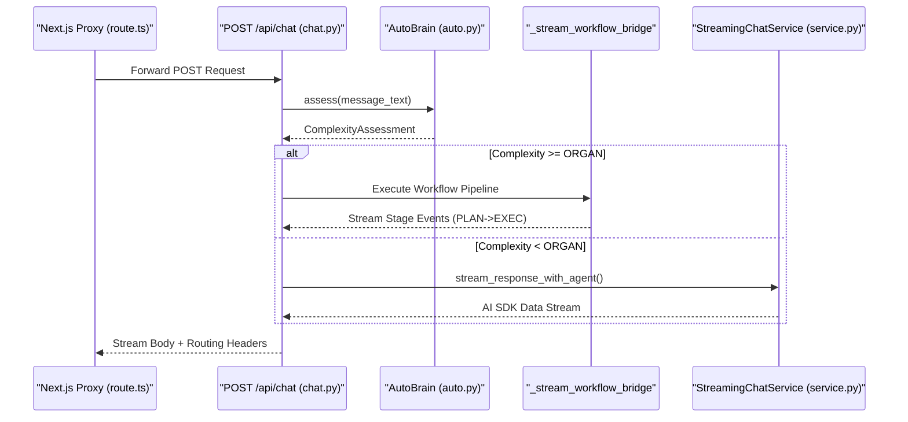
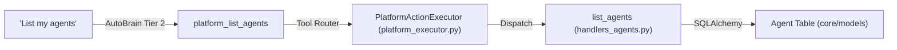

# Chat API & Streaming

Relevant source files

The following files were used as context for generating this wiki page:

- [frontend/app/api/chat/route.ts](frontend/app/api/chat/route.ts)
- [frontend/components/chatbot/chat.tsx](frontend/components/chatbot/chat.tsx)
- [frontend/components/chatbot/mission-suggestion-card.tsx](frontend/components/chatbot/mission-suggestion-card.tsx)
- [frontend/lib/chat/hooks.ts](frontend/lib/chat/hooks.ts)
- [frontend/stores/mission-store.ts](frontend/stores/mission-store.ts)
- [orchestrator/api/chat.py](orchestrator/api/chat.py)
- [orchestrator/api/recipe_executor.py](orchestrator/api/recipe_executor.py)
- [orchestrator/consumers/chatbot/service.py](orchestrator/consumers/chatbot/service.py)
- [orchestrator/modules/agents/factory/agent_factory.py](orchestrator/modules/agents/factory/agent_factory.py)

## Purpose and Scope

This document covers the **`/api/chat`** endpoint and its streaming response system, which powers real-time conversational interactions with AI agents. The chat API implements Server-Sent Events (SSE) streaming using the **AI SDK Data Stream format**, and integrates with the **AutoBrain** complexity assessor, **Universal Router**, and **Workflow Engine** to deliver intelligent, context-aware responses.

The implementation bridges high-level natural language requests to low-level code entities like `AgentFactory`, `UniversalRouter`, and `StreamingChatService`.

**Sources:** [orchestrator/api/chat.py:1-26](), [orchestrator/consumers/chatbot/service.py:1-13]()

---

## Request/Response Format

### Request Schema

The chat API accepts POST requests at `/api/chat`. The request body is processed by `POST /api/chat` which extracts the message and context for routing.

| Field | Type | Description |
|-------|------|-------------|
| `id` | `string?` | Chat session ID. If null, a new `Chat` record is created [orchestrator/api/chat.py:188-192](). |
| `message` | `ChatMessageRequest` | Contains `role` and `parts` (text, attachments) [orchestrator/api/chat.py:186-191](). |
| `agentId` | `int?` | Explicit agent selection (Tier 0 override) [orchestrator/api/chat.py:192](). |
| `selectedChatModel`| `string?` | Model hint used if no specific agent is targeted [orchestrator/api/chat.py:192](). |
| `missionMode` | `boolean?` | Flag for conversational mission planning [orchestrator/api/chat.py:192](). |

**Sources:** [orchestrator/api/chat.py:176-197](), [frontend/lib/chat/hooks.ts:110-123]()

---

### Response Format: AI SDK Data Stream

Responses use the Vercel AI SDK Data Stream format (`text/plain; charset=utf-8`) with line-prefixed events. The `StreamingChatService` and `StreamingHandler` manage this formatting.

| Prefix | Description | Example |
|--------|-------------|---------|
| `0:` | Text chunk (JSON string) | `0:"Hello"\n` [orchestrator/api/chat.py:171]() |
| `d:` | Custom data (JSON) | `d:{"type":"workflow-update","status":"started"}\n` [orchestrator/api/chat.py:110]() |
| `e:` | Error event | `e:{"message":"Workflow timeout"}\n` [orchestrator/api/chat.py:134]() |

**Sources:** [orchestrator/api/chat.py:110-172](), [orchestrator/consumers/chatbot/service.py:35]()

---

### Response Headers

The API returns metadata about routing and complexity assessment in response headers. These are forwarded by the frontend proxy to the client.

| Header | Description | Source |
|--------|-------------|--------|
| `x-routing-agent-id` | Selected agent ID from `UniversalRouter` | [frontend/app/api/chat/route.ts:80]() |
| `x-routing-confidence`| Routing confidence (0.0-1.0) | [frontend/app/api/chat/route.ts:80]() |
| `x-routing-type` | "agent", "workflow", or "orchestrate" | [frontend/app/api/chat/route.ts:80]() |
| `x-auto-complexity` | "atom", "molecule", "cell", "organ", "organism" | [orchestrator/consumers/chatbot/auto.py:42-49]() |

**Sources:** [frontend/app/api/chat/route.ts:72-85](), [orchestrator/consumers/chatbot/auto.py:42-49]()

---

## Message Lifecycle

The following diagram shows the complete flow from the API entry point through complexity assessment to the final streamed response.

### Data Flow: API Entry to Stream
Title: Chat Request and Streaming Flow

**Sources:** [orchestrator/api/chat.py:37-55](), [orchestrator/api/chat.py:218-235](), [frontend/app/api/chat/route.ts:57-90]()

---

## Complexity Assessment (AutoBrain)

### Three-Tier Assessment Pipeline

The **AutoBrain** evaluates every message to determine its complexity level (Atom → Organism), minimizing LLM costs by using fast heuristics first.

Title: AutoBrain Tiered Logic

**Sources:** [orchestrator/consumers/chatbot/auto.py:14-22](), [orchestrator/consumers/chatbot/auto.py:92-114](), [orchestrator/consumers/chatbot/auto.py:116-181]()

---

## Workflow Bridge (PRD-68 Phase 2)

When `AutoBrain` detects **ORGAN** or **ORGANISM** complexity, the API invokes `_stream_workflow_bridge`. This function transitions the chat into a managed workflow execution.

1. **Transient Workflow**: Created with `source="chat_generated"` and a goal derived from the message text [orchestrator/api/chat.py:68-84]().
2. **Execution Record**: A `WorkflowExecution` is initialized to track the lifecycle [orchestrator/api/chat.py:92-105]().
3. **Progress Streaming**: Stage updates (PLAN → PREPARE → EXECUTE) are yielded as `workflow-update` events in the AI SDK stream [orchestrator/api/chat.py:110-116]().
4. **Timeout Safety**: Executions are wrapped in `asyncio.wait_for` with a 120s timeout [orchestrator/api/chat.py:123-126]().

**Sources:** [orchestrator/api/chat.py:37-173]()

---

## Tool Loop Prevention

The `ToolExecutionTracker` prevents infinite loops and redundant processing during agent execution turns.

| Feature | Implementation |
|---------|----------------|
| **Exact Deduplication** | Hashes `tool_args` to detect identical calls [orchestrator/consumers/chatbot/service.py:163-166](). |
| **Semantic Deduplication** | Uses `SequenceMatcher` to detect similar search queries for `SEARCH_TOOLS` [orchestrator/consumers/chatbot/service.py:62-71](). |
| **Retry Limits** | Enforces per-tool limits (e.g., `composio_execute`: 5, `read_file`: 8) [orchestrator/consumers/chatbot/service.py:98-111](). |

**Sources:** [orchestrator/consumers/chatbot/service.py:83-176]()

---

## Mission Suggestions (PRD-125)

The frontend `Chat` component integrates with `AutoBrain` results to suggest high-complexity missions when appropriate.

- **Trigger**: When `AutoBrain` detects `organ` or `organism` complexity [frontend/components/chatbot/chat.tsx:141-145]().
- **UI Component**: `MissionSuggestionCard` allows users to launch a full multi-agent mission directly from the chat context [frontend/components/chatbot/mission-suggestion-card.tsx:19-40]().
- **Data Flow**: Uses `useCreateMission` to persist a new mission and redirects the user to the mission planning view [frontend/components/chatbot/mission-suggestion-card.tsx:41-67]().

**Sources:** [frontend/components/chatbot/chat.tsx:141-153](), [frontend/components/chatbot/mission-suggestion-card.tsx:41-67]()

---

## Platform Actions & Tool Execution

Agents can interact with the platform itself via `PlatformActionExecutor`. If `AutoBrain` detects system-related keywords (e.g., "list my agents"), it injects these as `tool_hints`.

### Code Entity Association: Tools
Title: Natural Language to Platform Action Mapping

**Sources:** [orchestrator/consumers/chatbot/auto.py:117-120](), [orchestrator/modules/tools/discovery/platform_executor.py:173-176](), [orchestrator/modules/tools/discovery/handlers_agents.py:20]()

---

## LLM Configuration & Key Resolution

The `LLMManager` handles the final execution of chat requests by resolving providers and API keys.

- **Service Scoping**: LLM settings are scoped by service (e.g., `chatbot`, `orchestrator`) [orchestrator/core/llm/manager.py:30-41]().
- **Key Resolution**: Implements a 3-tier strategy: 
    1. Explicit `credential_name` in system settings [orchestrator/core/llm/manager.py:158-164]().
    2. Flexible lookup using `get_credential_resolver` [orchestrator/core/llm/manager.py:156-184]().
    3. Fallback to environment variables [orchestrator/core/llm/manager.py:140]().
- **System Settings**: Providers and models are fetched dynamically from the database `SystemSetting` table [orchestrator/core/llm/manager.py:68-81]().

**Sources:** [orchestrator/core/llm/manager.py:129-184](), [orchestrator/core/llm/manager.py:68-81]()

---