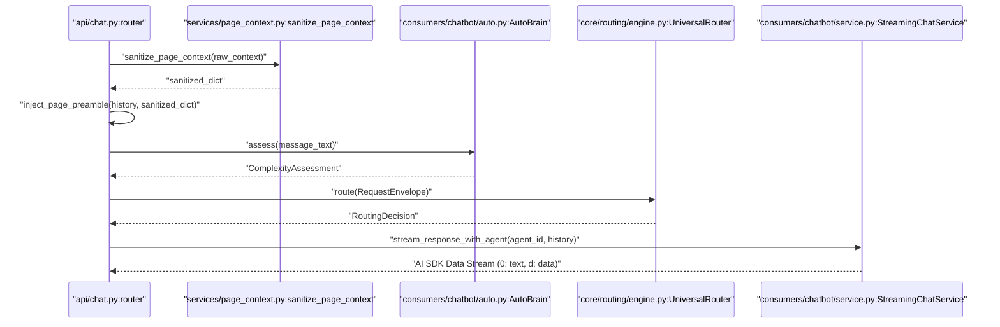
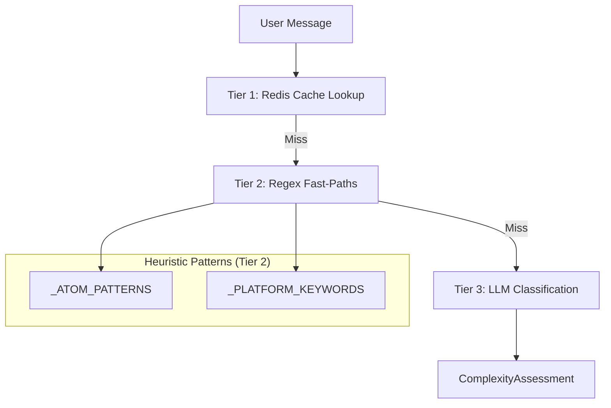
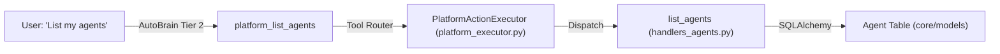

# Chat API & Streaming

Relevant source files

The following files were used as context for generating this wiki page:

- [frontend/app/api/chat/route.ts](frontend/app/api/chat/route.ts)
- [frontend/app/chat/page.tsx](frontend/app/chat/page.tsx)
- [frontend/components/chatbot/__tests__/widget-quick-prompts.test.ts](frontend/components/chatbot/__tests__/widget-quick-prompts.test.ts)
- [frontend/components/chatbot/artifact-viewer.tsx](frontend/components/chatbot/artifact-viewer.tsx)
- [frontend/components/chatbot/chat-widget.tsx](frontend/components/chatbot/chat-widget.tsx)
- [frontend/components/chatbot/message.tsx](frontend/components/chatbot/message.tsx)
- [frontend/components/chatbot/multimodal-input.tsx](frontend/components/chatbot/multimodal-input.tsx)
- [frontend/components/chatbot/sidebar-history-item.tsx](frontend/components/chatbot/sidebar-history-item.tsx)
- [frontend/components/chatbot/sidebar.tsx](frontend/components/chatbot/sidebar.tsx)
- [frontend/components/chatbot/studio-chat-shell.tsx](frontend/components/chatbot/studio-chat-shell.tsx)
- [frontend/components/chatbot/text-artifact.tsx](frontend/components/chatbot/text-artifact.tsx)
- [frontend/lib/chat/api.ts](frontend/lib/chat/api.ts)
- [frontend/lib/chat/hooks.ts](frontend/lib/chat/hooks.ts)
- [frontend/types/chat.ts](frontend/types/chat.ts)
- [orchestrator/api/chat.py](orchestrator/api/chat.py)
- [orchestrator/api/routing.py](orchestrator/api/routing.py)
- [orchestrator/consumers/chatbot/auto.py](orchestrator/consumers/chatbot/auto.py)
- [orchestrator/consumers/chatbot/service.py](orchestrator/consumers/chatbot/service.py)
- [orchestrator/consumers/chatbot/streaming.py](orchestrator/consumers/chatbot/streaming.py)
- [orchestrator/core/llm/manager.py](orchestrator/core/llm/manager.py)
- [orchestrator/core/models/stream_events.py](orchestrator/core/models/stream_events.py)
- [orchestrator/core/routing/engine.py](orchestrator/core/routing/engine.py)
- [orchestrator/modules/agents/factory/agent_factory.py](orchestrator/modules/agents/factory/agent_factory.py)
- [orchestrator/modules/tools/discovery/platform_actions.py](orchestrator/modules/tools/discovery/platform_actions.py)
- [orchestrator/modules/tools/discovery/platform_executor.py](orchestrator/modules/tools/discovery/platform_executor.py)
- [orchestrator/scripts/setup_jira_trigger.py](orchestrator/scripts/setup_jira_trigger.py)
- [orchestrator/services/heartbeat_service.py](orchestrator/services/heartbeat_service.py)
- [orchestrator/services/page_context.py](orchestrator/services/page_context.py)
- [orchestrator/tests/test_prd221_page_context.py](orchestrator/tests/test_prd221_page_context.py)
- [orchestrator/tests/test_prd221_page_prior_tools.py](orchestrator/tests/test_prd221_page_prior_tools.py)
- [orchestrator/tests/test_us009_limit_reporting.py](orchestrator/tests/test_us009_limit_reporting.py)

## Purpose and Scope

This document covers the **`/api/chat`** endpoint and its streaming response system, which powers real-time conversational interactions with AI agents. The chat API implements Server-Sent Events (SSE) streaming using the **AI SDK Data Stream format**, and integrates with the **AutoBrain** complexity assessor (`AutoBrain`), **UniversalRouter**, and **Workflow Engine** to deliver intelligent, context-aware responses.

The implementation bridges high-level natural language requests to low-level code entities like `AgentFactory`, `UniversalRouter`, and `StreamingChatService`.

Sources: [orchestrator/api/chat.py:1-26](), [orchestrator/consumers/chatbot/service.py:1-13]()

---

## Request/Response Format

### Request Schema

The chat API accepts POST requests at `/api/chat`. The request body is processed by `POST /api/chat` which extracts the message and context for routing.

| Field | Type | Description |
|-------|------|-------------|
| `id` | `string?` | Chat session ID. If null, a new `Chat` record is created [orchestrator/api/chat.py:60-61]() |
| `message` | `ChatMessageRequest` | Structured message content including `parts` (text/attachments) [orchestrator/api/chat.py:51-58]() |
| `agentId` | `int?` | Explicit agent selection (Tier 0 override) [orchestrator/api/chat.py:71]() |
| `context` | `dict?` | Page context (e.g., `page`, `route`, `tab`) for preamble injection [orchestrator/api/chat.py:69]() |

Sources: [orchestrator/api/chat.py:36-77](), [orchestrator/services/page_context.py:46-54]()

---

### Response Format: AI SDK Data Stream

Responses use the Vercel AI SDK Data Stream format (`text/plain; charset=utf-8`) with line-prefixed events. The `StreamingChatService` and streaming handlers manage this formatting.

| Prefix | Description | Example |
|--------|-------------|---------|
| `0:` | Text chunk (JSON string) | `0:"Hello"\n` |
| `d:` | Custom data (JSON) | `d:{"type":"workflow-update","status":"started"}\n` |
| `e:` | Error event | `e:{"message":"Workflow timeout"}\n` |

Sources: [orchestrator/api/chat.py:14-15](), [orchestrator/consumers/chatbot/service.py:45]()

---

### Response Headers

The API returns metadata about routing and complexity assessment in response headers.

| Header | Description | Source |
|--------|-------------|--------|
| `x-routing-agent-id` | Selected agent ID from `UniversalRouter` | [orchestrator/core/routing/engine.py:170-176]() |
| `x-routing-confidence`| Routing confidence (0.0-1.0) | [orchestrator/core/routing/engine.py:174]() |
| `x-routing-type` | "agent", "workflow", or "orchestrate" | [orchestrator/core/routing/engine.py:172]() |
| `x-auto-complexity` | "atom", "molecule", "cell", "organ", "organism" | [orchestrator/consumers/chatbot/auto.py:51-58]() |

Sources: [orchestrator/core/routing/engine.py:169-182](), [orchestrator/consumers/chatbot/auto.py:51-58]()

---

## Message Lifecycle

The following diagram bridges natural language inputs to the underlying code entities executing the chat lifecycle.

### Data Flow: API Entry to Stream (Natural Language to Code Entity Space)
Title: "Chat Request and Streaming Flow"

Sources: [orchestrator/api/chat.py:218-245](), [orchestrator/services/page_context.py:178-195](), [orchestrator/core/routing/engine.py:79-85]()

---

## Complexity Assessment (AutoBrain)

### Three-Tier Assessment Pipeline

The **AutoBrain** (`AutoBrain`) evaluates every message to determine its complexity level (Atom → Organism), minimizing LLM costs by using fast heuristics first.

Title: "AutoBrain Tiered Logic"

Sources: [orchestrator/consumers/chatbot/auto.py:7-22](), [orchestrator/consumers/chatbot/auto.py:92-120](), [orchestrator/consumers/chatbot/auto.py:121-181]()

---

## Tool Loop Prevention & Deduplication

The `ToolExecutionTracker` prevents infinite loops and redundant processing during agent execution turns. It is instantiated within the tool-loop spine to monitor tool calls in a single turn.

| Feature | Implementation |
|---------|----------------|
| **Exact Deduplication** | Tracks `(tool_name, hash(tool_args))` to detect identical calls [orchestrator/consumers/chatbot/service.py:31-35]() |
| **Semantic Deduplication** | Uses `SequenceMatcher` to detect similar search queries for search tools [orchestrator/consumers/chatbot/service.py:85-94]() |
| **Retry Limits** | Enforces per-tool limits across iteration counts [orchestrator/consumers/chatbot/service.py:31-35]() |

Sources: [orchestrator/consumers/chatbot/service.py:76-104](), [orchestrator/consumers/chatbot/service.py:31-35]()

---

## Platform Actions & Tool Execution

Agents can interact with the platform itself via `PlatformActionExecutor`. If `AutoBrain` detects system-related keywords, it injects these as tool hints.

### Code Entity Association: Tools (Natural Language to Code Entity Space)
Title: "Natural Language to Platform Action Mapping"

Sources: [orchestrator/consumers/chatbot/auto.py:122-125](), [orchestrator/modules/tools/discovery/platform_executor.py:19-28](), [orchestrator/modules/tools/discovery/platform_actions.py:57-103]()

---

## LLM Configuration & Key Resolution

The `LLMManager` handles the final execution of chat requests by resolving providers and API keys using a prioritized resolution strategy.

- **Service Scoping**: LLM settings are scoped by service (e.g., `chatbot` uses `system_llm`, `orchestrator` uses `orchestrator_llm`) [orchestrator/core/llm/manager.py:34-54]()
- **Key Resolution**: Implements a multi-tier strategy: 
    1. Explicit `credential_name_{provider}` in system settings [orchestrator/core/llm/manager.py:166-170]()
    2. Pattern-based lookup: `{environment}_{provider}_api` [orchestrator/core/llm/manager.py:138-142]()
    3. Fallback to environment variables via `config` [orchestrator/core/llm/manager.py:145]()
- **System Settings**: Providers and models are fetched dynamically from the database `SystemSetting` table, requiring explicit configuration to avoid hardcoded fallbacks [orchestrator/core/llm/manager.py:110-128]()

Sources: [orchestrator/core/llm/manager.py:98-128](), [orchestrator/core/llm/manager.py:135-187]()

---