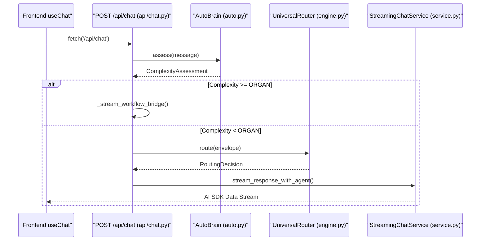
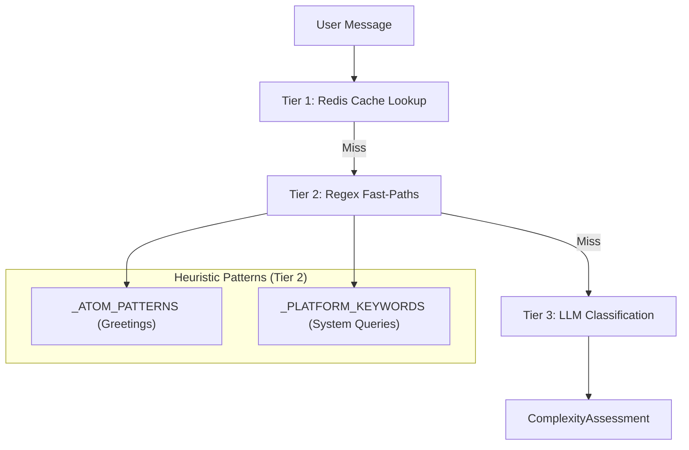

# Chat API & Streaming

Relevant source files

The following files were used as context for generating this wiki page:

- [docs/reviews/COMPOSIO-TOOL-REGRESSION-REVIEW.md](docs/reviews/COMPOSIO-TOOL-REGRESSION-REVIEW.md)
- [orchestrator/api/chat.py](orchestrator/api/chat.py)
- [orchestrator/api/chat_voice.py](orchestrator/api/chat_voice.py)
- [orchestrator/consumers/chatbot/auto.py](orchestrator/consumers/chatbot/auto.py)
- [orchestrator/consumers/chatbot/intent_classifier.py](orchestrator/consumers/chatbot/intent_classifier.py)
- [orchestrator/consumers/chatbot/personality.py](orchestrator/consumers/chatbot/personality.py)
- [orchestrator/consumers/chatbot/service.py](orchestrator/consumers/chatbot/service.py)
- [orchestrator/consumers/chatbot/smart_tool_router.py](orchestrator/consumers/chatbot/smart_tool_router.py)
- [orchestrator/consumers/chatbot/streaming.py](orchestrator/consumers/chatbot/streaming.py)
- [orchestrator/core/llm/manager.py](orchestrator/core/llm/manager.py)
- [orchestrator/core/models/stream_events.py](orchestrator/core/models/stream_events.py)
- [orchestrator/core/routing/engine.py](orchestrator/core/routing/engine.py)
- [orchestrator/modules/orchestrator/service.py](orchestrator/modules/orchestrator/service.py)
- [orchestrator/modules/tools/discovery/actions_analytics_enhanced.py](orchestrator/modules/tools/discovery/actions_analytics_enhanced.py)
- [orchestrator/modules/tools/discovery/handlers_analytics_enhanced.py](orchestrator/modules/tools/discovery/handlers_analytics_enhanced.py)
- [orchestrator/modules/tools/discovery/handlers_search.py](orchestrator/modules/tools/discovery/handlers_search.py)
- [orchestrator/modules/tools/discovery/platform_actions.py](orchestrator/modules/tools/discovery/platform_actions.py)
- [orchestrator/modules/tools/discovery/platform_executor.py](orchestrator/modules/tools/discovery/platform_executor.py)
- [orchestrator/modules/tools/execution/exec_composio.py](orchestrator/modules/tools/execution/exec_composio.py)
- [orchestrator/modules/tools/execution/exec_document.py](orchestrator/modules/tools/execution/exec_document.py)
- [orchestrator/modules/tools/execution/exec_file_ops.py](orchestrator/modules/tools/execution/exec_file_ops.py)
- [orchestrator/modules/tools/execution/exec_multimodal.py](orchestrator/modules/tools/execution/exec_multimodal.py)
- [orchestrator/modules/tools/execution/exec_planning.py](orchestrator/modules/tools/execution/exec_planning.py)
- [orchestrator/modules/tools/tool_router.py](orchestrator/modules/tools/tool_router.py)

## Purpose and Scope

This document covers the **`/api/chat`** endpoint and its streaming response system, which powers real-time conversational interactions with AI agents. The chat API implements Server-Sent Events (SSE) streaming using the **AI SDK Data Stream format**, and integrates with the **AutoBrain** complexity assessor, **Universal Router**, and **Workflow Engine** to deliver intelligent, context-aware responses.

The implementation bridges high-level natural language requests to low-level code entities like `AgentFactory`, `UniversalRouter`, and `StreamingChatService`.

**Sources:** [orchestrator/api/chat.py:1-26](), [orchestrator/consumers/chatbot/streaming.py:1-10]()

---

## Request/Response Format

### Request Schema

The chat API accepts POST requests at `/api/chat` with the following structure:

| Field | Type | Description |
|-------|------|-------------|
| `id` | `string?` | Chat session ID. If null, creates new chat [orchestrator/api/chat.py:202](). |
| `message` | `object` | Current user message (role, parts) [orchestrator/api/chat.py:204](). |
| `agentId` | `int?` | Explicit agent selection (bypasses AutoBrain/Router) [orchestrator/api/chat.py:206](). |
| `selectedChatModel`| `string?` | Model hint (default: "gpt-4") [orchestrator/api/chat.py:208](). |

**Sources:** [orchestrator/api/chat.py:200-226]()

---

### Response Format: AI SDK Data Stream

Responses use the Vercel AI SDK Data Stream format (`text/plain; charset=utf-8`) with line-prefixed events. The `StreamingHandler` class in `streaming.py` manages this formatting.

| Prefix | Description | Example |
|--------|-------------|---------|
| `0:` | Text chunk (JSON string) | `0:"Hello"\n` [orchestrator/consumers/chatbot/streaming.py:105-108]() |
| `d:` | Custom data (JSON) | `d:{"type":"chat-id","chatId":"..."}\n` [orchestrator/consumers/chatbot/streaming.py:117-119]() |
| `e:` | Error event | `e:{"message":"LLM error"}\n` [orchestrator/consumers/chatbot/streaming.py:174-176]() |

**Sources:** [orchestrator/consumers/chatbot/streaming.py:105-176]()

---

### Response Headers

The API returns metadata about routing and complexity assessment in response headers:

| Header | Description | Source |
|--------|-------------|--------|
| `x-routing-agent-id` | Selected agent ID | `UniversalRouter` [orchestrator/api/chat.py:506]() |
| `x-routing-confidence`| Routing confidence (0.0-1.0) | `UniversalRouter` [orchestrator/api/chat.py:507]() |
| `x-routing-type` | "agent", "workflow", or "orchestrate" | `UniversalRouter` [orchestrator/api/chat.py:508]() |
| `x-auto-complexity` | "atom", "molecule", "cell", "organ", "organism" | `AutoBrain` [orchestrator/api/chat.py:512]() |

**Sources:** [orchestrator/api/chat.py:505-526]()

---

## Message Lifecycle

The following diagram shows the complete flow from the frontend through the FastAPI backend to the final streamed response.

### Data Flow: Frontend to Backend
Title: Chat Request and Streaming Flow

**Sources:** [orchestrator/api/chat.py:448-572](), [orchestrator/consumers/chatbot/service.py:12]()

---

## Complexity Assessment (AutoBrain)

### Three-Tier Assessment Pipeline

The **AutoBrain** evaluates every message to determine its complexity level (Atom → Organism), minimizing LLM costs by using fast heuristics first.

Title: AutoBrain Tiered Logic

**Sources:** [orchestrator/consumers/chatbot/auto.py:14-22](), [orchestrator/consumers/chatbot/auto.py:92-114](), [orchestrator/consumers/chatbot/auto.py:116-181]()

---

## Workflow Bridge (PRD-68 Phase 2)

When `AutoBrain` detects **ORGAN** or **ORGANISM** complexity, the API invokes `_stream_workflow_bridge`. This function creates a transient workflow and execution record, then streams progress events using the AI SDK format.

1. **Transient Workflow**: Created with `source="chat_generated"` [orchestrator/api/chat.py:112]().
2. **Execution**: Initialized with `status="pending"` [orchestrator/api/chat.py:134]().
3. **Progress Streaming**: Sends stage updates (PLAN → EXECUTE) to the chat UI [orchestrator/api/chat.py:143-150]().

**Sources:** [orchestrator/api/chat.py:70-197]()

---

## Tool Loop Prevention

The `ToolExecutionTracker` class prevents infinite loops during agent execution by implementing semantic deduplication and retry limits.

| Feature | Implementation |
|---------|----------------|
| **Exact Deduplication** | Hashes `tool_args` to detect identical calls [orchestrator/consumers/chatbot/service.py:111-112](). |
| **Semantic Deduplication** | Uses `SequenceMatcher` to detect similar search queries [orchestrator/consumers/chatbot/service.py:57-66](). |
| **Retry Limits** | Limits tools like `read_file` to 3 attempts [orchestrator/consumers/chatbot/service.py:101](). |

**Sources:** [orchestrator/consumers/chatbot/service.py:78-155]()

---

## Smart Tool Routing

The `SmartToolRouter` determines which tools are relevant based on detected intent, preventing LLM context pollution.

- **Core Tools**: Essential tools like `search_knowledge` and `smart_query_database` are prioritized [orchestrator/consumers/chatbot/smart_tool_router.py:54-62]().
- **Semantic Ranking**: If enabled via `SEMANTIC_TOOL_ROUTING`, tools are ranked by cosine similarity to the user query [orchestrator/consumers/chatbot/smart_tool_router.py:181-185]().
- **Intent Mapping**: Maps intents like `DATA_QUERY` to specific tool categories like `data` and `fields` [orchestrator/consumers/chatbot/smart_tool_router.py:112-121]().

**Sources:** [orchestrator/consumers/chatbot/smart_tool_router.py:39-183]()

---

## Platform Actions & Tool Execution

Agents can interact with the platform itself via `PlatformActionExecutor`. If `AutoBrain` detects system-related keywords (e.g., "list my agents"), it triggers specific platform tools.

### Code Entity Association: Tools
Title: Natural Language to Platform Action Mapping

**Sources:** [orchestrator/consumers/chatbot/smart_tool_router.py:69](), [orchestrator/modules/tools/tool_router.py:27-28](), [orchestrator/modules/tools/discovery/platform_executor.py:200]()

---

## Personality & Prompt Generation

The `AutomatosPersonality` class generates system prompts based on workspace settings like `personality_mode` (friendly, professional, technical).

- **Identity**: Defines the assistant name and greeting [orchestrator/consumers/chatbot/personality.py:153-157]().
- **Prompt Registry**: Attempts to load custom prompts from `PromptRegistry` before falling back to hardcoded defaults [orchestrator/consumers/chatbot/personality.py:165-175]().
- **Communication Style**: Appends suffixes for `concise` or `detailed` responses [orchestrator/consumers/chatbot/personality.py:112-116]().

**Sources:** [orchestrator/consumers/chatbot/personality.py:119-180]()

---

## Security & Auth

- **Hybrid Auth**: Backend supports both Clerk JWT and API Keys via `get_request_context_hybrid` [orchestrator/api/chat.py:20-21]().
- **Workspace Scoping**: All chat operations and tool executions are scoped to the `workspace_id` to ensure multi-tenant isolation [orchestrator/api/chat.py:214-215]().

**Sources:** [orchestrator/api/chat.py:6-21]()

---