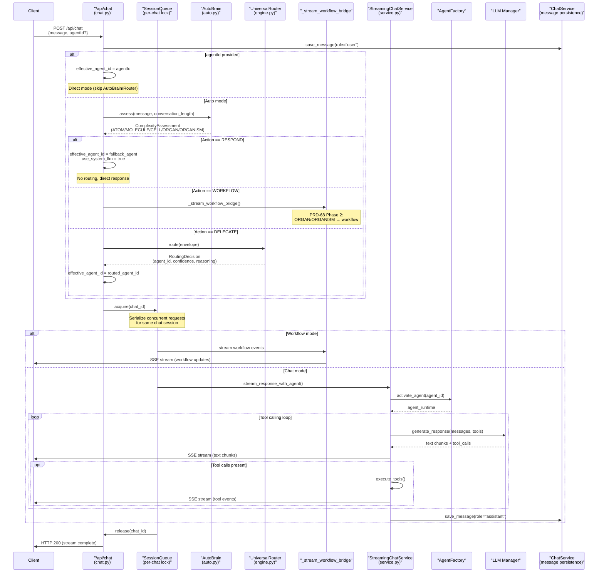
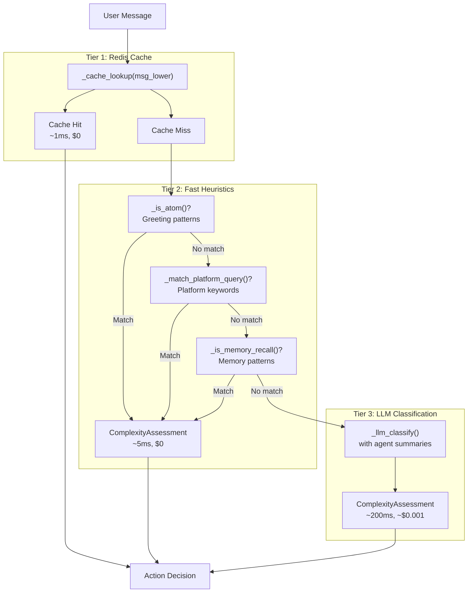
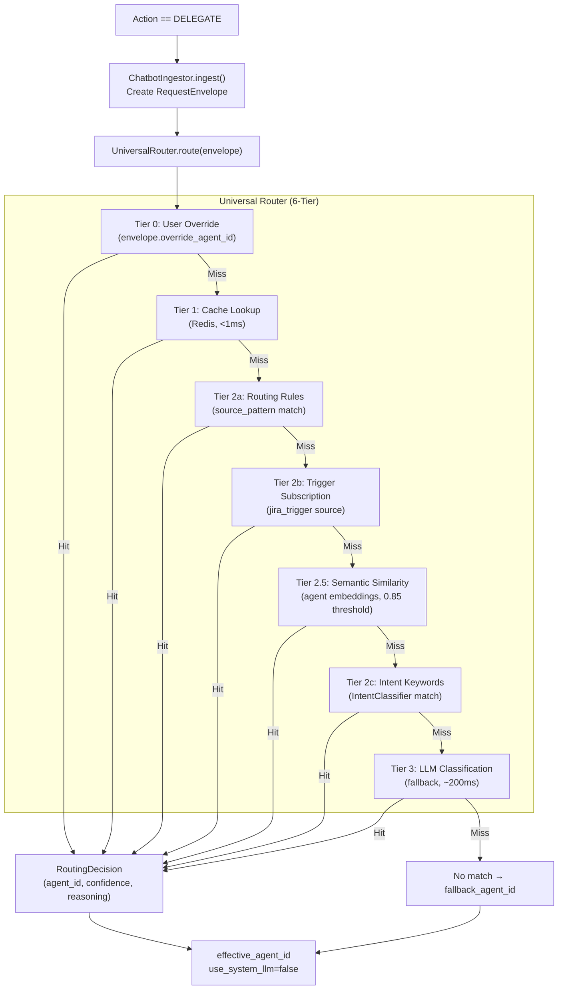
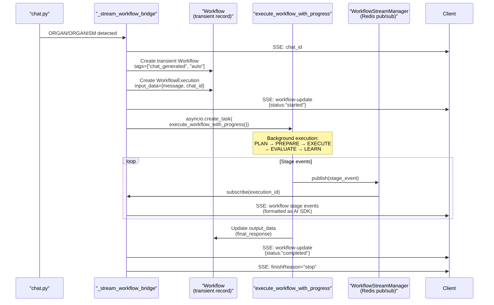
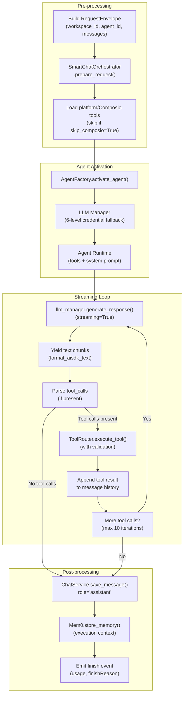

# Chat API & Streaming

<details>
<summary>Relevant source files</summary>

The following files were used as context for generating this wiki page:

- [orchestrator/api/chat.py](orchestrator/api/chat.py)
- [orchestrator/api/routing.py](orchestrator/api/routing.py)
- [orchestrator/consumers/chatbot/auto.py](orchestrator/consumers/chatbot/auto.py)
- [orchestrator/consumers/chatbot/intent_classifier.py](orchestrator/consumers/chatbot/intent_classifier.py)
- [orchestrator/consumers/chatbot/personality.py](orchestrator/consumers/chatbot/personality.py)
- [orchestrator/consumers/chatbot/smart_orchestrator.py](orchestrator/consumers/chatbot/smart_orchestrator.py)
- [orchestrator/consumers/chatbot/smart_tool_router.py](orchestrator/consumers/chatbot/smart_tool_router.py)
- [orchestrator/core/models/system_settings.py](orchestrator/core/models/system_settings.py)
- [orchestrator/core/routing/engine.py](orchestrator/core/routing/engine.py)
- [orchestrator/modules/tools/discovery/__init__.py](orchestrator/modules/tools/discovery/__init__.py)
- [orchestrator/scripts/setup_jira_trigger.py](orchestrator/scripts/setup_jira_trigger.py)

</details>


## Purpose and Scope

This document covers the **`/api/chat`** endpoint and its streaming response system, which powers real-time conversational interactions with AI agents. The chat API implements Server-Sent Events (SSE) streaming using the Vercel AI SDK Data Stream format, and integrates with the AutoBrain complexity assessor, Universal Router, and workflow engine to deliver intelligent, context-aware responses.

For agent creation and configuration, see [Creating Agents](#3.1). For workflow execution details, see [Workflow Pipeline Architecture](#4.7). For routing logic internals, see [Routing Architecture](#8.1).

**Sources:** [orchestrator/api/chat.py:1-841]()

---

## Request/Response Format

### Request Schema

The chat API accepts POST requests at `/api/chat` with the following structure:

| Field | Type | Description |
|-------|------|-------------|
| `id` | `string?` | Chat session ID. If null, creates new chat. |
| `message` | `ChatMessageRequest` | Current user message (role, parts, or content). |
| `messages` | `ChatMessageRequest[]?` | Alternative: full message array (AI SDK compatibility). |
| `selectedChatModel` | `string?` | Model hint (default: "gpt-4"). |
| `selectedVisibilityType` | `string?` | "private" or "public". |
| `context` | `object?` | Additional context metadata. |
| `agentId` | `int?` | Explicit agent selection (bypasses AutoBrain/Router). |

**MessagePart Structure:**

```typescript
{
  type: "text" | "file" | "image",
  text?: string,
  filename?: string,
  mediaType?: string,
  url?: string
}
```

**Sources:** [orchestrator/api/chat.py:200-226]()

---

### Response Format: AI SDK Data Stream

Responses use the Vercel AI SDK Data Stream format (`text/plain; charset=utf-8`) with line-prefixed events:

| Prefix | Description | Example |
|--------|-------------|---------|
| `2:` | Chat ID announcement | `2:"chat-uuid-123"\n` |
| `0:` | Text chunk (JSON string) | `0:"Hello"\n` |
| `9:` | Tool call start | `9:{"toolCallId":"call_1","toolName":"search_knowledge"}\n` |
| `a:` | Tool result | `a:{"toolCallId":"call_1","result":{...}}\n` |
| `c:` | Data event (structured) | `c:{"type":"tool-result","content":"..."}\n` |
| `d:` | Custom data | `d:{"finishReason":"stop","usage":{...}}\n` |
| `e:` | Error event | `e:{"message":"LLM error"}\n` |

**Sources:** [orchestrator/api/chat.py:568-572]()

---

### Response Headers

The API returns metadata about routing and complexity assessment in response headers:

| Header | Description | Source |
|--------|-------------|--------|
| `x-routing-agent-id` | Selected agent ID | Universal Router |
| `x-routing-confidence` | Routing confidence (0.0-1.0) | Universal Router |
| `x-routing-type` | "agent", "workflow", or "orchestrate" | Universal Router |
| `x-routing-reasoning` | Why this agent was chosen | Universal Router |
| `x-routing-request-id` | Router request UUID | Universal Router |
| `x-auto-complexity` | "atom", "molecule", "cell", "organ", "organism" | AutoBrain |
| `x-auto-action` | "respond", "delegate", "workflow" | AutoBrain |
| `x-auto-confidence` | Complexity assessment confidence | AutoBrain |
| `x-auto-needs-memory` | "true" or "false" | AutoBrain |
| `x-auto-tool-hints` | Comma-separated tool domain hints | AutoBrain |

**Sources:** [orchestrator/api/chat.py:505-526]()

---

## Message Lifecycle

The following diagram shows the complete flow from HTTP request to streamed response:



**Sources:** [orchestrator/api/chat.py:309-572](), [orchestrator/consumers/chatbot/auto.py:145-200](), [orchestrator/core/routing/engine.py:77-161]()

---

## Complexity Assessment (AutoBrain)

### Three-Tier Assessment Pipeline

The **AutoBrain** (PRD-68) evaluates every incoming message to determine its complexity level and required action, minimizing LLM costs by using fast heuristics first:



**Sources:** [orchestrator/consumers/chatbot/auto.py:145-200]()

---

### Complexity Levels

| Level | Description | Token Budget | Example | Action |
|-------|-------------|--------------|---------|--------|
| **ATOM** | Simple chitchat, greetings | <200 tokens | "hi", "thanks", "how are you" | RESPOND |
| **MOLECULE** | Single tool call, no memory | ~1K tokens | "check my email", "search docs" | DELEGATE |
| **CELL** | Memory + tools + reasoning | ~3K tokens | "reply to that email we discussed" | DELEGATE |
| **ORGAN** | Multi-agent coordination | ~6K tokens | "research bug, plan fix, open PR" | WORKFLOW |
| **ORGANISM** | Enterprise pipeline, learning | ~12K tokens | "refactor auth across all services" | WORKFLOW |

**Sources:** [orchestrator/consumers/chatbot/auto.py:41-48]()

---

### Action Types

The `ComplexityAssessment` returns one of three actions:

```python
class Action(str, Enum):
    RESPOND = "respond"      # Auto responds directly (no delegation)
    DELEGATE = "delegate"    # Route to a single sub-agent
    WORKFLOW = "workflow"    # Trigger multi-agent workflow
```

**Action Decision Logic:**

- **RESPOND**: ATOM requests (greetings, platform queries, memory recalls) are handled directly by the fallback agent using orchestrator LLM settings (`use_system_llm=True`). No routing occurs.
- **DELEGATE**: MOLECULE/CELL requests require specialized agent capabilities. The Universal Router selects the best agent based on intent, tools, and semantic similarity.
- **WORKFLOW**: ORGAN/ORGANISM requests trigger the PRD-68 Phase 2 workflow bridge, creating a transient workflow and executing it through the full PRD-59 pipeline.

**Sources:** [orchestrator/api/chat.py:448-503](), [orchestrator/consumers/chatbot/auto.py:50-55]()

---

## Agent Selection & Routing

### Routing Decision Tree

When AutoBrain returns `Action.DELEGATE`, the chat API invokes the Universal Router:



**Sources:** [orchestrator/api/chat.py:466-503](), [orchestrator/core/routing/engine.py:77-161]()

---

### Fallback Agent Selection

When no explicit `agentId` is provided and routing fails, the chat API selects a fallback agent:

**For admins** (PRD-67): The **CTO Agent** (`slug="auto-cto"`, `is_system_agent=True`) if seeded. This agent has elevated access and orchestrates with Auto's full capabilities.

**For regular users**: `get_default_agent_id()` selects the agent with the most active external app assignments (Composio) that also have connected OAuth tokens in the workspace. Falls back to `agent_id=1` if none found.

**Sources:** [orchestrator/api/chat.py:38-60](), [orchestrator/api/chat.py:247-305](), [orchestrator/api/chat.py:426-431]()

---

## Workflow Bridge (PRD-68 Phase 2)

When AutoBrain detects ORGAN/ORGANISM complexity, the chat API creates a **transient workflow** and executes it through the PRD-59 Neural Swarm pipeline, streaming stage events back as AI SDK format:



**Transient Workflow Structure:**

- **name**: `"Chat workflow: {first 60 chars of message}..."`
- **description**: Full user message
- **goal**: User message (goal-oriented)
- **context**: `"Generated from chat {chat_id} by AutoBrain (complexity={level})"`
- **workflow_definition**: Single-step workflow with assigned agent
- **tags**: `["chat_generated", "auto"]` (for user discovery/re-run)

**Sources:** [orchestrator/api/chat.py:70-197]()

---

## Streaming Response

### StreamingChatService Architecture

Once an agent is selected, the chat API delegates to `StreamingChatService.stream_response_with_agent()`:



**Sources:** [orchestrator/consumers/chatbot/service.py:1-950]() (not in provided files, referenced from architecture diagram)

---

### Composio Tool Loading

Tools are loaded based on complexity and intent:

- **Skip Composio** (`skip_composio=True`): When AutoBrain returns `Action.RESPOND`, Composio tool discovery is skipped to save ~2 seconds. Platform tools (`platform_*`) are always included for self-awareness queries.
- **Load Composio** (`skip_composio=False`): For DELEGATE/WORKFLOW actions, full Composio action discovery runs via `ComposioToolService`, filtered by agent's `AgentAppAssignment` and workspace `EntityConnection`.

**Sources:** [orchestrator/api/chat.py:535-566]()

---

## Concurrency Control

### Session-Scoped Queue

The chat API uses `SessionQueue` to serialize concurrent requests for the same chat session, preventing race conditions in message ordering and tool execution:

```python
session_key = f"{ctx.workspace_id}:{chat_id}"
session_queue = get_session_queue()

async def _guarded_stream():
    async with session_queue.acquire(session_key):
        # Stream response (exclusive lock per chat)
        async for chunk in streaming_service.stream_response_with_agent(...):
            yield chunk
```

**Behavior:**
- Each `(workspace_id, chat_id)` pair gets an independent async lock.
- Concurrent requests to different chats proceed in parallel.
- Concurrent requests to the same chat are queued (FIFO).
- Locks are released automatically on exception or stream completion.

**Sources:** [orchestrator/api/chat.py:531-567](), [orchestrator/core/session_queue.py:1-100]() (referenced but not provided)

---

## Chat Management Endpoints

### Chat History & Retrieval

| Endpoint | Method | Description | Authentication |
|----------|--------|-------------|----------------|
| `GET /api/chat/history` | GET | List recent chats (limit=20) | Hybrid (JWT/API key) |
| `GET /api/chat/{chat_id}` | GET | Get single chat metadata | Hybrid (JWT/API key) |
| `GET /api/chat/{chat_id}/messages` | GET | Get all messages in chat | Hybrid (JWT/API key) |

**Response Format (Chat):**

```json
{
  "id": "uuid-string",
  "userId": 1,
  "title": "Chat title",
  "createdAt": "2024-01-01T00:00:00Z",
  "updatedAt": "2024-01-01T01:00:00Z",
  "visibility": "private",
  "lastContext": {...}
}
```

**Sources:** [orchestrator/api/chat.py:575-659]()

---

### Chat Modification

| Endpoint | Method | Description | Request Body |
|----------|--------|-------------|--------------|
| `PATCH /api/chat/{chat_id}` | PATCH | Update chat title | `{title: string}` |
| `DELETE /api/chat/{chat_id}` | DELETE | Delete chat and messages | (none) |
| `PATCH /api/chat/vote` | PATCH | Vote on message | `{chatId, messageId, isUpvoted: bool}` |

**Sources:** [orchestrator/api/chat.py:661-731]()

---

## Agent Management in Chat

### Available Agents

**Endpoint:** `GET /api/chat/agents?status=active`

Returns all active agents in the workspace for chat UI selection:

```json
{
  "agents": [
    {
      "id": 1,
      "name": "Research Analyst",
      "agent_type": "conversational",
      "description": "...",
      "status": "active",
      "skills": ["search", "analysis"],
      "model_config": {...},
      "is_default": true,
      "tags": ["research"]
    }
  ]
}
```

**Sources:** [orchestrator/api/chat.py:734-762]()

---

### Agent Switching

**Endpoint:** `POST /api/chat/{chat_id}/switch-agent`

Switch to a different agent mid-conversation:

```json
{
  "newAgentId": 5,
  "reason": "Need code review capabilities"
}
```

**Behavior:**
- Updates `chats.current_agent_id`
- Appends switch record to `chats.agent_switches` (audit trail)
- PRD-67: Allows switching to system agents (CTO) if user has required role
- Returns new agent metadata

**Sources:** [orchestrator/api/chat.py:769-841]()

---

## Integration Points

### AutoBrain → Chat API

The `ComplexityAssessment` flows from AutoBrain into the chat API decision tree:

| Field | Purpose | Consumer |
|-------|---------|----------|
| `complexity` | ATOM/MOLECULE/CELL/ORGAN/ORGANISM | Response headers, logging |
| `action` | RESPOND/DELEGATE/WORKFLOW | Routing bypass or workflow bridge |
| `needs_memory` | Memory retrieval flag | `SmartChatOrchestrator` |
| `tool_hints` | Domain keywords (e.g. ["email", "github"]) | Tool filtering in `SmartToolRouter` |
| `matched_tools` | Exact tool names | Priority tools list |
| `confidence` | Assessment confidence | Response headers |

**Sources:** [orchestrator/consumers/chatbot/auto.py:58-82](), [orchestrator/api/chat.py:419-526]()

---

### Universal Router → Chat API

The `RoutingDecision` determines the effective agent:

| Field | Purpose | Consumer |
|-------|---------|----------|
| `route_type` | "agent", "workflow", or "orchestrate" | Agent selection logic |
| `agent_id` | Selected agent ID | `effective_agent_id` |
| `confidence` | Routing confidence (0.0-1.0) | Response headers |
| `reasoning` | Why this agent was chosen | Response headers, logging |

**Sources:** [orchestrator/core/routing/engine.py:34-42](), [orchestrator/api/chat.py:483-503]()

---

### Chat API → StreamingChatService

The chat API passes the following context to the streaming service:

```python
await streaming_service.stream_response_with_agent(
    chat_id=chat_id,
    messages=message_history,
    agent_id=effective_agent_id,
    user_id=user_id,
    use_system_llm=use_system_llm,        # True for RESPOND action
    skip_composio=skip_composio,           # True for ATOM messages
    complexity_assessment=complexity_assessment,  # Full assessment
)
```

**Sources:** [orchestrator/api/chat.py:557-566]()

---

## Code Entity Map

### Key Classes and Functions

| Code Entity | File | Purpose |
|-------------|------|---------|
| `stream_chat()` | [orchestrator/api/chat.py:309-572]() | Main POST /api/chat endpoint |
| `_stream_workflow_bridge()` | [orchestrator/api/chat.py:70-197]() | ORGAN/ORGANISM workflow execution |
| `AutoBrain` | [orchestrator/consumers/chatbot/auto.py:145-394]() | 3-tier complexity assessor |
| `AutoBrain.assess()` | [orchestrator/consumers/chatbot/auto.py:171-200]() | Main assessment entry point |
| `ComplexityAssessment` | [orchestrator/consumers/chatbot/auto.py:58-82]() | Assessment result dataclass |
| `UniversalRouter` | [orchestrator/core/routing/engine.py:56-1220]() | 6-tier agent routing engine |
| `UniversalRouter.route()` | [orchestrator/core/routing/engine.py:77-161]() | Main routing entry point |
| `ChatbotIngestor` | [orchestrator/core/routing/ingestors/chatbot.py:1-100]() | Builds RequestEnvelope |
| `get_default_agent_id()` | [orchestrator/api/chat.py:247-305]() | Fallback agent selection |
| `_get_cto_agent_id()` | [orchestrator/api/chat.py:38-60]() | CTO Agent lookup (PRD-67) |
| `get_session_queue()` | [orchestrator/core/session_queue.py:1-100]() | Per-chat concurrency lock |

---

### Database Models

| Model | Table | Purpose |
|-------|-------|---------|
| `Chat` | `chats` | Chat session metadata |
| `Message` | `messages` | Individual messages in conversations |
| `Workflow` | `workflows` | Transient workflows from ORGAN/ORGANISM |
| `WorkflowExecution` | `workflow_executions` | Workflow run records |
| `Agent` | `agents` | Agent configurations |
| `RoutingDecisionRecord` | `routing_decisions` | Routing audit log |

---

## Performance Characteristics

### Latency Breakdown

| Stage | Typical Latency | Optimization |
|-------|-----------------|--------------|
| **AutoBrain Tier 1 (Cache)** | <1ms | Redis lookup |
| **AutoBrain Tier 2 (Regex)** | <5ms | In-memory pattern matching |
| **AutoBrain Tier 3 (LLM)** | ~200ms | Lightweight model, cached 24h |
| **Router Tier 1 (Cache)** | <1ms | Redis lookup |
| **Router Tier 2.5 (Semantic)** | ~50ms | Vector cosine similarity (pgvector) |
| **Router Tier 3 (LLM)** | ~200ms | Narrowed candidate list |
| **Tool Loading (Composio)** | ~2s | Skipped for ATOM, cached metadata |
| **LLM First Token** | ~500ms | Streaming starts immediately |

**Sources:** [orchestrator/consumers/chatbot/auto.py:145-200](), [orchestrator/core/routing/engine.py:100-161]()

---

## Error Handling

### Graceful Degradation

The chat API implements multiple fallback layers:

1. **AutoBrain Tier 3 Failure**: Falls back to `Action.DELEGATE` with MOLECULE complexity.
2. **Router Failure**: Falls back to `get_default_agent_id()` (workspace's most-connected agent).
3. **Workflow Bridge Failure**: Falls back to normal chat response with error message streamed.
4. **LLM Provider Failure**: LLM Manager tries secondary provider (see [LLM Provider Management](#3.6)).
5. **Tool Execution Failure**: Error streamed as tool result, LLM continues with next step.

**Sources:** [orchestrator/api/chat.py:479-503](), [orchestrator/consumers/chatbot/auto.py:299-308]()

---

## Security & Authentication

### Hybrid Authentication

All chat endpoints use `get_request_context_hybrid`, which accepts:
- **Clerk JWT** (frontend, `Authorization: Bearer <token>`)
- **API Key** (external integrations, `X-API-Key: <key>`)

Both methods populate `RequestContext` with `workspace_id` for multi-tenancy.

**Sources:** [orchestrator/api/chat.py:312](), [orchestrator/core/auth/hybrid.py:1-100]() (referenced but not provided)

---

### Workspace Isolation

- User ID validation via `get_user_id(db)` (currently MVP: defaults to id=1)
- Chat ownership check: `chat.user_id != user_id` → 403 Forbidden
- Agent visibility: Only agents in `ctx.workspace_id` are selectable
- PRD-67: System agents (CTO) require role check (`system_role in ["admin", "super_admin"]`)

**Sources:** [orchestrator/api/chat.py:238-246](), [orchestrator/api/chat.py:390-393](), [orchestrator/api/chat.py:792-803]()

---