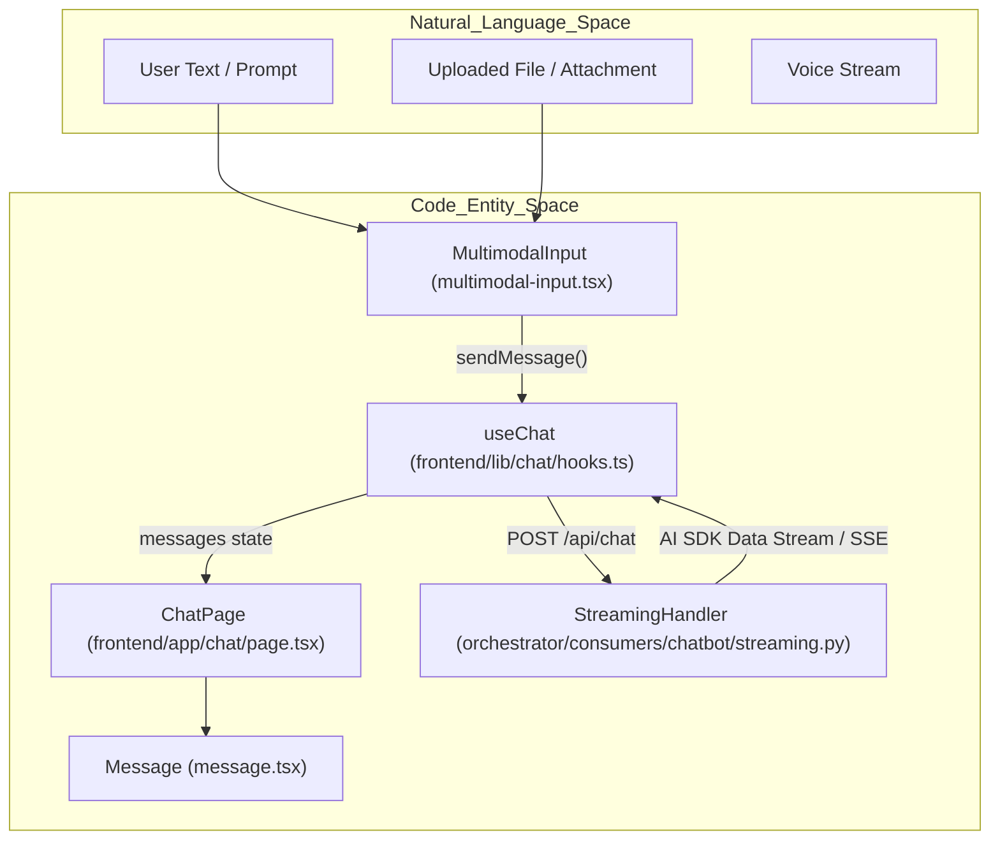
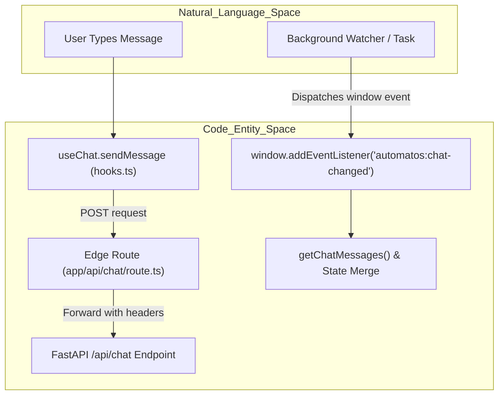

# Chat UI Components

Relevant source files

The following files were used as context for generating this wiki page:

- [frontend/app/api/chat/route.ts](frontend/app/api/chat/route.ts)
- [frontend/app/api/generated-images/[id]/route.ts](frontend/app/api/generated-images/[id]/route.ts)
- [frontend/app/chat/page.tsx](frontend/app/chat/page.tsx)
- [frontend/components/chatbot/__tests__/widget-quick-prompts.test.ts](frontend/components/chatbot/__tests__/widget-quick-prompts.test.ts)
- [frontend/components/chatbot/agent-selector.tsx](frontend/components/chatbot/agent-selector.tsx)
- [frontend/components/chatbot/artifact-viewer.tsx](frontend/components/chatbot/artifact-viewer.tsx)
- [frontend/components/chatbot/chat-mode-bar.tsx](frontend/components/chatbot/chat-mode-bar.tsx)
- [frontend/components/chatbot/chat-widget.tsx](frontend/components/chatbot/chat-widget.tsx)
- [frontend/components/chatbot/code-block.tsx](frontend/components/chatbot/code-block.tsx)
- [frontend/components/chatbot/image-gallery.tsx](frontend/components/chatbot/image-gallery.tsx)
- [frontend/components/chatbot/message-actions.tsx](frontend/components/chatbot/message-actions.tsx)
- [frontend/components/chatbot/message.tsx](frontend/components/chatbot/message.tsx)
- [frontend/components/chatbot/mission-created-card.tsx](frontend/components/chatbot/mission-created-card.tsx)
- [frontend/components/chatbot/mission-suggestion-card.tsx](frontend/components/chatbot/mission-suggestion-card.tsx)
- [frontend/components/chatbot/multimodal-input.tsx](frontend/components/chatbot/multimodal-input.tsx)
- [frontend/components/chatbot/pin-agent-picker.tsx](frontend/components/chatbot/pin-agent-picker.tsx)
- [frontend/components/chatbot/sheet-artifact.tsx](frontend/components/chatbot/sheet-artifact.tsx)
- [frontend/components/chatbot/sidebar-history-item.tsx](frontend/components/chatbot/sidebar-history-item.tsx)
- [frontend/components/chatbot/sidebar.tsx](frontend/components/chatbot/sidebar.tsx)
- [frontend/components/chatbot/studio-chat-shell.tsx](frontend/components/chatbot/studio-chat-shell.tsx)
- [frontend/components/chatbot/text-artifact.tsx](frontend/components/chatbot/text-artifact.tsx)
- [frontend/components/voice/VoiceCallPanel.tsx](frontend/components/voice/VoiceCallPanel.tsx)
- [frontend/lib/chat/api.ts](frontend/lib/chat/api.ts)
- [frontend/lib/chat/hooks.ts](frontend/lib/chat/hooks.ts)
- [frontend/lib/voice/orb-state.ts](frontend/lib/voice/orb-state.ts)
- [frontend/types/chat.ts](frontend/types/chat.ts)
- [orchestrator/consumers/chatbot/streaming.py](orchestrator/consumers/chatbot/streaming.py)
- [orchestrator/core/models/stream_events.py](orchestrator/core/models/stream_events.py)
- [orchestrator/core/services/image_store.py](orchestrator/core/services/image_store.py)
- [orchestrator/tests/test_us009_limit_reporting.py](orchestrator/tests/test_us009_limit_reporting.py)

The chat interface is a sophisticated React application built with Next.js, leveraging the AI SDK for streaming, Server-Sent Events (SSE), and Framer Motion for animations. It serves as the primary interaction layer for agents, missions, multi-threaded conversations, artifacts, and real-time voice calls.

---

## Overview & Component Architecture

The chat frontend is structured into modular components managing state transitions, message list virtualization, tool lifecycle visualization, and multimodal data flows.

| Component | File | Purpose |
|-----------|------|---------|
| `Chat` | [frontend/app/chat/page.tsx:9-9]() | Main container managing chat sessions, tabs, and layout integration. |
| `Message` | [frontend/components/chatbot/message.tsx:41-53]() | Individual message renderer supporting Markdown, images, code blocks, and tool results. |
| `MultimodalInput` | [frontend/components/chatbot/multimodal-input.tsx:27-38]() | Input area handling text input, ephemeral file/image attachments, and agent selection. |
| `ChatModeBar` | [frontend/components/chatbot/chat-mode-bar.tsx:40-53]() | Mode toolbar for switching Code, Plan, Mission, Live voice modes, and pinned agents. |
| `StudioChatShell` | [frontend/components/chatbot/studio-chat-shell.tsx:58-68]() | Studio layout shell managing collapsible threads and mission rails. |
| `AutoChatTab` | [frontend/components/chatbot/chat-widget.tsx:88-88]() | Persistent mini-chat widget mirroring main conversation sessions across platform pages. |

Sources: [frontend/app/chat/page.tsx:9-25](), [frontend/lib/chat/hooks.ts:16-53](), [frontend/components/chatbot/multimodal-input.tsx:27-38](), [frontend/components/chatbot/message.tsx:41-53](), [orchestrator/consumers/chatbot/streaming.py:21-25]()

---

## The `useChat` Hook and Streaming Data Flow

The `useChat` hook acts as the bridge between the React UI layer and the backend chat execution pipeline. It manages message history, streaming statuses, abort controllers, and background synchronization.

### Request Lifecycle & State Management
When `sendMessage` is executed:
1. Validates that a submission is not already in flight [frontend/lib/chat/hooks.ts:155-155]().
2. Constructs a `ChatMessage` object containing role, content, and optional attachment IDs [frontend/lib/chat/hooks.ts:157-173]().
3. Dispatches a POST request to `/api/chat` via the Next.js edge proxy route [frontend/app/api/chat/route.ts:29-66]().
4. Handles incoming chunks using the AI SDK Data Stream protocol, parsing text deltas, tool call events, usage tokens, and limit-reached notices [orchestrator/consumers/chatbot/streaming.py:105-184]().

### Background Chat Synchronization
The hook listens for the `automatos:chat-changed` window event [frontend/lib/chat/hooks.ts:112-140](). When background processes (such as scheduled tasks or watchers) append messages to a conversation, this event triggers a background fetch via `getChatMessages(chatId)` to merge missing messages without disrupting active typing state [frontend/lib/chat/hooks.ts:114-138]().

Sources: [frontend/lib/chat/hooks.ts:3-162](), [frontend/app/api/chat/route.ts:29-95](), [orchestrator/consumers/chatbot/streaming.py:105-184]()

---

## Message Rendering and Artifacts

The `Message` component [frontend/components/chatbot/message.tsx:41-53]() is responsible for rendering individual chat entries. It handles user vs. assistant roles, markdown parsing with GitHub-flavored markdown (`remarkGfm`), code blocks, artifacts, and tool execution status trails.

### Image Extraction and Galleries
Message content is parsed for embedded image markdown via regular expression matching [frontend/components/chatbot/message.tsx:30-38](). Extracted images are routed to the `ImageGallery` component [frontend/components/chatbot/message.tsx:78-78]().

### Tool Call Formatting and Activity Trails
Tool calls executed during a turn are processed by `formatToolLabel` to present human-readable descriptions (e.g., mapping `composio_execute` to specific third-party actions like `Composio · GMAIL_SEND_EMAIL`) [frontend/components/chatbot/message.tsx:163-181](). The activity trail summarizes intermediate tool states, durations, and de-duplication skips [frontend/components/chatbot/message.tsx:183-183]().

Sources: [frontend/components/chatbot/message.tsx:30-183](), [frontend/types/chat.ts:40-60]()

---

## Multimodal Input and Attachments

The `MultimodalInput` component [frontend/components/chatbot/multimodal-input.tsx:27-38]() provides an auto-resizing textarea [frontend/components/chatbot/multimodal-input.tsx:54-59](), a file upload queue for ephemeral attachments [frontend/components/chatbot/multimodal-input.tsx:40-47](), and integrated controls for agent selection.

### Attachment Upload Flow
* Files selected via `fileInputRef` are uploaded through `apiClient.uploadAttachment(file)` [frontend/components/chatbot/multimodal-input.tsx:135-135]().
* The resulting `attachment_id` tokens are included in the chat request payload instead of raw URLs [frontend/components/chatbot/multimodal-input.tsx:78-84]().
* Uploaded files appear as removable badges in the input area prior to submission [frontend/components/chatbot/multimodal-input.tsx:160-193]().

Sources: [frontend/components/chatbot/multimodal-input.tsx:3-198](), [frontend/types/chat.ts:229-234]()

---

## Chat Mode Bar and Navigation

The `ChatModeBar` component [frontend/components/chatbot/chat-mode-bar.tsx:40-53]() renders the interactive pill toolbar above or within the chat input area.

* **Mode Toggles**: Provides quick activation buttons for Code mode (`isCodeActive`), Plan mode (`isPlanActive`), Mission mode (`isMissionActive`), and Live voice mode (`isLiveActive`) [frontend/components/chatbot/chat-mode-bar.tsx:61-106]().
* **Pinned Agent Shortcuts**: Iterates through `pinnedAgentIds` to render active agent buttons with status badges and quick-select handlers (`onAgentSelect`) [frontend/components/chatbot/chat-mode-bar.tsx:108-131]().

Sources: [frontend/components/chatbot/chat-mode-bar.tsx:1-133](), [frontend/app/chat/page.tsx:55-70]()

---

## Persistent Chat Widget and Sessions

The persistent chat widget (`AutoChatTab` inside `chat-widget.tsx`) [frontend/components/chatbot/chat-widget.tsx:88-189]() shares the exact conversation session store as the main chat page, ensuring continuity across platform navigation.

* **Session Hydration**: Utilizes `useChatSessionHydration` and `useChatSessionStore` to maintain active tabs, draft states, and unread conversation markers [frontend/components/chatbot/chat-widget.tsx:94-100]().
* **Thread History**: Fetches recent conversation rows via `getChatHistory` to populate thread dropdown menus and auto-update titles [frontend/components/chatbot/chat-widget.tsx:109-117]().
* **Promotion to Full Page**: Users can promote the mini-chat session directly to the full `/chat` view while preserving active thread pointers [frontend/components/chatbot/chat-widget.tsx:175-179]().

Sources: [frontend/components/chatbot/chat-widget.tsx:4-189](), [frontend/lib/chat/api.ts:13-31]()

---