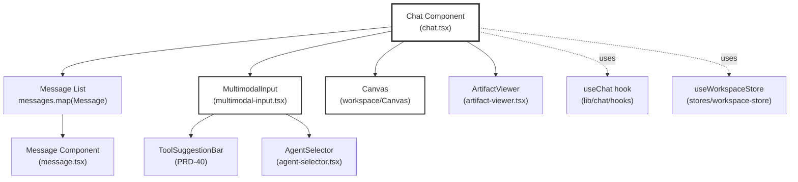
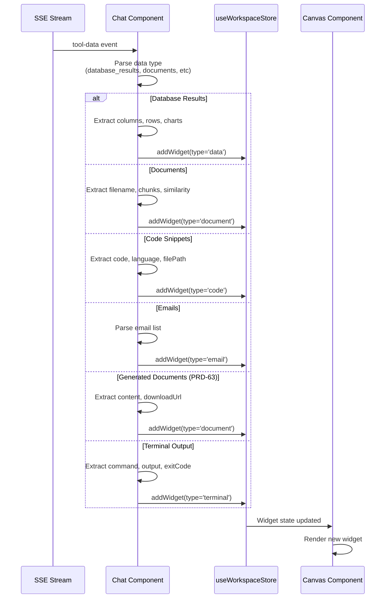
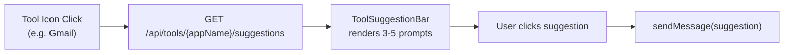
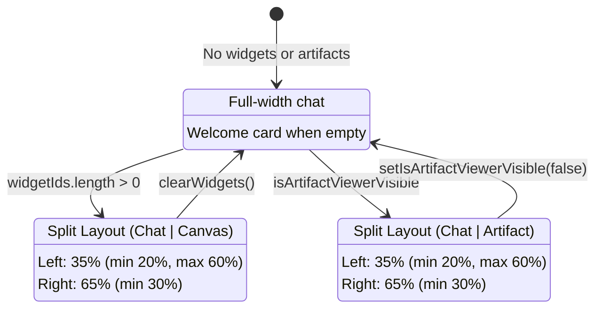
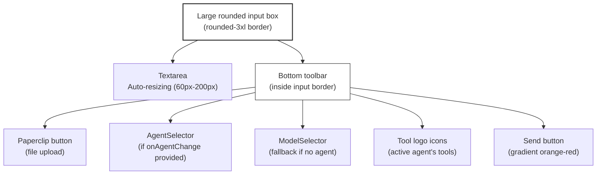
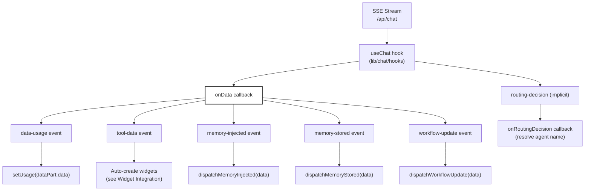

# Chat UI Components

<details>
<summary>Relevant source files</summary>

The following files were used as context for generating this wiki page:

- [frontend/components/chatbot/chat-widget.tsx](frontend/components/chatbot/chat-widget.tsx)
- [frontend/components/chatbot/chat.tsx](frontend/components/chatbot/chat.tsx)
- [frontend/components/chatbot/multimodal-input.tsx](frontend/components/chatbot/multimodal-input.tsx)
- [frontend/public/brand/jira-logo.svg](frontend/public/brand/jira-logo.svg)
- [orchestrator/modules/documents/generation_service.py](orchestrator/modules/documents/generation_service.py)
- [orchestrator/modules/tools/discovery/platform_actions.py](orchestrator/modules/tools/discovery/platform_actions.py)
- [orchestrator/modules/tools/discovery/platform_executor.py](orchestrator/modules/tools/discovery/platform_executor.py)

</details>


This page covers the frontend components that implement the real-time streaming chat interface, including message rendering, multimodal input, widget integration, tool suggestions, and layout management. 

For backend chat orchestration, see [7.1 Chat API & Streaming](#7.1). For the widget system architecture and widget types, see [7.7 Widget System](#7.7). For agent routing displayed in chat messages, see [8 Universal Router](#8).

---

## Component Architecture Overview

The chat interface is composed of three primary components working together:

| Component | File | Purpose |
|-----------|------|---------|
| `Chat` | `frontend/components/chatbot/chat.tsx` | Main chat container, message list, widget integration, SSE event handling |
| `MultimodalInput` | `frontend/components/chatbot/multimodal-input.tsx` | Text input, file attachments, agent selector, model selector, tool icons |
| `PilotHelperWidget` | `frontend/components/chatbot/chat-widget.tsx` | Contextual help and bug reporting overlay |

The `Chat` component manages three distinct layout modes based on content type:

1. **Normal mode** — Chat messages only, no side panels
2. **Widget mode** (PRD-38.1) — Split view with chat on left (35%), widget canvas on right (65%)
3. **Artifact viewer mode** (legacy) — Split view with chat on left, single artifact on right

**Sources:** [frontend/components/chatbot/chat.tsx:1-50](), [frontend/components/chatbot/multimodal-input.tsx:1-30]()

---

## Chat Component Structure

### Component Hierarchy



**Sources:** [frontend/components/chatbot/chat.tsx:43-105]()

### Key Props and State

The `Chat` component accepts the following props:

```typescript
interface ChatProps {
  id: string                          // Conversation ID
  initialMessages?: ChatMessage[]     // Pre-loaded message history
  initialChatModel?: string           // Default model (e.g. 'gpt-4')
  initialVisibilityType?: VisibilityType  // 'private' | 'public'
  isReadonly?: boolean                // Disable input for shared chats
  autoResume?: boolean                // Continue streaming on mount
  initialLastContext?: AppUsage       // Token usage data
}
```

**State variables:**

| State | Type | Purpose |
|-------|------|---------|
| `widgetIds` | `string[]` | Active widget IDs from workspace store (PRD-38.1) |
| `selectedArtifact` | `Artifact \| null` | Legacy artifact for artifact viewer mode |
| `activeTool` | `string \| null` | Currently active tool for suggestions (PRD-40) |
| `toolSuggestions` | `string[]` | Suggested prompts for active tool |
| `selectedAgentId` | `number \| null` | User-selected agent (overrides auto-routing) |
| `lastRoutingDecision` | `ref` | Stores agent ID from most recent routing for corrections (PRD-50) |

**Sources:** [frontend/components/chatbot/chat.tsx:33-125]()

---

## Widget Integration (PRD-38.1)

The chat component automatically creates widgets when tool execution results arrive via SSE `tool-data` events. This replaces the legacy artifact viewer with a composable multi-widget canvas.

### Auto-Widget Creation Flow



**Sources:** [frontend/components/chatbot/chat.tsx:145-380]()

### Widget Type Transformations

The chat component transforms backend tool results into widget data structures:

| Backend Structure | Widget Type | Transformation Logic |
|-------------------|-------------|----------------------|
| `database_results[]` | `data` | Extract `columns`, `rows`, `sql`, `charts` from PandasAI [chat.tsx:156-192]() |
| `documents[]` | `document` | Map `chunks[]` to widget format with similarity scores [chat.tsx:196-230]() |
| `code_snippets[]` | `code` | Extract `code`, `language`, `filePath`, `symbolName` [chat.tsx:233-255]() |
| `emails[]` | `email` | Parse email addresses (handles "Name \<email\>" format) [chat.tsx:260-317]() |
| `generated_document` | `document` | Attach `content`, `downloadUrl`, mark `hasFullContent: true` [chat.tsx:320-341]() |
| `terminal_output` | `terminal` | Extract `command`, `stdout`, `stderr`, `exitCode` [chat.tsx:344-366]() |

**Email Address Parsing Example:**

The chat component includes a helper to normalize email formats from Composio integrations:

```typescript
// "John Doe <john@example.com>" → { name: "John Doe", email: "john@example.com" }
const parseEmailAddress = (addr: any): { email: string; name?: string } => {
  const match = addr.match(/^(.+?)\s*<([^>]+)>$/)
  if (match) return { name: match[1].trim(), email: match[2].trim() }
  return { email: addr.trim() }
}
```

**Sources:** [frontend/components/chatbot/chat.tsx:263-283]()

### Document Widget Lazy Loading

When a document widget is created without full content (`has_full_content: false`), the chat component fetches the full text asynchronously:

```typescript
// Fetch full content if needed
if (doc.id && !doc.has_full_content) {
  apiClient.request(`/api/documents/${doc.id}/content`)
    .then((data: any) => {
      const fullContent = Array.isArray(data?.chunks)
        ? data.chunks.map((chunk: any) => chunk?.content ?? '').join('\n\n')
        : initialContent
      
      // Update widget with full content
      useWorkspaceStore.getState().updateWidget(widgetId, {
        data: { ...widgetData.data, content: fullContent, hasFullContent: true },
        state: 'ready',
      })
    })
}
```

This prevents blocking the UI while large documents are retrieved from S3.

**Sources:** [frontend/components/chatbot/chat.tsx:653-679]()

---

## Tool Suggestion System (PRD-40/41)

The chat interface displays dynamic tool suggestions when users click tool icons in the input bar. This feature has two phases:

### Phase 1: Basic Suggestions (PRD-40)

Tool icons are displayed for the active agent's connected apps. Clicking an icon fetches pre-configured suggestions from the backend:



**State Management:**

| State Variable | Purpose |
|----------------|---------|
| `activeTool` | Name of tool with open suggestions (e.g. "gmail") |
| `toolSuggestions` | Array of prompt strings fetched from API |
| `isLoadingSuggestions` | Loading indicator during API call |

**Sources:** [frontend/components/chatbot/chat.tsx:489-556]()

### Phase 2: Context-Aware Suggestions (PRD-41)

When `user_id` and `session_id` are available, the backend personalizes suggestions based on conversation history:

```typescript
const handleToolIconClick = async (appName: string) => {
  setActiveTool(appName)
  setIsLoadingSuggestions(true)
  
  const userId = user?.id
  const sessionId = activeChatId || id
  
  // Build URL with context params
  let url = `/api/tools/${appName}/suggestions`
  if (userId && sessionId) {
    const params = new URLSearchParams({ user_id: userId, session_id: sessionId })
    url = `${url}?${params.toString()}`
  }
  
  const data = await apiClient.request<SuggestionResponse>(url)
  setToolSuggestions(data.suggestions || [])
  setHasContextSuggestions(data.has_context || false)  // Indicates personalized results
}
```

The `ToolSuggestionBar` displays a context indicator when `hasContext: true`.

**Sources:** [frontend/components/chatbot/chat.tsx:506-540](), [frontend/components/chatbot/multimodal-input.tsx:232-261]()

---

## Layout System

The chat component supports three layout modes using `ResizablePanelGroup`:

### Layout Modes Diagram



**Sources:** [frontend/components/chatbot/chat.tsx:737-900]()

### Normal Mode (Welcome State)

When `messages.length === 0` and not streaming, displays a welcome card with personalized greeting:

```tsx
<h1 className="text-3xl md:text-4xl font-semibold tracking-tight text-foreground/90">
  Hey{user?.firstName ? <> <span className="gradient-text">{user.firstName}</span></> : ''}, 
  what can I do for you today?
</h1>
```

The card includes quick links to agents, workflows, documents, and tools pages.

**Sources:** [frontend/components/chatbot/chat.tsx:905-940]()

### Widget Mode (PRD-38.1)

When `hasWidgets` is true (i.e., `widgetIds.length > 0`), the component renders a full-screen overlay with resizable panels:

```tsx
{hasWidgets && (
  <div className="fixed top-0 left-0 z-50 h-screen w-screen bg-background">
    <ResizablePanelGroup direction="horizontal" className="h-full">
      {/* Chat Column - LEFT (resizable, default 35%, min 20%) */}
      <ResizablePanel defaultSize={35} minSize={20} maxSize={60}>
        {/* Messages + Input */}
      </ResizablePanel>

      <ResizableHandle withHandle />

      {/* Widget Canvas - RIGHT (resizable) */}
      <ResizablePanel defaultSize={65} minSize={30}>
        <Canvas width={canvasWidth} onClose={handleCloseCanvas} />
      </ResizablePanel>
    </ResizablePanelGroup>
  </div>
)}
```

The `Canvas` component (from `@/components/workspace`) renders all active widgets as floating panels with tabs.

**Sources:** [frontend/components/chatbot/chat.tsx:737-817]()

### Artifact Viewer Mode (Legacy)

For backward compatibility, the component still supports viewing single artifacts (code, markdown, HTML). This mode is deprecated in favor of widgets but maintained for existing links:

```tsx
{isArtifactViewerVisible && selectedArtifact && !hasWidgets && (
  <motion.div className="fixed top-0 left-0 z-50 h-screen w-screen bg-background">
    <ResizablePanelGroup direction="horizontal" className="h-full">
      <ResizablePanel defaultSize={35} minSize={20} maxSize={60}>
        {/* Messages */}
      </ResizablePanel>
      <ResizableHandle withHandle />
      <ResizablePanel defaultSize={65} minSize={30}>
        <ArtifactViewer artifact={selectedArtifact} onClose={...} />
      </ResizablePanel>
    </ResizablePanelGroup>
  </motion.div>
)}
```

**Sources:** [frontend/components/chatbot/chat.tsx:820-899]()

---

## MultimodalInput Component

The input component handles text input, file attachments, agent selection, model selection, and tool icon displays.

### Component Structure



**Sources:** [frontend/components/chatbot/multimodal-input.tsx:1-295]()

### File Upload Flow

The input component supports drag-and-drop and paste-to-upload for documents:

```typescript
// Hidden file input
<input
  ref={fileInputRef}
  type="file"
  className="hidden"
  multiple
  onChange={async (event) => {
    const files = Array.from(event.target.files || [])
    setUploadQueue(files.map(f => f.name))  // Show "uploading..." badges
    
    const results = await Promise.all(
      files.map(file => apiClient.uploadDocument(file))
    )
    
    setUploadedDocs(results.map(r => ({
      document_id: String(r.document_id ?? r.id),
      filename: String(r.filename),
      status: String(r.status ?? 'uploaded'),
    })))
  }}
/>
```

Uploaded documents are sent as `file` parts in the message:

```typescript
const parts: any[] = [
  ...uploadedDocs.map(doc => ({
    type: 'file',
    filename: doc.filename,
    mediaType: 'application/octet-stream',
    url: `document://${doc.document_id}`,  // Special URI scheme for backend
  })),
  { type: 'text', text: trimmedInput },
]
```

**Sources:** [frontend/components/chatbot/multimodal-input.tsx:114-149](), [frontend/components/chatbot/multimodal-input.tsx:75-90]()

### Agent-Based Tool Icons (PRD-40)

When an agent is selected via `AgentSelector`, the component displays tool logos for the agent's connected apps:

```tsx
{activeAgent?.tools && activeAgent.tools.length > 0 && (
  <div className="flex gap-2 items-center animate-in fade-in zoom-in-50 duration-300">
    {activeAgent.tools.slice(0, 4).map(tool => (
      <button
        key={tool.id}
        onClick={() => onToolIconClick?.(tool.name)}
        className="hover:scale-110 transition-all duration-200"
        title={`Click for ${tool.name} suggestions`}
      >
        <ToolLogo
          name={tool.name}
          logo={tool.icon}
          size={28}
          showBackground={true}
          className="ring-1 ring-orange-500/30 border border-orange-500/20"
        />
      </button>
    ))}
    {activeAgent.tools.length > 4 && (
      <div className="w-7 h-7 rounded-lg bg-secondary/80">
        +{activeAgent.tools.length - 4}
      </div>
    )}
  </div>
)}
```

Clicking a tool icon triggers `onToolIconClick(appName)`, which opens the `ToolSuggestionBar` in the parent `Chat` component.

**Sources:** [frontend/components/chatbot/multimodal-input.tsx:232-261]()

---

## Message Flow and Event Handling

The `Chat` component integrates with the `useChat` hook to handle SSE streaming:

### Event Handling Flow



**Sources:** [frontend/components/chatbot/chat.tsx:140-416]()

### Routing Decision Display (PRD-50)

When a message is auto-routed to an agent, the `onRoutingDecision` callback resolves the agent name:

```typescript
onRoutingDecision: (info: RoutingInfo) => {
  // Store for correction API (if user manually changes agent)
  lastRoutingDecision.current = { agentId: info.agentId }
  
  // Resolve agent name asynchronously if not cached
  if (!info.agentName && info.agentId && !agentNameCache.current[info.agentId]) {
    apiClient.request(`/api/agents/${info.agentId}`)
      .then((agent: any) => {
        const name = agent?.name || `Agent #${info.agentId}`
        agentNameCache.current[info.agentId] = name
        
        // Update all messages with this agent's routing info to include name
        setMessages(prev =>
          prev.map(m =>
            m.routingInfo?.agentId === info.agentId && !m.routingInfo.agentName
              ? { ...m, routingInfo: { ...m.routingInfo, agentName: name } }
              : m
          )
        )
      })
  }
}
```

If the user manually changes the agent after auto-routing, a correction is sent to `/api/routing/corrections`:

```typescript
const handleAgentChange = (newAgentId: number | null) => {
  setSelectedAgentId(newAgentId)
  
  // If user selects a specific agent after an auto-route, record the correction
  if (newAgentId && prev?.agentId && newAgentId !== prev.agentId) {
    const routedMessage = [...messages].reverse().find(m => m.routingInfo?.requestId)
    const requestId = routedMessage?.routingInfo?.requestId
    if (requestId) {
      apiClient.post('/api/routing/corrections', {
        request_id: requestId,
        correct_agent_id: newAgentId,
      })
    }
  }
}
```

This feedback loop improves routing accuracy over time (see [8.7 Routing Corrections & Learning](#8.7)).

**Sources:** [frontend/components/chatbot/chat.tsx:383-439]()

---

## PilotHelperWidget (Jira Integration)

The `PilotHelperWidget` provides contextual help and bug reporting. It's rendered as a floating Jira-branded button in the bottom-right corner.

### Widget Features

| Tab | Purpose |
|-----|---------|
| **Help** | Context-aware help items based on current page (dashboard, agents, workflows, etc.) |
| **Report Bug** | Bug report form with title, description, severity, category, screenshot paste |

### Bug Report Submission

The widget captures console errors and page context, submitting to `/api/bug-report`:

```typescript
const payload: BugReportRequest = {
  title: title.trim(),
  description: description.trim(),
  severity,  // 'Critical' | 'Major' | 'Minor'
  category,  // 'UI Bug' | 'Data Issue' | 'Performance' | 'Other'
  screenshot_base64: screenshot || undefined,
  context: {
    url: window.location.href,
    page: context.currentPage,
    user_agent: navigator.userAgent,
    viewport: `${window.innerWidth}x${window.innerHeight}`,
    user_email: user?.primaryEmailAddress?.emailAddress,
    user_name: user?.fullName || undefined,
    console_errors: consoleErrorsRef.current.slice(-20),  // Last 20 errors
    timestamp: new Date().toISOString(),
  },
}
```

The backend creates a Jira issue and returns `jira_key` (e.g., `"AUTO-123"`) and `jira_url` for linking to the created ticket.

**Sources:** [frontend/components/chatbot/chat-widget.tsx:192-233]()

### Contextual Help Content

Help items are defined per page in `PAGE_HELP_CONTENT`:

```typescript
const PAGE_HELP_CONTENT: Record<string, HelpItem[]> = {
  agents: [
    { title: 'Create an Agent', description: 'Click "New Agent" to configure...' },
    { title: 'Assign Tools', description: 'Connect Composio integrations...', link: '/tools' },
    { title: 'Monitor Performance', description: 'Track each agent\'s success rate...' },
  ],
  workflows: [
    { title: 'Build a Workflow', description: 'Use the visual editor to chain agents...' },
    { title: 'Templates', description: 'Start from a pre-built template...' },
  ],
  // ... other pages
}
```

The widget selects the appropriate help items based on `context.currentPage`.

**Sources:** [frontend/components/chatbot/chat-widget.tsx:40-86]()

---

## State Management Integration

The chat component integrates with two primary state stores:

### useChat Hook Integration

The `useChat` hook (from `lib/chat/hooks`) manages message state and SSE streaming:

```typescript
const { messages, setMessages, sendMessage, status, stop, reload } = useChat({
  id: activeChatId,
  initialMessages,
  selectedModelId: currentModelId,
  selectedAgentId,
  onData: (dataPart) => { /* Handle SSE events */ },
  onChatIdUpdate: (newChatId) => { setActiveChatId(newChatId) },
  onRoutingDecision: (info: RoutingInfo) => { /* Resolve agent name */ },
})
```

**Sources:** [frontend/components/chatbot/chat.tsx:140-416]()

### Workspace Store Integration (PRD-38.1)

The chat component uses `useWorkspaceStore` for widget state:

```typescript
const widgetIds = useWorkspaceStore((s) => s.widgetIds)
const addWidget = useWorkspaceStore((s) => s.addWidget)
const clearWidgets = useWorkspaceStore((s) => s.clearWidgets)

// US-015: SSE event dispatchers for memory & workflow widgets
const dispatchMemoryInjected = useWorkspaceStore((s) => s.dispatchMemoryInjected)
const dispatchMemoryStored = useWorkspaceStore((s) => s.dispatchMemoryStored)
const dispatchWorkflowUpdate = useWorkspaceStore((s) => s.dispatchWorkflowUpdate)
```

These dispatchers allow memory and workflow widgets (if implemented) to react to SSE events.

**Sources:** [frontend/components/chatbot/chat.tsx:56-66]()

---

## Auto-Scroll and Scroll Detection

The chat component tracks scroll position to show/hide a "scroll to bottom" button:

```typescript
const checkScroll = () => {
  const { scrollTop, scrollHeight, clientHeight } = container
  setIsAtBottom(scrollHeight - scrollTop - clientHeight < 50)
}

// Re-attach when artifact viewer visibility toggles (DOM node changes)
useEffect(() => {
  const container = messagesContainerRef.current
  if (!container) return
  
  container.addEventListener('scroll', checkScroll)
  checkScroll()  // Initialize
  
  return () => container.removeEventListener('scroll', checkScroll)
}, [isArtifactViewerVisible])
```

During streaming, the component auto-scrolls to the bottom:

```typescript
useEffect(() => {
  if (status === 'streaming') {
    requestAnimationFrame(() => {
      messagesContainerRef.current?.scrollTo({
        top: messagesContainerRef.current.scrollHeight,
        behavior: 'smooth',
      })
    })
  }
}, [status])
```

**Sources:** [frontend/components/chatbot/chat.tsx:442-471]()

---

## Title Generation

The chat component auto-generates a title after the first user-assistant exchange:

```typescript
useEffect(() => {
  if (!hasGeneratedTitle && messages.length >= 2 && activeChatId) {
    const firstUserMessage = messages.find(m => m.role === 'user')
    if (firstUserMessage && firstUserMessage.parts) {
      const textPart = firstUserMessage.parts.find(p => p.type === 'text')
      if (textPart && 'text' in textPart) {
        const title = generateTitle(textPart.text)  // Truncates to 50 chars
        updateChatTitle(activeChatId, title).catch(console.error)
        setHasGeneratedTitle(true)
      }
    }
  }
}, [messages, activeChatId, hasGeneratedTitle])
```

The `generateTitle` utility function (from `lib/utils`) truncates the first message to 50 characters for use as the conversation title in the sidebar.

**Sources:** [frontend/components/chatbot/chat.tsx:474-486]()

---

## Summary

The chat UI components form a sophisticated interface layer that:

1. **Renders streaming messages** with routing indicators, tool calls, and artifacts
2. **Auto-creates widgets** from tool execution results (database queries, documents, code, emails, terminal output)
3. **Provides contextual tool suggestions** with Phase 1 (basic) and Phase 2 (context-aware) support
4. **Manages three layout modes** (normal, widget canvas, artifact viewer) using resizable panels
5. **Handles multimodal input** with text, file attachments, agent selection, and tool icon shortcuts
6. **Integrates with help and bug reporting** via the Jira-branded PilotHelperWidget
7. **Dispatches SSE events** to workspace store for memory and workflow widgets
8. **Records routing corrections** when users manually override agent selection

For the backend chat orchestration that powers these components, see [7.1 Chat API & Streaming](#7.1). For widget rendering details, see [7.7 Widget System](#7.7).

---