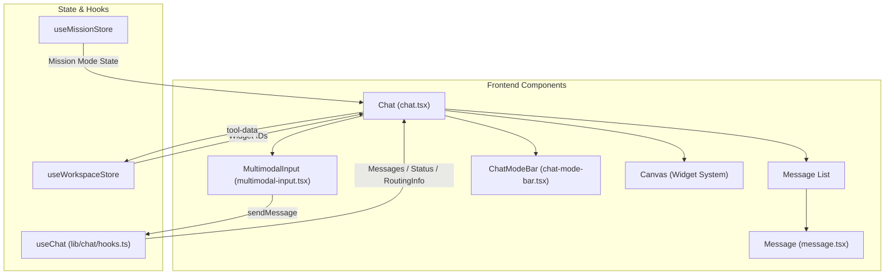
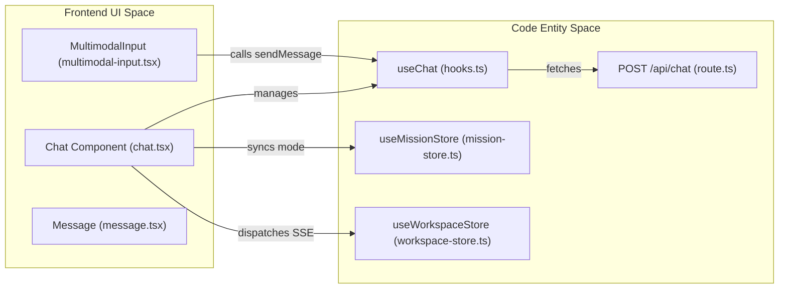

# Chat UI Components

Relevant source files

The following files were used as context for generating this wiki page:

- [frontend/app/api/chat/route.ts](frontend/app/api/chat/route.ts)
- [frontend/components/chatbot/chat-mode-bar.tsx](frontend/components/chatbot/chat-mode-bar.tsx)
- [frontend/components/chatbot/chat.tsx](frontend/components/chatbot/chat.tsx)
- [frontend/components/chatbot/message-actions.tsx](frontend/components/chatbot/message-actions.tsx)
- [frontend/components/chatbot/message.tsx](frontend/components/chatbot/message.tsx)
- [frontend/components/chatbot/mission-suggestion-card.tsx](frontend/components/chatbot/mission-suggestion-card.tsx)
- [frontend/components/chatbot/multimodal-input.tsx](frontend/components/chatbot/multimodal-input.tsx)
- [frontend/components/missions/create-mission-modal.tsx](frontend/components/missions/create-mission-modal.tsx)
- [frontend/components/voice/VoiceCallPanel.tsx](frontend/components/voice/VoiceCallPanel.tsx)
- [frontend/components/voice/VoiceMessage.tsx](frontend/components/voice/VoiceMessage.tsx)
- [frontend/components/voice/VoiceMicButton.tsx](frontend/components/voice/VoiceMicButton.tsx)
- [frontend/components/voice/VoicePlayer.tsx](frontend/components/voice/VoicePlayer.tsx)
- [frontend/components/voice/VoiceRecordingIndicator.tsx](frontend/components/voice/VoiceRecordingIndicator.tsx)
- [frontend/hooks/use-voice-playback.ts](frontend/hooks/use-voice-playback.ts)
- [frontend/hooks/use-voice-recorder.ts](frontend/hooks/use-voice-recorder.ts)
- [frontend/hooks/use-voice-stream.ts](frontend/hooks/use-voice-stream.ts)
- [frontend/lib/chat/hooks.ts](frontend/lib/chat/hooks.ts)
- [frontend/lib/voice-client.ts](frontend/lib/voice-client.ts)
- [frontend/stores/mission-store.ts](frontend/stores/mission-store.ts)
- [frontend/types/chat.ts](frontend/types/chat.ts)

This page covers the frontend components that implement the real-time streaming chat interface, including the `useChat` hook, message rendering, multimodal input, widget integration, and mission/plan mode selection.

---

## Component Architecture Overview

The chat interface is a sophisticated React application built with Next.js, leveraging the AI SDK for streaming and Framer Motion for animations. It is composed of several high-level components:

| Component | File | Purpose |
|-----------|------|---------|
| `Chat` | [frontend/components/chatbot/chat.tsx:56-64]() | Main container managing messages, streaming state, and layout transitions. |
| `Message` | [frontend/components/chatbot/message.tsx:41-53]() | Individual message renderer supporting Markdown, code blocks, and tool results. |
| `MultimodalInput` | [frontend/components/chatbot/multimodal-input.tsx:37-49]() | Input area for text, files, voice, and selector controls. |
| `ChatModeBar` | [frontend/components/chatbot/chat-mode-bar.tsx:34-45]() | Navigation for switching between Code, Plan, and Mission modes. |

### Component Hierarchy and Data Flow

Sources: [frontend/components/chatbot/chat.tsx:56-162](), [frontend/lib/chat/hooks.ts:8-28](), [frontend/components/chatbot/chat-mode-bar.tsx:34-45]()

---

## The `useChat` Hook and Streaming

The `useChat` hook is the primary interface between the UI and the backend Chat API. It manages the message list, loading states, and the server-sent events (SSE) stream.

### Request Flow
When `sendMessage` is called, the hook:
1.  Appends the user message to the local state [frontend/lib/chat/hooks.ts:62-71]().
2.  Initiates a POST request to `/api/chat` [frontend/lib/chat/hooks.ts:98-124]().
3.  Includes headers for `X-Workspace-ID` and authentication tokens [frontend/lib/chat/hooks.ts:100-108]().
4.  Sends `agentId` (if pinned) or `selectedChatModel` along with mode flags like `missionMode` or `planMode` [frontend/lib/chat/hooks.ts:115-122]().

### Routing Metadata (PRD-50)
The hook extracts routing information from response headers (set by the `UniversalRouter` on the backend) and attaches it to the assistant message [frontend/lib/chat/hooks.ts:142-164]().
*   `x-routing-agent-id`: The ID of the agent selected to handle the query.
*   `x-routing-confidence`: The confidence score of the routing decision.
*   `x-routing-type`: The tier used (e.g., `user_override`, `llm_classifier`).

Sources: [frontend/lib/chat/hooks.ts:54-164](), [frontend/app/api/chat/route.ts:80-84]()

---

## Message Rendering System

The `Message` component transforms raw AI SDK parts or standard content strings into rich UI elements.

### Content Processing
Messages are processed in two formats:
1.  **AI SDK Format**: Uses the `content` field for standard text [frontend/components/chatbot/message.tsx:174-176]().
2.  **Custom Parts Format**: Uses a `parts` array for multimodal content (text, files, tool-calls, tool-results, voice) [frontend/components/chatbot/message.tsx:179-185]().

### Markdown & Media Support
The system uses `react-markdown` with `remark-gfm` to render text [frontend/components/chatbot/message.tsx:158-166]().
*   **Images**: Extracted from markdown via regex and rendered in an `ImageGallery` [frontend/components/chatbot/message.tsx:30-39]().
*   **Code**: Handled by a custom `CodeBlock` component with syntax highlighting [frontend/components/chatbot/message.tsx:89-102]().
*   **Tool Results**: Specific renderers exist for `DocumentReference` (RAG results), `DatabaseResult` (SQL tables), and `CodeSnippet` [frontend/components/chatbot/message.tsx:23-25]().
*   **Voice**: Supports voice message playback and transcription display [frontend/components/chatbot/message.tsx:13]().

Sources: [frontend/components/chatbot/message.tsx:41-185](), [frontend/types/chat.ts:163-169]()

---

## Mode Selection & Mission Integration

The UI supports specialized interaction modes via the `ChatModeBar` and dedicated components like `MissionSuggestionCard`.

### Chat Modes
*   **Code Mode**: Activates the `coding_canvas` widget for side-by-side code editing [frontend/components/chatbot/chat.tsx:98-126]().
*   **Plan Mode**: Focuses the agent on research and strategy without immediate execution [frontend/stores/mission-store.ts:47-52]().
*   **Mission Mode**: Transitions the chat into a goal-oriented planning phase [frontend/stores/mission-store.ts:53-57]().

### Mission Creation & Suggestions
1.  **Complexity Detection**: The UI can display a `MissionSuggestionCard` when AutoBrain detects a task is "Multi-step" or "Complex multi-agent" [frontend/components/chatbot/mission-suggestion-card.tsx:19-25]().
2.  **Templates**: The `CreateMissionModal` offers predefined templates like "Business Plan" or "Research Report" [frontend/components/missions/create-mission-modal.tsx:67-110]().
3.  **Conversion**: `handleLaunchPlanAsMission` extracts goals and descriptions from the chat history to prepopulate the mission form [frontend/components/chatbot/chat.tsx:146-152]().

Sources: [frontend/components/chatbot/chat-mode-bar.tsx:54-84](), [frontend/components/missions/create-mission-modal.tsx:119-225](), [frontend/components/chatbot/mission-suggestion-card.tsx:35-38]()

---

## Layout and Widget System (PRD-38.1)

The `Chat` component manages the split between conversation and the `Canvas` (widget area).

### Layout Logic
*   **Dynamic Resizing**: The UI adjusts based on whether widgets are active. If `widgetIds.length > 0`, the `Canvas` is rendered in a resizable panel [frontend/components/chatbot/chat.tsx:70-73]().
*   **Artifact/Code Integration**: Clicking an artifact or code snippet in a message can trigger the `ArtifactViewer` or open the `Code Canvas` [frontend/components/chatbot/chat.tsx:98-126]().

### SSE Widget Events (US-015)
The chat interface listens for Server-Sent Events to update workspace state:
*   `dispatchMemoryInjected`: Updates UI when memories are retrieved [frontend/components/chatbot/chat.tsx:76]().
*   `dispatchMemoryStored`: Notifies when new conversation facts are persisted [frontend/components/chatbot/chat.tsx:77]().
*   `dispatchWorkflowUpdate`: Refreshes workflow status in the sidebar/widgets [frontend/components/chatbot/chat.tsx:78]().

Sources: [frontend/components/chatbot/chat.tsx:68-132](), [frontend/lib/chat/hooks.ts:98-124](), [frontend/stores/mission-store.ts:45-57]()

---

## Voice Interaction (PRD-Voice)

The `MultimodalInput` integrates a voice pipeline for hands-free interaction.

*   **Recording**: Uses `useVoiceRecorder` to capture audio blobs [frontend/components/chatbot/multimodal-input.tsx:94-97]().
*   **Transcription**: Audio is sent to `/api/chat/voice` via `sendVoiceMessage` [frontend/lib/voice-client.ts:53-63]().
*   **Integration**: The resulting transcript is automatically fed back into the standard `sendMessage` flow [frontend/components/chatbot/multimodal-input.tsx:82-86]().

Sources: [frontend/components/chatbot/multimodal-input.tsx:62-97](), [frontend/lib/voice-client.ts:53-102]()

---