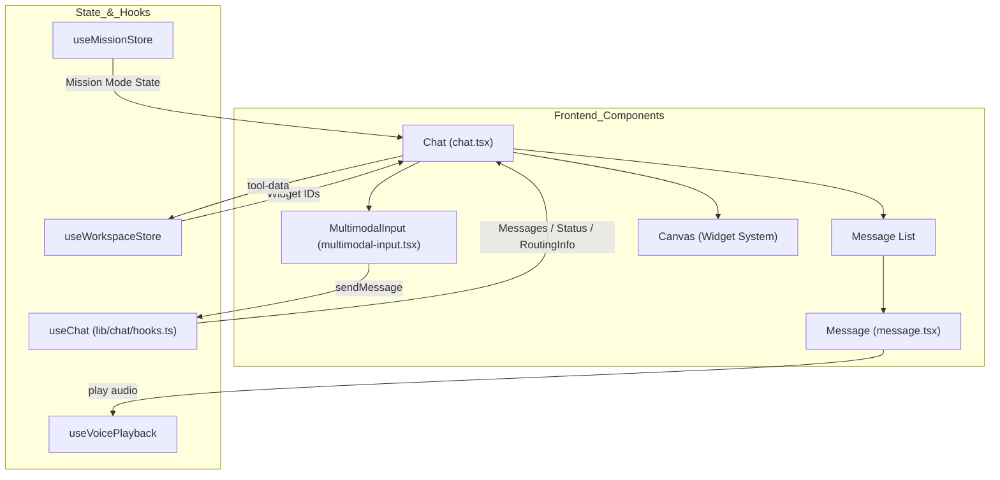
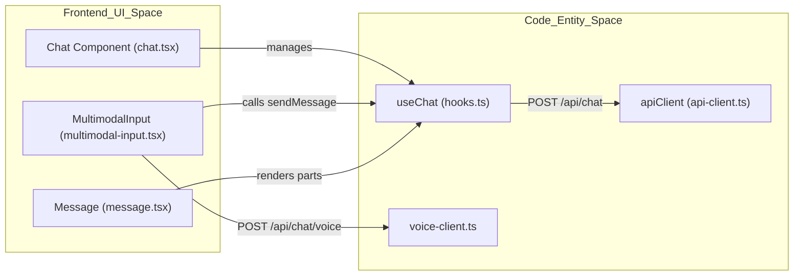

# Chat UI Components

Relevant source files

The following files were used as context for generating this wiki page:

- [frontend/app/api/chat/route.ts](frontend/app/api/chat/route.ts)
- [frontend/components/chatbot/chat.tsx](frontend/components/chatbot/chat.tsx)
- [frontend/components/chatbot/message.tsx](frontend/components/chatbot/message.tsx)
- [frontend/components/chatbot/mission-suggestion-card.tsx](frontend/components/chatbot/mission-suggestion-card.tsx)
- [frontend/components/chatbot/multimodal-input.tsx](frontend/components/chatbot/multimodal-input.tsx)
- [frontend/components/voice/VoiceMessage.tsx](frontend/components/voice/VoiceMessage.tsx)
- [frontend/components/voice/VoiceMicButton.tsx](frontend/components/voice/VoiceMicButton.tsx)
- [frontend/components/voice/VoicePlayer.tsx](frontend/components/voice/VoicePlayer.tsx)
- [frontend/components/voice/VoiceRecordingIndicator.tsx](frontend/components/voice/VoiceRecordingIndicator.tsx)
- [frontend/hooks/use-voice-playback.ts](frontend/hooks/use-voice-playback.ts)
- [frontend/hooks/use-voice-recorder.ts](frontend/hooks/use-voice-recorder.ts)
- [frontend/lib/chat/hooks.ts](frontend/lib/chat/hooks.ts)
- [frontend/lib/voice-client.ts](frontend/lib/voice-client.ts)
- [frontend/stores/mission-store.ts](frontend/stores/mission-store.ts)
- [frontend/types/chat.ts](frontend/types/chat.ts)
- [orchestrator/api/chat.py](orchestrator/api/chat.py)
- [orchestrator/api/recipe_executor.py](orchestrator/api/recipe_executor.py)
- [orchestrator/consumers/chatbot/service.py](orchestrator/consumers/chatbot/service.py)
- [orchestrator/consumers/chatbot/streaming.py](orchestrator/consumers/chatbot/streaming.py)
- [orchestrator/core/models/stream_events.py](orchestrator/core/models/stream_events.py)
- [orchestrator/modules/agents/factory/agent_factory.py](orchestrator/modules/agents/factory/agent_factory.py)

This page covers the frontend components that implement the real-time streaming chat interface, including the `useChat` hook, message rendering, multimodal input, widget integration, and mission/plan mode selection.

---

## Component Architecture Overview

The chat interface is a sophisticated React application built with Next.js, leveraging the AI SDK for streaming and Framer Motion for animations. It is composed of several high-level components:

| Component | File | Purpose |
|-----------|------|---------|
| `Chat` | [frontend/components/chatbot/chat.tsx:57-65]() | Main container managing messages, streaming state, and layout transitions. |
| `Message` | [frontend/components/chatbot/message.tsx:41-53]() | Individual message renderer supporting Markdown, code blocks, and tool results. |
| `MultimodalInput` | [frontend/components/chatbot/multimodal-input.tsx:38-51]() | Input area for text, files, voice, and selector controls. |
| `VoicePlayer` | [frontend/components/voice/VoicePlayer.tsx:27-34]() | Audio playback component for assistant voice responses. |

### Component Hierarchy and Data Flow

Sources: [frontend/components/chatbot/chat.tsx:57-162](), [frontend/lib/chat/hooks.ts:9-29](), [frontend/components/chatbot/multimodal-input.tsx:38-51]()

---

## The `useChat` Hook and Streaming

The `useChat` hook is the primary interface between the UI and the backend Chat API. It manages the message list, loading states, and the server-sent events (SSE) stream.

### Request Flow
When `sendMessage` is called, the hook:
1.  Appends the user message to the local state [frontend/lib/chat/hooks.ts:70-70]().
2.  Initiates a POST request to `/api/chat` [frontend/lib/chat/hooks.ts:99-125]().
3.  Includes headers for `X-Workspace-ID` and authentication tokens [frontend/lib/chat/hooks.ts:101-108]().
4.  Sends `agentId` (if pinned) or `selectedChatModel` along with mode flags like `missionMode` or `planMode` [frontend/lib/chat/hooks.ts:117-123]().

### Routing Metadata (PRD-50)
The hook extracts routing information from response headers (set by the `UniversalRouter` on the backend) and attaches it to the assistant message [frontend/lib/chat/hooks.ts:143-165]().
*   `x-routing-agent-id`: The ID of the agent selected to handle the query [frontend/lib/chat/hooks.ts:143-143]().
*   `x-routing-confidence`: The confidence score of the routing decision [frontend/lib/chat/hooks.ts:144-144]().
*   `x-routing-type`: The tier used (e.g., `user_override`, `llm_classifier`) [frontend/lib/chat/hooks.ts:145-145]().

Sources: [frontend/lib/chat/hooks.ts:55-165](), [frontend/types/chat.ts:111-118]()

---

## Message Rendering System

The `Message` component transforms raw AI SDK parts or standard content strings into rich UI elements.

### Content Processing
Messages are processed in two formats:
1.  **AI SDK Format**: Uses the `content` field for standard text [frontend/components/chatbot/message.tsx:174-176]().
2.  **Custom Parts Format**: Uses a `parts` array for multimodal content (text, file, tool-result, artifact, voice) [frontend/components/chatbot/message.tsx:179-185](), [frontend/types/chat.ts:163-168]().

### Markdown & Media Support
The system uses `react-markdown` with `remark-gfm` to render text [frontend/components/chatbot/message.tsx:158-166]().
*   **Images**: Extracted from markdown via regex and rendered in an `ImageGallery` [frontend/components/chatbot/message.tsx:30-39]().
*   **Code**: Handled by a custom `CodeBlock` component with syntax highlighting [frontend/components/chatbot/message.tsx:89-102]().
*   **Voice**: Rendered using a specialized `VoiceMessage` component which handles both user transcripts and assistant audio players [frontend/components/voice/VoiceMessage.tsx:17-90]().

Sources: [frontend/components/chatbot/message.tsx:41-185](), [frontend/types/chat.ts:163-168]()

---

## Voice and Multimodal Input

The `MultimodalInput` component handles various input types beyond text, including a dedicated voice pipeline.

### Voice Integration
*   **Recording**: Uses `useVoiceRecorder` to capture audio blobs with a 120-second maximum duration [frontend/components/chatbot/multimodal-input.tsx:124-127]().
*   **Processing**: The `handleVoiceComplete` callback sends the audio to the backend voice endpoint [frontend/components/chatbot/multimodal-input.tsx:69-77]().
*   **UI Injection**: The voice endpoint returns both the user transcript and assistant audio. These are injected directly into the message state to avoid a redundant agent call [frontend/components/chatbot/multimodal-input.tsx:82-108]().

### Voice Playback
Assistant responses containing audio are played via the `VoicePlayer` [frontend/components/voice/VoicePlayer.tsx:27-34]().
*   **Playback Control**: Uses the `useVoicePlayback` hook to manage `AudioContext` and `AudioBufferSourceNode` [frontend/hooks/use-voice-playback.ts:19-22]().
*   **Speed Control**: Supports multiple playback rates (1x, 1.5x, 2x, 0.5x) [frontend/components/voice/VoicePlayer.tsx:18-18]().
*   **Data URIs**: Prefers inline base64 audio to avoid additional network fetches for small clips [frontend/hooks/use-voice-playback.ts:135-141]().

### Ephemeral Attachments (PRD-127)
The system uses ephemeral attachments for chat.
*   **State**: Uploaded attachments are tracked in `uploadedAttachments` state [frontend/components/chatbot/multimodal-input.tsx:56-60]().
*   **Payload**: When submitting, the `attachment_ids` are mapped and sent to the backend [frontend/components/chatbot/multimodal-input.tsx:167-173]().

Sources: [frontend/components/chatbot/multimodal-input.tsx:69-127](), [frontend/hooks/use-voice-playback.ts:78-117](), [frontend/lib/voice-client.ts:54-103]()

---

## Layout and Widget System (PRD-38.1)

The `Chat` component uses a `ResizablePanelGroup` to manage the split between conversation and the `Canvas` (widget area).

### Layout Logic
*   **Dynamic Resizing**: The UI adjusts based on whether widgets are active. If `widgetIds.length > 0`, the `Canvas` is rendered in a resizable panel [frontend/components/chatbot/chat.tsx:71-74]().
*   **Code Canvas**: Users can open a dedicated coding environment which is added as a `coding_canvas` widget to the workspace store [frontend/components/chatbot/chat.tsx:99-127]().

Sources: [frontend/components/chatbot/chat.tsx:71-134](), [frontend/lib/chat/hooks.ts:99-125](), [frontend/lib/voice-client.ts:89-93]()

---

## Model Selection

The `ModelSelector` (used within `MultimodalInput`) allows users to choose from various LLM providers.

### Configuration
*   **Defaults**: System fallbacks are defined in `LLM_DEFAULTS`, currently defaulting to `google/gemini-2.5-flash` [frontend/lib/llm-defaults.ts:10-19]().
*   **Providers**: The frontend supports OpenAI, Anthropic, Grok, and HuggingFace models [frontend/lib/ai/models.ts:11-124]().
*   **Metadata**: Each model definition includes context window limits and pricing information for UI transparency [frontend/lib/ai/models.ts:17-21]().

Sources: [frontend/lib/ai/models.ts:11-124](), [frontend/lib/llm-defaults.ts:10-19]()

---