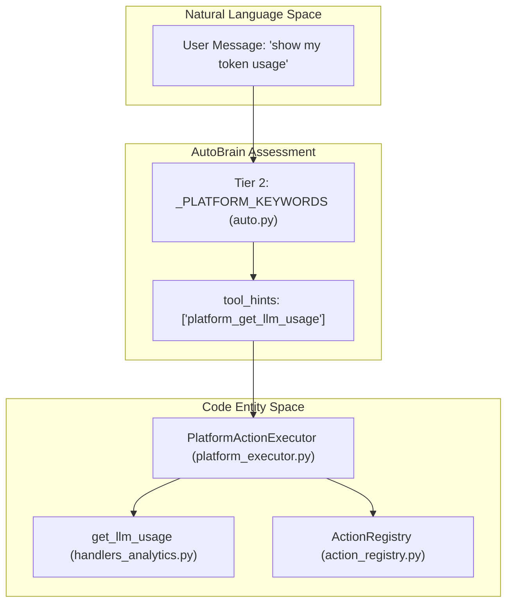
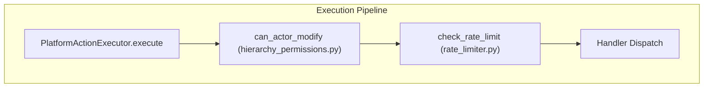

# Complexity Assessment (AutoBrain)

<details>
<summary>Relevant source files</summary>

The following files were used as context for generating this wiki page:

- [orchestrator/consumers/chatbot/auto.py](orchestrator/consumers/chatbot/auto.py)
- [orchestrator/core/security/rate_limiter.py](orchestrator/core/security/rate_limiter.py)
- [orchestrator/core/services/auto_reporting.py](orchestrator/core/services/auto_reporting.py)
- [orchestrator/core/services/notification_dispatcher.py](orchestrator/core/services/notification_dispatcher.py)
- [orchestrator/modules/tools/discovery/actions_auto_reporting.py](orchestrator/modules/tools/discovery/actions_auto_reporting.py)
- [orchestrator/modules/tools/discovery/handlers_auto_reporting.py](orchestrator/modules/tools/discovery/handlers_auto_reporting.py)
- [orchestrator/modules/tools/discovery/platform_actions.py](orchestrator/modules/tools/discovery/platform_actions.py)
- [orchestrator/modules/tools/discovery/platform_executor.py](orchestrator/modules/tools/discovery/platform_executor.py)
- [orchestrator/tests/test_prd128_notification_dispatcher.py](orchestrator/tests/test_prd128_notification_dispatcher.py)

</details>


## Purpose & Scope

AutoBrain is the progressive complexity assessor that receives **every** incoming chat message and determines the computational depth required to respond. It implements PRD-68's Progressive Complexity Routing, classifying requests on a five-level scale from simple greetings (`ATOM`) to enterprise-scale multi-agent pipelines (`ORGANISM`). [orchestrator/consumers/chatbot/auto.py:1-22]()

The assessor's output determines three critical downstream behaviors:
1. **Routing decision** — whether to respond directly, delegate to a specialized agent, or trigger a workflow/mission. [orchestrator/consumers/chatbot/auto.py:51-57]()
2. **Tool availability** — which tools to load (if any) to avoid overwhelming the LLM via `tool_hints`. [orchestrator/consumers/chatbot/auto.py:69-71]()
3. **Memory retrieval** — whether to fetch conversation context from the memory system via `needs_memory`. [orchestrator/consumers/chatbot/auto.py:70-70]()

The `ComplexityAssessment` result flows through the system wiring, where `needs_memory` and `tool_hints` drive downstream behavior in the `SmartChatOrchestrator`. [orchestrator/consumers/chatbot/auto.py:19-22]()

**Sources**: [orchestrator/consumers/chatbot/auto.py:1-85]()

---

## Complexity Levels

AutoBrain classifies requests into five discrete complexity levels on the Atom → Organism scale defined in the `Complexity` Enum: [orchestrator/consumers/chatbot/auto.py:42-49]()

| Level | Name | Description | Token Budget | Example |
|-------|------|-------------|--------------|---------|
| **ATOM** | Simple | Greetings, factual, chitchat | <200 tokens | "hi", "thanks", "what can you do" |
| **MOLECULE** | Single Tool | Needs a tool or specific agent skill | ~1K tokens | "send email", "check Jira", "search docs" |
| **CELL** | Memory + Tools | Needs memory + tool + reasoning | ~3K tokens | "reply to that email we discussed" |
| **ORGAN** | Multi-Agent | Multi-agent coordination | ~6K tokens | "research bug, plan fix, open PR" |
| **ORGANISM** | Enterprise Pipeline | Full PRD-59 Neural Swarm pipelines | ~12K tokens | "refactor auth across all services" |

**Sources**: [orchestrator/consumers/chatbot/auto.py:42-49]()

---

## Three-Tier Assessment Strategy

AutoBrain uses a three-tier cascade with strict latency and cost targets to minimize overhead for simple queries: [orchestrator/consumers/chatbot/auto.py:14-17]()

### Tier 1: Redis Cache Lookup
The first tier performs a **cache lookup** using the SHA-256 hash of the normalized message text. This provides instant (<5ms) responses for repeated queries at zero LLM cost. [orchestrator/consumers/chatbot/auto.py:15-15](), [orchestrator/consumers/chatbot/auto.py:27-28]()

### Tier 2: Regex Fast Paths
When cache misses, Tier 2 applies **hand-coded regex patterns** for common message types. These patterns are deliberately strict — they must match the **entire message** (with optional punctuation) to prevent false positives. [orchestrator/consumers/chatbot/auto.py:87-91]()

#### ATOM Pattern Matching
The `_ATOM_PATTERNS` list contains regex for pure chitchat, greetings, and identity questions: [orchestrator/consumers/chatbot/auto.py:92-114]()

```python
_ATOM_PATTERNS = [
    r"^(hi|hello|hey|howdy|yo|sup)(\s+\w+)?[\s!?.,:]*$",
    r"^(thanks|thank you|thx|ty|cheers)(\s+\w+)?[\s!?.,:]*$",
    r"^(bye|goodbye|see ya|later|cya|see you)(\s+\w+)?[\s!?.,:]*$",
    r"^(what|who)\s+(are|is)\s+(you|automatos|auto)[\s!?.]*$",
]
```

#### Platform Query Detection
Platform self-awareness queries (PRD-64) are detected via keyword matching in `_PLATFORM_KEYWORDS`. If a match is found, AutoBrain injects specific `tool_hints` to enable the agent to call platform tools. [orchestrator/consumers/chatbot/auto.py:116-181]()

| Matched Tool Hint | Example Keyword Patterns |
|-----------|--------------------------|
| `platform_list_agents` | "list my agents", "show my agents" |
| `platform_get_llm_usage` | "token usage", "llm usage", "my api cost" |
| `platform_list_documents` | "list my documents", "show my uploaded files" |
| `platform_query_data` | "query the database", "ask the database" |
| `platform_workspace_stats` | "workspace stats", "usage stats" |

### Tier 3: LLM Classification
When both cache and regex patterns fail, AutoBrain invokes an **LLM classifier** (~200ms) to assess complexity. This tier populates the `ComplexityAssessment` dataclass with reasoning and confidence scores. [orchestrator/consumers/chatbot/auto.py:59-73]()

**Sources**: [orchestrator/consumers/chatbot/auto.py:14-181]()

---

## Action Types

AutoBrain maps complexity levels to four **action types** that control downstream execution: [orchestrator/consumers/chatbot/auto.py:51-57]()

*   **RESPOND**: Auto responds directly (no delegation). Typically used for `ATOM` complexity. [orchestrator/consumers/chatbot/auto.py:53-53]()
*   **DELEGATE**: Route to a single sub-agent. Used for `MOLECULE` and `CELL` complexity. [orchestrator/consumers/chatbot/auto.py:54-54]()
*   **MISSION**: Suggests a complex multi-step mission to the user (PRD-125). [orchestrator/consumers/chatbot/auto.py:56-56]()
*   **WORKFLOW**: (Deprecated) Kept for backward compatibility with PRD-59 pipelines. [orchestrator/consumers/chatbot/auto.py:55-55]()

---

## Data Flow & Implementation

### ComplexityAssessment Data Structure
The assessment result is encapsulated in a dataclass consumed by the orchestrator: [orchestrator/consumers/chatbot/auto.py:59-73]()

```python
@dataclass
class ComplexityAssessment:
    complexity: Complexity
    action: Action
    reasoning: str
    target_agent_id: Optional[int] = None
    target_agent_name: Optional[str] = None
    matched_tools: List[str] = field(default_factory=list)
    confidence: float = 0.0
    needs_memory: bool = False
    tool_hints: List[str] = field(default_factory=list)
    needs_multi_agent: bool = False
```

### Platform Action Integration
AutoBrain detects platform-specific keywords and injects them into `tool_hints`. These hints are resolved by the `PlatformActionExecutor` which routes to domain-specific handlers. [orchestrator/modules/tools/discovery/platform_executor.py:5-177]()


**Diagram: Mapping Natural Language Platform Queries to Code Handlers**

### Hierarchy Permissions & Security
Mutating platform actions (e.g., `platform_update_agent`) undergo a hierarchy check before execution. The `_HIERARCHY_TARGETS` map in the executor ensures that actors have sufficient permissions to modify target entities. [orchestrator/modules/tools/discovery/platform_executor.py:182-226]()

Additionally, platform actions are subject to rate limiting. `platform_write` operations are capped at 60 per minute per agent to prevent resource exhaustion. [orchestrator/core/security/rate_limiter.py:52-57]()


**Diagram: Platform Action Security Middleware**

**Sources**: [orchestrator/consumers/chatbot/auto.py:59-83](), [orchestrator/modules/tools/discovery/platform_executor.py:5-226](), [orchestrator/core/security/rate_limiter.py:45-57]()

---

## Unified Notification Integration
AutoBrain and other platform agents can emit notifications via the `platform_send_notification` tool. [orchestrator/modules/tools/discovery/actions_auto_reporting.py:96-103]() This tool invokes the `NotificationDispatcher`, which handles multi-destination fan-out (Telegram, Slack, In-App) based on workspace `auto_reporting` settings. [orchestrator/core/services/notification_dispatcher.py:76-111]()

| Action | Function | Purpose |
|--------|----------|---------|
| `platform_get_auto_reporting_prefs` | `get_auto_reporting_prefs` | Read workspace notification channels/rules [orchestrator/modules/tools/discovery/handlers_auto_reporting.py:14-16]() |
| `platform_update_auto_reporting_prefs` | `update_auto_reporting_prefs` | Update quiet hours or routing [orchestrator/modules/tools/discovery/handlers_auto_reporting.py:28-30]() |
| `platform_send_notification` | `send_notification` | Trigger a manual platform event [orchestrator/modules/tools/discovery/handlers_auto_reporting.py:57-59]() |

**Sources**: [orchestrator/core/services/notification_dispatcher.py:1-111](), [orchestrator/modules/tools/discovery/handlers_auto_reporting.py:1-109](), [orchestrator/modules/tools/discovery/actions_auto_reporting.py:11-154]()

---